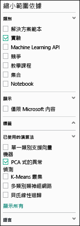
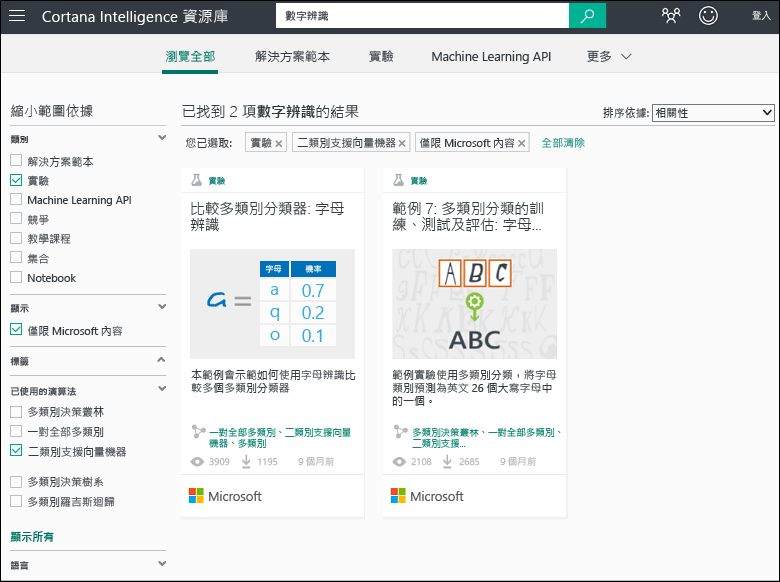
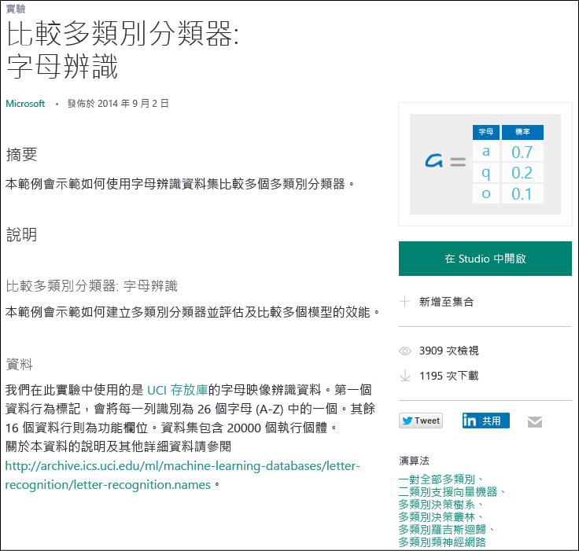

# 複製範例實驗來建立新的機器學習服務實驗
了解如何從 [Cortana 智慧資源庫](https://gallery.cortanaintelligence.com/) 的範例實驗開始，而不是從頭建立機器學習服務實驗。 您可以使用範例來建立自己的機器學習服務解決方案。

資源庫中包含 Microsoft Azure Machine Learning 小組的範例實驗，以及由 Machine Learning 社群共用的範例。 您也可以提出有關實驗的問題或張貼意見。

若要查看如何使用資源庫，請觀看[初學者的資料科學](machine-learning-data-science-for-beginners-the-5-questions-data-science-answers.md)系列中的 3 分鐘影片[複製其他人的工作來進行資料科學](machine-learning-data-science-for-beginners-copy-other-peoples-work-to-do-data-science.md)。

[!INCLUDE [machine-learning-free-trial](../../includes/machine-learning-free-trial.md)]

## 在 Cortana 智慧資源庫中尋找要複製的實驗
若要查看有哪些可用的實驗，請移至[資源庫](https://gallery.cortanaintelligence.com/)，然後按一下頁面頂端的 [實驗]。

### 尋找最新或最受歡迎的實驗
在此頁面上，您可以查看 [最近新增] 實驗，或往下捲動查看 [熱門項目] 或最新的 [熱門的 Microsoft 實驗]。

### 尋找符合特定需求的實驗
若要瀏覽所有實驗︰

1. 按一下頁面頂端的 [全部瀏覽]  。
2. 在 [精簡依據] 之下，選取 [實驗] 以查看資源庫中的所有實驗。
3. 有幾種不同方式可以找到符合您需求的實驗︰
   * **選取左邊的篩選。** 例如，若要瀏覽使用 PCA 型異常偵測演算法的實驗，請選取 [類別] 之下的 [實驗]，以及 [使用的演算法] 之下的 [PCA 型異常偵測] (如果您沒有看到該演算法，請按一下清單底部的 [全部顯示])。  
     
   * **使用 [搜尋] 方塊。**  例如，若要尋找 Microsoft 所提出並使用二級支援向量機器演算法的數字辨識相關實驗，請在 [搜尋] 方塊中輸入「數字辨識」。 然後選取篩選器 [實驗]、[僅包含 Microsoft 內容] 和 [二級支援向量機器]：
4. 按一下實驗，以深入了解相關資訊。
5. 若要執行和 (或) 修改實驗，請按一下實驗頁面上的 [在 Studio 中開啟]  。

   > [!NOTE]
   > 若要在 Machine Learning Studio 中開啟實驗，您必須使用 Microsoft 帳戶認證登入。 如果您還沒有機器學習服務工作區，就會建立免費試用的工作區。 [了解機器學習服務包含免費試用哪些功能？](https://azure.microsoft.com/pricing/details/machine-learning/)
   >
   >

    

## 在 Machine Learning Studio 中使用範本
您也可以使用資源庫範例作為範本，在 Machine Learning Studio 中建立新的實驗。

1. 用您的 Microsoft 帳戶認證登入 [Studio](https://studio.azureml.net)，然後按一下 [新增] 以建立新的實驗。
2. 瀏覽範例內容，然後按一下其中一個。

隨即使用範例實驗做為範本，在您的工作區中建立新的實驗。

## 後續步驟
* [準備您的資料](machine-learning-data-science-import-data.md)
* [嘗試在實驗中使用 R](machine-learning-r-quickstart.md)
* [檢閱範例 R 實驗](machine-learning-r-csharp-web-service-examples.md)
* [建立 Web 服務 API](machine-learning-publish-a-machine-learning-web-service.md)

<!--HONumber=Dec16_HO2-->

