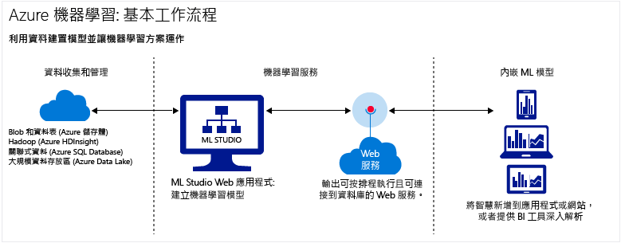

# 雲端的 Azure Machine Learning 簡介
## 什麼是機器學習？
機器學習服務是一項資料科學技術，協助電腦從現有的資料學習，以便預測未來的行為、結果和趨勢。  

機器學習服務的這些預測可讓應用程式和裝置更聰明。 當您線上購物時，機器學習服務可根據您已經購買的產品，協助推薦其他產品。 當您的信用卡被刷過時，機器學習服務可將該筆交易與交易資料庫進行比對，協助偵測詐騙。 當您的真空吸塵器機器人清潔房間時，機器學習服務可協助它判斷作業是否完成。

如需簡短的概觀，請觀賞 [初學者的資料科學](machine-learning-data-science-for-beginners-the-5-questions-data-science-answers.md)系列影片。 初學者的資料科學為您介紹機器學習服務，不使用專業術語或數學運算，並引導您完成簡單的預測模型。

## 什麼是 Microsoft Azure 雲端中的 Machine Learning？
Azure Machine Learning 是雲端預測性分析服務，可讓您快速地建立預測模型，並將其部署為分析解決方案。

您可以操作現成的演算法程式庫、使用它們在連接網際網路的電腦上建立模型，以及快速部署預測解決方案。 從 [Cortana Intelligence Gallery](https://gallery.cortanaintelligence.com/) 中的現成範例和解決方案開始。

Azure Machine Learning 不僅提供可建立預測性分析模型的工具，也提供完全受管理的服務，您可以透過這項服務將預測模型部署為可供取用的 Web 服務。

## 什麼是預測性分析？
預測性分析使用稱為演算法的數學公式，可分析過往或目前的資料以找出模式或趨勢，以便預測未來的事件。

## 在雲端上建置完整機器學習服務解決方案的工具
Azure Machine Learning 具備在雲端上建立完整預測性分析解決方案所需的一切功能，從大型演算法程式庫、用於建置模型的 Studio，到可將模型部署為 Web 服務的簡單方法。 快速建立、測試、操作及管理預測模型。

### Machine Learning Studio：建立預測模型
在 [Machine Learning Studio](machine-learning-what-is-ml-studio.md)中，您可以透過拖放和連接模組快速建立預測模型。 您可以試驗不同的組合及[免費試用](https://studio.azureml.net/?selectAccess=true&o=2)。

* 在 [Cortana 智慧資源庫](machine-learning-gallery-how-to-use-contribute-publish.md)中，您可以嘗試其他人所撰寫的分析解決方案，或提供您自己的方案。 在社群張貼關於實驗的問題或意見，或透過 LinkedIn 和 Twitter 等社交網路分享實驗的連結。

  
* 使用 Machine Learning Studio 中之 [機器學習服務演算法和模組](https://msdn.microsoft.com/library/azure/f5c746fd-dcea-4929-ba50-2a79c4c067d7) 的大型程式庫，開始建立您的預測模型。 從範例實驗、R 和 Python 套件，以及 Xbox 和 Bing 等 Microsoft 公司的一流演算法中選擇。 使用您自訂的 [R](machine-learning-r-quickstart.md) 和 [Python](machine-learning-execute-python-scripts.md) 指令碼來擴充 Studio 模組。

  

### 藉由發佈您自己的預測性分析解決方案來予以實作
下列教學課程將示範如何實作預測性分析模型︰

 * [部署 Web 服務](machine-learning-publish-a-machine-learning-web-service.md)
 * [透過 API 定型模型](machine-learning-retrain-models-programmatically.md)
 * [管理 Web 服務端點](machine-learning-create-endpoint.md)
 * [調整 Web 服務](machine-learning-scaling-webservice.md)
 * [取用 Web 服務](machine-learning-consume-web-services.md)

## 機器學習服務的重要詞彙和概念
機器學習服務的詞彙易使人混淆。 以下提供您重要詞彙的定義。 使用下方註解讓我們知道其他您想要定義的詞彙。

### 資料探索、描述性分析和預測性分析

**資料探索** 是收集大量且通常非結構化資料集的相關資訊，以便找出要進行重點分析之特性的程序。

**資料採礦** 是指自動資料探索。

**描述性分析** 是分析資料集以便彙總狀況的程序。 大部分商務分析 (例如銷售報表、網路指標和社交網路分析) 都具描述性。

**預測性分析** 是從歷程記錄或目前資料建置模型，以便預測未來結果的程序。

### 監督式和非監督式學習
 **監督式學習** 演算法透過標示的資料 (也就是包含所需答案範例的資料) 來定型。 例如，在用來定型識別信用卡盜用之模型的資料集中，其資料點標示了已知的詐騙收費和有效收費。 大部分的機器學習服務都是監督式。

 **非監督式學習** 適用於沒有標籤的資料，其目標是為了尋找資料中的關聯性。 例如，您可能想要尋找具有類似購買習慣的客戶人口統計資料群組。

### 模型定型和評估
機器學習服務模型是您嘗試回答之問題或想要預測之結果的擷取內容。 模型會以現有的資料定型並評估。

#### 訓練資料
當您以資料訓練模型時，您使用已知的資料集，並以資料特性為基礎進行模型調整，以取得最正確的回應。 在 Azure Machine Learning 中，模型是從處理定型資料和功能模組的演算法模組 (例如計分模組) 建置而來。

在監督式學習中，如果您要定型詐騙偵測模型，您會使用一組標示為詐騙或有效的交易。 您會隨機分割資料集，然後使用一部分來定型模型，另一部分來測試或評估模型。

#### 評估資料
一旦您具有定型模型，請使用其餘測試資料來評估模型。 您會使用已知結果的資料，以便判斷模型的預測是否正確。

## 其他常見的機器學習服務詞彙
* **演算法**：透過資料處理、數學運算或自動推論來解決問題的一組獨立規則。
* **異常偵測**︰標幟不尋常的事件或值並協助您找出問題的模型。 例如，信用卡詐騙偵測會尋找不尋常的購買情況。
* **分類資料**：依類別來組織並可分組的資料。 例如，汽車的類別資料集可指定年份、廠牌、車型和價格。
* **分類**：根據資料集的哪個類別群組為已知，將資料點組織成不同類別的模型。
* **特性工程設計**：擷取或選取與資料集相關的特性，以便增強資料集並改善結果的程序。 例如，飛機票價資料可透過星期幾和假日來增強。 請參閱 [Azure Machine Learning 中的特性選取和工程設計](machine-learning-feature-selection-and-engineering.md)。
* **模組**：Machine Learning Studio 模型中的功能部分，例如可輸入及編輯小型資料集的輸入資料模組。 演算法也是 Machine Learning Studio 的一種模組類型。
* **模型**：監督式學習模型是機器學習服務實驗的產物，其中包含定型資料、一個演算法模組，以及功能模組 (例如「計分模型」模組)。
* **數值資料**：代表度量 (連續資料) 或計數 (離散資料) 的資料。 也稱為「量化資料」 。
* **分割**：用來將資料分成多個樣本的方法。 如需詳細資訊，請參閱 [資料分割和取樣](https://msdn.microsoft.com/library/azure/dn905960.aspx) 。
* **預測**：預測是來自機器學習服務模型的一個或多個預測值。 您也可能會看到「預測的計分」一詞。 不過，預測的計分不是模型的最終輸出。 計分之後還會評估模型。
* **迴歸**：根據獨立變數來預測值的模型，例如根據汽車的年份和廠牌來預測汽車價格。
* **分數**：使用 Machine Learning Studio 中的 [「計分模型」模組](https://msdn.microsoft.com/library/azure/dn905995.aspx) ，從定型分類或迴歸模型產生的預測值。 分類模型也會傳回預測值的機率分數。 從模型產生分數之後，即可使用 [「評估模型」模組](https://msdn.microsoft.com/library/azure/dn905915.aspx)來評估模型的正確性。
* **樣本**：用來代表整體的一部分資料集。 您可以隨機取樣，或根據資料集的特定特徵進行取樣。

## 後續步驟
您可以使用[逐步指南](machine-learning-create-experiment.md)和[以範例建立](machine-learning-sample-experiments.md)來學習預測性分析和機器學習的基礎知識。  

<!-- Module References -->
[learning-with-counts]: https://msdn.microsoft.com/library/azure/81c457af-f5c0-4b2d-922c-fdef2274413c/

