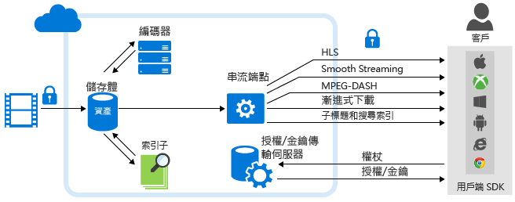

<properties
	pageTitle="Azure 媒體服務分析概觀 | Microsoft Azure"
	description="Azure 媒體服務提供Azure 媒體分析的公開預覽、企業規模的語音和電腦視覺服務集合、相容性、安全性和遍及全球的觸角。Azure 媒體分析服務使用核心 Azure 媒體服務平台元件建置，因此可隨時進行一天的大規模媒體處理。"
	services="media-services"
	documentationCenter=""
	authors="juliako"
	manager="erikre"
	editor=""/>

<tags
	ms.service="media-services"
	ms.workload="media"
	ms.tgt_pltfrm="na"
	ms.devlang="dotnet"
	ms.topic="article"
	ms.date="09/14/2016"   
	ms.author="milanga;juliako;johndeu"/>

# Azure 媒體服務分析概觀 | Microsoft Azure

##Overview

越來越多組織和企業採用視訊做為慣用的媒體，用來訓練員工、連絡客戶與記錄商務功能。雲端運算可讓您有效儲存、串流及存取這些大型媒體檔案，但是當公司擴充其視訊內容庫，他們必須具備同樣有效的方式從視訊擷取新的解析，以建立與其對象間更有意義與個人化的互動，並將其業務提升到更高的層次。

為了解決市場的成長需求，Azure 媒體服務提供媒體分析、語音和視覺元件集合 (具企業規模、相容性、安全性和遍及全球的觸角)，讓組織和企業從其影片檔輕鬆製作出能採取行動的深入見解內容。Azure 媒體分析服務使用核心 Azure 媒體服務平台元件建置，因此可隨時進行一天的大規模媒體處理。

Azure 媒體分析可讓開發人員在有限規模下快速開始使用視訊的視覺功能，並將此進階功能引進到 Bot 和應用程式。Azure 媒體分析的建置使用對象是大型組織所需的企業環境，其具備完整規模、相容性、安全性和遍及全球的觸角。

下圖顯示**媒體分析**和媒體服務平台的其他主要部分。請注意，媒體分析的媒體處理器會產生 MP4 檔案或 JSON 檔案。如果媒體處理器產生了 MP4 檔案，您可以漸進式下載檔案。如果媒體處理器產生了 JSON 檔案，您可以從 Azure Blob 儲存體下載檔案。

## Azure 媒體分析服務

- **索引器** – Azure 媒體索引器可讓您的內容可供搜尋，並且產生隱藏式輔助字幕。Azure 媒體服務推出 **Azure 媒體索引器 2 預覽**，提供更快速的索引編製與更廣泛的語言支援。支援的語言包括英文、西班牙文、法文、德文、義大利文、中文、葡萄牙文和阿拉伯文。如需詳細資訊和範例，請參閱[利用 Azure 媒體索引器 2 處理視訊](media-services-process-content-with-indexer2.md)
 
- **Hyperlapse** – Microsoft Hyperlapse 是在 Microsoft Research (MSR) 進行超過 20 年的電腦視覺研究結果，結合視訊穩定以及間時攝影功能，可從您的長表單內容建立快速及可使用的美麗視訊。除了建立間時攝影，您也可以使用 Hyperlapse，將透過行動電話及攝影機擷取的不穩定視訊建立為穩定的視訊。如需詳細資訊和範例，請參閱 [Hyperlapse 媒體檔案與 Azure Media Hyperlapse](media-services-hyperlapse-content.md)
 
- **影片偵測** – 您可以使用此服務來偵測視訊中具有信箋背景的動作。這個功能適用於想要檢查監視視訊摘要上由監視攝影機偵測到的動作事件上是否有誤判情形的客戶。如需詳細資訊和範例，請參閱 [Azure 媒體分析的動作偵測](media-services-motion-detection.md)。
 
- **臉部偵測和臉部情緒** – 使用這項服務時，您可以偵測人的臉部和情緒，包括快樂、傷心、驚訝、生氣、藐視、恐懼、厭惡與冷漠/中立。這項服務有數個實用的產業應用程式，如下所述，包括彙總並分析人員參與事件的反應。如需詳細資訊和範例，請參閱 [Azure 媒體分析的臉部和情緒偵測](media-services-face-and-emotion-detection.md)。
 
- **視訊摘要** – 視訊摘要可自動選取來源視訊的有趣片段，協助您建立較長視訊的摘要。針對片長較長的視訊，如果您想要提供精彩內容的快速概觀，這非常有用。如需詳細資訊和範例，請參閱[使用 Azure 媒體視訊縮圖建立視訊摘要](media-services-video-summarization.md)

- **光學字元辨識** - Azure 媒體分析 OCR (光學字元辨識) 可讓您將視訊檔中的文字內容轉換成可編輯、可搜尋的數位文字。這可讓您從媒體的視訊訊號自動擷取有意義的中繼資料。
 
- **可調整的臉部修訂** - **Azure 媒體修訂器**是可在雲端提供可調整的臉部修訂的 Azure 媒體分析 MP。臉部修訂可讓您修改視訊，以模糊所選人物的臉部。在公共安全和新聞媒體案例中，您可能會想要使用臉部修訂服務。若要手動修訂包含多個臉部的幾分鐘影片，可能要花上數小時的時間，若使用此服務，則只需要幾個簡單的步驟就能完成臉部修訂程序。如需詳細資訊，請參閱[本篇文章](media-services-face-redaction.md)。

 
## 常見案例

以下是幾個案例，Azure 媒體分析可協助跨產業的組織和企業從視訊搜集新的見解，以建立更個人化的對象和員工溝通，並且更有效地管理大量視訊內容︰

- **客服中心** – 即使沒有社交媒體，客戶的客服中心仍有助於大量的客戶服務交易。在此音訊資料中編碼的是豐富的資訊，可分析客戶以改進產品藍圖，並且訓練客服中心員工以達到更高的客戶滿意度。藉由使用 Azure 媒體索引器，客戶可以擷取文字並建置搜尋索引與儀表板，以擷取最常見的抱怨、抱怨來源以及其他此類相關資料的消息。

- **使用者產生的內容仲裁** – 從新聞媒體通路到警察部門，許多組織都有對外公開的入口網站，可在其中接受 UGC 媒體，例如視訊和影像。內容的數量可能會因為未預期事件而激增。在這些案例中，幾乎不可能以適當方式進行有效的內容手動檢閱。客戶可以依賴內容仲裁服務，將重點放在適當的內容。

- **監視錄影** - 由於 IP 相機的成長，監視錄影視訊遽增。手動檢閱監視視訊既耗時又容易發生人為錯誤。Azure 媒體分析提供數個元件，例如動作偵測、臉部偵測和 Hyperlapse，讓檢閱、管理和建立衍生物件的程序更加容易。

## 媒體服務分析媒體處理器 

本節列出所有媒體服務分析媒體處理器 (MP)，並示範如何使用 .NET 或 REST 來取得 MP 物件。

### MP 名稱

- Azure 媒體索引器 2 預覽版
- Azure Media Indexer
- Azure Media Hyperlapse
- Azure 媒體臉部偵測器
- Azure 媒體動作偵測器
- Azure 媒體視訊縮圖
- Azure 媒體 OCR

### .NET

下列函式會採用其中一個指定的 MP 名稱，並傳回 MP 物件。

    static IMediaProcessor GetLatestMediaProcessorByName(string mediaProcessorName)
    {
        var processor = _context.MediaProcessors
            .Where(p => p.Name == mediaProcessorName)
            .ToList()
            .OrderBy(p => new Version(p.Version))
            .LastOrDefault();

        if (processor == null)
            throw new ArgumentException(string.Format("Unknown media processor",
                                                       mediaProcessorName));

        return processor;
    }

## REST

要求：

	GET https://media.windows.net/api/MediaProcessors()?$filter=Name%20eq%20'Azure%20Media%20OCR' HTTP/1.1
	DataServiceVersion: 1.0;NetFx
	MaxDataServiceVersion: 3.0;NetFx
	Accept: application/json
	Accept-Charset: UTF-8
	User-Agent: Microsoft ADO.NET Data Services
	Authorization: Bearer <token>
	x-ms-version: 2.12
	Host: media.windows.net
	
回應：
		
	. . .
	
	{  
	   "odata.metadata":"https://media.windows.net/api/$metadata#MediaProcessors",
	   "value":[  
	      {  
	         "Id":"nb:mpid:UUID:074c3899-d9fb-448f-9ae1-4ebcbe633056",
	         "Description":"Azure Media OCR",
	         "Name":"Azure Media OCR",
	         "Sku":"",
	         "Vendor":"Microsoft",
	         "Version":"1.1"
	      }
	   ]
	}

##示範

[Azure 媒體分析示範](http://azuremedialabs.azurewebsites.net/demos/Analytics.html)

##後續步驟

檢閱媒體服務學習路徑。

[AZURE.INCLUDE [media-services-learning-paths-include](../../includes/media-services-learning-paths-include.md)]

##提供意見反應

[AZURE.INCLUDE [media-services-user-voice-include](../../includes/media-services-user-voice-include.md)]

##相關文章

[媒體服務分析公告](https://azure.microsoft.com/blog/introducing-azure-media-analytics/)
  

<!-- Images -->

[overview]: ./media/media-services-video-on-demand-workflow/media-services-video-on-demand.png

<!---HONumber=AcomDC_0921_2016-->