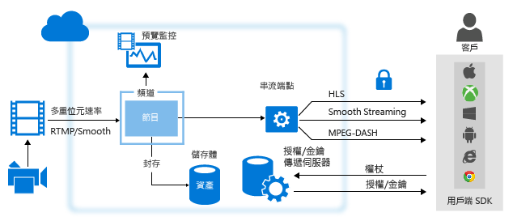
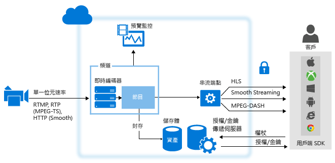

# 使用 Azure 媒體服務之即時串流的概觀
## 概觀
使用 Azure 媒體服務傳遞即時串流時，通常涉及下列元件：

* 相機，用來廣播事件。
* 即時視訊編碼器，它會將相機中的訊號轉換成資料流，然後再傳送至即時資料流服務。

    (選擇性) 多個即時同步處理的編碼器。 針對某些需要相當高度可用性與高品質經驗的重要即時事件，建議使用主動對主動備援編碼器搭配時間同步處理，以便順利進行容錯移轉，而不會遺失資料。
* 即時串流服務可讓您執行下列動作：

  * 使用各種即時串流處理通訊協定 (例如 RTMP 或 Smooth Streaming) 擷取即時內容，
  * (選擇性) 將您的串流編碼成調適性位元速率串流
  * 預覽您的即時串流，
  * 記錄並儲存擷取的內容以於稍後進行串流 (隨選視訊)
  * 透過一般串流通訊協定 (例如，MPEG DASH、Smooth、HLS) 直接將內容傳遞給客戶，或傳遞至內容傳遞網路 (CDN) 供進一步的發佈。

**Microsoft Azure 媒體服務** (AMS) 提供擷取、編碼、預覽、儲存和傳遞即時串流內容的能力。

當您將內容傳遞給客戶時，您的目標是在不同的網路條件下將高品質的視訊傳遞到各種裝置。 為達成此目的，請使用即時編碼器將您的串流編碼成多位元速率 (調適性位元速率) 視訊串流。  請注意不同裝置上的串流，使用媒體服務 [動態封裝](media-services-dynamic-packaging-overview.md) 將串流動態地重新封裝至不同的通訊協定。 媒體服務支援傳遞下列自適性串流技術：HTTP 即時串流 (HLS)、Smooth Streaming、MPEG DASH。

在 Azure 媒體服務中，**通道**、**程式**及 **StreamingEndpoints** 會處理所有的即時串流功能，包括內嵌、格式化、DVR、安全性、延展性和備援能力。

在 Azure 媒體服務中， **通道** 代表處理即時串流內容的管線。 通道可以用下列方式接收即時輸入串流：

* 內部部署即時編碼器會傳送多位元速率 **RTMP** 或 **Smooth Streaming** (分散的 MP4) 到針對**即時通行**傳遞所設定的通道。 **即時通行**傳遞就是擷取的串流會通過**通道**，無需進一步的處理。 您可以使用下列輸出多位元速率 Smooth Streaming 的即時編碼器：MediaExcel、Ateme、Imagine Communications、Envivio、Cisco 和 Elemental。 下列即時編碼器會輸出 RTMP：Adobe Flash Media Live Encoder (FMLE)、Telestream Wirecast、Haivision、Teradek 和 Tricaster 轉碼器。  即時編碼器也會將單一位元速率串流傳送至無法用於即時編碼的通道，但是不建議您使用此方法。 接到要求時，媒體服務會傳遞串流給客戶。

  > [!NOTE]
  > 如果您在很長一段時間內進行多個事件，而且已投資內部部署編碼器時，使用傳遞方法是進行即時串流的最經濟實惠方式。 請參閱 [價格](https://azure.microsoft.com/pricing/details/media-services/) 詳細資料。
  > 
  > 
* 內部部署即時編碼器會將單一位元速率串流傳送至通道，可以使用下列格式之一，以媒體服務執行即時編碼：RTMP 或 Smooth Streaming (分散的 MP4)。 也支援 RTP (MPEG-TS)，可提供您連接至 Azure 資料中心的專用連接。 下列包含 RTMP 輸出的即時編碼器已知可與以下類型的通道協同作業：Telestream Wirecast 和 FMLE。 通道接著會執行即時編碼，將連入的單一位元速率串流編碼成多位元速率 (自動調整) 視訊串流。 接到要求時，媒體服務會傳遞串流給客戶。

自媒體服務 2.10 版起，當您建立通道時，您可以指定您希望通道接收輸入串流的方式，以及您是否想要通道執行串流的即時編碼。 您有兩個選擇：

* **無** (傳遞) – 如果您想要使用會輸出多位元速率串流 (傳遞串流) 的內部部署即時編碼器，請指定這個值。 在此情況下，連入的串流會傳遞至輸出，無須任何編碼。 這是在 2.10 版以前的通道行為。  
* **標準** – 如果您打算使用媒體服務將單一位元速率即時串流編碼成多位元速率串流，請選擇這個值。 對於快速相應增加的非頻繁事件來說，這是較為經濟的方法。 請注意即時編碼有計費影響，而且您應該記住將即時編碼通道保持在「執行中」狀態會產生費用。  建議您在即時串流事件完成之後立即停止執行的通道，以避免額外的每小時費用。

## 通道類型的比較
下表提供了媒體服務所支援的兩種通道類型比較指南

| 功能 | 傳遞通道 | 標準通道 |
| --- | --- | --- |
| 單一位元速率輸入會在雲端編碼為多重位元速率 |否 |是 |
| 最大解析度、分層數目 |1080p、8 層、60+fps |720p、6 層、30 fps |
| 輸入通訊協定 |RTMP、Smooth Streaming |RTMP、Smooth Streaming 和 RTP |
| 價格 |請參閱 [定價頁面](https://azure.microsoft.com/pricing/details/media-services/) 並按一下 [即時影片] 索引標籤 |請參閱 [定價頁面](https://azure.microsoft.com/pricing/details/media-services/) |
| 最長執行時間 |全天候 |8 小時 |
| 插入靜態圖像支援 |否 |是 |
| 廣告訊號支援 |否 |是 |
| 傳遞 CEA 608/708 字幕 |是 |是 |
| 在比重摘要內能從短暫延遲中復原的能力 |是 |否 (經過 6 秒以上且未有任何輸入資料時，通道便會中斷) |
| 支援未統一輸入的 GOP |是 |否 – 輸入必須為固定式 2 秒 GOP |
| 支援變動畫面播放速率輸入 |是 |否 – 輸入必須為固定畫面播放速率。 輕微的差異可以接受，例如：處於高速動態場景的情況。 但編碼器無法降至 10 個畫面/秒的標準。 |
| 在輸入摘要遺失時自動關閉通道 |否 |經過 12 個小時，如果沒有程式仍在執行 |

## 使用可從內部部署編碼器接收多位元速率即時串流的通道 (傳遞)
下圖顯示 **即時通行** 工作流程中涉及的 AMS 平台主要部分。

如需詳細資訊，請參閱 [使用通道，從內部部署編碼器接收多位元速率即時串流](media-services-live-streaming-with-onprem-encoders.md)。

## 使用啟用的通道來以 Azure 媒體服務執行即時編碼
下圖顯示 AMS 平台的主要部分，與通道可以使用媒體服務執行即時編碼的即時串流工作流程有關。

如需詳細資訊，請參閱 [使用啟用的通道來以 Azure 媒體服務執行即時編碼](media-services-manage-live-encoder-enabled-channels.md)。

## 通道和其相關元件的說明
### 通道
在媒體服務中， [通道](https://docs.microsoft.com/rest/api/media/operations/channel)負責處理即時資料流內容。 通道會提供輸入端點 (內嵌 URL)，接著您再提供給即時轉碼器。 通道從即時轉碼器接收即時輸入資料流，再透過一或多個 StreamingEndpoint 進行串流處理。 通道也會提供預覽端點 (預覽 URL)，您可在進一步處理和傳遞之前先用來預覽及驗證您的資料流。

您可在建立通道時取得內嵌 URL 和預覽 URL。 通道不需處於啟動狀態也可以取得這些 URL。 當您準備好要開始從即時轉碼器推播資料給通道時，就必須先啟動通道。 即時轉碼器開始內嵌資料後，您就可以預覽您的資料流。

每個媒體服務帳戶可以包含多個通道、多個程式和多個 StreamingEndpoints。 根據頻寬和安全性需求，StreamingEndpoint 服務可以專屬於一或多個通道。 任何 StreamingEndpoint 可以從任何通道中提取。

### 程式
[程式](https://docs.microsoft.com/rest/api/media/operations/program) 可讓您控制即時資料流區段的發佈和儲存體。 通道會管理程式。 通道和程式的關聯性非常類似於傳統媒體，此處的通道有常數內容資料流，而程式的範圍是該通道上的某些計時事件。
您可以透過設定 **ArchiveWindowLength** 屬性，指定您想要保留已記錄程式內容的時數。 此值最小可以設定為 5 分鐘，最大可以設定為 25 個小時。

ArchiveWindowLength 也指定用戶端可從目前即時位置往回搜尋的最大時間量。 程式可以執行超過指定的時間量，但是超過此時間長度的內容會被持續捨棄。 此屬性的這個值也會決定用戶端資訊清單可以成長多長的時間。

每個程式都是與「資產」相關聯。 若要發佈程式，您必須建立相關資產的定位器。 擁有此定位器，可讓您建置可提供給用戶端的串流 URL。

通道支援最多三個同時執行的程式，因此您可以建立相同內送串流的多個封存。 這可讓您視需要發行和封存事件的不同部分。 例如，您的商務需求是封存 6 小時的程式，但只廣播最後 10 分鐘。 為了達成此目的，您必須建立兩個同時執行的程式。 其中一個程式設定為封存 6 小時的事件，但是未發行該程式。 另一個程式則設定為封存 10 分鐘，並發行程式。

## 計費影響
通道只要其狀態透過 API 轉換為「執行中」，即會開始計費。  

下表顯示通道狀態如何對應至 API 和 Azure 入口網站的計費狀態。 請注意，API 和入口網站 UX 之間的狀態稍有不同。 一旦通道透過 API 處於「執行中」狀態，或在 Azure 入口網站中處於「就緒」或「串流」狀態，就會開始計費。

若要停止通道進一步向您計費，您必須停止透過 API 或在 Azure 入口網站中的通道。
您必須負責在完成通道時停止您的通道。 無法停止通道將會導致持續計費。

> [!NOTE]
> 使用標準通道時，在輸入饋送遺失 12 小時之後且沒有執行任何程式時，AMS 會自動關閉仍處於「執行中」狀態的任何通道。 不過，您將還是需要支付通道處於「執行中」狀態時間的費用。
>
>

### 通道狀態和狀態如何對應至計費模式
通道的目前狀態。 可能的值包括：

* **已停止**。 這是通道建立後的初始狀態 (除非在入口網站中選取自動啟動)。此狀態中不會計費。 在此狀態下，通道屬性可以更新，但是不允許串流。
* **啟動中**。 正在啟動通道。 此狀態中不會計費。 在此狀態期間允許任何更新或串流。 如果發生錯誤，通道會回到已停止狀態。
* **執行中**。 通道能夠處理即時串流。 現在針對使用量計費。 您必須停止通道來防止進一步計費。
* **停止中**。 正在停止通道。 此暫時性狀態中不會計費。 在此狀態期間允許任何更新或串流。
* **刪除中**。 正在刪除通道。 此暫時性狀態中不會計費。 在此狀態期間允許任何更新或串流。

下表顯示通道狀態如何對應至計費模式。

| 通道狀態 | 入口網站 UI 指標 | 會計費嗎？ |
| --- | --- | --- |
| 啟動中 |啟動中 |無 (暫時性狀態) |
| 執行中 |就緒 (沒有執行中的程式) 或 串流 (至少一個執行中的程式) |是 |
| 停止中 |停止中 |無 (暫時性狀態) |
| 已停止 |已停止 |否 |

## 媒體服務學習路徑
[!INCLUDE [media-services-learning-paths-include](../../includes/media-services-learning-paths-include.md)]

## 提供意見反應
[!INCLUDE [media-services-user-voice-include](../../includes/media-services-user-voice-include.md)]

## 相關主題
[Azure 媒體服務的分散 MP4 即時內嵌規格](media-services-fmp4-live-ingest-overview.md)

[使用啟用的通道來以 Azure 媒體服務執行即時編碼](media-services-manage-live-encoder-enabled-channels.md)

[使用通道，從內部部署編碼器接收多位元速率即時串流](media-services-live-streaming-with-onprem-encoders.md)

[配額和限制](media-services-quotas-and-limitations.md)。  

[媒體服務概念](media-services-concepts.md)

