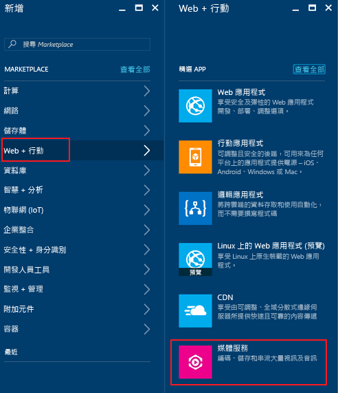
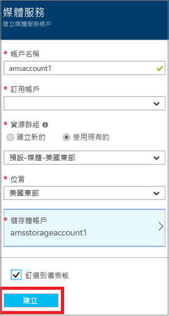
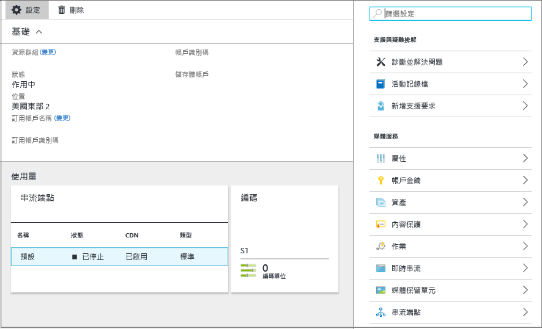
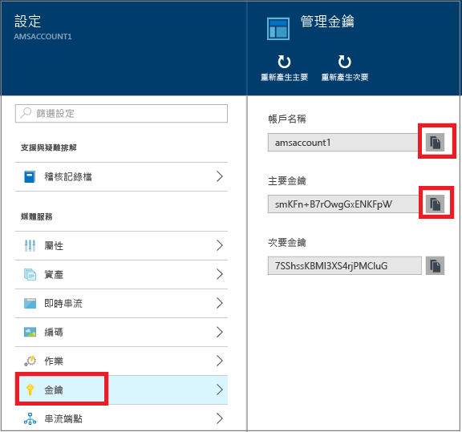

# 使用 Azure 入口網站建立 Azure 媒體服務帳戶
> [!div class="op_single_selector"]
> * [入口網站](media-services-portal-create-account.md)
> * [PowerShell](media-services-manage-with-powershell.md)
> * [REST](https://docs.microsoft.com/rest/api/media/mediaservice)
> 
> [!NOTE]
> 若要完成此教學課程，您需要 Azure 帳戶。 如需詳細資訊，請參閱 [Azure 免費試用](https://azure.microsoft.com/pricing/free-trial/)。 
> 
> 

Azure 入口網站提供一種方法來快速建立 Azure 媒體服務 (AMS) 帳戶。 您可以使用自己的帳戶，來存取讓您在 Azure 中儲存、加密、編碼、管理和串流播放媒體內容的媒體服務。 當您建立媒體服務帳戶時，您也會在與媒體服務帳戶相同的地理區域中建立相關聯的儲存體帳戶 (或使用現有儲存體帳戶)。

本文說明一些常見的概念，並示範如何使用 Azure 入口網站建立媒體服務帳戶。

## 概念
存取媒體服務時需要有兩個相關聯的帳戶：

* 媒體服務帳戶。 您的帳戶可讓您存取 Azure 中提供的一組雲端型媒體服務。 媒體服務帳戶並不會儲存實際媒體內容。 而是在您的帳戶中儲存媒體內容和媒體處理工作的中繼資料。 當您建立帳戶時，您會選取一個可用的媒體服務區域。 所選取的區域會是儲存您帳戶之中繼資料記錄的資料中心。
  
    Available Media Services 可用的媒體服務 (AMS) 區域如下：北歐、西歐、美國西部、美國東部、東南亞、東亞、日本西部、日本東部。 媒體服務不會使用同質群組。
  
    AMS 現在也適用於下列資料中心：巴西南部、印度西部、印度南部和印度中部。 您現在可以使用 Azure 入口網站來建立媒體服務帳戶，以及執行這裡所述的各種工作。 不過，這些資料中心不會啟用即時編碼。 此外，並非所有類型的編碼保留單元都可用於這些資料中心。
  
  * 巴西南部：只可以使用標準和基本編碼保留單元。
  * 印度西部、印度南部： 
* 一個 Azure 儲存體帳戶。 儲存體帳戶必須與媒體服務帳戶位於相同的地理區域中。 建立媒體服務帳戶時，可以選擇相同區域中的現有儲存體帳戶，也可以在相同區域中建立新的儲存體帳戶。 如果您刪除媒體服務帳戶，並不會刪除相關儲存體帳戶中的 Blob。

## 建立 AMS 帳戶
本節中的步驟示範如何建立 AMS 帳戶。

1. 登入 [Azure 入口網站](https://portal.azure.com/)。
2. 按一下 [+新增] > [Web + 行動] > [媒體服務]。
   
    
3. 在 [建立媒體服務帳戶]  中輸入必要的值。
   
    
   
   1. 在 [帳戶名稱] 中，輸入新 AMS 帳戶的名稱。 媒體服務帳戶名稱為全部小寫且不含空格的字母或數字，且長度是 3 到 24 個字元。
   2. 在訂用帳戶中，從您可存取的不同 Azure 訂用帳戶中進行選取。
   3. 在 [資源群組] 中，選取新的或現有資源。  資源群組是共用生命週期、權限及原則的資源集合。 [在此](../azure-resource-manager/resource-group-overview.md#resource-groups)深入了解。
   4. 在 [位置] 中，選取您將用來為媒體服務帳戶儲存媒體和中繼資料記錄的地理區域。 此區域將用於處理和串流媒體。 只有可用的媒體服務區域才會出現在下拉式清單方塊中。 
   5. 在 [儲存體帳戶] 中，選取儲存體帳戶以從媒體服務帳戶提供媒體內容的 Blob 儲存體。 您可以選取與媒體服務帳戶相同地理區域中的現有儲存體帳戶，也可以建立儲存體帳戶。 新的儲存體帳戶會建立於相同的區域中。 儲存體帳戶名稱的規則會與媒體服務帳戶相同。
      
       在 [這裡](../storage/storage-introduction.md)深入了解儲存體。
   6. 選取 **[釘選到儀表板] ** 以查看帳戶部署的進度。
4. 按一下表單底部的 [建立]  。
   
    成功建立帳戶後，隨即載入概觀頁面。 在串流端點資料表中，此帳戶將具有 [已停止] 狀態的預設串流端點。 

    >[!NOTE]
    >建立 AMS 帳戶時，**預設**串流端點會新增至 [已停止] 狀態的帳戶。 若要開始串流內容並利用動態封裝和動態加密功能，您想要串流內容的串流端點必須處於 [執行中] 狀態。 
   
    
   
    若要管理 AMS 帳戶 (例如，上傳視訊、為資產編碼、監視作業進度)，請使用 [設定]  視窗。

## Manage Keys
您需要帳戶名稱和主要金鑰資訊，以便以程式設計方式存取媒體服務帳戶。

1. 在 Azure 入口網站中，選取您的帳戶。 
   
    [設定]  視窗隨即出現在右邊。 
2. 在 [設定] 視窗中，選取 [金鑰]。 
   
    [管理金鑰]  視窗會顯示帳戶名稱以及主要和次要金鑰。 
3. 按複製按鈕以複製這些值。
   
    

## 後續步驟
您現在可以將檔案上傳到 AMS 帳戶。 如需詳細資訊，請參閱 [上傳檔案](media-services-portal-upload-files.md)。

## 媒體服務學習路徑
[!INCLUDE [media-services-learning-paths-include](../../includes/media-services-learning-paths-include.md)]

## 提供意見反應
[!INCLUDE [media-services-user-voice-include](../../includes/media-services-user-voice-include.md)]

