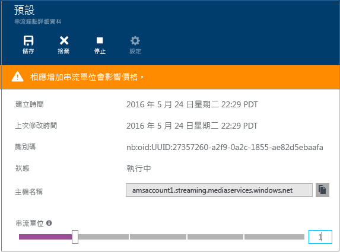
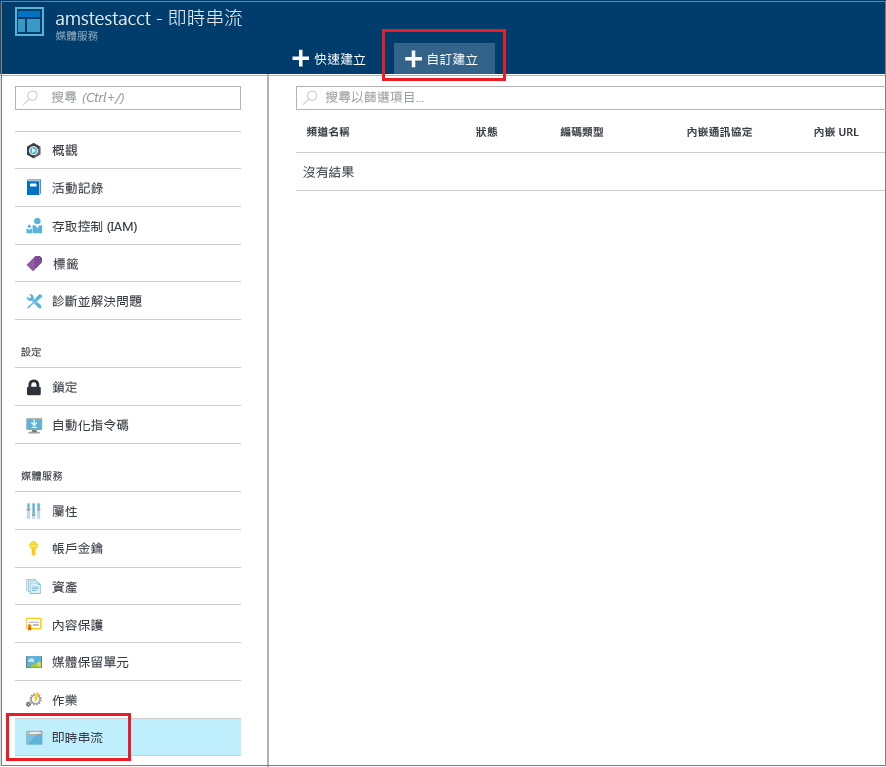
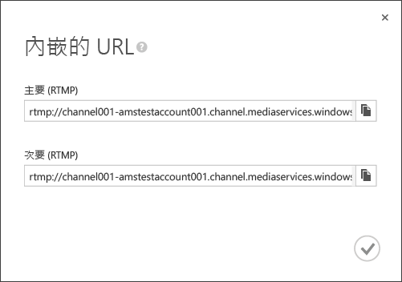
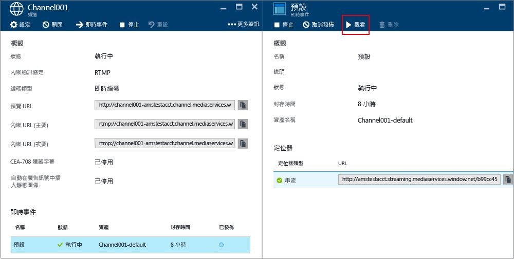
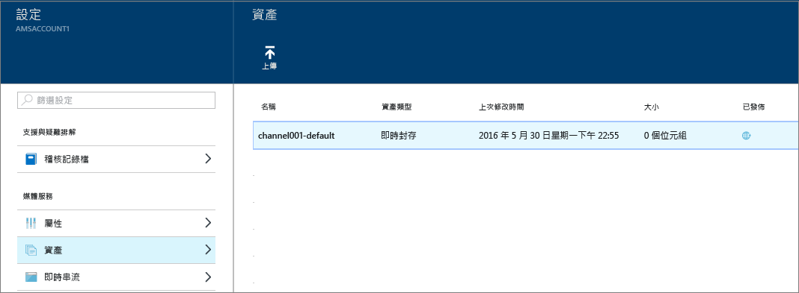

# 如何使用 Azure 媒體服務執行即時串流，以使用 Azure 入口網站建立多位元速率串流
> [!div class="op_single_selector"]
> * [入口網站](media-services-portal-creating-live-encoder-enabled-channel.md)
> * [.NET](media-services-dotnet-creating-live-encoder-enabled-channel.md)
> * [REST API](https://msdn.microsoft.com/library/azure/dn783458.aspx)
> 
> 

本教學課程將逐步引導您建立**通道**，可接收單一位元速率的即時串流，並將其編碼為多位元速率串流。

> [!NOTE]
> 如需為即時編碼啟用之通道相關的詳細概念資訊，請參閱[使用 Azure 媒體服務的即時串流，以建立多位元速率串流](media-services-manage-live-encoder-enabled-channels.md)。
> 
> 

## 常見即時串流案例
下列是建立常見即時串流應用程式所含的一般步驟。

> [!NOTE]
> 目前，即時事件的最大建議持續時間是 8 小時。如果您需要較長的時間來執行通道，請連絡 amslived@Microsoft.com。
> 
> 

1. 將攝影機連接到電腦。啟動和設定可使用下列其中一種通訊協定輸出單一位元速率串流的內部部署即時編碼器：RTMP、Smooth Streaming 或 RTP (MPEG-TS)。如需詳細資訊，請參閱 [Azure 媒體服務 RTMP 支援和即時編碼器](http://go.microsoft.com/fwlink/?LinkId=532824)。
   
    此步驟也可以在您建立通道之後執行。
2. 建立並啟動通道。
3. 擷取通道內嵌 URL。
   
    內嵌 URL 可供即時編碼器用來傳送串流到通道。
4. 擷取通道預覽 URL。
   
    使用此 URL 來確認您的通道會正確接收即時串流。
5. 建立事件/程式，此程式也會建立資產。
6. 發佈事件，以建立相關聯資產的 OnDemand 定位器。
   
    確定負責傳送內容的串流端點上，至少有一個串流保留單位。
7. 當您準備好開始串流和封存時，請啟動事件。
8. 即時編碼器會收到啟動公告的信號 (選擇性)。公告會插入輸出串流中。
9. 每當您想要停止串流處理和封存事件時，請停止事件。
10. 刪除事件 (並選擇性地刪除資產)。

## 本教學課程內容
在本教學課程中，Azure 入口網站用來完成下列工作：

1. 設定串流端點。
2. 建立啟用即可執行即時編碼的通道。
3. 取得內嵌 URL，以將其提供給即時編碼器。即時編碼器將使用此 URL 將串流內嵌到通道。
4. 建立事件/程式 (和資產)
5. 發佈資產並取得串流 URL
6. 播放您的內容
7. 清除

## 必要條件
需要有下列項目，才能完成教學課程。

* 若要完成此教學課程，您需要 Azure 帳戶。如果您沒有帳戶，只需要幾分鐘的時間就可以建立免費試用帳戶。如需詳細資訊，請參閱 [Azure 免費試用](https://azure.microsoft.com/pricing/free-trial/)。
* 媒體服務帳戶。若要建立媒體服務帳戶，請參閱[建立帳戶](media-services-create-account.md)。
* 網路攝影機以及可以傳送單一位元速率即時串流的編碼器。

## 設定串流端點
媒體服務提供動態封裝，這讓您以下列串流格式 (MPEG DASH、HLS、Smooth Streaming 或 HDS) 提供多位元速率 MP4，而不必重新封裝成這些串流格式。使用動態封裝，您只需要以單一儲存格式儲存及播放檔案，媒體服務會根據來自用戶端的要求建置及傳遞適當的回應。

若要利用動態封裝，您需要為想要從該處傳遞內容的串流端點取得至少一個串流單位。

若要建立和變更串流保留單位數目，請執行下列動作：

1. 登入 [Azure 入口網站](https://portal.azure.com/)。
2. 在 [設定] 視窗中，按一下 [串流端點]。
3. 按一下預設串流端點。
   
    [預設串流端點詳細資料] 視窗隨即出現。
4. 若要指定串流單位數目，請滑動 [串流單位] 滑桿。
   
    
5. 按一下 [儲存] 按鈕以儲存您的變更。
   
   > [!NOTE]
   > 配置任何新的單位最多需要 20 分鐘的時間才能完成。
   > 
   > 

## 建立通道
1. 在 [Azure 入口網站](https://portal.azure.com/)中，按一下 [媒體服務]，然後按一下媒體服務帳戶名稱。
2. 選取 [即時串流]。
3. 選取 [自訂建立]。此選項可讓您建立通道，而啟用通道即可進行即時編碼。
   
    
4. 按一下 [設定]。
   
   1. 選擇 [即時編碼] 通道類型。此類型指定您想要建立通道，而啟用通道即可進行即時編碼。這表示內送單一位元速率串流會傳送至通道，並編碼為使用所指定即時編碼器設定的多位元速率串流。如需詳細資訊，請參閱[使用 Azure 媒體服務的即時串流，以建立多位元速率串流](media-services-manage-live-encoder-enabled-channels.md)。按一下 [確定]。
   2. 指定通道的名稱。
   3. 按一下畫面底部的 [確定]。
5. 選取 [內嵌] 索引標籤。
   
   1. 在這個頁面上，您可以選取串流通訊協定。適用於 [即時編碼] 通道類型的有效通訊協定選項如下：
      
      * 單一位元速率的分散 MP4 (Smooth Streaming)
      * 單一位元速率 RTMP
      * RTP (MPEG-TS)：透過 RTP 的 MPEG-2 傳輸串流。
        
        如需每個通訊協定的詳細說明，請參閱[使用 Azure 媒體服務的即時串流，以建立多位元速率串流](media-services-manage-live-encoder-enabled-channels.md)。
        
        通道或其相關聯事件/程式正在執行時，您無法變更通訊協定選項。如果您需要不同的通訊協定，則應該為每個串流通訊協定建立個別的通道。
   2. 您可以在內嵌上套用 IP 限制。
      
       您可以定義允許將視訊內嵌到這個通道的 IP 位址。允許的 IP 位址可以指定為單一 IP 位址 (例如'10.0.0.1')、使用 IP 位址和 CIDR 子網路遮罩的 IP 範圍 (例如'10.0.0.1/22’)，或使用 IP 位址和以點分隔十進位子網路遮罩的 IP 範圍 (例如'10.0.0.1(255.255.252.0)')。
      
       如果未指定 IP 位址，而且沒有任何規則定義，則不允許任何 IP 位址。若要允許任何 IP 位址，請建立規則，並設定 0.0.0.0/0。
6. 在 [預覽] 索引標籤上，套用預覽上的 IP 限制。
7. 在 [編碼] 索引標籤上，指定編碼預設值。
   
    目前，您唯一可選取的系統預設是 [**預設 720p**]。若要指定自訂預設值，請開啟 Microsoft 支援票證。接著，輸入為您建立的預設值名稱。

> [!NOTE]
> 目前，通道啟動可能需要最多 30 分鐘。重設通道可能需要最多 5 分鐘。
> 
> 

建立通道後，您可按一下通道並選取 [設定]，以在其中檢視您的通道組態。

如需詳細資訊，請參閱[使用 Azure 媒體服務的即時串流，以建立多位元速率串流](media-services-manage-live-encoder-enabled-channels.md)。

## 取得內嵌 URL
建立通道之後，即可取得您提供給即時編碼器的內嵌 URL。編碼器會使用這些 URL 來輸入即時串流。

## 建立和管理事件
### Overview
通道是與事件/程式相關聯，而程式可讓您控制即時串流中區段的發佈和儲存。通道會管理事件/程式。通道和程式的關聯性非常類似於傳統媒體，此處的通道有常數內容資料流，而程式的範圍是該通道上的某些計時事件。

設定 [封存時間範圍] 長度，即可指定您想要保留事件之錄製內容的時數。此值可以設為最少 5 分鐘到最多 25 個小時。封存時間範圍長度也會指出用戶端可以從目前即時位置及時往回搜尋的最大時間量。事件在超過指定的時間量後還是可以執行，但是會持續捨棄落後時間範圍長度的內容。此屬性的這個值也會決定用戶端資訊清單可以成長多長的時間。

每個事件都是與資產相關聯。若要發佈事件，您必須建立相關聯資產的 OnDemand 定位器。擁有此定位器，可讓您建置可提供給用戶端的串流 URL。

通道支援最多三個同時執行的事件，因此您可以建立相同內送串流的多個封存。這可讓您視需要發行和封存事件的不同部分。例如，您的商務需求是封存 6 小時的事件，但只廣播最後 10 分鐘。為了達成此目的，您必須建立兩個同時執行的事件。其中一個事件設定為封存 6 小時的事件，但是未發行該程式。另一個事件則設定為封存 10 分鐘，並發行程式。

您不應該將現有程式重複用於新的事件。而是針對每個事件建立並啟動新的程式。

當您準備好開始串流和封存時，請啟動事件/程式。每當您想要停止串流處理和封存事件時，請停止事件。

若要刪除封存的內容，請停止並刪除事件，然後刪除相關聯的資產。如果事件使用資產，則無法刪除資產，必須先刪除事件。

只要您未刪除資產，即使在停止並刪除事件之後，使用者還是可以視需求將封存的內容串流為視訊。

如果想要保留封存的內容，但不要讓它可進行串流，請刪除串流定位器。

### 建立/啟動/停止事件
讓串流流入通道之後，您可以建立「資產」、「程式」和「串流定位器」來開始串流事件。這將封存串流，並透過「串流端點」將它提供給檢視器。

有兩種方式可以啟動事件：

1. 從 [**通道**] 頁面，按 [即時事件] 以新增事件。
   
    指定：事件名稱、資產名稱、封存時間範圍和加密選項。
   
    
   
    如果您保留 [立即發佈此即時事件] 的核取狀態，則事件會建立發佈 URL。
   
    只要準備好串流處理事件，即可按 [啟動]。
   
    啟動事件後，即可按 [監看] 來開始播放內容。
2. 或者，您可以使用捷徑並按 [通道] 頁面上的 [啟用] 按鈕。這樣會建立預設「資產」、「程式」和「串流定位器」。
   
    事件的名稱為 **default**，而封存時間範圍設定為 8 小時。

您可以從 [即時事件] 頁面監看已發佈的事件。

如果您按一下 [停止播放]，則會停止所有的即時事件。

## 監看事件
若要監看事件，請按一下 Azure 入口網站中的 [監看]，或複製串流 URL 並使用您選擇的播放程式。

即時事件會在停止時將事件自動轉換為點播內容。

## 清除
如果您完成串流處理事件，而且想要清除先前佈建的資源，請遵循下列程序。

* 停止從編碼器發送串流。
* 停止通道。停止通道之後，就不會產生任何費用。當您需要重新啟動它時，它會具有相同的內嵌 URL，因此您不需要重新設定編碼器。
* 除非您想要繼續將即時事件封存為隨選串流，否則您可以停止「串流端點」。如果通道處於已停止狀態，就不會產生任何費用。

## 檢視封存的內容
只要您未刪除資產，即使在停止並刪除事件之後，使用者還是可以視需求將封存的內容串流為視訊。如果事件使用資產，則無法刪除資產；必須先刪除事件。

若要管理您的資產，請選取 [設定]，然後按一下 [資產]。

## 考量
* 目前，即時事件的最大建議持續時間是 8 小時。如果您需要較長的時間來執行通道，請連絡 amslived@Microsoft.com。
* 確定負責傳送內容的串流端點上，至少有一個串流保留單位。

## 後續步驟
檢閱媒體服務學習路徑。

[!INCLUDE [media-services-learning-paths-include](../../includes/media-services-learning-paths-include.md)]

## 提供意見反應
[!INCLUDE [media-services-user-voice-include](../../includes/media-services-user-voice-include.md)]

<!---HONumber=AcomDC_0921_2016-->