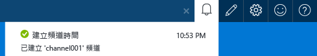
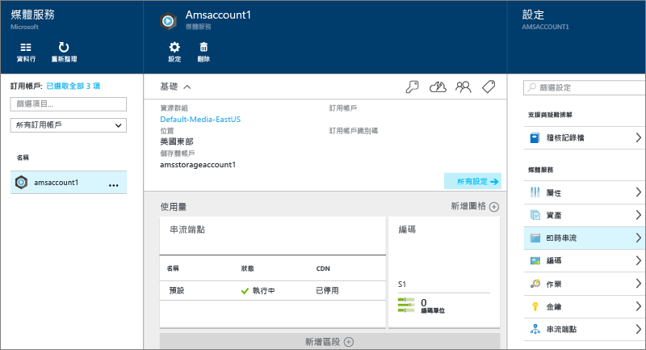
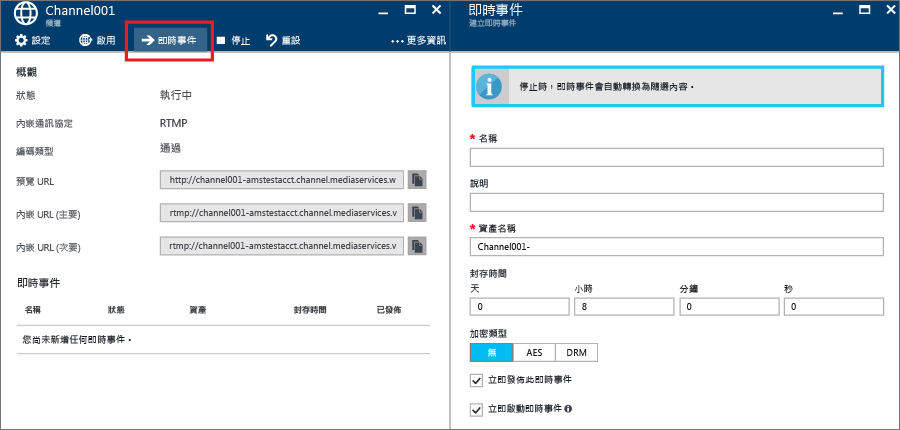
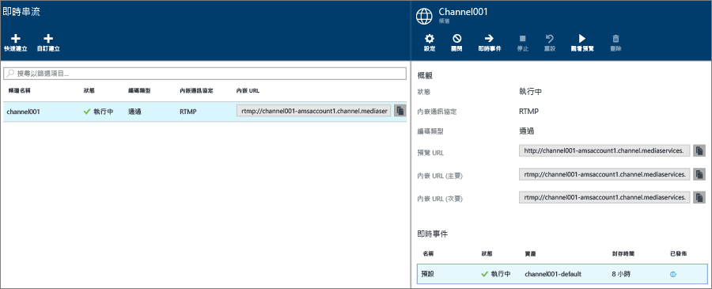
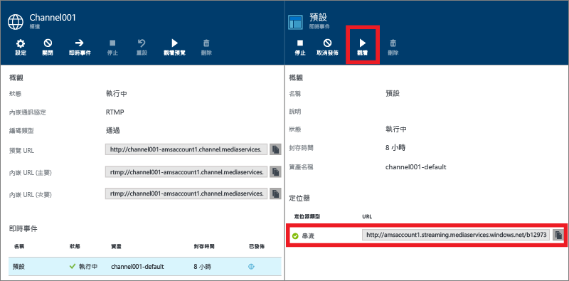
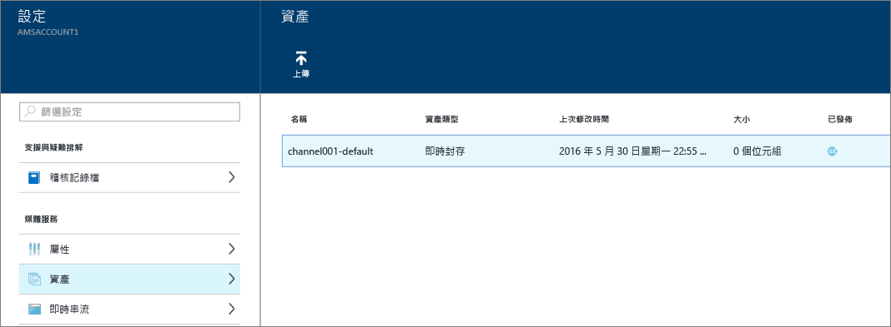

# 如何使用 Azure 入口網站透過內部部署編碼器執行即時串流
> [!div class="op_single_selector"]
> * [入口網站](media-services-portal-live-passthrough-get-started.md)
> * [.NET](media-services-dotnet-live-encode-with-onpremises-encoders.md)
> * [REST](https://docs.microsoft.com/rest/api/media/operations/channel)
> 
> 

本教學課程將逐步引導您使用 Azure 入口網站建立針對即時通行傳遞設定的 **通道** 。 

## 必要條件
需要有下列項目，才能完成教學課程：

* 一個 Azure 帳戶。 如需詳細資訊，請參閱 [Azure 免費試用](https://azure.microsoft.com/pricing/free-trial/)。 
* 媒體服務帳戶。 若要建立媒體服務帳戶，請參閱[如何建立媒體服務帳戶](media-services-portal-create-account.md)。
* 網路攝影機。 例如， [Telestream Wirecast 編碼器](http://www.telestream.net/wirecast/overview.htm)。

強烈建議您先檢閱下列文章：

* [Azure 媒體服務 RTMP 支援和即時編碼器](https://azure.microsoft.com/blog/2014/09/18/azure-media-services-rtmp-support-and-live-encoders/)
* [使用 Azure 媒體服務之即時串流的概觀](media-services-manage-channels-overview.md)
* [使用會建立多位元速率串流的內部部署編碼器執行即時串流](media-services-live-streaming-with-onprem-encoders.md)

## 常見即時串流案例
下列步驟描述當我們建立一般即時串流應用程式 (其使用針對即時通行傳遞設定的通道) 時，會涉及到的各種工作。 本教學課程示範如何建立及管理即時通行通道和即時事件。

>[!NOTE]
>確定您想要串流內容的串流端點已處於 [執行中] 狀態。 
    
1. 將攝影機連接到電腦。 啟動並設定內部部署即時編碼器，讓它輸出多位元速率 RTMP 或 Fragmented MP4 串流。 如需詳細資訊，請參閱 [Azure 媒體服務 RTMP 支援和即時編碼器](http://go.microsoft.com/fwlink/?LinkId=532824)。
   
    此步驟也可以在您建立通道之後執行。
2. 建立並啟動即時通行通道。
3. 擷取通道內嵌 URL。 
   
    內嵌 URL 可供即時編碼器用來傳送串流到通道。
4. 擷取通道預覽 URL。 
   
    使用此 URL 來確認您的通道會正確接收即時串流。
5. 建立即時事件/程式。 
   
    使用 Azure 入口網站時，建立即時事件也會建立資產。 

6. 當您準備好開始串流和封存時，請啟動事件/程式。
7. 即時編碼器會收到啟動公告的信號 (選擇性)。 公告會插入輸出串流中。
8. 每當您想要停止串流處理和封存事件時，請停止事件/程式。
9. 刪除事件/程式 (並選擇性地刪除資產)。     

> [!IMPORTANT]
> 請檢閱 [使用會建立多位元速率串流的內部部署編碼器執行即時視訊串流](media-services-live-streaming-with-onprem-encoders.md) ，以了解具有內部部署編碼器和即時通行通道之即時串流的相關概念和考量。
> 
> 

## 檢視通知和錯誤
如果您要檢視 Azure 入口網站所產生的通知和錯誤，請按一下 [通知] 圖示。

## 建立並啟動即時通行通道和事件
通道是與事件/程式相關聯，而程式可讓您控制即時串流中區段的發佈和儲存。 通道會管理事件。 

設定 **封存時間範圍** 長度，即可指定您想要保留程式之錄製內容的時數。 此值可以設為最少 5 分鐘到最多 25 個小時。 封存時間範圍長度也會指出用戶端可以從目前即時位置及時往回搜尋的最大時間量。 事件在超過指定的時間量後還是可以執行，但是會持續捨棄落後時間範圍長度的內容。 此屬性的這個值也會決定用戶端資訊清單可以成長多長的時間。

每個事件都是與資產相關聯。 若要發佈事件，您必須建立相關聯資產的 OnDemand 定位器。 擁有此定位器，可讓您建置可提供給用戶端的串流 URL。

通道支援最多三個同時執行的事件，因此您可以建立相同內送串流的多個封存。 這可讓您視需要發行和封存事件的不同部分。 例如，您的商務需求是封存 6 小時的程式，但只廣播最後 10 分鐘。 為了達成此目的，您必須建立兩個同時執行的程式。 其中一個程式設定為封存 6 小時的事件，但是未發行該程式。 另一個程式則設定為封存 10 分鐘，並發行程式。

您不應該重複使用現有的即時事件。 而是針對每個事件建立並啟動新事件。

當您準備好開始串流和封存時，請啟動事件。 每當您想要停止串流處理和封存事件時，請停止程式。 

若要刪除封存的內容，請停止並刪除事件，然後刪除相關聯的資產。 如果事件使用資產，則無法刪除資產；必須先刪除事件。 

只要您未刪除資產，即使在停止並刪除事件之後，使用者還是可以視需求將封存的內容串流為視訊。

如果想要保留封存的內容，但不要讓它可進行串流，請刪除串流定位器。

### 使用 Azure 入口網站來建立通道
本節示範如何使用 [快速建立]  選項來建立即時通行通道。

如需即時通行通道的詳細資訊，請參閱 [使用會從建立多位元速率串流的內部部署編碼器執行即時視訊串流](media-services-live-streaming-with-onprem-encoders.md)。

1. 在 [Azure 入口網站](https://portal.azure.com/)中，選取您的 Azure 媒體服務帳戶。
2. 在 [設定] 視窗中，按一下 [即時視訊串流]。 
   
    
   
    [即時視訊串流]  視窗隨即出現。
3. 按一下 [快速建立]  ，使用 RTMP 內嵌通訊協定建立即時通行通道。
   
    [建立新的通道]  視窗隨即出現。
4. 提供新通道的名稱，然後按一下 [建立] 。 
   
    這會使用 RTMP 內嵌通訊協定建立即時通行通道。

## 建立事件
1. 選取您要新增事件的通道。
2. 按下 [即時事件]  按鈕。

## 取得內嵌 URL
建立通道之後，即可取得您提供給即時編碼器的內嵌 URL。 編碼器會使用這些 URL 來輸入即時串流。

## 監看事件
若要監看事件，請按一下 Azure 入口網站中的 [監看]  ，或複製串流 URL 並使用您選擇的播放程式。 

即時事件會在停止時自動轉換為點播內容。

## 清除
如需即時通行通道的詳細資訊，請參閱 [使用會從建立多位元速率串流的內部部署編碼器執行即時視訊串流](media-services-live-streaming-with-onprem-encoders.md)。

* 只有當通道上的所有事件/程式都已停止時，才能停止通道。  停止通道之後，就不會產生任何費用。 當您需要重新啟動它時，它會具有相同的內嵌 URL，因此您不需要重新設定編碼器。
* 只有當通道上的所有事件都已刪除時，才能刪除通道。

## 檢視封存的內容
只要您未刪除資產，即使在停止並刪除事件之後，使用者還是可以視需求將封存的內容串流為視訊。 如果事件使用資產，則無法刪除資產；必須先刪除事件。 

若要管理您的資產，請選取 [設定]，然後按一下 [資產]。

## 後續步驟
檢閱媒體服務學習路徑。

[!INCLUDE [media-services-learning-paths-include](../../includes/media-services-learning-paths-include.md)]

## 提供意見反應
[!INCLUDE [media-services-user-voice-include](../../includes/media-services-user-voice-include.md)]

