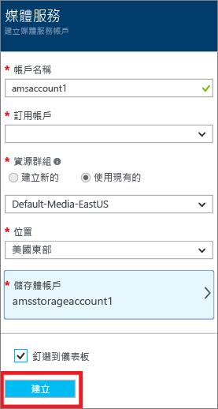
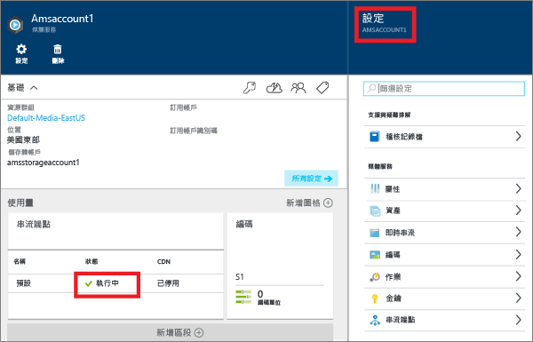
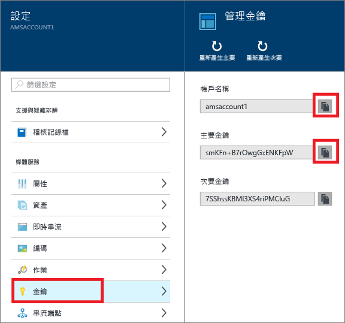
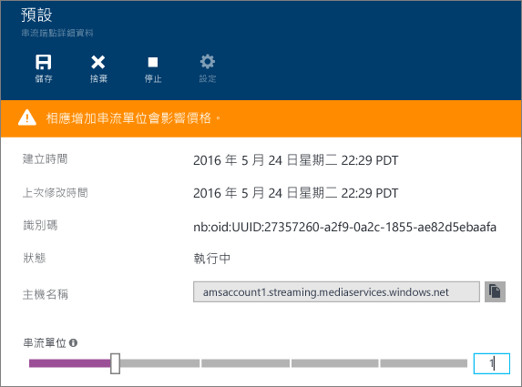
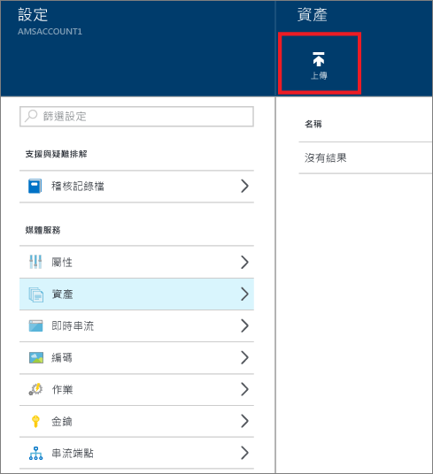
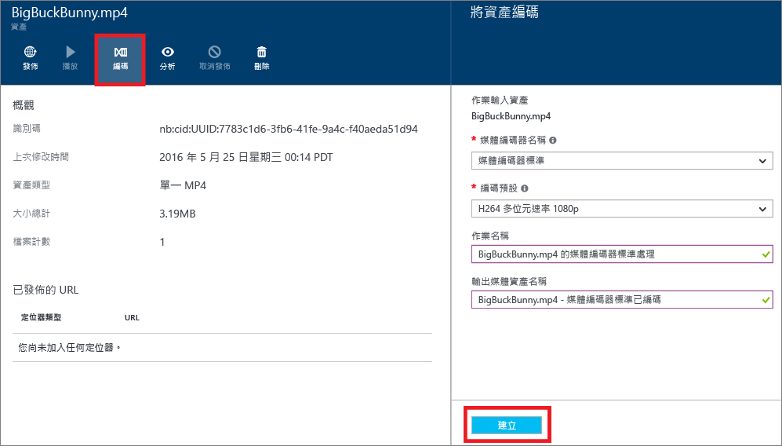
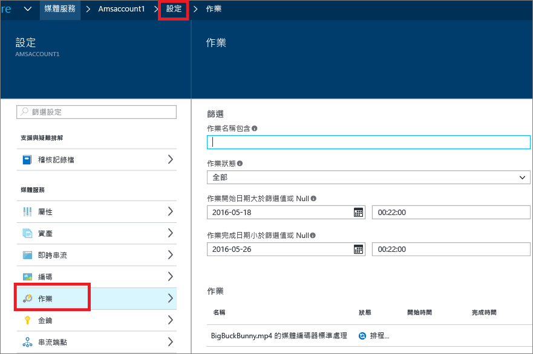
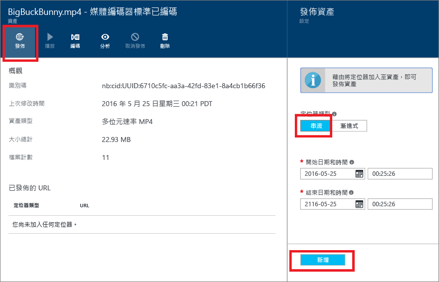
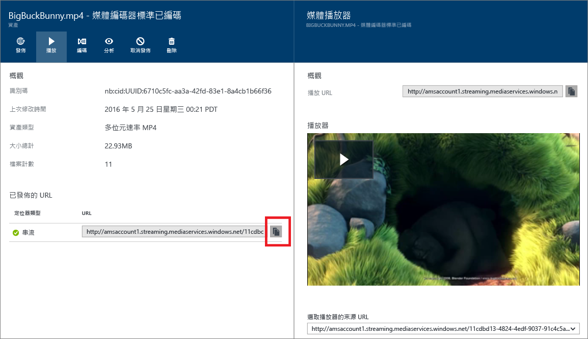

# 使用 Azure 入口網站傳遞點播內容入門
[!INCLUDE [media-services-selector-get-started](../../includes/media-services-selector-get-started.md)]

本教學課程會逐步引導您使用 Azure 入口網站實作含 Azure 媒體服務 (AMS) 應用程式的基本點播視訊 (VoD) 內容傳遞服務。

> [!NOTE]
> 若要完成此教學課程，您需要 Azure 帳戶。 如需詳細資訊，請參閱 [Azure 免費試用](https://azure.microsoft.com/pricing/free-trial/)。 
> 
> 

本教學課程內容包括以下工作：

1. 建立 Azure 媒體服務帳戶。
2. 設定串流端點。
3. 上傳視訊檔案。
4. 將來源檔案編碼為一組自適性 MP4 檔案。
5. 發佈資產並取得串流和漸進式下載 URL。  
6. 播放您的內容。

## 建立 Azure 媒體服務帳戶
本節中的步驟示範如何建立 AMS 帳戶。

1. 登入 [Azure 入口網站](https://portal.azure.com/)。
2. 按一下 [+新增] > [Web + 行動] > [媒體服務]。
   
    
3. 在 [建立媒體服務帳戶]  中輸入必要的值。
   
    
   
   1. 在 [帳戶名稱] 中，輸入新 AMS 帳戶的名稱。 媒體服務帳戶名稱為全部小寫且不含空格的數字或字母，且長度是 3 到 24 個字元。
   2. 在訂用帳戶中，從您可存取的不同 Azure 訂用帳戶中進行選取。
   3. 在 [資源群組] 中，選取新的或現有資源。  資源群組是共用生命週期、權限及原則的資源集合。 [在此](../azure-resource-manager/resource-group-overview.md#resource-groups)深入了解。
   4. 在 [位置] 中，選取用來儲存您媒體服務帳戶之媒體和中繼資料記錄的地理區域。 此區域用於處理和串流媒體。 只有可用的媒體服務區域才會出現在下拉式清單方塊中。 
   5. 在 [儲存體帳戶] 中，選取儲存體帳戶以從媒體服務帳戶提供媒體內容的 Blob 儲存體。 您可以選取與媒體服務帳戶相同地理區域中的現有儲存體帳戶，也可以建立儲存體帳戶。 新的儲存體帳戶會建立於相同的區域中。 儲存體帳戶名稱的規則會與媒體服務帳戶相同。
      
       在 [這裡](../storage/storage-introduction.md)深入了解儲存體。
   6. 選取 **[釘選到儀表板] ** 以查看帳戶部署的進度。
4. 按一下表單底部的 [建立]  。
   
    成功建立帳戶之後，狀態會變更為 [執行中] 。 
   
    
   
    若要管理 AMS 帳戶 (例如，上傳視訊、為資產編碼、監視作業進度)，請使用 [設定]  視窗。

## Manage Keys
您需要帳戶名稱和主要金鑰資訊，以便以程式設計方式存取媒體服務帳戶。

1. 在 Azure 入口網站中，選取您的帳戶。 
   
    [設定]  視窗隨即出現在右邊。 
2. 在 [設定] 視窗中，選取 [金鑰]。 
   
    [管理金鑰]  視窗會顯示帳戶名稱以及主要和次要金鑰。 
3. 按複製按鈕以複製這些值。
   
    

## 設定串流端點
使用 Azure 媒體服務時，其中一個最常見案例是透過自適性串流提供影片給您的用戶端。 媒體服務支援下列調適性位元速率串流技術：HTTP 即時串流 (HLS)、Smooth Streaming、MPEG DASH 和 HDS (僅適用於 Adobe PrimeTime/Access 授權)。

媒體服務提供動態封裝，這讓您以媒體服務即時支援的串流格式 (MPEG DASH、HLS、Smooth Streaming、HDS) 提供自適性 MP4 編碼內容，而不必儲存這些串流格式個別的預先封裝版本。

若要利用動態封裝，您需要執行下列動作：

* 將您的夾層 (來源) 檔編碼為一組自適性 MP4 檔案 (編碼步驟稍後示範於本教學課程中)。  
* 為您計畫從該處傳遞內容的「串流端點」  至少建立一個串流單位。 以下步驟顯示如何變更串流單位數目。

使用動態封裝，您只需要以單一儲存格式儲存及播放檔案，媒體服務會根據來自用戶端的要求建置及傳遞適當的回應。

若要建立和變更串流保留單位數目，請執行下列動作：

1. 在 [設定] 視窗中，按一下 [串流端點]。 
2. 按一下預設串流端點。 
   
    [預設串流端點詳細資料]  視窗隨即出現。
3. 若要指定串流單位數目，請滑動 [串流單位]  滑桿。
   
    
4. 按一下 [儲存]  按鈕以儲存您的變更。
   
   > [!NOTE]
   > 配置任何新的單位最多需要 20 分鐘的時間才能完成。
   > 
   > 

## 上傳檔案
若要使用 Azure 媒體服務串流處理視訊，您必須上傳來源影片、將它們編碼成多個位元速率，以及發佈結果。 這一節涵蓋第一個步驟。 

1. 在 [設定] 視窗中，按一下 [資產]。
   
    
2. 按一下 [上傳]  按鈕。
   
    [上傳視訊資產]  視窗隨即出現。
   
   > [!NOTE]
   > 檔案大小不受限。
   > 
   > 
3. 瀏覽至您的電腦上想要的視訊，加以選取，然後點擊 [確定]。  
   
    開始上傳，您可以在檔名底下看到進度。  

上傳完成後，您會看到新資產列在 [資產]  清單中。 

## 為資產編碼
使用 Azure 媒體服務時，其中一個最常見案例是提供自適性串流給您的用戶端。 媒體服務支援下列調適性位元速率串流技術：HTTP 即時串流 (HLS)、Smooth Streaming、MPEG DASH 和 HDS (僅適用於 Adobe PrimeTime/Access 授權)。 若要針對自適性串流準備您的視訊，您必須將來源視訊編碼為多位元速率檔案。 您應該使用 [媒體編碼器標準]  編碼器來為您的視訊編碼。  

媒體服務也提供動態封裝，這讓您以下列串流格式 (MPEG DASH、HLS、Smooth Streaming 或 HDS) 提供多位元速率 MP4，而不必重新封裝成這些串流格式。 使用動態封裝，您只需要以單一儲存格式儲存及播放檔案，媒體服務會根據來自用戶端的要求建置及傳遞適當的回應。

若要利用動態封裝，您需要執行下列動作：

* 將您的來源檔編碼為一組多位元速率 MP4 檔案 (編碼步驟稍後示範於本節中)。
* 為您計畫從該處傳遞內容的串流端點至少取得一個串流單元。 如需詳細資訊，請參閱 [設定串流端點](media-services-portal-vod-get-started.md#configure-streaming-endpoints)。 

### 使用入口網站進行編碼
本節說明當您利用媒體編碼器標準為您的內容編碼時，可以採取的步驟。

1. 在 [設定] 視窗中，選取 [資產]。  
2. 在 [資產]  視窗中，選取您想要編碼的資產。
3. 按 [編碼]  按鈕。
4. 在 [為資產編碼]  視窗中，選取 [媒體編碼器標準] 處理器和預設值。 例如，如果您知道您的輸入視訊的解析度為 1920x1080 像素，您則可使用 [H264 多位元速率 1080p] 預設值。 如需預設值的詳細資訊，請參閱 [這篇](https://msdn.microsoft.com/library/azure/mt269960.aspx) 文章 – 務必選取最適合您的輸入視訊的預設值。 如果您有低解析度 (640x360) 視訊，則不應該使用預設 [H264 多位元速率 1080p] 預設值。
   
   為了方便管理，您可以選擇編輯輸出資產的名稱和作業的名稱。
   
   
5. 按下 [建立] 。

### 監視編碼作業進度
若要監視編碼作業的進度，請按一下 **[設定]** \(位於頁面頂端)，然後選取 [作業]。

## 發佈內容
如要想提供 URL 給使用者，讓使用者可以利用這個 URL 來傳送或下載內容，請您先建立定位器來發佈您的資產。 定位器提供對於資產中包含之檔案的存取。 媒體服務支援兩種類型的定位器： 

* 串流 (OnDemandOrigin) 定位器，用來自適性串流 (例如，串流處理 MPEG DASH、HLS 或 Smooth Streaming)。 若要建立串流定位器，您的資產必須包含 .ism 檔案。 
* 漸進式 (SAS) 定位器，用於透過漸進式下載傳遞視訊。

資料流 URL 的格式如下，還可以用它來播放 Smooth Streaming 資產。

    {streaming endpoint name-media services account name}.streaming.mediaservices.windows.net/{locator ID}/{filename}.ism/Manifest

若要建立 HLS 資料流 URL，請在 URL 加上 (format=m3u8-aapl)。

    {streaming endpoint name-media services account name}.streaming.mediaservices.windows.net/{locator ID}/{filename}.ism/Manifest(format=m3u8-aapl)

若要建置 MPEG DASH 串流 URL，請將 (格式=mpd-time-csf) 附加至 URL。

    {streaming endpoint name-media services account name}.streaming.mediaservices.windows.net/{locator ID}/{filename}.ism/Manifest(format=mpd-time-csf)

SAS URL 具有下列格式。

    {blob container name}/{asset name}/{file name}/{SAS signature}

> [!NOTE]
> 如果您在 2015 年 3 月前使用入口網站來建立定位器，則建立的定位器 2 年後便告失效。  
> 
> 

若要更新定位器的到期日，請使用 [REST](http://msdn.microsoft.com/library/azure/hh974308.aspx#update_a_locator) 或 [.NET](http://go.microsoft.com/fwlink/?LinkID=533259) API。 當您更新 SAS 定位器的到期日，URL 也會隨之變更。

### 使用入口網站發佈資產
若要使用入口網站發佈資產，請執行下列作業：

1. 選取 **設定** > **資產**。
2. 選取您要發佈的資產。
3. 按一下 [發佈]  按鈕。
4. 選取定位器類型。
5. 按 [新增] 。
   
    

URL 便會加入 [已發佈的 URL] 清單中。

## 從入口網站播放內容
Azure 入口網站提供內容播放程式，您可用來測試您的視訊。

按一下想要的視訊，然後按一下 [播放]  按鈕。

適用一些考量事項：

* 確定已發佈視訊。
* 此 **媒體播放器** 會從預設串流端點播放。 如果您想要從非預設串流端點播放，請按一下以複製 URL 並使用其他播放器。 例如， [Azure 媒體服務播放器](http://amsplayer.azurewebsites.net/azuremediaplayer.html)。

## 後續步驟
檢閱媒體服務學習路徑。

[!INCLUDE [media-services-learning-paths-include](../../includes/media-services-learning-paths-include.md)]

## 提供意見反應
[!INCLUDE [media-services-user-voice-include](../../includes/media-services-user-voice-include.md)]

<!--HONumber=Nov16_HO2-->

