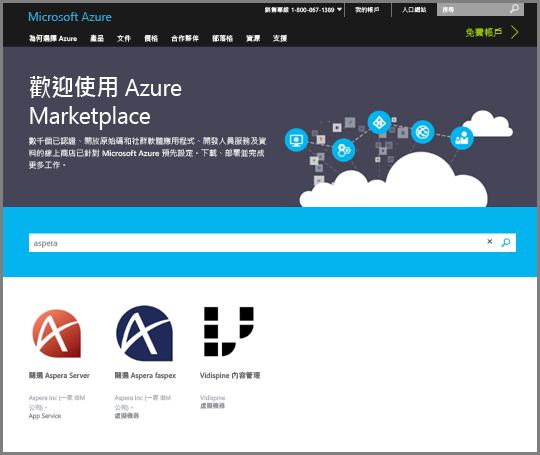
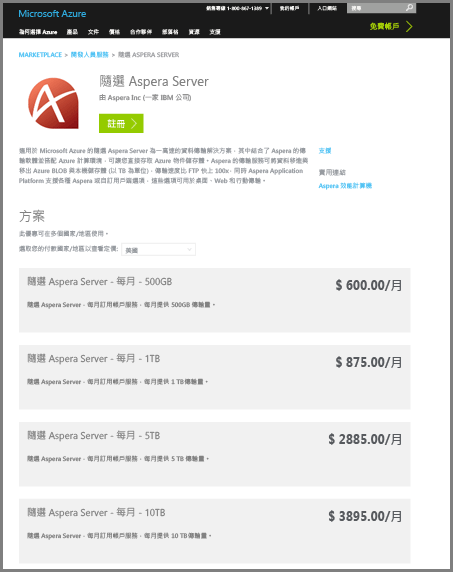
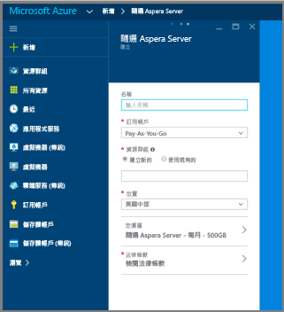
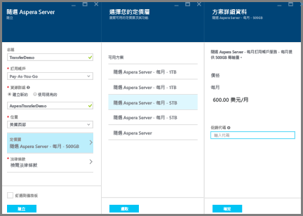
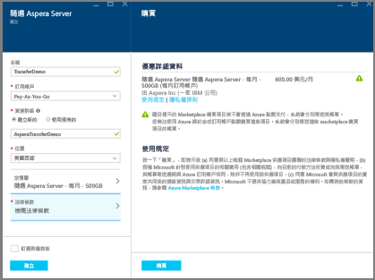
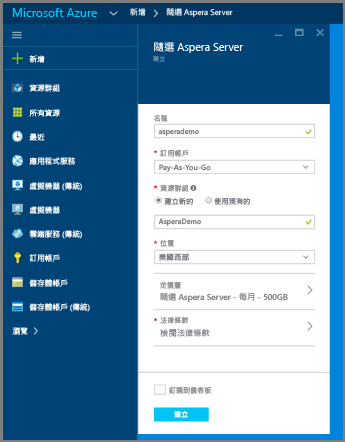
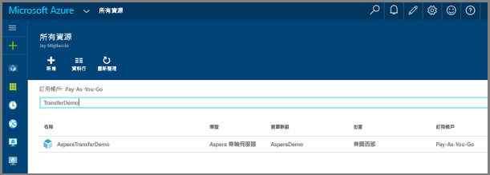
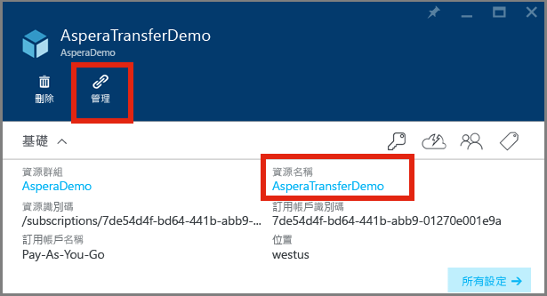

# 使用 Azure 上的 Aspera Server On Demand 服務，將檔案上傳至媒體服務帳戶

## 概觀

**Aspera** 是高速檔案傳輸軟體。 適用於 Azure 的 **Aspera Server On Demand** 可讓大型檔案直接高速上傳和下載到 Azure Blob 物件儲存體。 如需有關 **Aspera On Demand** 的相關資訊，請參閱 [Aspera 雲端](http://cloud.asperasoft.com/)網站。 
  
適用於 **Aspera Server On Demand** 可從 [Azure marketplace](https://azure.microsoft.com/en-us/marketplace/) 中購買。 若要完成購買適用於 Azure 的**Aspera Server On Demand**，請使用 Windows Live ID 來登入 Azure Marketplace。

本教學課程將引導您逐步進行以下步驟：使用 Azure 上的 **Aspera Server On Demand** 服務，將檔案上傳到與媒體服務帳戶相關聯的儲存體帳戶。 

>[!NOTE]
>對於支援使用 Azure 媒體服務媒體處理器 (Mp) 來進行處理的檔案大小有所限制。 請參閱[此](media-services-quotas-and-limitations.md)主題，以取得有關檔案大小限制的詳細資料。
>

## 必要條件 

若要完成本教學課程，您需要：

* Windows Live ID
* [Azure 帳戶](https://azure.microsoft.com)。 如需詳細資訊，請參閱 [Azure 免費試用](https://azure.microsoft.com/pricing/free-trial/)。 
* [Azure 媒體服務帳戶](media-services-portal-create-account.md)。

## 購買適用於 Azure 的 Aspera On Demand

一旦您登入 Azure Marketplace，請遵循下列基本步驟，來完成購買適用於 Azure 的 Aspera On Demand。

1. 搜尋 Aspera，並選取「Server On Demand」。

   

2. 檢閱訂用計畫，然後按一下 [登入]

   

3. 填寫 Server on Demand 訂用帳戶的細節。

   

4. 按一下 [定價層]，並在子面板中選取您希望的每月磁碟量。 在 [方案詳細資料] 面板中，選取 [確定]。 在 [選擇定價層] 面板中，按一下 [選取]。

   

5. 按一下 [法律條款]，即可檢視並接受子面板中的法律條款。 一旦您已檢閱法律條款，按一下 [購買]。

   

6. 按一下 [建立]，以完成購買。

   

7. Azure 的儀表板會宣布它正在佈建服務。  佈建完成後，您可以在資源中搜尋服務名稱來找到新訂用帳戶。 一旦找到服務，連按兩下以啟動服務管理入口網站。

   

8. 啟動 Aspera 管理入口網站。 一旦找到新的 Aspera 服務，您可以在服務上按一下以存取管理入口網站。  新的面板就會啟動。 從該新面板中，必須按一下新服務的 [資源名稱]。  在下列螢幕擷取畫面中，資源名稱為 'AsperaTransferDemo'。 一旦按一下資源名稱時，就會啟動另一個面板。 在該新推出的面板中，您會看到 [管理] 連結。 按一下 [管理] 連結來啟動 Aspera 管理入口網站。

   

9. 藉由按一下 [管理] 連結，您會前往 [註冊] 頁面，必須通過此頁面才能存取服務。

   

10. 此時，您應該具 Aspera 服務管理入口網站的存取權，在此您可建立存取金鑰、下載 Aspera 用戶端和授權、檢視使用量及了解 Api 的相關資訊。

    以下螢幕擷取畫面顯示的是存取建立情況。 

   

    下列螢幕擷取畫面顯示使用方式報告入口網站中的介面。 

   

## 透過 Aspera 上傳檔案

1. 下載並安裝 Aspera 用戶端軟體︰
    
    * [瀏覽器外掛程式](http://downloads.asperasoft.com/connect2/)
    * [豐富型用戶端](http://downloads.asperasoft.com/en/downloads/2)

2. 進行第一次傳送。 若要使用 Aspera 用戶端來透過 Aspera 傳輸服務進行傳輸，您需要完成下列動作︰ 

    1. 使用 Aspera 入口網站來建立存取金鑰。  
    2. 下載、安裝及讓 Aspera 用戶端獲得授權 (可在 Aspera 入口網站中找到軟)。  

    >[!NOTE]
    >請閱讀 Aspera 用戶端指南以取得設定資訊。
    
    3. 透過 [Azure 入口網站](https://portal.azure.com/)，擷取與 Azure 媒體帳戶相關聯的儲存體帳戶部分資訊。 具體而言，即您要將內容置於其中的名稱索引鍵和儲存體 blob 容器名稱。 

        * 若要從入口網站取得儲存體資訊︰尋找儲存體帳戶、按一下 [存取金鑰] 並複製帳戶名稱和金鑰。
        * 若要取得容器名稱︰尋找儲存體帳戶，選取 [Blob]，接著選取您想將內容上傳至其中的內容名稱。 

    以下是 Aspera 用戶端**連接管理員**的螢幕擷取畫面，您必須在其中指定 'Azure' 儲存體類型和認證以及 blob 容器。

    

## 資源

下列是本文提到的資源。 

* [Connect 瀏覽器外掛程式](http://downloads.asperasoft.com/connect2/)
* [Connect 指南](http://downloads.asperasoft.com/en/documentation/8)
* [Aspera 用戶端](http://downloads.asperasoft.com/en/downloads/2)
* [用戶端指南](http://downloads.asperasoft.com/en/documentation/2)

## 後續步驟

您現在可以[從儲存體帳戶將 Blob 複製到 AMS 帳戶](media-services-copying-existing-blob.md#copy-blobs-from-a-storage-account-into-an-ams-account)。

## 媒體服務學習路徑
[!INCLUDE [media-services-learning-paths-include](../../includes/media-services-learning-paths-include.md)]

## 提供意見反應
[!INCLUDE [media-services-user-voice-include](../../includes/media-services-user-voice-include.md)]

