<properties
    pageTitle="開始使用 Azure 監視器 | Microsoft Azure"
    description="開始使用 Azure 監視器，深入了解資源的作業，並以資料為基礎採取動作。"
    authors="johnkemnetz"
    manager="rboucher"
    editor=""
    services="monitoring-and-diagnostics"
    documentationCenter="monitoring-and-diagnostics"/>

<tags
    ms.service="monitoring-and-diagnostics"
    ms.workload="na"
    ms.tgt_pltfrm="na"
    ms.devlang="na"
    ms.topic="article"
    ms.date="09/26/2016"
    ms.author="johnkem"/>

# 開始使用 Azure 監視器

Azure 監視器是全新的平台服務，提供監視 Azure 資源的單一來源。 您可以使用 Azure 監視器來視覺化、查詢、路由、封存及針對來自 Azure 資源的度量和記錄檔採取行動。 您可以利用監視入口網站刀鋒視窗、Insights PowerShell Cmdlets、Cross-Platform CLI 或 Azure Insights REST API 來使用此資料。 在本文中，我們會逐步解說幾個 Azure 監視器的重要元件。

1. 在入口網站中，瀏覽至 [更多服務] 並尋找 [監視] 選項。 按一下星號圖示，將此選項新增至我的最愛清單，讓您可輕鬆從左側導覽列存取。

    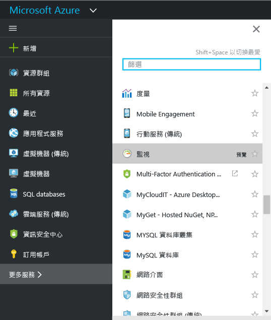

2. 按一下 [監視] 選項來開啟 [監視] 刀鋒視窗。 此刀鋒視窗會將您所有的監視設定和資料結合成一個彙總檢視。 它會先開啟 [活動記錄檔]  區段。

    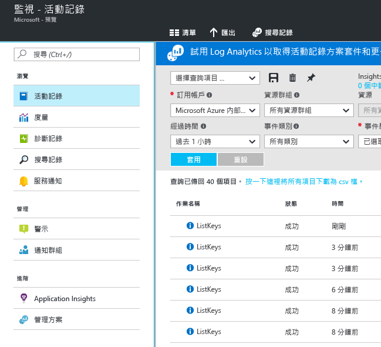

    > [AZURE.WARNING] 所顯示的 [服務通知] 和 [通知群組] 選項為私人預覽，僅針對已加入私人預覽的人員顯示。

    Azure 監視器有三個監視資料的基本類別︰活動記錄檔、度量和診斷記錄檔。

3. 按一下 [活動記錄檔]  確認已顯示活動記錄檔區段。

    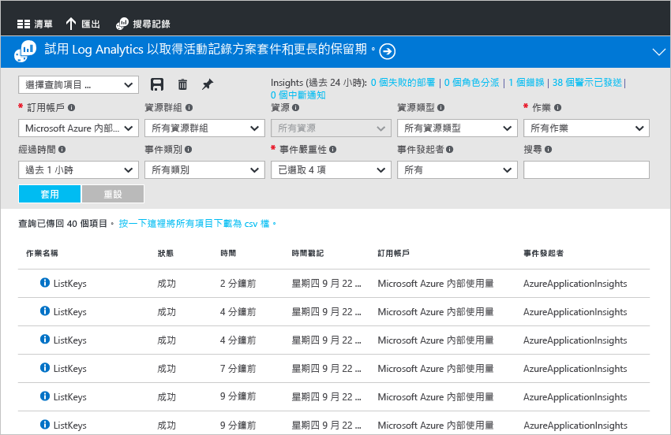

    **活動記錄檔** 描述訂用帳戶中資源所執行的所有作業。 您可以使用 [活動記錄檔] 來判斷訂用帳戶中的資源上任何寫入作業的「內容、對象和時間」。 例如，活動記錄檔會告訴您 Web 應用程式停止的時間，及將 Web 應用程式停止的人員。 活動記錄檔事件會在平台儲存 90 天。
   
    您可以建立並儲存一般篩選的查詢，然後將最重要的查詢釘選至入口網站儀表板，這樣只要發生符合您準則的事件時就會通知您。

4. 篩選上週特定資源群組的檢視，然後按一下 [儲存]  按鈕。

    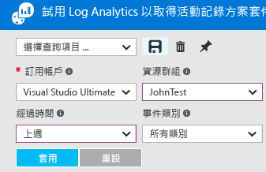

5. 現在，按一下 [釘選]  按鈕。

    ![按一下 [釘選] 取得活動記錄檔](./media/monitoring-get-started/monitor-act-log-pin.png)

    此逐步解說中大部分的檢視皆可釘選到儀表板。 這可協助您在服務上建立作業資料的單一資訊來源。 

6. 返回儀表板。 您現在可以看到查詢 (和結果數目) 顯示在儀表板中。

    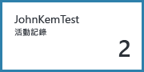

7. 返回 [監視] 圖格然後按一下 [度量] 區段。 您必須先使用區段頂端的選項進行篩選及選取來選取資源。

    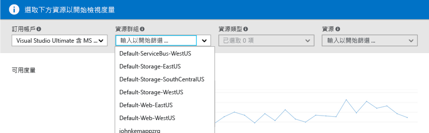

    所有 Azure 資源會發出度量。 這個檢視將所有度量結合在單一窗格。

8. 一旦您選取資源後，所有可用的度量會出現在刀鋒視窗的左邊。 您可以選取度量並修改圖形類型和時間範圍，一次繪製多個度量圖表。 您也可以檢視此資源上設定的所有度量警示。

    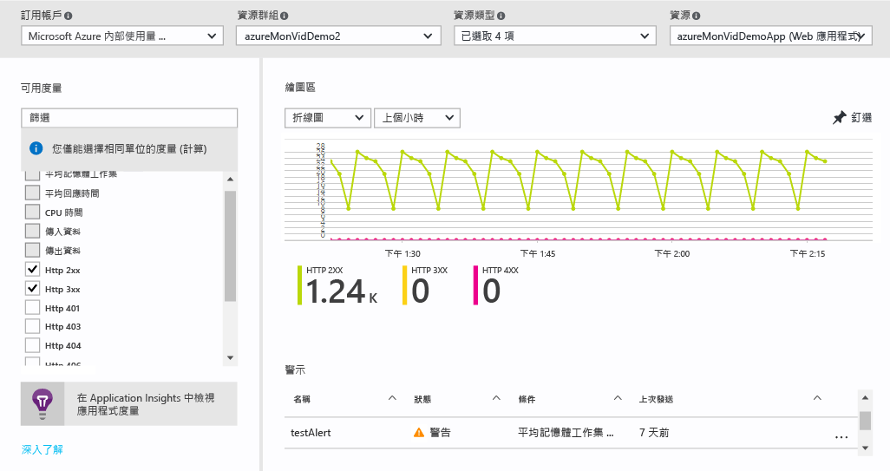

    > [AZURE.NOTE] 部分度量僅可藉由啟用資源上的 [Application Insights](../application-insights/app-insights-overview.md) 提供使用。

9. 當您對圖表感到滿意時，可以使用 [釘選]  按鈕將它釘選到儀表板。

10. 返回 [監視] 刀鋒視窗然後按一下 [診斷記錄檔]。

    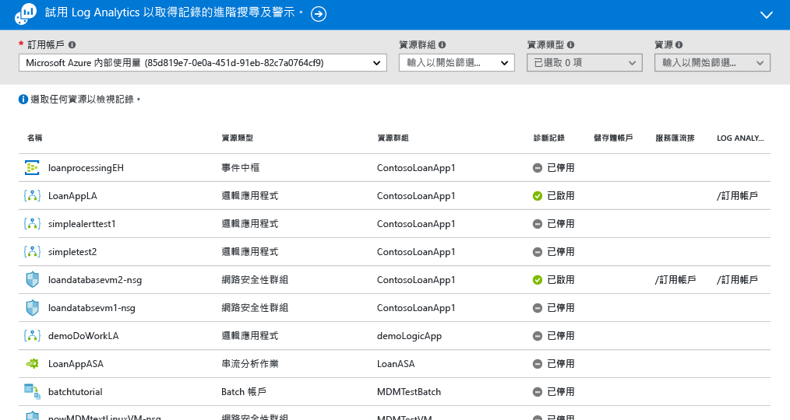

    診斷記錄檔是由特定資源發出的記錄檔，提供有關該資源的作業資料。 例如，網路安全性群組規則計數器和邏輯應用程式工作流程記錄檔皆為診斷記錄檔的類型。 這些記錄檔可以儲存於儲存體帳戶、串流至事件中樞，及/或傳送至 [Log Analytics](../log-analytics/log-analytics-overview.md)(Microsoft 的營運情報產品)，以進行進階搜尋和警示。
   
    在入口網站中，您可以檢視及篩選訂用帳戶中所有資源的清單，來識別它們是否已啟用診斷記錄檔。

11. 按一下診斷記錄檔刀鋒視窗中的資源。 如果診斷記錄檔儲存於儲存體帳戶，您會看到每小時記錄檔的清單，可供您直接下載。 您也可以按一下 [開啟/關閉診斷]，讓您可將保存設定至儲存體帳戶、串流至事件中樞，或傳送至 Log Analytics 工作區。

    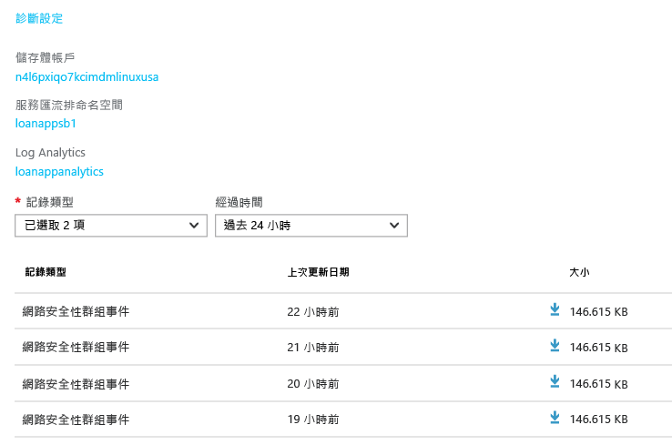

    如果您已將記錄檔分析設定至 Log Analytics，則可以在入口網站的 [搜尋]  區段中搜尋它們。

12. 瀏覽至 [監視] 刀鋒視窗的 [警示]  區段。

    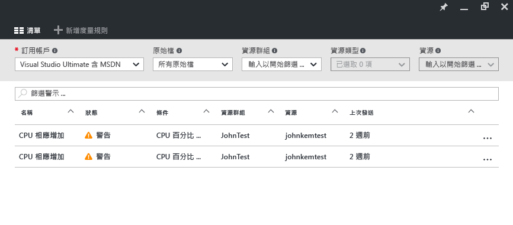

    您可以在這裡管理 Azure 資源上的所有警示。 這包括度量、活動記錄事件 (預覽)、Application Insights Web 測試 (位置) 和 Application Insights 主動診斷的警示。 警示可以觸發將電子郵件或張貼傳送到 webhook。
   
13. 按一下 [新增度量警示]  建立警示。

    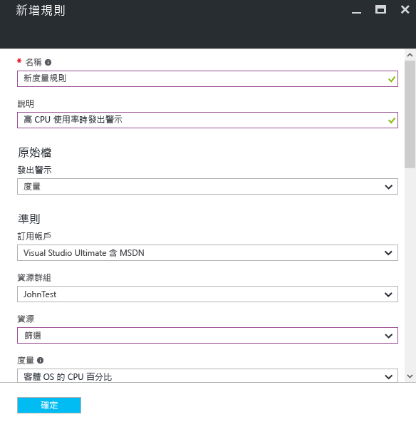

    然後您可以將警示釘選到儀表板，輕鬆地隨時查看其狀態。

14. [監視] 區段也包含 [Application Insights](../application-insights/app-insights-overview.md) 應用程式和 [Log Analytics](../log-analytics/log-analytics-overview.md) 管理解決方案的連結。 這些其他的 Microsoft 產品與 Azure 監視器深入整合。

15. 如果您不使用 Application Insights 或 Log Analytics，有可能是 Azure 監視器已與您目前的監視、記錄和警示產品建立合作關係。 請參閱我們的 [合作夥伴頁面](./monitoring-partners.md) ，取得如何進行整合的完整清單和指示。

您可以藉由執行下列步驟並將所有相關圖格釘選到儀表板，建立應用程式與基礎結構的完整檢視，如下所示︰

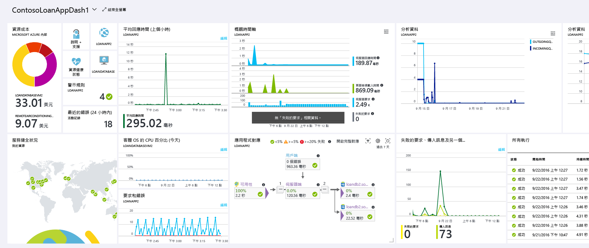

## 後續步驟
- 閱讀 [的概觀](./monitoring-overview.md)

<!--HONumber=Oct16_HO2-->

