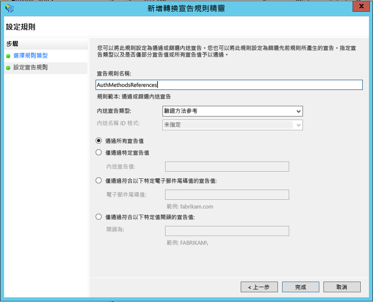

# 搭配 Windows Server 2012 R2 中的 AD FS 使用 Azure Multi-Factor Authentication Server 來保護雲端和內部部署資源
如果您使用 Active Directory 同盟服務 (AD FS)，而且想要保護雲端或內部部署資源，您可以設定 Azure Multi-factor Authentication Server 以搭配 AD FS 運作。 此組態會觸發高價值端點的雙步驟驗證。

在本文中，我們將討論如何搭配 Windows Server 2012 R2 中的 AD FS 使用 Azure Multi-Factor Authentication Server。 如需詳細資訊，請參閱 [搭配 AD FS 2.0 使用 Azure Multi-Factor Authentication Server 來保護雲端和內部部署資源](multi-factor-authentication-get-started-adfs-adfs2.md)。

## 使用 Azure Multi-Factor Authentication Server 保護 Windows Server 2012 R2 AD FS
安裝 Azure Multi-Factor Authentication Server 時，您有下列選項：

* 在與 AD FS 相同的伺服器本機上安裝 Azure Multi-Factor Authentication Server
* 在 AD FS 伺服器本機上安裝 Azure Multi-Factor Authentication 配接器，然後在另一部電腦上安裝 Multi-Factor Authentication Server

開始之前，請留意下列項目：

* 您不需在 AD FS 伺服器上安裝 Azure Multi-Factor Authentication Server。 不過，您必須在執行 AD FS 的 Windows Server 2012 R2 上安裝適用於 AD FS 的 Multi-Factor Authentication 配接器。 您可以在不同的電腦上安裝伺服器 (只要是支援的版本即可)，以及在 AD FS 同盟伺服器上個別安裝 AD FS 配接器。 請參閱下列程序，以了解如何個別安裝配接器。
* 在設計 MFA Server 的 AD FS 配接器時，預期 AD FS 可以將信賴憑證者的名稱傳遞至配接器。 接著，信賴憑證者的名稱可做為應用程式名稱。 不過，結果事實並非如此。 如果您的組織使用簡訊或行動應用程式驗證方法，則在 [公司設定] 中定義的字串會包含預留位置 <$*application_name*$>。 使用 AD FS 配接器時並不會自動取代此預留位置。 因此，建議在保護 AD FS 時，從適當的字串中移除此預留位置。
* 用來登入的帳戶必須具有在 Active Directory 服務中建立安全性群組的使用者權限。
* Multi-Factor Authentication AD FS 配接器安裝精靈會在 Active Directory 執行個體中建立名為 PhoneFactor Admins 的安全性群組。 然後將 Federation Service 的 AD FS 服務帳戶新增至這個群組。 建議您在網域控制站上確認確實已建立 PhoneFactor Admins 群組，而且 AD FS 服務帳戶是此群組的成員。 如有必要，請以手動方式將 AD FS 服務帳戶加入至網域控制站上的 PhoneFactor Admins 群組。
* 如需透過使用者入口網站安裝 Web 服務 SDK 的資訊，請參閱 [部署 Azure Multi-Factor Authentication Server 的使用者入口網站](multi-factor-authentication-get-started-portal.md)

### 在 AD FS 伺服器本機上安裝 Azure Multi-Factor Authentication Server
1. 在 AD FS 伺服器上下載並安裝 Azure Multi-Factor Authentication Server。 如需安裝資訊，請參閱 [開始使用 Azure Multi-Factor Authentication Server](multi-factor-authentication-get-started-server.md)。
2. 在 Azure Multi-Factor Authentication Server 管理主控台中，按一下 [AD FS] 圖示，然後選取 [允許使用者註冊] 和 [允許使用者選取方法] 選項。
3. 選取您想要為您的組織指定的任何其他選項。
4. 按一下 [安裝 AD FS 配接器] 。
   

5. 如果顯示 [Active Directory] 視窗，這代表兩件事情。 您的電腦已加入網域，而且用於保護 AD FS 配接器與 Multi-Factor Authentication 服務間通訊的 Active Directory 組態尚未完成。 按 [下一步] 自動完成此設定，或選取 [略過自動 Active Directory 設定並手動進行設定] 核取方塊，然後按 [下一步]。
6. 如果顯示 [本機群組] 視窗，這代表兩件事情。 您的電腦未加入網域，而且用於保護 AD FS 配接器與 Multi-Factor Authentication 服務間通訊的本機群組組態尚未完成。 按 [下一步] 自動完成此設定，或選取 [略過自動本機群組設定並手動進行設定] 核取方塊，然後按 [下一步]。
7. 在安裝精靈中按 [下一步] 。 Azure Multi-Factor Authentication Server 會建立 PhoneFactor Admins 群組並將 AD FS 服務帳戶加入至 PhoneFactor Admins 群組。
   

8. 在 [啟動安裝程式] 頁面上，按 [下一步]。
9. 在 Multi-Factor Authentication AD FS 配接器安裝程式中，按 [下一步] 。
10. 在安裝完成時按一下 [關閉]  。
11. 現已安裝配接器，您必須向 AD FS 進行登錄。 開啟 Windows PowerShell 並執行下列命令： 
    `C:\Program Files\Multi-Factor Authentication Server\Register-MultiFactorAuthenticationAdfsAdapter.ps1`
    

12. 若要使用最近登錄的配接器，請編輯 AD FS 中的通用驗證原則。 在 AD FS 管理主控台中，移至 [驗證原則]  節點。 在 [Multi-Factor Authentication] 區段中，按一下 [全域設定] 區段旁邊的 [編輯] 連結。 在 [編輯通用驗證原則] 視窗中，選取 [Multi-Factor Authentication] 作為其他驗證方法，然後按一下 [確定]。 此配接器會登錄為 WindowsAzureMultiFactorAuthentication。 重新啟動 AD FS 服務，以讓登錄生效。

此時，Multi-Factor Authentication Server 已設定為要搭配 AD FS 使用的其他驗證提供者。

## 使用 Web 服務 SDK 安裝 AD FS 配接器的獨立執行個體
1. 在執行 Multi-Factor Authentication Server 的伺服器上安裝 Web 服務 SDK。
2. 從 \Program Files\Multi-Authentication Server 目錄將下列檔案複製到您計劃安裝 AD FS 配接器的伺服器︰
   * MultiFactorAuthenticationAdfsAdapterSetup64.msi
   * Register-MultiFactorAuthenticationAdfsAdapter.ps1
   * Unregister-MultiFactorAuthenticationAdfsAdapter.ps1
   * MultiFactorAuthenticationAdfsAdapter.config
3. 執行 MultiFactorAuthenticationAdfsAdapterSetup64.msi 安裝檔案。
4. 在 Multi-Factor Authentication AD FS 配接器安裝程式中，按 [下一步]  來啟動安裝。
5. 在安裝完成時按一下 [關閉]  。

## 編輯 MultiFactorAuthenticationAdfsAdapter.config 檔案
請遵循下列步驟來編輯 MultiFactorAuthenticationAdfsAdapter.config 檔案：

1. 將 **UseWebServiceSdk** 節點設定為 **true**。  
2. 將 **WebServiceSdkUrl** 的值設定為 Multi-Factor Authentication Web 服務 SDK 的 URL。 例如︰https://contoso.com/&lt;certificatename&gt;/MultiFactorAuthWebServicesSdk/PfWsSdk.asmx，其中 certificatename 是您的憑證名稱。  
3. 編輯 Register-MultiFactorAuthenticationAdfsAdapter.ps1 指令碼，將 -ConfigurationFilePath &lt;path&gt; 新增至 `Register-AdfsAuthenticationProvider` 命令的結尾，其中 &lt;path&gt; 是 MultiFactorAuthenticationAdfsAdapter.config 檔案的完整路徑。

### 以使用者名稱和密碼設定 Web 服務 SDK
有兩個選項可供設定 Web 服務 SDK。 第一個是利用使用者名稱和密碼，第二個是利用用戶端憑證。 若要使用第一個選項，請遵循下列步驟，或加以略過直接跳到第二個選項。  

1. 將 **WebServiceSdkUsername** 的值設定為屬於 PhoneFactor Admins 安全性群組的帳戶。 使用 &lt;網域&gt;&#92;&lt;使用者名稱&gt; 格式。  
2. 將 **WebServiceSdkPassword** 的值設定為適當的帳戶密碼。

### 以用戶端憑證設定 Web 服務 SDK
如果您不想要使用使用者名稱和密碼，請遵循下列步驟來以用戶端憑證設定 Web 服務 SDK。

1. 從執行 Web 服務 SDK 之伺服器的憑證授權單位取得用戶端憑證。 了解如何 [取得用戶端憑證](https://technet.microsoft.com/library/cc770328.aspx)。  
2. 將用戶端憑證匯入執行 Web 服務 SDK 的伺服器上的本機電腦個人憑證存放區。 請確定憑證授權單位的公開憑證是在受信任的根憑證存放區中。  
3. 將用戶端憑證的公開和私密金鑰匯出至 .pfx 檔案。  
4. 將 Base64 格式的公開金鑰匯出至 .cer 檔案。  
5. 在 [伺服器管理員] 中，確認已安裝網頁伺服器 (IIS)\網頁伺服器\安全性\IIS 用戶端憑證對應驗證功能。 如果未安裝，請選擇 [新增角色及功能]  來新增此功能。  
6. 在 [IIS 管理員] 中，按兩下包含 Web 服務 SDK 虛擬目錄之網站中的 [設定編輯器]  。 請務必選取網站，而非虛擬目錄。  
7. 移至 **system.webServer/security/authentication/iisClientCertificateMappingAuthentication** 區段。  
8. 將 enabled 設定為 **true**。  
9. 將 oneToOneCertificateMappingsEnabled 設定為 **true**。  
10. 按一下 oneToOneMappings 旁邊的 [...] 按鈕，然後按一下 [新增] 連結。  
11. 開啟稍早匯出的 Base64 .cer 檔案。 移除 *-----BEGIN CERTIFICATE-----*、*-----END CERTIFICATE-----*，以及任何分行符號。 複製產生的字串。  
12. 將 certificate 設定為在上一個步驟中複製的字串。  
13. 將 enabled 設定為 **true**。  
14. 將 userName 設定為屬於 PhoneFactor Admins 安全性群組成員的帳戶。 使用 &lt;網域&gt;&#92;&lt;使用者名稱&gt; 格式。  
15. 將密碼設定為適當的帳戶密碼，然後關閉 [設定編輯器]。  
16. 按一下 [套用]  連結。  
17. 在 Web 服務 SDK 虛擬目錄中，按兩下 [驗證] 。  
18. 確認 [ASP.NET 模擬] 和 [基本驗證] 已設為 [已啟用]，而所有其他項目則已設為 [已停用]。  
19. 在 Web 服務 SDK 虛擬目錄中，按兩下 [SSL 設定] 。  
20. 將 [用戶端憑證] 設定為 [接受]，然後按一下 [套用]。  
21. 將稍早匯出的 .pfx 檔案複製到執行 AD FS 配接器的伺服器。  
22. 將 .pfx 檔案匯入至本機電腦個人憑證存放區。  
23. 按一下滑鼠右鍵並選取 [管理私密金鑰] ，然後將讀取權授與用來登入 AD FS 服務的帳戶。  
24. 開啟用戶端憑證，並從 [詳細資料]  索引標籤複製憑證指紋。  
25. 在 MultiFactorAuthenticationAdfsAdapter.config 檔案中，將 **WebServiceSdkCertificateThumbprint** 設定為在上一個步驟中複製的字串。  

最後，若要登錄配接器，請在 PowerShell 中執行 \Program Files\Multi-Factor Authentication Server\Register-MultiFactorAuthenticationAdfsAdapter.ps1 指令碼。 此配接器會登錄為 WindowsAzureMultiFactorAuthentication。 重新啟動 AD FS 服務，以讓登錄生效。

## 使用 AD FS 保護 Azure AD 資源
若要保護雲端資源，請設定宣告規則，以便在使用者成功執行雙步驟驗證時，Active Directory Federation Services 會發出 multipleauthn 宣告。 此宣告會傳遞至 Azure AD。 遵循此程序來逐步執行各個步驟︰

1. 開啟 [AD FS 管理]。
2. 在左側選取 [信賴憑證者信任]。
3. 以滑鼠右鍵按一下 [Microsoft Office 365 身分識別平台]，然後選取 [編輯宣告規則...]

   

4. 在 [發佈轉換規則] 上，按一下 [新增規則]

   

5. 在 [新增轉換宣告規則精靈] 上，從下拉式清單選取 [通過或篩選傳入宣告]，然後按 [下一步]。

   

6. 指定規則的名稱。 
7. 選取 [驗證方法參考] 做為傳入宣告類型。
8. 選取 [傳遞所有宣告值]。
    
9. 按一下 [完成]。 關閉 AD FS 管理主控台。

## 相關主題
如需疑難排解說明，請參閱 [Azure Multi-Factor Authentication 常見問題集](multi-factor-authentication-faq.md)

<!--HONumber=Feb17_HO2-->

