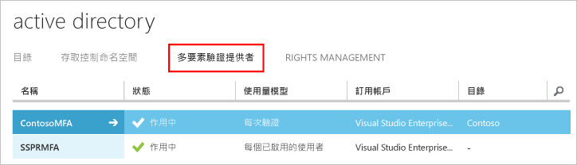

# 開始使用 Azure Multi-Factor Authentication Server

既然我們已經決定要使用內部部署 Multi-Factor Authentication Server，那麼我們就開始著手進行吧。 本頁面探討新伺服器安裝，以及透過內部部署 Active Directory 予以設定。 如果您已安裝 Phonefactor Server 並且正在尋求升級，請參閱[升級為 Azure Mult-Factor Authentication Server](multi-factor-authentication-get-started-server-upgrade.md)；如果您正在尋找只安裝 Web 服務的相關資訊，請參閱[部署 Azure Multi-Factor Authentication Server Mobile App Web 服務](multi-factor-authentication-get-started-server-webservice.md)。

## 下載 Azure Multi-Factor Authentication Server
下載 Azure Multi-Factor Authentication Server 的方法有兩種。 兩者都是透過 Azure 入口網站來完成。 第一個是藉由直接管理 Multi-Factor Auth Provider。 第二個是透過服務設定。 第二個選項需要 Multi-Factor Auth Provider 或 Azure MFA、Azure AD Premium 或 Enterprise Mobility Suite 授權。

> [!Important]
> 這兩個選項看似雷同，但請務必知道要使用哪一個。 如果使用者的授權隨附 MFA，請勿建立 Multi-Factor Auth Provider 來到達伺服器下載。 相反地，請使用選項 2，從 [服務設定] 頁面下載伺服器。 

### 選項 1：從 Azure 傳統入口網站下載 Azure Multi-Factor Authentication Server

如果您已因為按照每一啟用使用者或每一驗證的基礎支付 MFA 而擁有 Multi-Factor Auth Provider，請使用此下載選項。 

1. 以系統管理員身分登入 [Azure 傳統入口網站](https://manage.windowsazure.com)。
2. 選取左邊的 [Active Directory] 。
3. 在 [Active Directory] 頁面上，按一下 [多因素驗證提供者]****
    
4. 在底部按一下 [管理]。 新的頁面隨即開啟。
5. 按一下 [下載]。
6. 在 [產生啟用認證] 上方，按一下 [下載]。
   
7. 儲存下載內容。

### 選項 2：從服務設定下載 Azure Multi-Factor Authentication Server

如果您擁有 Enterprise Mobility Suite、Azure AD Premium 或 Enterprise Cloud Suite 授權，請使用此下載選項。 

1. 以系統管理員身分登入 [Azure 傳統入口網站](https://manage.windowsazure.com)。
2. 選取左邊的 [Active Directory] 。
3. 按兩下您的 Azure AD 執行個體。
4. 在頂端按一下 [ **設定**
5. 向下選動至 [Multi-Factor Authentication] 區段，然後選取 [管理服務設定]
6. 在 [服務設定] 頁面上，於畫面底部按一下 [ **移至入口網站**]。 新的頁面隨即開啟。
   
7. 按一下 [ **下載**
8. 在 [產生啟用認證] 上方，按一下 [下載]。
    
9. 儲存下載內容。

## 安裝及設定 Azure Multi-Factor Authentication Server
既然您已下載伺服器，現在可以進行安裝和設定。  請確認要安裝的伺服器符合下列需求：

| Azure Multi-Factor Authentication Server 需求 | 說明 |
|:--- |:--- |
| 硬體 |<li>200 MB 的硬碟空間</li><li>具有 x32 或 x64 功能的處理器</li><li>1 GB 或更高的 RAM</li> |
| 軟體 |<li>如果主機是伺服器 OS，則為 Windows Server 2008 或更高版本</li><li>如果主機是用戶端 OS，則為 Windows 7 或更高版本</li><li>Microsoft .NET 4.0 Framework</li><li>如果安裝使用者入口網站或 Web 服務 SDK，則為 IIS 7.0 或更高版本</li> |

### Azure Multi-Factor Authentication Server 防火牆需求
- - -
每部 MFA Server 都必須要能夠透過連接埠 443 與以下位址進行輸出通訊：

* https://pfd.phonefactor.net
* https://pfd2.phonefactor.net
* https://css.phonefactor.net

如果將輸出防火牆限制在連接埠 443，請開啟以下 IP 位址範圍：

| IP 子網路 | 網路遮罩 | IP 範圍 |
|:--- |:--- |:--- |
| 134.170.116.0/25 |255.255.255.128 |134.170.116.1 – 134.170.116.126 |
| 134.170.165.0/25 |255.255.255.128 |134.170.165.1 – 134.170.165.126 |
| 70.37.154.128/25 |255.255.255.128 |70.37.154.129 – 70.37.154.254 |

如果您不會使用事件確認功能，而且使用者不會使用行動應用程式從公司網路上的裝置進行驗證，則可將 IP 位址縮小為下列範圍︰

| IP 子網路 | 網路遮罩 | IP 範圍 |
|:--- |:--- |:--- |
| 134.170.116.72/29 |255.255.255.248 |134.170.116.72 – 134.170.116.79 |
| 134.170.165.72/29 |255.255.255.248 |134.170.165.72 – 134.170.165.79 |
| 70.37.154.200/29 |255.255.255.248 |70.37.154.201 – 70.37.154.206 |

### 安裝及設定 Azure Multi-Factor Authentication Server

1. 按兩下可執行檔。 這樣就會開始安裝。
2. 在 [選取安裝資料夾] 畫面中，請確認資料夾正確，然後按一下 [下一步]。
3. 當安裝完成時，請按一下 [完成]。  組態精靈就會啟動。
4. 在組態精靈歡迎畫面上，核取 [略過使用驗證設定精靈]，然後按 [下一步]。  這樣就會關閉精靈，並啟動伺服器。
    
5. 回到下載伺服器的頁面，按一下 [ **產生啟用認證** ] 按鈕。 將此資訊複製到 Azure MFA Server 提供的方塊中，然後按一下 [ **啟用**]。

上述步驟說明使用組態精靈進行快速安裝。  您可以從伺服器的 [工具] 功能表選取驗證精靈，以便重新執行。

## 從 Active Directory 匯入使用者
既然您已安裝及設定伺服器，現在快速地將使用者匯入 Azure MFA Server。

1. 在 Azure MFA Server 的左側選取 [ **使用者**]。
2. 在底部選取 [ **從 Active Directory 匯入**]。
3. 現在您可以搜尋個別使用者，或在 AD 中搜尋含使用者的 OU。  在此情況下，我們會指定使用者的 OU。
4. 反白顯示右側的所有使用者，然後按一下 [匯入]。  您應該會看到指出成功完成作業的快顯視窗。  關閉匯入視窗。

## 傳送電子郵件給使用者
現在您已將使用者匯入 MFA Server，接下來我們建議您傳送電子郵件，以通知他們已為其註冊雙步驟驗證。

要傳送什麼電子郵件應取決於您是如何為使用者設定雙步驟驗證。 比方說，假設您可以從公司目錄匯入使用者的電話號碼，則電子郵件中應該包含預設電話號碼，讓使用者知道應該會有什麼。 同樣地，如果未匯入使用者的電話號碼，或將使用者設定為使用行動應用程式，請對他們傳送可引導他們透過 Azure Multi-factor Authentication 使用者入口網站的超連結來完成帳戶註冊的電子郵件。

電子郵件的內容也會隨著已為使用者設定的驗證方法而不同 (電話、簡訊或行動應用程式)。  例如，如果使用者驗證時需要使用 PIN，電子郵件會告訴他們已設定的初始 PIN。  使用者必須在第一次驗證時變更他們的 PIN。

### 設定電子郵件和電子郵件範本
按一下左邊的電子郵件圖示，即可設定用來傳送這些電子郵件的設定。 這裡可讓您輸入郵件伺服器的 SMTP 資訊，並透過核取 [傳送電子郵件給使用者] 核取方塊來傳送電子郵件。

在 [電子郵件內容] 索引標籤中，您會看到可供選擇的電子郵件範本。 請根據您是如何設定使用者來執行雙步驟驗證，選擇最適合您使用的範本。

## Azure Multi-Factor Authentication Server 如何處理使用者資料？
當您使用 Multi-Factor Authentication (MFA) Server 內部部署時，使用者的資料會儲存在內部部署伺服器中。 雲端中不會儲存任何持續性的使用者資料。 當使用者執行雙步驟驗證時，MFA Server 會將資料傳送至 Azure MFA 雲端服務，以執行驗證。 當這些驗證要求傳送至雲端服務時，要求和記錄檔中會傳送下列欄位，供客戶的驗證/使用情況報告中使用。 某些欄位是選擇性，可以在 Multi-Factor Authentication Server 內啟用或停用。 從 MFA Server 到 MFA 雲端服務的通訊使用透過連接埠 443 輸出的 SSL/TLS。 這些欄位包括：

* 唯一識別碼 - 使用者名稱或內部的 MFA 伺服器識別碼
* 名字和姓氏 (選擇性)
* 電子郵件地址 (選擇性)
* 電話號碼 - 進行語音通話或簡訊驗證時
* 安全性權杖 - 執行行動應用程式驗證時
* 驗證模式
* 驗證結果
* MFA Server 名稱
* MFA Server IP
* 用戶端 IP – 如果有的話

除了上述欄位，驗證結果 (成功/拒絕) 和任何拒絕的原因也與驗證資料一起儲存，可透過驗證/使用情況報告取得。

## 後續步驟
如需進階設定的詳細資訊和組態資訊，請使用下表中的連結：

| 方法 | 說明 |
|:--- |:--- |
| [使用者入口網站](multi-factor-authentication-get-started-portal.md) |有關設定使用者入口網站的資訊，包括部署和使用者自助。 |
| [Active Directory Federation Service](multi-factor-authentication-get-started-adfs.md) |有關搭配 AD FS 設定 Azure Multi-Factor Authentication 的資訊。 |
| [RADIUS 驗證](multi-factor-authentication-get-started-server-radius.md) |有關搭配 RADIUS 設定 Azure MFA Server 的資訊。 使用 RADIUS 可讓您整合各種協力廠商系統與 Azure MFA Server。 |
| [IIS 驗證](multi-factor-authentication-get-started-server-iis.md) |有關搭配 IIS 設定 Azure MFA Server 的資訊。 使用 IIS 可讓您整合各種協力廠商系統與 Azure MFA Server。 |
| [Windows 驗證](multi-factor-authentication-get-started-server-windows.md) |有關搭配 Windows 驗證設定 Azure MFA Server 的資訊。 |
| [LDAP 驗證](multi-factor-authentication-get-started-server-ldap.md) |有關搭配 LDAP 驗證設定 Azure MFA Server 的資訊。 使用 LDAP 可讓您整合各種協力廠商系統與 Azure MFA Server。 |
| [使用 RADIUS 的遠端桌面閘道和 Azure Multi-Factor Authentication Server](multi-factor-authentication-get-started-server-rdg.md) |有關使用 RADIUS 搭配遠端桌面閘道器設定 Azure MFA Server 的資訊。 |
| [與 Windows Server Active Directory 同步處理](multi-factor-authentication-get-started-server-dirint.md) |有關設定 Active Directory 與 Azure MFA Server 之間同步處理的資訊。 |
| [部署 Azure Multi-Factor Authentication Server 行動應用程式 Web 服務](multi-factor-authentication-get-started-server-webservice.md) |有關設定 Azure MFA 伺服器 Web 服務的資訊。 |
| [使用 Azure Multi-Factor Authentication 與協力廠商 VPN 的進階案例](multi-factor-authentication-advanced-vpn-configurations.md) | Cisco、Citrix 和 Juniper VPN 應用裝置的逐步設定指南。 |

<!--HONumber=Feb17_HO1-->

