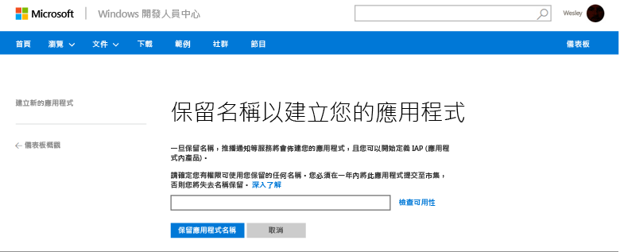
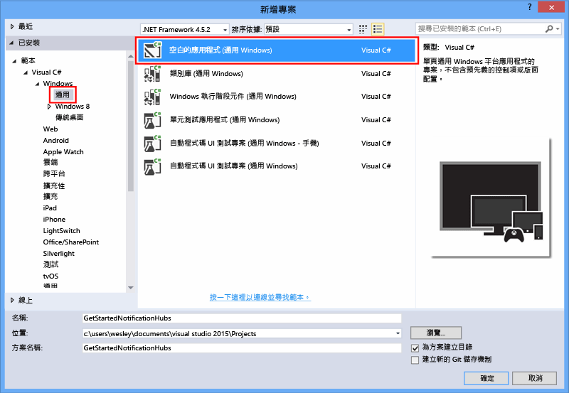
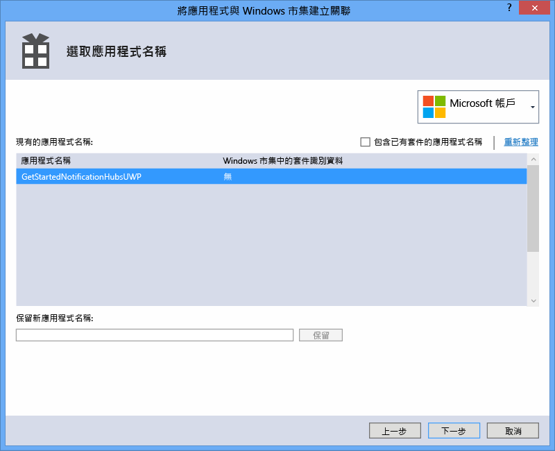
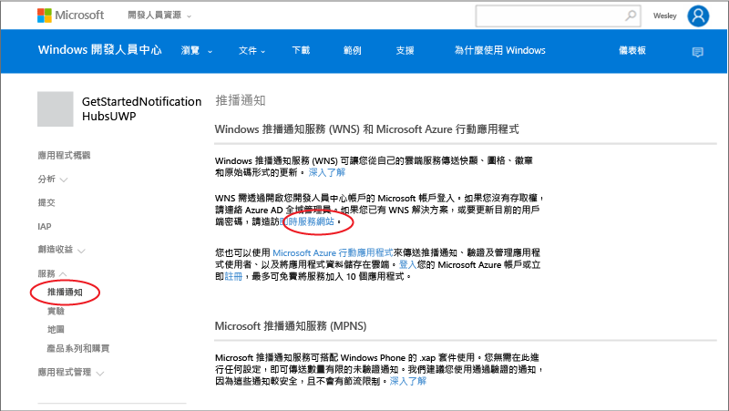
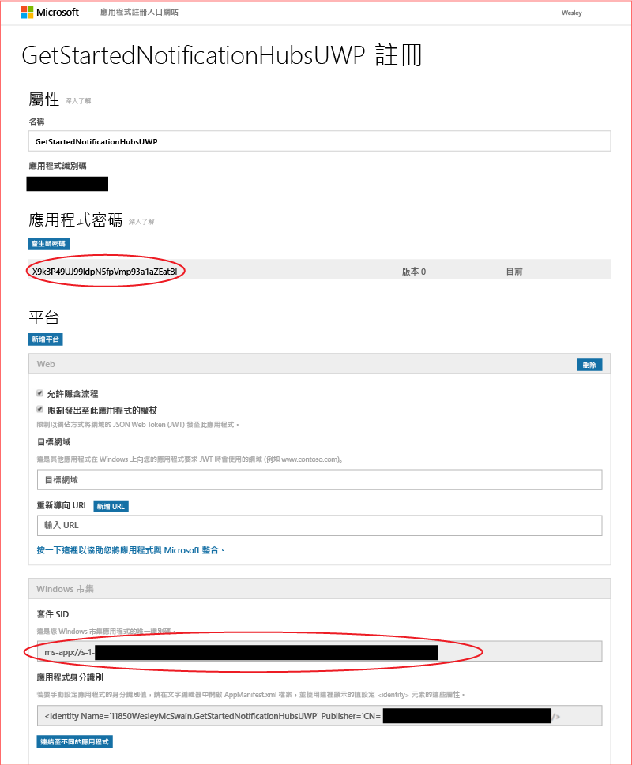
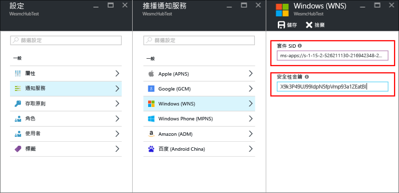

# 開始使用適用於 Windows 通用平台應用程式的通知中樞

[!INCLUDE [notification-hubs-selector-get-started](../../includes/notification-hubs-selector-get-started.md)]

## 概觀

本教學課程將說明如何使用 Azure 通知中樞將推播通知傳送至 Windows 通用平台 (UWP) 應用程式。

在本教學課程中，您將使用 Windows 推播通知服務 (WNS)，建立可接收推播通知的空白 Windows 市集應用程式。 完成時，您便能夠使用通知中樞，將推播通知廣播到所有執行您 app 的裝置。

## 開始之前

[!INCLUDE [notification-hubs-hero-slug](../../includes/notification-hubs-hero-slug.md)]

您可以在 [此處](https://github.com/Azure/azure-notificationhubs-samples/tree/master/dotnet/GetStartedWindowsUniversal)的 GitHub 上找到本教學課程的完整程式碼。

## 先決條件

本教學課程需要下列各項：

* [Microsoft Visual Studio Community 2015](https://www.visualstudio.com/products/visual-studio-community-vs) 或更新版本
* [已安裝通用 Windows 應用程式開發工具](https://msdn.microsoft.com/windows/uwp/get-started/get-set-up)
* 作用中的 Azure 帳戶   如果您沒有帳戶，只需要幾分鐘的時間就可以建立免費試用帳戶。 如需詳細資料，請參閱 [Azure 免費試用](https://azure.microsoft.com/pricing/free-trial/?WT.mc_id=A0E0E5C02&amp;returnurl=http%3A%2F%2Fazure.microsoft.com%2Fen-us%2Fdocumentation%2Farticles%2Fnotification-hubs-windows-store-dotnet-get-started%2F)。
* 有效的 Windows 市集帳戶

完成本教學課程是 Windows 通用平台應用程式所有其他通知中樞教學課程的先決條件。

## 向 Windows 市集註冊應用程式

若要傳送推播通知給 Windows UWP 應用程式，您必須將您的應用程式與 Windows 市集產生關聯。 接著您必須設定您的通知中心，以便與 WNS 進行整合。

1. 如果您尚未註冊您的應用程式，請瀏覽至 [Windows 開發人員中心](https://dev.windows.com/overview)，並使用 Microsoft 帳戶登入，然後按一下 [建立新的應用程式]。
2. 輸入您的 App 名稱，然後按一下 [保留應用程式名稱] 。
   
    
   
   This creates a new Windows Store registration for your app.
3. 在 Visual Studio 中，使用 [空白應用程式] 範本來建立新的 Visual C# 市集應用程式專案，然後按一下 [確定]。
   
    
4. 接受目標和最小平台版本的預設值。
5. 在 [方案總管] 中，以滑鼠右鍵按一下 Windows 市集應用程式專案，然後依序按一下 [市集] 和 [將應用程式與市集建立關聯...]。
   
    

   隨即顯示 [將您的應用程式與 Windows 市集建立關聯]  精靈。

1. 在此精靈中，按一下 [登入]  ，然後使用您的 Microsoft 帳戶登入。
2. 按一下您在步驟 2 中註冊的應用程式，並按 [下一步]，然後按一下 [關聯]。
   
    
   
   這會將所需的 Windows 市集註冊資訊新增至應用程式資訊清單。
3. 回到新應用程式的 [Windows 開發人員中心](http://go.microsoft.com/fwlink/p/?LinkID=266582)頁面，並依序按一下 [服務] 和 [推播通知]，然後按一下 [Windows 推播通知服務 (WNS) 和 Microsoft Azure Mobile Apps] 底下的 [線上服務網站]。
   
    
4. 在您應用程式的註冊頁面上，記下位於 [Windows 市集] 平台設定中的 [應用程式密碼] 和 [套件安全性識別碼 (SID)]。
   
    

     > [AZURE.WARNING]
    應用程式密碼與封裝 SID 是重要的安全性認證。 請勿與任何人共用這些值，或與您的應用程式一起散發密碼。

## 設定您的通知中樞

[!INCLUDE [notification-hubs-portal-create-new-hub](../../includes/notification-hubs-portal-create-new-hub.md)]

<ol start="6">
<li>
選取 [通知服務]<b></b> 選項和 [Windows (WNS)]<b></b> 選項。 然後在 [安全性金鑰]<b></b> 欄位中輸入<b>應用程式密碼</b>。 輸入您在上一節中從 WNS 取得的 [套件 SID]<b></b> 值，然後按一下 [儲存]<b></b>。

</li>
</ol>

&emsp;&emsp;

現在已將您的通知中心設定成使用 WNS，而且您已擁有可用來註冊應用程式和傳送通知的連接字串。

## 將您的應用程式連接到通知中樞

1. 在 Visual Studio 中，以滑鼠右鍵按一下方案，然後按一下 [管理 NuGet 封裝] 。
   
    此時會顯示 [管理 NuGet 封裝]  對話方塊。
2. 搜尋 `WindowsAzure.Messaging.Managed` ，然後按一下 [ **安裝**] 並接受使用條款。
   
    ![][20]
   
    這會使用 <a href="http://nuget.org/packages/WindowsAzure.Messaging.Managed/">WindowsAzure.Messaging.Managed NuGet 封裝</a>來下載、安裝並新增適用於 Windows 的 Azure 傳訊程式庫參考。
3. 開啟 App.xaml.cs 專案檔案，並新增下列 `using` 陳述式。 
   
        using Windows.Networking.PushNotifications;
        using Microsoft.WindowsAzure.Messaging;
        using Windows.UI.Popups;
4. 接著，在 App.xaml.cs 中，將下列 **InitNotificationsAsync** 方法定義新增至 **App** 類別：
   
        private async void InitNotificationsAsync()
        {
            var channel = await PushNotificationChannelManager.CreatePushNotificationChannelForApplicationAsync();
   
            var hub = new NotificationHub("< your hub name>", "<Your DefaultListenSharedAccessSignature connection string>");
            var result = await hub.RegisterNativeAsync(channel.Uri);
   
            // Displays the registration ID so you know it was successful
            if (result.RegistrationId != null)
            {
                var dialog = new MessageDialog("Registration successful: " + result.RegistrationId);
                dialog.Commands.Add(new UICommand("OK"));
                await dialog.ShowAsync();
            }
   
        }
   
    此程式碼會從 WNS 中擷取應用程式的通道 URI，然後向您的通知中樞註冊該通道 URI。
   
   > [!NOTE]
   > 請務必使用出現在 Azure 入口網站中的通知中樞名稱，取代 "your hub name" 預留位置。 此外，使用您在上一節中從通知中樞的 [存取原則] 頁面取得的 **DefaultListenSharedAccessSignature** 連接字串，取代連接字串預留位置。
   > 
   > 
5. 在 App.xaml.cs 的 **OnLaunched** 事件處理常式頂端，將下列呼叫新增至新 **InitNotificationsAsync** 方法：
   
        InitNotificationsAsync();
   
    這會保證每次啟動應用程式時，通道 URI 便會在通知中樞中註冊。
6. 按 **F5** 鍵以執行應用程式。 包含註冊金鑰的快顯對話方塊隨即顯示。
   
     ![][19]

您的應用程式現在已能夠接收快顯通知。

## 傳送通知

在 [Azure 入口網站](https://portal.azure.com/)中使用通知中樞上的 [測試傳送] 案例 (如下列螢幕畫面所示) 來傳送通知，即可在應用程式中快速測試通知的接收。

推播通知通常會以後端服務傳送，例如行動服務或使用相容程式庫的 ASP.NET。 如果程式庫不適用於您的後端，也可以直接使用 REST API 來傳送通知訊息。 

在本教學課程中，為了簡單起見，我們只會在主控台應用程式 (而非後端服務) 中使用適用於通知中樞的 .NET SDK 傳送通知，示範如何測試您的用戶端應用程式。 我們建議以 [使用通知中樞將通知推播給使用者] 教學課程做為下一個步驟，以便從 ASP.NET 後端傳送通知。 不過，下列方法可用來傳送通知：

* **REST 介面**：您可以在使用 [REST 介面](http://msdn.microsoft.com/library/windowsazure/dn223264.aspx)的任何後端平台上支援通知。
* **Microsoft Azure 通知中樞 .NET SDK**︰在適用於 Visual Studio 的 NuGet 封裝管理員中，執行 [Install-Package Microsoft.Azure.NotificationHubs](https://www.nuget.org/packages/Microsoft.Azure.NotificationHubs/)。
* **Node.js** ： [如何從 Node.js 使用通知中樞](notification-hubs-nodejs-push-notification-tutorial.md)。
* **Azure Mobile Apps**：如需如何從已與通知中樞整合的 Azure Mobile App 傳送通知的範例，請參閱 [新增 Mobile Apps 的推播通知](../app-service-mobile/app-service-mobile-windows-store-dotnet-get-started-push.md)。
* **Java/PHP**︰如需使用 REST API 傳送通知的範例，請參閱＜如何從 Java/PHP 使用通知中樞＞([Java](notification-hubs-java-push-notification-tutorial.md) | [PHP](notification-hubs-php-push-notification-tutorial.md))。

## (選擇性) 從主控台應用程式傳送通知

若要使用 .NET 主控台應用程式來傳送通知，請遵循下列步驟。 

1. 以滑鼠右鍵按一下方案，並選取 [新增] 和 [新增專案...]，然後按一下 [Visual C#] 底下的 [Windows] 和 [主控台應用程式]，再按一下 [確定]。
   
     ![][13]
   
    即會將新的 Visual C# 主控台應用程式新增到方案中。 您也可以在個別方案中進行此項作業。
2. 在 Visual Studio 中，依序按一下 [工具]、[NuGet 封裝管理員] 和 [封裝管理員主控台]。
   
    這會在 Visual Studio 中顯示 [封裝管理員主控台]。
3. 在 [封裝管理員主控台] 視窗中，將 [預設專案]  設為新的主控台應用程式專案，然後在主控台視窗中執行下列命令：
   
        Install-Package Microsoft.Azure.NotificationHubs
   
    這會使用 <a href="http://www.nuget.org/packages/Microsoft.Azure.NotificationHubs/">Microsoft.Azure.Notification Hubs NuGet 封裝</a>加入對 Azure 通知中樞 SDK 的參考。
   
    
4. 開啟 Program.cs 檔案，並新增下列 `using` 陳述式：
   
        using Microsoft.Azure.NotificationHubs;
5. 在 **Program** 類別中，新增下列方法：
   
        private static async void SendNotificationAsync()
        {
            NotificationHubClient hub = NotificationHubClient
                .CreateClientFromConnectionString("<connection string with full access>", "<hub name>");
            var toast = @"<toast><visual><binding template=""ToastText01""><text id=""1"">Hello from a .NET App!</text></binding></visual></toast>";
            await hub.SendWindowsNativeNotificationAsync(toast);
        }
   
       Make sure to replace the "hub name" placeholder with the name of the notification hub that as it appears in the Azure Portal. Also, replace the connection string placeholder with the **DefaultFullSharedAccessSignature** connection string that you obtained from the **Access Policies** page of your Notification Hub in the section called "Configure your notification hub."
   
   > [!NOTE]
   > 請確定您使用的連接字串具有 [完整] 存取權，而非 [接聽] 存取權。 接聽存取權的字串沒有傳送通知的權限。
   > 
   > 
6. 在 **[主要]** 方法中新增下列命令列。
   
         SendNotificationAsync();
         Console.ReadLine();
7. 在 Visual Studio 中，以滑鼠右鍵按一下主控台應用程式專案，然後按一下 [設定為啟始專案]，將它設為啟始專案。 然後按 **F5** 鍵執行應用程式。
   
     ![][14]
   
    您將會在所有註冊裝置上收到快顯通知。 按一下或點選快顯橫幅即會載入應用程式。

您可以在 MSDN 上的[快顯目錄]、[圖格目錄]和[徽章概觀]主題中找到所有支援的承載。

## 後續步驟

在此簡單範例中，您會使用入口網站或主控台應用程式，將廣播通知傳送到您的所有 Windows 裝置。 我們建議以 [使用通知中樞將通知推播給使用者] 教學課程做為下一個步驟。 它會示範如何使用標記以特定使用者為目標，從 ASP.NET 後端傳送通知。

如果您想要按興趣群組分隔使用者，請參閱 [使用通知中心傳送即時新聞]。 

若要深入了解通知中樞的一般資訊，請參閱 [通知中樞指引](notification-hubs-push-notification-overview.md)。

<!-- Images. -->
[13]: ./media/notification-hubs-windows-store-dotnet-get-started/notification-hub-create-console-app.png
[14]: ./media/notification-hubs-windows-store-dotnet-get-started/notification-hub-windows-toast.png
[19]: ./media/notification-hubs-windows-store-dotnet-get-started/notification-hub-windows-reg.png
[20]: ./media/notification-hubs-windows-store-dotnet-get-started/notification-hub-windows-universal-app-install-package.png

<!-- URLs. -->

[使用通知中樞將通知推播給使用者]: notification-hubs-aspnet-backend-windows-dotnet-wns-notification.md
[使用通知中心傳送即時新聞]: notification-hubs-windows-notification-dotnet-push-xplat-segmented-wns.md

[快顯目錄]: http://msdn.microsoft.com/library/windows/apps/hh761494.aspx
[圖格目錄]: http://msdn.microsoft.com/library/windows/apps/hh761491.aspx
[徽章概觀]: http://msdn.microsoft.com/library/windows/apps/hh779719.aspx

