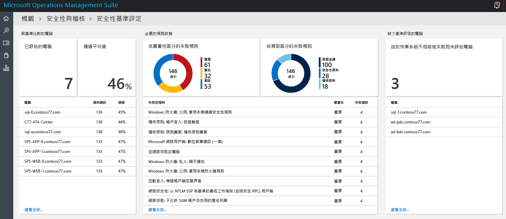
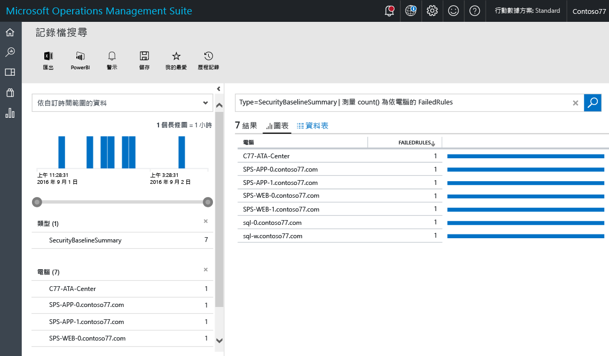
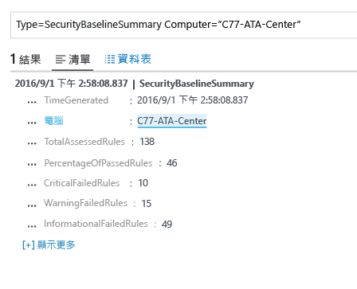
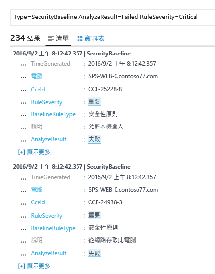

# Operations Management Suite 安全性和稽核解決方案中的基準評估
本文件協助您使用 [Operations Management Suite (OMS) 安全性和稽核解決方案](operations-management-suite-overview.md)的基準評估功能，存取受監視資源的安全狀態。

## 什麼是基準評估？
Microsoft 與全球產業和政府組織共同定義可代表高度安全伺服器部署的 Windows 組態。 此組態是一組登錄機碼、稽核原則設定和安全性原則設定，以及 Microsoft 對於這些設定的建議值。 這組規則也稱為安全性基準。 OMS 安全性和稽核基準評估功能可以順暢地掃描所有電腦的相容性。 

規則類型有三種：

* **登錄規則**︰檢查登錄機碼是否正確設定。
* **稽核原則規則**︰稽核原則相關規則。
* **安全性原則規則**︰使用者的電腦使用權限相關規則。

> [!NOTE]
> 如需這項功能的概觀，請參閱[使用 OMS 安全性來評估安全性組態基準](https://blogs.technet.microsoft.com/msoms/2016/08/12/use-oms-security-to-assess-the-security-configuration-baseline/)。
> 
> 

## 安全性基準評估
您可以使用儀表板，針對 OMS 安全性和稽核監視的所有電腦，檢閱目前的安全性基準評估。  執行下列步驟以存取安全性基準評估儀表板︰

1. 在 [Microsoft Operations Management Suite] 主儀表板中，按一下 [安全性和稽核] 圖格。
2. 在 [安全性和稽核] 儀表板中，按一下 [安全性網域] 下的 [基準評估]。 [安全性基準評估]儀表板隨即出現，如下圖所示︰
   
    

此儀表板分成三個主要區域︰

* **與基準比對的電腦**︰這個區段提供已存取的電腦數和通過評估的電腦百分比摘要。 它也會提供評估中排前 10 名的電腦和百分比結果。
* **需要的規則狀態**︰這個區段的用意是要提醒大家注意失敗的規則 (依嚴重性) 和失敗的規則 (依類型)。 查看第一張圖，您即可快速識別大部分的失敗規則是否重大。 該圖還提供排前 10 名的失敗規則與其嚴重性。 第二張圖會顯示在評估期間失敗的規則類型。 
* **遺失基準評估的電腦**︰這個區段列出因為作業系統不相容或失敗而無法存取的電腦。 

### 存取與基準比對的電腦
在理想情況下，您所有的電腦都會符合安全性基準評估。 不過，在某些情況下，應該不會發生這種情形。 在安全性管理程序中，請務必包含檢閱未通過所有安全性評估測試的電腦。 選取位於 [與基準比對的電腦] 區段中的 [存取的電腦] 選項，即可快速呈現該資料。 您應該會看到記錄檔搜尋結果顯示如下列畫面所示的電腦清單︰

搜尋結果會以表格表格式顯示，其中第一欄為電腦名稱，而第二欄為失敗的規則數目。 若要擷取失敗的規則類型相關資訊，請按一下電腦名稱旁邊的失敗規則數目。 您應該會看到類似下圖所示的結果︰

在此搜尋結果中，您可看見存取的規則總數、重大失敗規則、警告規則和資訊失敗規則的數目。

### 存取需要的規則狀態
取得通過評估的電腦數百分比相關資訊之後，建議您根據重要性取得更多哪些規則失敗的相關資訊。 此視覺效果可協助您設定哪些電腦應先處理的優先順序，以確保它們會在下一次評估中相容。 將滑鼠移至圖形的「重大」部分 (位於 [需要的規則狀態] 下的 [失敗的規則 (依嚴重性)] 圖格中) 並且按一下。 您應該會看到類似以下畫面的結果：

 

在此記錄檔結果中，您會看到失敗的基準規則類型、此規則的描述，以及此安全性規則的Common Configuration Enumeration (CCE) ID。 這些屬性應足以執行更正動作，以修正目標電腦的這個問題。

> [!NOTE]
> 如需 CCE 的詳細資訊，請存取 [National Vulnerability Database](https://nvd.nist.gov/cce/index.cfm)。
> 
> 

### 存取遺失基準評估的電腦
OMS 支援 Windows Server 2008 R2 至 Windows Server 2012 R2 的網域成員和網域控制站基準設定檔。 Windows Server 2016 基準尚未定案，將在發佈後盡快新增。 透過 OMS 安全性和稽核基準評估掃描的其他所有作業系統會顯示在 [遺失基準評估的電腦] 區段之下。

## 另請參閱
在本文件中，您已了解 OMS 安全性和稽核基準評估。 若要深入了解 OMS 安全性，請參閱下列文章：

* [Operations Management Suite (OMS) 概觀](operations-management-suite-overview.md)
* [在 Operations Management Suite 安全性和稽核內監視及回應安全性警示](oms-security-responding-alerts.md)
* [在 Operations Management Suite 安全性和稽核解決方案內監視資源](oms-security-monitoring-resources.md)

