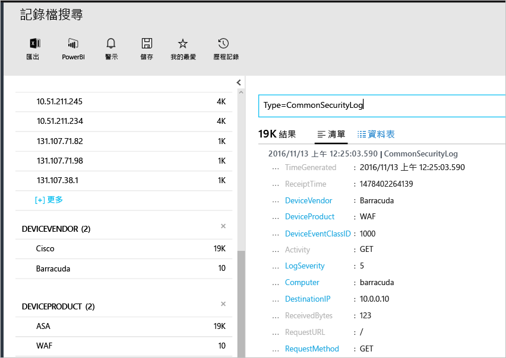

# <a name="connecting-your-security-products-to-the-operations-management-suite-oms-security-and-audit-solution"></a>將安全性產品連接至 Operations Management Suite (OMS) 安全性和稽核解決方案 
本文件可協助您將安全性產品連接至 OMS 安全性和稽核解決方案。 支援的來源如下：

- 常見事件格式 (CEF) 事件
- Cisco ASA 事件


## <a name="what-is-cef"></a>什麼是 CEF？
常見事件格式 (CEF) 是一種以 Syslog 訊息為基礎的業界標準格式，許多安全性廠商使用此格式來讓事件可在不同平台之間互通。 OMS 安全性和稽核解決方案使用 CEF 支援資料擷取，而讓您可以連接安全性產品與 OMS 安全性。 

藉由將資料來源連接至 OMS，您可以充分利用屬於此平台的下列功能︰

- 搜尋與相互關聯
- 稽核
- 警示
- 威脅情報
- 值得注意的問題

## <a name="collection-of-security-solution-logs"></a>收集安全性解決方案的記錄檔

OMS 安全性支援收集使用 CEF over Syslogs 的記錄檔和 [Cisco ASA](https://blogs.technet.microsoft.com/msoms/2016/08/25/add-your-cisco-asa-logs-to-oms-security/) 記錄檔。 在此範例中，來源 (會產生記錄檔的電腦) 是執行 syslog-ng 精靈的 Linux 電腦，目標則是 OMS 安全性。 若要準備 Linux 電腦，您必須執行下列工作︰

- 下載 OMS Agent for Linux 1.2.0-25 版或更新版本。
- 依照[這篇文章](https://github.com/Microsoft/OMS-Agent-for-Linux/blob/master/docs/OMS-Agent-for-Linux.md#steps-to-install-the-oms-agent-for-linux)的**快速安裝指南**一節，將代理程式安裝並加入工作區。

一般而言，代理程式安裝所在的電腦會與產生記錄檔的電腦不同。 將記錄檔轉送至代理程式機器通常需要進行下列步驟︰

- 在代理程式機器上，將記錄產品/機器設定為轉送所需事件到 syslog 精靈 (rsyslog 或 syslog-ng)。
- 在代理程式機器上啟用 syslog 精靈，以從遠端系統接收訊息。

在代理程式機器上，必須從 syslog 精靈將事件傳送到本機 UDP 連接埠 25226。 代理程式將會接聽此連接埠上的內送事件。 以下範例組態會將本機系統的所有事件傳送至代理程式 (您可以修改組態以符合您的本機設定)︰

1. 開啟終端機視窗，並移至目錄 /etc/syslog-ng/ 
2. 建立新檔案 security-config-omsagent.conf，並新增下列內容︰OMS_facility = local4
    
    filter f_local4_oms { facility(local4); };

    destination security_oms { tcp("127.0.0.1" port(25226)); };

    log { source(src); filter(f_local4_oms); destination(security_oms); };
    
3. 下載 security_events.conf 檔案並放在 OMS Agent 電腦中的 */etc/opt/microsoft/omsagent/conf/omsagent.d/*。
4. 輸入下列命令來重新啟動 syslog 精靈︰若為 syslog-ng 執行︰ **
    
    ```
    sudo service rsyslog restart
    ```

    若為 rsyslog 執行︰
    
    ```
    /etc/init.d/syslog-ng restart
    ```
5. 輸入下列命令來重新啟動 OMS Agent︰

    若為 syslog-ng 執行︰
    
    ```
    sudo service omsagent restart
    ```

    若為 rsyslog 執行︰
    
    ```
    systemctl restart omsagent
    ```
6. 輸入下列命令並檢閱結果，以確認 OMS Agent 記錄檔中沒有任何錯誤︰

    ``` 
    tail /var/opt/microsoft/omsagent/log/omsagent.log
    ```

## <a name="reviewing-collected-security-events"></a>檢閱收集到的安全性事件

[!include[log-analytics-log-search-nextgeneration](../../includes/log-analytics-log-search-nextgeneration.md)]

設定完成之後，OMS 安全性就會開始擷取安全性事件。 若要以視覺化方式檢視這些事件，請開啟記錄檔搜尋、在搜尋欄位中輸入命令 Type=CommonSecurityLog，然後按 ENTER。 下列範例顯示此命令的結果，請您注意，在此案例中 OMS 安全性已從多家廠商擷取安全性記錄檔︰
   


您可以針對單一廠商縮小此搜尋範圍，例如，以便以視覺化方式檢視線上 Cisco 記錄檔，輸入︰Type=CommonSecurityLog DeviceVendor=Cisco。 「CommonSecurityLog」已針對 CEF 頁首預先定義欄位，包括基本的擴充功能，其他任何擴充功能無論是不是「自訂擴充功能」，都會插入到「AdditionalExtensions」欄位。 您可以使用自訂欄位功能，以從中獲得專用欄位。 

### <a name="accessing-computers-missing-baseline-assessment"></a>存取遺失基準評估的電腦
OMS 支援 Windows Server 2008 R2 至 Windows Server 2012 R2 的網域成員基準設定檔。 Windows Server 2016 基準尚未定案，將在發佈後盡快新增。 透過 OMS 安全性和稽核基準評估掃描的其他所有作業系統會顯示在 [遺失基準評估的電腦] 區段之下。

## <a name="see-also"></a>另請參閱
在本文件中，您已了解如何將 CEF 解決方案連接至 OMS。 若要深入了解 OMS 安全性，請參閱下列文章：

* [Operations Management Suite (OMS) 概觀](operations-management-suite-overview.md)
* [在 Operations Management Suite 安全性和稽核內監視及回應安全性警示](oms-security-responding-alerts.md)
* [在 Operations Management Suite 安全性和稽核解決方案內監視資源](oms-security-monitoring-resources.md)


