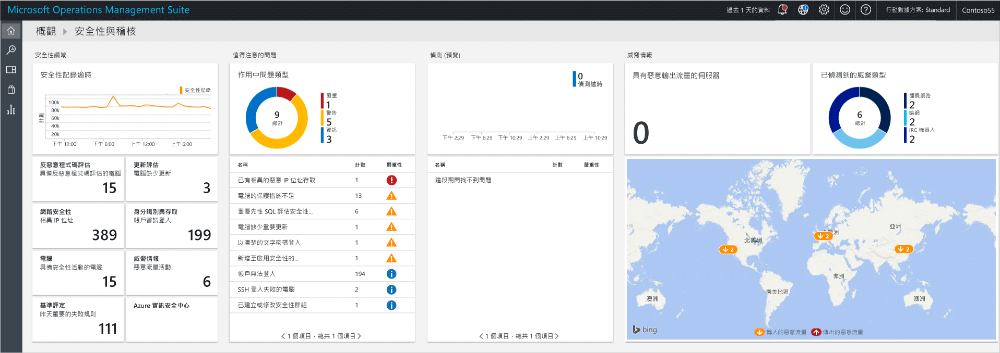
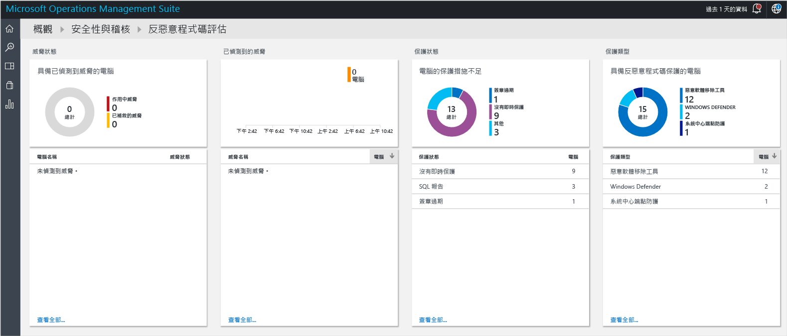
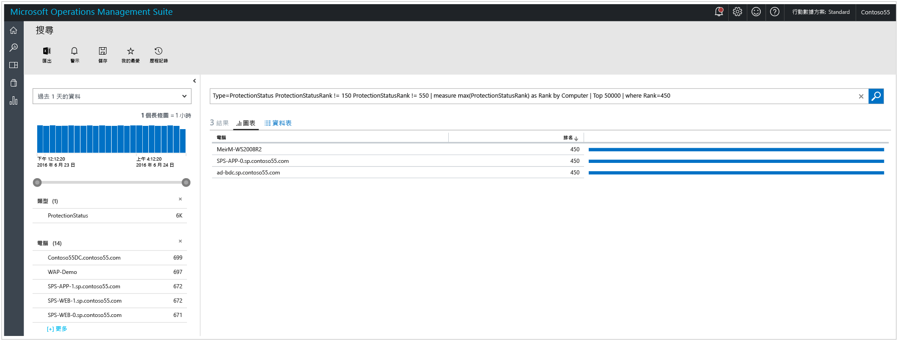
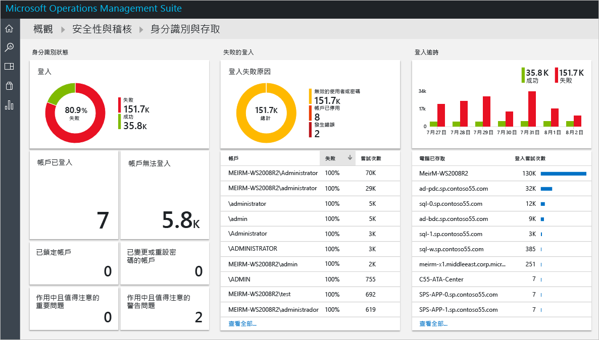
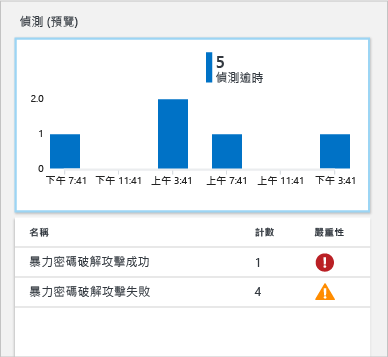
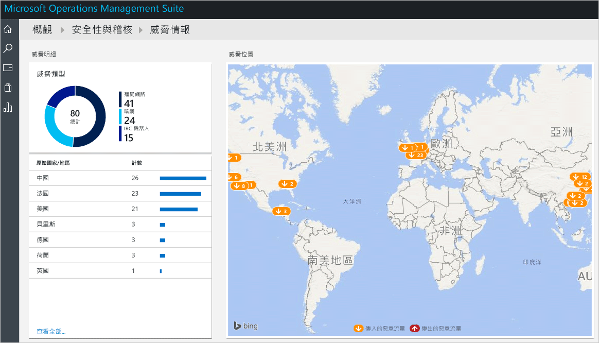

# 開始使用 Operations Management Suite 安全性和稽核解決方案
本文帶領您認識每個選項，協助您快速開始使用 Operations Management Suite (OMS) 安全性和稽核解決方案功能。

## 何謂 OMS？
Microsoft Operations Management Suite (OMS) 是 Microsoft 的雲端型 IT 管理解決方案，可協助您管理並保護內部部署和雲端基礎結構。 如需 OMS 的詳細資訊，請閱讀 [Operations Management Suite](https://technet.microsoft.com/library/mt484091.aspx)一文。

## OMS 安全性和稽核儀表板
「OMS 安全性和稽核」解決方案針對值得您注意的問題，使用內建的搜尋查詢，為您組織的 IT 安全性狀況提供全面性的檢視。 [安全性和稽核] 儀表板是 OMS 中所有安全性相關項目的主畫面。 它可讓您深入了解您的電腦的安全性狀態。 它還能夠檢視過去 24 小時、7 天或任何其他自訂時間範圍內的所有事件。 若要存取 [安全性和稽核] 儀表板，請遵循下列步驟︰

1. 在 [Microsoft Operations Management Suite] 主要儀表板中，按一下左邊的 [設定] 圖格。
2. 在 [設定] 刀鋒視窗的 [解決方案] 底下，按一下 [安全性和稽核] 選項。
3. [安全性和稽核] 儀表板隨即出現︰
   
    

如果您第一次存取此儀表板，而且沒有由 OMS 監視的裝置，則圖格中不會填入從代理程式取得的資料。 一旦安裝此代理程式，則可能需要一些時間來填入資料，因此您一開始看到的儀表板可能會遺失一些資料，因為這些資料仍然在上傳至雲端。  在此情況下，看到一些沒有具體資訊的圖格是很正常的。 請參閱[將 Windows 電腦直接連接到 OMS](https://technet.microsoft.com/library/mt484108.aspx) 以取得如何在 Windows 系統中安裝 OMS 代理程式的詳細資訊，並請參閱[將 Linux 電腦連接到 OMS](https://technet.microsoft.com/library/mt622052.aspx) 以取得如何在 Linux 系統中執行這項工作的詳細資訊。

> [!NOTE]
> 代理程式會根據目前啟用的事件來收集資訊，例如電腦名稱、IP 位址和使用者名稱。 但不會收集任何文件/檔案、資料庫名稱或私人資料。   
> 
> 

解決方案是邏輯、視覺效果和資料擷取規則的集合，可解決客戶所面臨的重要挑戰。 「安全性和稽核」是其他人可以個別新增的一種解決方案。 如需有關如何新增解決方案的詳細資訊，請閱讀 [新增解決方案](https://technet.microsoft.com/library/mt674635.aspx) 一文。

OMS 安全性和稽核儀表板分為四個主要類別︰

* **安全性網域**︰在此區域中，您將能夠進一步探索一段時間的安全性記錄、存取惡意程式碼評估、更新評估、網路安全性、身分識別和存取資訊、具有安全性事件的電腦，以及快速存取 Azure 資訊安全中心儀表板。
* **值得注意的問題**︰此選項可讓您快速識別作用中問題數目和這些問題的嚴重性。
* **偵測 (預覽)**︰可讓您立即將資源的安全性警示視覺化，進而識別攻擊模式。
* **威脅情報**：可讓您藉由下列方式來識別攻擊模式：視覺化呈現具有惡意輸出 IP 流量的伺服器總數、惡意威脅類型，以及顯示這些 IP 出處的地圖。 
* **常見安全性查詢**︰此選項提供最常見安全性查詢的清單，以便用來監視您的環境。 當您按一下上述其中一個查詢時，[搜尋] 刀鋒視窗即會開啟，其中包含該查詢的結果。

> [!NOTE]
> 如需 OMS 如何保留您的資料安全的詳細資訊，請閱讀「OMS 如何保護您的資料」。
> 
> 

## 安全性網域
在監視資源時，務必要能夠快速存取您的環境的目前狀態。 不過，也務必要能夠往回追蹤過去發生的事件，以便進一步了解您的環境在特定時間點發生什麼事情。 

> [!NOTE]
> 資料保留會根據 OMS 定價方案。 如需詳細資訊，請造訪 [Microsoft Operations Management Suite](https://www.microsoft.com/server-cloud/operations-management-suite/pricing.aspx) 價格頁面。
> 
> 

事件回應和鑑識調查案例將直接受惠於 [一段時間的安全性記錄]  圖格中可用的結果。

當您按一下此圖格時，[搜尋] 刀鋒視窗會開啟，並根據過去七天的資料顯示 [安全性事件] \(類型=SecurityEvents) 的查詢結果，如下所示︰

搜尋結果會分成兩個窗格︰左窗格提供已找到的安全性事件數目細目、找到這些事件的電腦、在這些電腦中發現的帳戶數目及活動類型。 右窗格提供結果總數和安全性事件的時序檢視 (包含電腦的名稱和事件活動)。 您也可以按一下 [顯示更多]  來檢視有關此事件的其他詳細資料，例如事件資料、事件識別碼和事件來源。

> [!NOTE]
> 如需 OMS 搜尋查詢的詳細資訊，請參閱 [OMS 搜尋參考](https://technet.microsoft.com/library/mt450427.aspx)。
> 
> 

### 反惡意程式碼評估
此選項可讓您快速識別保護效力不足的電腦，以及遭到惡意程式碼入侵的電腦。 系統會讀取受監視伺服器上的惡意程式碼評估狀態和偵測到的威脅，然後將資料傳送至雲端中的 OMS 服務，以便進行處理。 偵測到威脅及保護效力不足的伺服器會顯示在惡意程式碼評估儀表板中，在您按一下 [反惡意程式碼評估] 圖格後即可存取該儀表板。 

就如同 OMS 儀表板中可用的任何其他即時圖格，當您按一下圖格時，就會開啟包含查詢結果的 [搜尋] 刀鋒視窗。 對於此選項，如果您按一下 [保護狀態] 之下的 [未回報] 選項，您的查詢結果會顯示此單一項目，其中包含電腦的名稱與其排名，如下所示︰

> [!NOTE]
> 「排名」是一個等級，可供反映保護的狀態 (開啟、關閉、已更新等) 以及發現的威脅。 以數字表示有助於進行彙總。
> 
> 

如果您按一下電腦名稱，將會取得這部電腦依時間順序排列的保護狀態檢視。 對於需要了解反惡意程式碼是否曾經安裝並在某個時間點移除的情況，這非常實用。   

### 更新評估
此選項可讓您快速判斷潛在安全性問題的整體風險，以及或重要性這些更新適用於您的環境。 OMS 安全性和稽核解決方案只提供這些更新的視覺效果，而實際資料來自[更新管理解決方案](oms-solution-update-management.md) (這是 OMS 內的不同模組)。 以下是更新範例：

> [!NOTE]
> 如需更新管理解決方案的詳細資訊，請參閱[在 OMS 中更新管理解決方案](oms-solution-update-management.md)。
> 
> 

### 身分識別與存取
身分識別應該是您的企業的控制台，保護您的身分識別應該是您的第一要務。 雖然過去組織周圍有一些周邊，而這些周邊是其中一個主要防禦界限，但時至今日有更多資料和更多應用程式移到雲端，身分識別便成為新的周邊。 

> [!NOTE]
> 資料目前是以未來 Office365 登入的安全性事件登入資料 (事件識別碼 4624) 為基礎，而 Azure AD 資料也會包含在內。
> 
> 

監視您的身分識別活動，您就能夠在事件發生前採取主動式動作，或採取回應式動作以停止攻擊。 [身分識別和存取] 儀表板會提供您的身分識別狀態概觀，包括嘗試登入失敗的數目、在這些嘗試期間使用的使用者帳戶、已鎖定的帳戶、已變更或重設密碼的帳戶，以及目前登入的帳戶數目。 

當您按一下在 [身分識別和存取] 圖格時，您會看到下列儀表板︰

此儀表板中可用的資訊可立即協助您識別潛在的可疑活動。 例如，有 338 次嘗試以**系統管理員**身分登入，而這些嘗試 100% 失敗。 這可能是由暴力密碼破解攻擊這個帳戶所造成。 如果您按一下此帳戶，將會取得更多資訊，協助您判斷此潛在攻擊的目標資源︰

詳細報告會提供有關此事件的重要資訊，包括︰目標電腦、登入類型 (在此例中為「網路」登入)、活動 (在此例中為事件 4625) 和每次嘗試的完整時間軸。 

### 電腦
此圖格可以用來存取目前有安全性事件的所有電腦。 當您在此圖格中按一下時，您會看到一份具有安全性事件的電腦清單，以及每部電腦上的事件數目︰

您可以按一下每部電腦以繼續調查，並檢閱已加上旗標的安全性事件。

### 威脅情報

使用 OMS 安全性和稽核中可用的 [威脅情報] 選項，IT 系統管理員可以識別對環境的安全性威脅 (例如，識別特定的電腦是否屬於殭屍網路)。 如果攻擊者偷偷地安裝惡意程式碼，暗中將此電腦連接到命令和控制項，則電腦可能會成為殭屍網路中的節點。 它也可以識別來自地下通訊通道 (例如暗網) 的潛在威脅。 請閱讀[在 Operations Management Suite 安全性和稽核解決方案內監視及回應安全性警示](oms-security-responding-alerts.md)一文，以深入了解威脅情報。

### 基準評估

Microsoft 與全球產業和政府組織共同定義可代表高度安全伺服器部署的 Windows 組態。 此組態是一組登錄機碼、稽核原則設定和安全性原則設定，以及 Microsoft 對於這些設定的建議值。 這組規則也稱為安全性基準。 如需此選項的詳細資訊，請參閱 [Operations Management Suite 安全性和稽核解決方案中的基準評估](oms-security-baseline.md)。

### Azure 資訊安全中心
此圖格基本上是存取 Azure 資訊安全中心儀表板的捷徑。 如需此解決方案的詳細資訊，請閱讀 [開始使用 Azure 資訊安全中心](../security-center/security-center-get-started.md) 。

## 值得注意的問題
這一組選項的主要目的是提供您環境中問題的快速檢視，並將問題歸類為 [重大]、[警告] 和 [資訊]。 [作用中問題類型] 圖格是這些問題的視覺呈現，但無法讓您進一步探索其詳細資訊，所以您需要使用此圖格的下半部，其中包含問題的名稱 (名稱)、已發生多少物件 (計數) 與其重要性 (嚴重性)。

您可以看到這些問題已涵蓋於 [安全性網域]  群組的不同領域中，以強調此檢視的用意︰從單一位置以視覺化方式呈現您的環境中最重要的問題。

## 偵測 (預覽)
這個選項的主要目的是讓 IT 能藉由威脅的嚴重性，快速識別其環境的潛在威脅。

在[事件回應調查](https://blogs.msdn.microsoft.com/azuresecurity/2016/11/30/investigating-suspicious-activity-in-a-hybrid-cloud-with-oms-security/)期間，這個選項也可以用來執行評估並取得有關攻擊的詳細資訊。

> [!NOTE]
> 如需有關如何使用 OMS 進行事件回應的詳細資訊，請觀看此影片：[如何利用 Azure 資訊安全中心和 Microsoft Operations Management Suite 進行事件回應](https://channel9.msdn.com/Blogs/Taste-of-Premier/ToP1703)。
> 
> 

## 威脅情報
「安全性和稽核」解決方案的新威脅情報區段會以數種方式呈現可能的攻擊模式：具有惡意輸出 IP 流量的伺服器總數、惡意威脅類型，以及顯示這些 IP 出處的地圖。 您可以與地圖互動並按一下 IP 以取得詳細資訊。

地圖上的黃色圖釘表示來自惡意 IP 的傳入流量。 對於暴露在網際網路中以查看傳入惡意流量的伺服器而言，這也很常見，但建議檢閱這些嘗試以確定全都順利完成。 這些指標是以 IIS 記錄、WireData 和 Windows 防火牆記錄為基礎。  

## 常見安全性查詢
可用的常用安全性查詢清單可讓您快速存取資源的資訊並根據您的環境需求加以自訂。 這些常用查詢如下︰

* 所有安全性活動
* 電腦 "computer01.contoso.com" (以您自己的電腦名稱取代) 上的安全性活動
* 帳戶 "Administrator" (以您自己的電腦和帳戶名稱取代) 在電腦 "computer01.contoso.com" (以您自己的電腦名稱取代) 上的安全性活動
* 依電腦的登入活動
* 在任何電腦上終止 Microsoft 反惡意程式碼的帳戶
* 已終止 Microsoft 反惡意程式碼程序的電腦
* 已執行 "hash.exe" 的電腦 (以不同的處理序名稱取代)
* 已執行的所有處理序名稱
* 依帳戶的登入活動
* 從遠端登入電腦 "computer01.contoso.com" (以您自己的電腦名稱取代) 的帳戶

## 另請參閱
在本文件中，已向您介紹 OMS 安全性和稽核解決方案。 若要深入了解 OMS 安全性，請參閱下列文章：

* [Operations Management Suite (OMS) 概觀](operations-management-suite-overview.md)
* [在 Operations Management Suite 安全性和稽核內監視及回應安全性警示](oms-security-responding-alerts.md)
* [在 Operations Management Suite 安全性和稽核解決方案內監視資源](oms-security-monitoring-resources.md)

