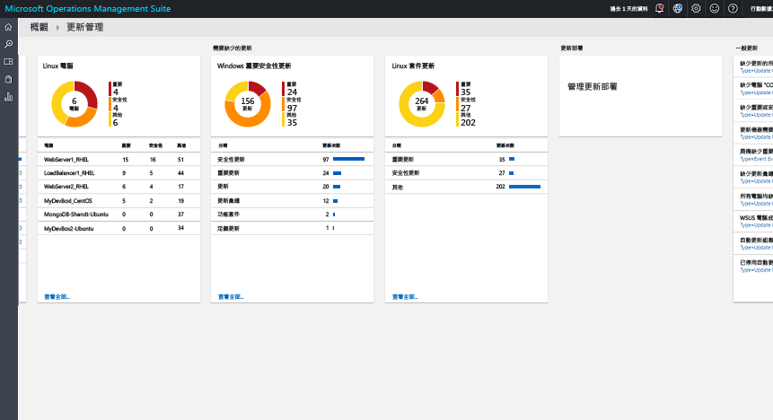
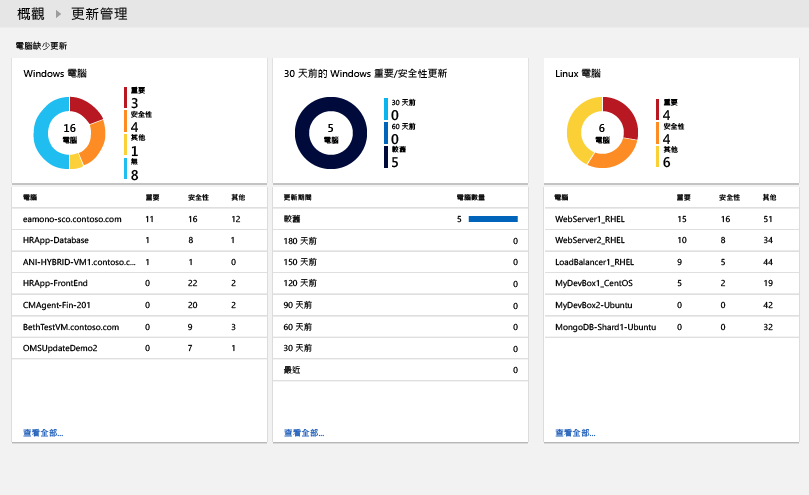
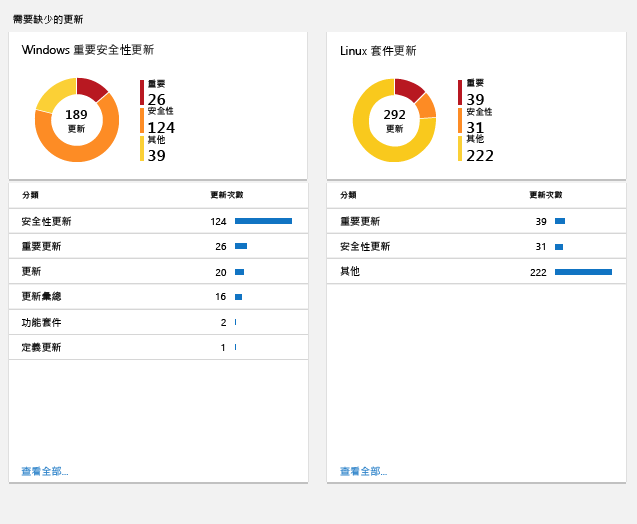
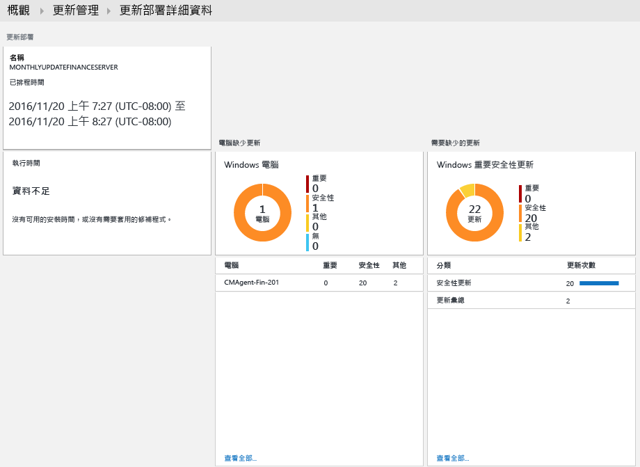

#  OMS 中的更新管理方案
OMS 中的更新管理方案可讓您管理 Windows 和 Linux 電腦的更新。  您可以快速評估所有代理程式電腦上可用更新的狀態，並起始為伺服器安裝必要更新的程序。 

## 必要條件
* Windows 代理程式必須設定為可與 Windows Server Update Services (WSUS) 伺服器通訊，或必須能夠存取 Microsoft Update。  
  
  > [!NOTE]
  > Windows 代理程式不可由 System Center Configuration Manager 並行管理。  
  > 
  > 
* Linux 代理程式必須能夠存取更新儲存機制。  您可以從 [GitHub](https://github.com/microsoft/oms-agent-for-linux) 下載 OMS Agent for Linux。 

## 組態
請執行下列步驟，在 OMS 工作區新增更新管理方案，並新增 Linux 代理程式。  Windows 代理程式則會自動新增，不需要另外進行設定。

1. 使用從方案庫[新增 OMS 方案](../log-analytics/log-analytics-add-solutions.md)所述的程序，在 OMS 工作區新增更新管理方案。  
2. 在 OMS 入口網站中，依序選取 [設定] 和 [連接的來源]。  記下 [工作區識別碼] 和 [主要金鑰] 或 [次要金鑰]。
3. 為每一部 Linux 電腦執行下列步驟。
   
   a.    執行下列命令，安裝最新版 OMS Agent for Linux。  以工作區識別碼取代 <Workspace ID>主要或次要金鑰取代 <Key>。
   
     cd ~   wget https://github.com/Microsoft/OMS-Agent-for-Linux/releases/download/v1.2.0-75/omsagent-1.2.0-75.universal.x64.sh   sudo bash omsagent-1.2.0-75.universal.x64.sh --upgrade -w <Workspace ID> -s <Key>
   
   b.這是另一個 C# 主控台應用程式。 若要移除代理程式，請執行下列命令。
   
     sudo bash omsagent-1.2.0-75.universal.x64.sh --purge

## 管理組件
如果 System Center Operations Manager 管理群組已連線到 OMS 工作區，當您新增此方案時，下列管理組件會安裝在 Operations Manager 中。 這些管理組件不需要任何設定或維護。 

* Microsoft System Center Advisor 更新評估智慧套件 (Microsoft.IntelligencePacks.UpdateAssessment)
* Microsoft.IntelligencePack.UpdateAssessment.Configuration (Microsoft.IntelligencePack.UpdateAssessment.Configuration)
* 更新部署 MP

如需有關方案管理組件如何更新的詳細資訊，請參閱[將 Operations Manager 連接到 Log Analytics](../log-analytics/log-analytics-om-agents.md)。

## 資料收集
### 支援的代理程式
下表描述此方案支援的連接來源。

| 連接的來源 | 支援 | 說明 |
| --- | --- | --- |
| Windows 代理程式 |是 |方案會從 Windows 代理程式收集系統更新的相關資訊，並起始必要更新的安裝。 |
| Linux 代理程式 |是 |方案會從 Linux 代理程式收集系統更新的相關資訊。 |
| Operations Manager 管理群組 |是 |方案會從所連線之管理群組中的代理程式收集系統更新的相關資訊。 Operations Manager 代理程式不需要直接連線到 Log Analytics。 資料會從管理群組轉送至 OMS 儲存機制。 |
| Azure 儲存體帳戶 |否 |Azure 儲存體未包含系統更新的相關資訊。 |

### 收集頻率
對於每部受管理的 Windows 電腦，每天會掃描兩次。  安裝更新時，其資訊會在 15 分鐘內更新。  

對於每部受管理的 Linux 電腦，每 3 個小時會掃描一次。  

## 使用方案
當您在 OMS 工作區新增更新管理方案時，OMS 儀表板中便會新增 [更新管理] 圖格。 此圖格會顯示計數，並以圖形表示環境中目前需要系統更新的電腦數目。  
  

## 檢視更新評估
按一下 [更新管理] 圖格以開啟 [更新管理] 儀表板。 此儀表板包含下表中的資料行。 每個資料行最多會列出十個符合該資料行中指定範圍和時間範圍之準則的項目。 您可以按一下資料行底部的 [查看全部]，或按一下資料行標頭，以執行記錄檔搜尋來傳回所有記錄。

| 資料欄 | 說明 |
| --- | --- |
| **遺漏更新的電腦** | |
| 重大更新或安全性更新 |列出前十大遺漏更新的電腦，並以其遺漏的更新數目排序。 按一下電腦名稱來執行記錄檔搜尋，以傳回該電腦的所有更新記錄。 |
| 超過 30 天的重大更新或安全性更新 |識別遺漏重大更新或安全性更新的電腦數目，並以更新發佈之後所經過的時間長度來分組。 按一下其中一個項目來執行記錄檔搜尋，以傳回所有遺漏的更新和重大更新。 |
| **必要的遺漏更新** | |
| 重大更新或安全性更新 |列出電腦遺漏之更新的分類，並以遺漏該類別更新的電腦數目排序。 按一下分類來執行記錄檔搜尋，以傳回該分類的所有更新記錄。 |
| **更新部署** | |
| 更新部署 |目前排定的更新部署數目，以及要到達下一次排定執行所需經過的時間。  按一下圖格可檢視排程、目前執行的更新和已完成的更新，或者也可排定新的部署。 |

   
   
 
   
 
   

## 安裝更新
環境中的所有 Windows 電腦皆進行過更新評估後，您可以建立「更新部署」來安裝必要的更新。  更新部署會排定為一或多部 Windows 電腦安裝必要的更新。  除了應該包含的電腦或電腦群組外，您還要指定部署的日期和時間。  

在 Azure 自動化中，會由 Runbook 安裝更新。  您目前無法檢視這些 Runbook，而且它們也不需要進行任何設定。  更新部署在建立後便會建立排程，以在指定時間為所包含的電腦啟動主要更新 Runbook。  這個主要 Runbook 會在每個 Windows 代理程式上啟動子 Runbook，以安裝必要的更新。  

### 檢視更新部署
按一下 [更新部署] 圖格可檢視現有更新部署的清單。  其分組依據為狀態 – **已排程**、**執行中**和**已完成**。      

下表說明每個更新部署所顯示的屬性。

| 屬性 | 說明 |
| --- | --- |
| 名稱 |更新部署的名稱。 |
| 排程 |排程的類型。  「OneTime」是目前唯一可用的值。 |
| 開始時間 |更新部署排定要開始的日期和時間。 |
| 持續時間 |允許執行更新部署的分鐘數。  如果未在這段持續時間內安裝完所有更新，就必須等到下一次更新部署時才能安裝剩餘的更新。 |
| 伺服器 |受更新部署影響的電腦數目。 |
| 狀態 |更新部署的目前狀態。  可能的值包括： - 尚未開始 - 執行中 - 已完成 |

按一下更新部署可檢視其詳細資料畫面，其中包含下表中的資料行。  如果更新部署尚未開始，這些資料行不會填入資料。 

| 資料欄 | 說明 |
| --- | --- |
| **電腦結果** | |
| 已成功完成 |依狀態列出更新部署中的電腦數目。  按一下狀態可執行記錄檔搜尋，以傳回更新部署中所有具有該狀態的更新記錄。 |
| 電腦安裝狀態 |列出更新部署所涉及的電腦，以及已成功安裝之更新的百分比。 按一下其中一個項目來執行記錄檔搜尋，以傳回所有遺漏的更新和重大更新。 |
| **更新執行個體結果** | |
| 執行個體安裝狀態 |列出電腦遺漏之更新的分類，並以遺漏該類別更新的電腦數目排序。 按一下電腦來執行記錄檔搜尋，以傳回該電腦的所有更新記錄。 |

   

### 建立更新部署
按一下畫面頂端的 [新增] 按鈕來建立新的更新部署，以開啟 [新增更新部署] 頁面。  您必須為下表中的屬性提供值。

| 屬性 | 說明 |
| --- | --- |
| 名稱 |用以識別更新部署的唯一名稱。 |
| 時區 |用於開始時間的時區。 |
| 開始時間 |開始更新部署的日期和時間。 |
| 持續時間 |允許執行更新部署的分鐘數。  如果未在這段持續時間內安裝完所有更新，就必須等到下一次更新部署時才能安裝剩餘的更新。 |
| 電腦 |更新部署所要包含的電腦或電腦群組名稱。  請從下拉式清單選取一或多個項目。 |

   

### 時間範圍
根據預設，更新管理方案中分析的資料範圍是來自過去 1 天內產生之所有已連線的管理群組。 

若要變更資料的時間範圍，請選取儀表板頂端的 [資料根據]。 您可以選取過去 7 天、1 天或 6 小時內建立或更新的警示。 或者，也可以選取 [自訂]  ，再指定自訂日期範圍。     

## Log Analytics 記錄
更新管理方案會在 OMS 儲存機制中建立兩種類型的記錄。

### 更新記錄
每一部電腦上所安裝或需要的每個更新，都會建立類型為**更新**的記錄。 更新記錄具有下表中的屬性。

| 屬性 | 說明 |
| --- | --- |
| 類型 |更新 |
| SourceSystem |核准之更新安裝的來源。 可能的值包括： - Microsoft Update - Windows Update - SCCM - Linux 伺服器 (擷取自套件管理員) |
| 已核准 |指定是否已核准安裝更新。  在 Linux 伺服器中，此屬性目前是選擇性的，因為其修補並非由 OMS 負責管理。 |
| Windows 的分類 |更新的分類。 可能的值包括： - 應用程式 - 重大更新 - 定義更新 - 功能套件 - 安全性更新 - Service Pack - 更新彙總套件 - 更新 |
| Linux 的分類 |更新的分類。 可能的值包括： - 重大更新 - 安全性更新 - 其他更新 |
| 電腦 |電腦的名稱。 |
| InstallTimeAvailable |指定其他已安裝相同更新的代理程式是否有時間進行安裝。 |
| InstallTimePredictionSeconds |根據其他已安裝相同更新的代理程式所預估出來的安裝時間 (秒)。 |
| KBID |描述更新之知識庫文章的識別碼。 |
| ManagementGroupName |SCOM 代理程式的管理群組名稱。  若為其他代理程式，此為 AOI-<workspace ID>。 |
| MSRCBulletinID |描述更新的 Microsoft 資訊安全公告識別碼。 |
| MSRCSeverity |Microsoft 資訊安全公告的嚴重性。 可能的值包括： - 重大 - 重要 - 中度 |
| 選用 |指定是否為選擇性更新。 |
| 產品 |更新適用的產品名稱。  按一下 [檢視] 可在瀏覽器中開啟文章。 |
| PackageSeverity |Linux 散發套件廠商所報告，這項更新所修正之漏洞的嚴重性。 |
| PublishDate |更新的安裝日期和時間。 |
| RebootBehavior |指定更新是否會強制重新開機。 可能的值包括： - canrequestreboot - neverreboots |
| RevisionNumber |更新的修訂編號。 |
| SourceComputerId |用以唯一識別電腦的 GUID。 |
| TimeGenerated |上次更新記錄的日期和時間。 |
| 標題 |更新的標題。 |
| UpdateID |用以唯一識別更新的 GUID。 |
| UpdateState |指定此電腦上是否已安裝更新。 可能的值包括： - 已安裝 - 此電腦上已安裝更新。 - 需要 - 此電腦上未安裝更新，但需要安裝。 |

 
當您執行的記錄檔搜尋傳回類型為**更新**的記錄時，您可以選取**更新**檢視，其中會顯示一組彙總了搜尋所傳回之更新的圖格。 您可以按一下 [遺漏和已套用的更新] 和 [必要和選用的更新] 圖格中的項目，將檢視範圍鎖定在該組更新。 選取 [清單] 或 [資料表] 檢視則可傳回個別記錄。  

  

在 [資料表] 檢視中，您可以按一下任何記錄的 [KBID]，以在瀏覽器中開啟知識庫文章。 這可讓您快速了解特定更新的詳細資料。  

在 [清單] 檢視中，您可以按一下 KBID 旁的 [檢視] 連結，以開啟知識庫文章。 

### UpdateSummary 記錄
每部 Windows 代理程式電腦都會建立類型為 **UpdateSummary** 的記錄。 每次掃描電腦中的更新時，就會更新此記錄。 **UpdateSummary** 記錄具有下表中的屬性。

| 屬性 | 說明 |
| --- | --- |
| 類型 |UpdateSummary |
| SourceSystem |OpsManager |
| 電腦 |電腦的名稱。 |
| CriticalUpdatesMissing |電腦上遺漏的重大更新數目。 |
| ManagementGroupName |SCOM 代理程式的管理群組名稱。 若為其他代理程式，此為 AOI-<workspace ID>。 |
| NETRuntimeVersion |電腦上所安裝的 .NET 執行階段版本。 |
| OldestMissingSecurityUpdateBucket |這部電腦上所遺漏之最久遠安全性更新在發佈後所經過時間的分類貯體。 可能的值包括： - 更久之前 - 180 天前 - 150 天前 - 120 天前 - 90 天前 - 60 天前 - 30 天前 - 最近 |
| OldestMissingSecurityUpdateInDays |這部電腦上所遺漏之最久遠安全性更新在發佈後所經過的天數。 |
| OsVersion |電腦上所安裝的作業系統版本。 |
| OtherUpdatesMissing |電腦上遺漏的其他更新數目。 |
| SecurityUpdatesMissing |電腦上遺漏的安全性更新數目。 |
| SourceComputerId |用以唯一識別電腦的 GUID。 |
| TimeGenerated |上次更新記錄的日期和時間。 |
| TotalUpdatesMissing |電腦上遺漏的更新數目總和。 |
| WindowsUpdateAgentVersion |電腦上的 Windows Update 代理程式版本號碼。 |
| WindowsUpdateSetting |電腦安裝重要更新之方式的設定。 可能的值包括： - 已停用 - 先通知再安裝 - 排程的安裝 |
| WSUSServer |WSUS 伺服器的 URL (如果電腦已設定為要使用)。 |

## 記錄檔搜尋範例
下表提供此方案所收集之更新記錄的記錄檔搜尋範例。 

| 查詢 | 說明 |
| --- | --- |
| 遺漏更新的所有電腦 |Type=Update UpdateState=Needed Optional=false &#124; select Computer,Title,KBID,Classification,UpdateSeverity,PublishedDate |
| 電腦 "COMPUTER01.contoso.com" (以您自己的電腦名稱取代此值) 的遺漏更新 |Type=Update UpdateState=Needed Optional=false Computer="COMPUTER01.contoso.com" &#124; select Computer,Title,KBID,Product,UpdateSeverity,PublishedDate |
| 遺漏重大更新或安全性更新的所有電腦 |Type=Update UpdateState=Needed Optional=false (Classification="Security Updates" OR Classification="Critical Updates") |
| 機器所需的重大更新或安全性更新 (以手動方式套用的) |Type=Update UpdateState=Needed Optional=false (Classification="Security Updates" OR Classification="Critical Updates") Computer IN {Type=UpdateSummary WindowsUpdateSetting=Manual &#124; Distinct Computer} &#124; Distinct KBID |
| 遺漏必要重大更新或安全性更新之機器的錯誤事件 |Type=Event EventLevelName=error Computer IN {Type=Update (Classification="Security Updates" OR Classification="Critical Updates") UpdateState=Needed Optional=false &#124; Distinct Computer} |
| 遺漏更新彙總套件的所有電腦 |Type=Update Optional=false Classification="Update Rollups" UpdateState=Needed &#124; select Computer,Title,KBID,Classification,UpdateSeverity,PublishedDate |
| 所有電腦的不同遺漏更新 |Type=Update UpdateState=Needed Optional=false &#124; Distinct Title |
| WSUS 電腦成員資格 |Type=UpdateSummary &#124; measure count() by WSUSServer |
| 自動更新組態 |Type=UpdateSummary &#124; measure count() by WindowsUpdateSetting |
| 已停用自動更新的電腦 |Type=UpdateSummary WindowsUpdateSetting=Manual |
| 有可用套件更新的所有 Linux 機器清單 |Type=Update and OSType=Linux and UpdateState!="Not needed" &#124; measure count() by Computer |
| 有可以解決重大漏洞或安全性漏洞之可用套件更新的所有 Linux 機器清單 |Type=Update and OSType=Linux and UpdateState!="Not needed" and (Classification="Critical Updates" OR Classification="Security Updates") &#124; measure count() by Computer |
| 有可用更新的所有套件清單 |Type=Update and OSType=Linux and UpdateState!="Not needed" |
| 有可以解決重大漏洞或安全性漏洞之可用更新的所有套件清單 |Type=Update  and OSType=Linux and UpdateState!="Not needed" and (Classification="Critical Updates" OR Classification="Security Updates") |
| 有任何可用更新的所有「Ubuntu」機器清單 |Type=Update and OSType=Linux and OSName = Ubuntu &#124; measure count() by Computer |

## 後續步驟
* 使用 [Log Analytics](../log-analytics/log-analytics-log-searches.md) 中的記錄檔搜尋，檢視詳細的更新資料。
* [建立您自己的儀表板](../log-analytics/log-analytics-dashboards.md)，其中會顯示受管理電腦的更新相容性。
* 在偵測到電腦遺漏重大更新或電腦已停用自動更新時[建立警示](../log-analytics/log-analytics-alerts.md)。  

<!--HONumber=Nov16_HO2-->

