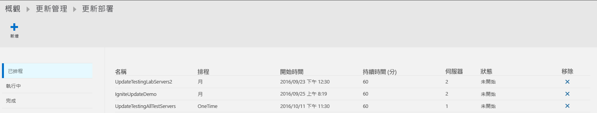
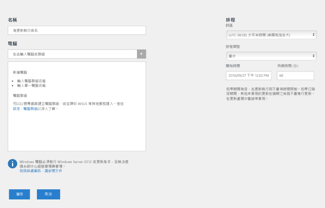
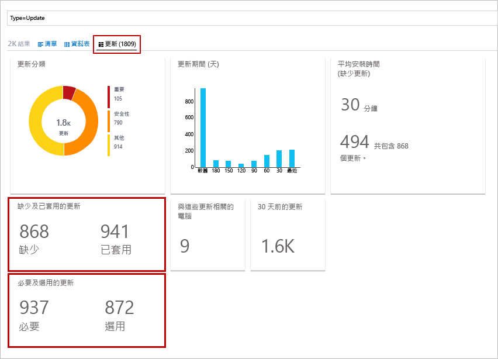
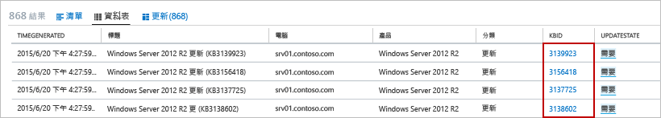
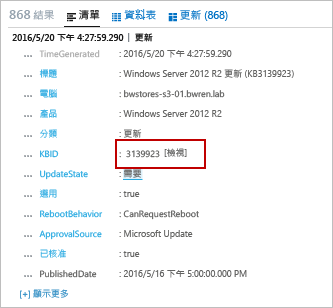

# OMS 中的更新管理方案

OMS 中的「更新管理」解決方案可讓您管理 Azure 中所部署 Windows 和 Linux 電腦的作業系統安全性更新、內部部署環境或其他雲端提供者。  您可以快速評估所有代理程式電腦上可用更新的狀態，並管理為伺服器安裝必要更新的程序。

## 解決方案概觀
OMS 管理的電腦會使用下列各項來執行評估和更新部署︰

* 適用於 Windows 或 Linux 的 OMS 代理程式
* 適用於 Linux 的 PowerShell 預期狀態組態 (DSC)
* 自動化 Hybrid Runbook Worker
* 適用於 Windows 電腦的 Microsoft Update 或 Windows Server Update Services

下列圖表顯示行為和資料流程的概念性檢視，說明解決方案如何評估安全性更新並將及套用至工作區中所有連線的 Windows Server 和 Linux 電腦。    

#### Windows Server

#### Linux

在電腦執行更新合規性掃描之後，OMS 代理程式會將大量資訊轉送至 OMS。 在 Windows 電腦上，合規性掃描預設會每 12 小時執行一次。  除了掃描排程，如果在更新安裝之前與更新安裝之後重新啟動 Microsoft Monitoring Agent (MMA)，則會在 15 分鐘內起始更新合規性掃描。  在 Linux 電腦上，合規性掃描預設會每 3 小時執行一次，而如果重新啟動 MMA 代理程式，則會在 15 分鐘內起始相容性掃描。  

接著會在解決方案內含的儀表板中處理及摘要說明合規性資訊，或可使用使用者定義或預先定義的查詢搜尋此資訊。  解決方案會根據您設定要同步處理的來源，報告電腦的最新狀態。  如果 Windows 電腦設定為向 WSUS 報告，則視 WSUS 上次與 Microsoft Update 同步處理的時間，結果可能不同於 Microsoft Update 所顯示的結果。  設定為向本機存放庫和公用存放庫報告之 Linux 電腦，同樣也是如此。   

您可以藉由建立排定的部署，在需要更新的電腦上部署和安裝軟體更新。  歸類為「選擇性」的更新不會包含在 Windows 電腦的部署範圍內，只需要更新。  排定的部署會藉由明確指定電腦，或選取以一組特定電腦之記錄搜尋為基礎的[電腦群組](../log-analytics/log-analytics-computer-groups.md)，定義哪些目標電腦將會收到適用的更新。  您也可以指定核准排程，並指定允許安裝更新的一段時間。  在 Azure 自動化中，會由 Runbook 安裝更新。  您無法檢視這些 Runbook，而它們也不需要任何設定。  更新部署在建立後便會建立排程，以在指定的時間為所包含的電腦啟動主要更新 Runbook。  這個主要 Runbook 會在每個代理程式上啟動子 Runbook，以安裝必要的更新。       

在更新部署中指定的日期和時間，目標電腦會以平行方式執行部署。  系統會先執行掃描，以確認安裝仍然需要並加以安裝。  請務必注意，對於 WSUS 用戶端電腦而言，如果未在 WSUS 中核准更新，則更新部署會失敗。  套用更新的結果會轉送給 OMS 在儀表板中進行處理及彙總，或藉以搜尋事件。     

## 必要條件
* 此解決方案支援針對 Windows Server 2008 和更新版本執行更新評估，以及針對 Windows Server 2008 R2 SP1 和更新版本執行更新部署。  不支援「伺服器核心」和「Nano 伺服器」安裝選項。

    > [!NOTE]
    > 支援將更新部署到 Windows Server 2008 R2 SP1 需要 .NET Framework 4.5 和 WMF 5.0 或更新版本。
    >  
* 不支援 Windows 用戶端作業系統。  
* Windows 代理程式必須設定為可與 Windows Server Update Services (WSUS) 伺服器通訊，或必須能夠存取 Microsoft Update。  

    > [!NOTE]
    > Windows 代理程式不可由 System Center Configuration Manager 並行管理。  
    >
* CentOS 6 (x86/x64) 和 7 (x64)
* Red Hat Enterprise 6 (x86/x64) 和 7 (x64)
* SUSE Linux Enterprise Server 11 (x86/x64) 和 12 (x64)
* Ubuntu 12.04 LTS 和更新的 x86/x64  
    > [!NOTE]  
    > 若要避免在 Ubuntu 維護期間以外套用更新，請將自動安裝升級套件重新設定為停用自動更新。 如需設定方式的資訊，請參閱 [Ubuntu Server 指南中的自動更新主題](https://help.ubuntu.com/lts/serverguide/automatic-updates.html)。

* Linux 代理程式必須能夠存取更新存放庫。  

    > [!NOTE]
    > 此解決方案不支援適用於 Linux 且設定為向多個 OMS 工作區報告的 OMS 代理程式。  
    >

如需有關如何安裝適用於 Linux 的 OMS 代理程式及下載最新版本的詳細資訊，請參閱[適用於 Linux 的 Operations Management Suite 代理程式](https://github.com/microsoft/oms-agent-for-linux)。  如需有關如何安裝適用於 Windows 的 OMS 代理程式，請檢閱[適用於 Windows 的 Operations Management Suite 代理程式](../log-analytics/log-analytics-windows-agents.md)。  

## 方案元件
此解決方案包含下列已新增到自動化帳戶的資源，以及直接連線的代理程式或 Operations Manager 連線的管理群組。

### 管理組件
如果 System Center Operations Manager 管理群組已連線到 OMS 工作區，則下列管理組件會安裝在 Operations Manager 中。  新增此解決方案之後，這些管理組件也會安裝在直接連線的 Windows 電腦上。 這些管理組件不需要進行任何設定或管理。

* Microsoft System Center Advisor 更新評估智慧套件 (Microsoft.IntelligencePacks.UpdateAssessment)
* Microsoft.IntelligencePack.UpdateAssessment.Configuration (Microsoft.IntelligencePack.UpdateAssessment.Configuration)
* 更新部署 MP

如需有關方案管理組件如何更新的詳細資訊，請參閱 [將 Operations Manager 連接到 Log Analytics](../log-analytics/log-analytics-om-agents.md)。

### 混合式背景工作群組
啟用此解決方案之後，則任何連線到 OMS 工作區的 Windows 電腦都會自動設定為 Hybrid Runbook Worker，以支援此解決方案所包含的 Runbook。  對於此解決方案管理的每部 Windows 電腦，它會遵循 Hostname FQDN_GUID 命名慣例並且列在自動化帳戶的 [Hybrid Runbook Worker 群組] 刀鋒視窗之下。  您不能讓這些群組以您帳戶中的 Runbook 為目標，否則它們會失敗。 這些群組只為了支援管理解決方案。   

然而，您可以將 Windows 電腦新增到自動化帳戶中的 Hybrid Runbook Worker 群組來支援自動化 Runbook，只要解決方案和 Hybrid Runbook Worker 群組成員資格兩者所用的帳戶相同即可。  此功能已新增至 Hybrid Runbook Worker 7.2.12024.0 版。  

## 組態
請執行下列步驟，將更新管理解決方案新增至 OMS 工作區並確認代理程式正在報告中。 不需要另外進行設定，便會自動新增已經連線至您的工作區的 Windows 代理程式。

您可以使用下列方法來部署解決方案︰

* 從 Azure 入口網站中的 Azure Marketplace 選取 [自動化與控制] 供應項目或 [更新管理] 解決方案
* 從 OMS 工作區中的 OMS 解決方案資源庫

如果您已經在相同的資源群組與區域中將自動化帳戶和 OMS 工作區連結在一起，則選取 [自動化與控制] 會驗證您的組態，而且只會安裝此解決方案並在這兩項服務中進行設定。  從 Azure Marketplace 選取 [更新管理] 解決方案會發生相同的行為。  如果您未在訂用帳戶中部署任一項服務，請遵循 [建立新解決方案] 刀鋒視窗中的步驟，並確認您想要安裝其他預先選取的建議解決方案。  您可以選擇性地使用從方案庫[新增 OMS 方案](../log-analytics/log-analytics-add-solutions.md)所述的步驟，將 [更新管理] 解決方案新增至 OMS 工作區。  

### 確認 OMS 代理程式和 Operations Manager 管理群組已連線至 OMS

若要確認直接連線且適用於 Linux 和 Windows 的 OMS 代理程式正與 OMS 通訊，您可以在幾分鐘之後執行下列記錄搜尋︰

* Linux - `Type=Heartbeat OSType=Linux | top 500000 | dedup SourceComputerId | Sort Computer | display Table`.  

* Windows - `Type=Heartbeat OSType=Windows | top 500000 | dedup SourceComputerId | Sort Computer | display Table`

在 Windows 電腦上，您可以檢閱下列各項來確認與 OMS 的代理程式連線能力︰

1.  在控制台中開啟 Microsoft Monitoring Agent，而代理程式會在 [Azure Log Analytics (OMS)] 索引標籤上顯示以下訊息︰**Microsoft Monitoring Agent 已成功連線到 Microsoft Operations Management Suite 服務**。   
2.  開啟 [Windows 事件記錄]，瀏覽至 [應用程式及服務記錄\Operations Manager] 並從來源服務連接器搜尋事件識別碼 3000 和 5002。  這些事件表示電腦已向 OMS 工作區註冊，並且正在接收組態。  

如果代理程式無法與 OMS 服務進行通訊，並已設定為透過防火牆或 Proxy 伺服器來與網際網路通訊，請藉由檢閱 [Windows 代理程式的網路設定](../log-analytics/log-analytics-windows-agents.md#network)或 [Linux 代理程式的網路設定](../log-analytics/log-analytics-agent-linux.md#network)，確認防火牆或 Proxy 伺服器設定正確。

> [!NOTE]
> 如果您的 Linux 系統是設定為與 proxy 或 OMS 閘道通訊，而且您要將此解決方案上架，請更新 proxy.conf 權限，請執行下列命令，將檔案讀取權限授與 omiuser 群組：  
> `sudo chown omsagent:omiusers /etc/opt/microsoft/omsagent/proxy.conf`  
> `sudo chmod 644 /etc/opt/microsoft/omsagent/proxy.conf`

在執行評估之後，新增的 Linux 代理程式的狀態會顯示為 [已更新]。  此程序可能需要多達 6 小時的時間。

若要確認 Operations Manager 管理群組正在與 OMS 通訊，請參閱[驗證 Operations Manager 與 OMS 的整合](../log-analytics/log-analytics-om-agents.md#validate-operations-manager-integration-with-oms)。

## 資料收集
### 支援的代理程式
下表描述此方案支援的連接來源。

| 連接的來源 | 支援 | 說明 |
| --- | --- | --- |
| Windows 代理程式 |是 |方案會從 Windows 代理程式收集系統更新的相關資訊，並起始必要更新的安裝。 |
| Linux 代理程式 |是 |解決方案會從 Linux 代理程式收集系統更新的相關資訊，並且在支援的散發套件上起始必要更新的安裝。 |
| Operations Manager 管理群組 |是 |方案會從所連線之管理群組中的代理程式收集系統更新的相關資訊。 Operations Manager 代理程式不需要直接連線到 Log Analytics。 資料會從管理群組轉送至 OMS 存放庫。 |
| Azure 儲存體帳戶 |否 |Azure 儲存體未包含系統更新的相關資訊。 |

### 收集頻率
對於每部受管理的 Windows 電腦，每天會掃描兩次。 系統會每隔 15 分鐘呼叫一次 Windows API 來查詢上次更新時間，以判斷狀態是否變更，若是如此，則會起始合規性掃描。  對於每部受管理的 Linux 電腦，每 3 個小時會掃描一次。

儀表板可能需要 30 分鐘以至 6 小時的時間，顯示來自受管理電腦的已更新資料。   

## 使用解決方案
當您在 OMS 工作區新增更新管理方案時，OMS 儀表板中便會新增 [更新管理] 圖格。 此圖格會顯示計數並以圖形表示環境中的電腦數目及其更新合規性。  
  

## 檢視更新評估
按一下 [更新管理] 圖格以開啟 [更新管理] 儀表板。    

此儀表板會提供依照作業系統類型和更新類別分類之更新狀態的詳細明細 - 嚴重、安全性或其他 (例如定義更新)。 選取 [更新部署] 圖格後，系統會將您重新導向至 [更新部署] 頁面，您可以在其中檢視排程、目前正在執行的部署、已完成的部署，或排程新的部署。  

您可藉由按一下特定圖格來執行可傳回所有記錄的記錄搜尋，或執行特定類別和預先定義之準則的查詢，從 [一般更新查詢] 資料行下可用的清單中選取其中一項。    

## 安裝更新
工作區中的所有 Linux 和 Windows 電腦皆進行過更新評估後，您可以建立「更新部署」來安裝必要的更新。  更新部署會排定為一或多部電腦安裝必要的更新。  除了應包含在部署範圍中的電腦或電腦群組外，您還要指定部署的日期和時間。  若要深入瞭解電腦群組，請參閱 [Log Analytics 中的電腦群組](../log-analytics/log-analytics-computer-groups.md)。  當您將電腦群組納入更新部署時，只會在建立排程時評估一次群組成員資格。  系統不會反映群組的後續變更。  若要解決這個問題，請刪除排定的更新部署並予以重建。

> [!NOTE]
> 依預設，從 Azure Marketplace 部署的 Windows VM 會設定為從 Windows Update 服務接收自動更新。  將此解決方案或 Windows VM 新增至您的工作區之後，此行為不會改變。  如果您未主動管理此解決方案的更新，則會套用預設行為 (自動套用更新)。  

針對從 Azure Marketplace 所提供之隨選 Red Hat Enterprise Linux (RHEL) 映像建立的虛擬機器，系統會將其註冊以存取部署在 Azure 中的 [Red Hat Update Infrastructure (RHUI)](../virtual-machines/virtual-machines-linux-update-infrastructure-redhat.md)。  針對任何其他 Linux 發行版本，則必須從發行版本線上檔案存放庫，依照其支援的方法來更新這些發行版本。  

### 檢視更新部署
按一下 [更新部署] 圖格可檢視現有更新部署的清單。  其分組依據為狀態 – **已排程**、**執行中**和**已完成**。      

下表說明每個更新部署所顯示的屬性。

| 屬性 | 說明 |
| --- | --- |
| 名稱 |更新部署的名稱。 |
| 排程 |排程的類型。  可用的選項為 [一次性]、[每週週期性] 或 [每月週期性]。 |
| 開始時間 |更新部署排定要開始的日期和時間。 |
| 持續時間 |允許執行更新部署的分鐘數。  如果未在這段持續時間內安裝完所有更新，就必須等到下一次更新部署時才能安裝剩餘的更新。 |
| 伺服器 |受更新部署影響的電腦數目。  |
| 狀態 |更新部署的目前狀態。  可能的值包括： - 未啟動 - 執行中 - 已完成 |

選取已完成的更新部署來檢視詳細資料畫面，其中包含下表中的資料行。  如果更新部署尚未開始，這些資料行不會填入資料。   

| 資料欄 | 說明 |
| --- | --- |
| **電腦檢視** | |
| Windows 電腦 |依狀態列出更新部署中的 Windows 電腦數目。  按一下狀態可執行記錄搜尋，以傳回更新部署中所有具有該狀態的更新記錄。 |
| Linux 電腦 |依狀態列出更新部署中的 Linux 電腦數目。  按一下狀態可執行記錄搜尋，以傳回更新部署中所有具有該狀態的更新記錄。 |
| 電腦安裝狀態 |列出更新部署所涉及的電腦，以及已成功安裝之更新的百分比。 按一下其中一個項目來執行記錄搜尋，以傳回所有遺漏的更新和重大更新。 |
| **更新檢視** | |
| Windows 更新 |列出更新部署中包含的 Windows 更新及每個更新的安裝狀態。  選取要執行記錄搜尋的更新，以傳回該特定更新的所有更新記錄，或按一下要執行記錄搜尋的狀態，以傳回部署的所有更新記錄。 |
| Linux 更新 |列出更新部署中包含的 Linux 更新及每個更新的安裝狀態。  選取要執行記錄搜尋的更新，以傳回該特定更新的所有更新記錄，或按一下要執行記錄搜尋的狀態，以傳回部署的所有更新記錄。 |

### 建立更新部署
按一下畫面頂端的 [新增] 按鈕來建立新的更新部署，以開啟 [新增更新部署] 頁面。  您必須為下表中的屬性提供值。

| 屬性 | 說明 |
| --- | --- |
| 名稱 |用以識別更新部署的唯一名稱。 |
| 時區 |用於開始時間的時區。 |
| 排程類型 | 排程的類型。  可用的選項為 [一次性]、[每週週期性] 或 [每月週期性]。  
| 開始時間 |開始更新部署的日期和時間。 **注意︰**如果您需要立即部署，則最快能執行部署的時間是從目前時間算起的 30 分鐘。 |
| 持續時間 |允許執行更新部署的分鐘數。  如果未在這段持續時間內安裝完所有更新，就必須等到下一次更新部署時才能安裝剩餘的更新。 |
| 電腦 |更新部署所要包含及設為目標的電腦或電腦群組名稱。  請從下拉式清單選取一或多個項目。 |

   

### 時間範圍
根據預設，更新管理方案中分析的資料範圍是來自過去 1 天內產生之所有已連線的管理群組。

若要變更資料的時間範圍，請選取儀表板頂端的 [資料根據]。 您可以選取過去 7 天、1 天或 6 小時內建立或更新的警示。 或者，也可以選取 [自訂]  ，再指定自訂日期範圍。

## Log Analytics 記錄
更新管理方案會在 OMS 存放庫中建立兩種類型的記錄。

### 更新記錄
每一部電腦上所安裝或需要的每個更新，都會建立類型為**更新**的記錄。 更新記錄具有下表中的屬性。

| 屬性 | 說明 |
| --- | --- |
| 類型 |更新 |
| SourceSystem |核准之更新安裝的來源。 可能的值包括： - Microsoft Update - Windows Update - SCCM - Linux 伺服器 (擷取自套件管理員) |
| 已核准 |指定是否已核准安裝更新。  在 Linux 伺服器中，此屬性目前是選擇性的，因為其修補並非由 OMS 負責管理。 |
| Windows 的分類 |更新的分類。 可能的值包括： - 應用程式 - 重大更新 - 定義更新 - 功能套件 - 安全性更新 - Service Pack - 更新彙總套件 - 更新 |
| Linux 的分類 |更新的分類。 可能的值包括： - 重大更新 - 安全性更新 - 其他更新 |
| 電腦 |電腦的名稱。 |
| InstallTimeAvailable |指定其他已安裝相同更新的代理程式是否有時間進行安裝。 |
| InstallTimePredictionSeconds |根據其他已安裝相同更新的代理程式所預估出來的安裝時間 (秒)。 |
| KBID |描述更新之知識庫文章的識別碼。 |
| ManagementGroupName |SCOM 代理程式的管理群組名稱。  若為其他代理程式，此為 AOI-<workspace ID>。 |
| MSRCBulletinID |描述更新的 Microsoft 資訊安全公告識別碼。 |
| MSRCSeverity |Microsoft 資訊安全公告的嚴重性。 可能的值包括： - 重大 - 重要 - 中度 |
| 選用 |指定是否為選擇性更新。 |
| 產品 |更新適用的產品名稱。  按一下 [檢視] 可在瀏覽器中開啟文章。 |
| PackageSeverity |Linux 散發套件廠商所報告，這項更新所修正之漏洞的嚴重性。 |
| PublishDate |更新的安裝日期和時間。 |
| RebootBehavior |指定更新是否會強制重新開機。 可能的值包括： - canrequestreboot - neverreboots |
| RevisionNumber |更新的修訂編號。 |
| SourceComputerId |用以唯一識別電腦的 GUID。 |
| TimeGenerated |上次更新記錄的日期和時間。 |
| 標題 |更新的標題。 |
| UpdateID |用以唯一識別更新的 GUID。 |
| UpdateState |指定此電腦上是否已安裝更新。 可能的值包括： - 已安裝 - 此電腦上已安裝更新。 - 需要 - 此電腦上未安裝更新，但需要安裝。 |

當您執行的記錄搜尋傳回類型為**更新**的記錄時，您可以選取**更新**檢視，其中會顯示一組彙總了搜尋所傳回之更新的圖格。 您可以按一下 [遺漏和已套用的更新] 和 [必要和選用的更新] 圖格中的項目，將檢視範圍鎖定在該組更新。 選取 [清單] 或 [資料表] 檢視則可傳回個別記錄。 

  

在 [資料表] 檢視中，您可以按一下任何記錄的 [KBID]，以在瀏覽器中開啟知識庫文章。 這可讓您快速了解特定更新的詳細資料。 

在 [清單] 檢視中，您可以按一下 KBID 旁的 [檢視] 連結，以開啟知識庫文章。 

### UpdateSummary 記錄
每部 Windows 代理程式電腦都會建立類型為 **UpdateSummary** 的記錄。 每次掃描電腦中的更新時，就會更新此記錄。 **UpdateSummary** 記錄具有下表中的屬性。

| 屬性 | 說明 |
| --- | --- |
| 類型 |UpdateSummary |
| SourceSystem |OpsManager |
| 電腦 |電腦的名稱。 |
| CriticalUpdatesMissing |電腦上遺漏的重大更新數目。 |
| ManagementGroupName |SCOM 代理程式的管理群組名稱。 若為其他代理程式，此為 AOI-<workspace ID>。 |
| NETRuntimeVersion |電腦上所安裝的 .NET 執行階段版本。 |
| OldestMissingSecurityUpdateBucket |這部電腦上所遺漏之最久遠安全性更新在發佈後所經過時間的分類貯體。 可能的值包括： - 更久之前 - 180 天前 - 150 天前 - 120 天前 - 90 天前 - 60 天前 - 30 天前 - 最近 |
| OldestMissingSecurityUpdateInDays |這部電腦上所遺漏之最久遠安全性更新在發佈後所經過的天數。 |
| OsVersion |電腦上所安裝的作業系統版本。 |
| OtherUpdatesMissing |電腦上遺漏的其他更新數目。 |
| SecurityUpdatesMissing |電腦上遺漏的安全性更新數目。 |
| SourceComputerId |用以唯一識別電腦的 GUID。 |
| TimeGenerated |上次更新記錄的日期和時間。 |
| TotalUpdatesMissing |電腦上遺漏的更新數目總和。 |
| WindowsUpdateAgentVersion |電腦上的 Windows Update 代理程式版本號碼。 |
| WindowsUpdateSetting |電腦安裝重要更新之方式的設定。 可能的值包括： - 已停用 - 先通知再安裝 - 排程的安裝 |
| WSUSServer |WSUS 伺服器的 URL (如果電腦已設定為要使用)。 |

## 記錄搜尋範例
下表提供此方案所收集之更新記錄的記錄搜尋範例。

| 查詢 | 說明 |
| --- | --- |
| Type:Update OSType!=Linux UpdateState=Needed Optional=false Approved!=false &#124; measure count() by Computer |以 Windows 為基礎且需要更新的伺服器電腦 |
| Type:Update OSType=Linux UpdateState!="Not needed" &#124; measure count() by Computer |需要更新的 Linux 伺服器 | 
| Type=Update UpdateState=Needed Optional=false &#124; select Computer,Title,KBID,Classification,UpdateSeverity,PublishedDate |遺漏更新的所有電腦 |
| Type=Update UpdateState=Needed Optional=false Computer="COMPUTER01.contoso.com" &#124; select Computer,Title,KBID,Product,UpdateSeverity,PublishedDate |特定電腦的遺漏更新 (以您自己的電腦名稱取代此值)|
| Type=Update UpdateState=Needed Optional=false (Classification="Security Updates" OR Classification="Critical Updates") |遺漏重大更新或安全性更新的所有電腦 | 
| Type=Update UpdateState=Needed Optional=false (Classification="Security Updates" OR Classification="Critical Updates") Computer IN {Type=UpdateSummary WindowsUpdateSetting=Manual &#124; Distinct Computer} &#124; Distinct KBID |機器所需的重大更新或安全性更新 (以手動方式套用的) |
| Type=Event EventLevelName=error Computer IN {Type=Update (Classification="Security Updates" OR Classification="Critical Updates") UpdateState=Needed Optional=false &#124; Distinct Computer} |遺漏必要重大更新或安全性更新之機器的錯誤事件 |
| Type=Update Optional=false Classification="Update Rollups" UpdateState=Needed &#124; select Computer,Title,KBID,Classification,UpdateSeverity,PublishedDate |遺漏更新彙總套件的所有電腦 | 
| Type=Update UpdateState=Needed Optional=false &#124; Distinct Title |所有電腦的不同遺漏更新 | 
| Type:UpdateRunProgress InstallationStatus=failed &#124; measure count() by Computer, Title, UpdateRunName |以 Windows 為基礎且在更新回合中更新失敗的伺服器電腦 | 
| Type:UpdateRunProgress InstallationStatus=failed &#124; measure count() by Computer, Product, UpdateRunName |在更新回合中更新失敗的 Linux 伺服器 | 
| Type=UpdateSummary &#124; measure count() by WSUSServer |WSUS 電腦成員資格 | 
| Type=UpdateSummary &#124; measure count() by WindowsUpdateSetting |自動更新組態 | 
| Type=UpdateSummary WindowsUpdateSetting=Manual |已停用自動更新的電腦 | 
| Type=Update and OSType=Linux and UpdateState!="Not needed" &#124; measure count() by Computer |有可用套件更新的所有 Linux 機器清單 | 
| Type=Update and OSType=Linux and UpdateState!="Not needed" and (Classification="Critical Updates" OR Classification="Security Updates") &#124; measure count() by Computer |有可以解決重大漏洞或安全性漏洞之可用套件更新的所有 Linux 機器清單 | 
| Type=Update and OSType=Linux and UpdateState!="Not needed" |有可用更新的所有套件清單 | 
| Type=Update  and OSType=Linux and UpdateState!="Not needed" and (Classification="Critical Updates" OR Classification="Security Updates") |有可以解決重大漏洞或安全性漏洞之可用更新的所有套件清單 | 
| Type:UpdateRunProgress &#124; measure Count() by UpdateRunName |列出哪些更新部署已修改過電腦 | 
| Type:UpdateRunProgress UpdateRunName="DeploymentName" &#124; measure Count() by Computer |在此更新回合中更新的電腦 (以您的更新部署名稱取代此值) | 
| Type=Update and OSType=Linux and OSName = Ubuntu &#124; measure count() by Computer |有任何可用更新的所有「Ubuntu」機器清單 | 

## 疑難排解

本節提供的資訊有助於排解更新管理解決方案的疑難問題。  

### 如何針對更新部署進行疑難排解？
您可以從與支援此解決方案的 OMS 工作區連結之自動化帳戶的 [作業] 刀鋒視窗，檢視負責部署排定更新部署內含更新之 Runbook 的結果。  **Patch-MicrosoftOMSComputer** Runbook是以特定受管理電腦為目標的子 Runbook，而檢閱詳細資訊串流將呈現該部署的詳細資訊。  輸出會顯示適用的必要更新、下載狀態、安裝狀態，以及其他詳細資料。    

如需進一步資訊，請參閱[自動化 Runbook 輸出和訊息](../automation/automation-runbook-output-and-messages.md)。   

## 後續步驟
* 使用 [Log Analytics](../log-analytics/log-analytics-log-searches.md) 中的記錄搜尋，檢視詳細的更新資料。
* [建立您自己的儀表板](../log-analytics/log-analytics-dashboards.md)，其中會顯示受管理電腦的更新相容性。
* 在偵測到電腦遺漏重大更新或電腦已停用自動更新時[建立警示](../log-analytics/log-analytics-alerts.md)。  

