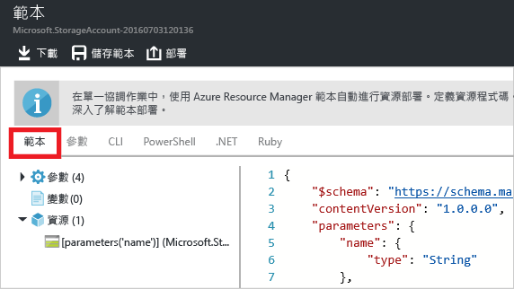

<properties
	pageTitle="匯出 Azure Resource Manager 範本 | Microsoft Azure"
	description="使用 Azure Resource Manager 從現有資源群組匯出範本。"
	services="azure-resource-manager"
	documentationCenter=""
	authors="tfitzmac"
	manager="timlt"
	editor="tysonn"/>

<tags
	ms.service="azure-resource-manager"
	ms.workload="multiple"
	ms.tgt_pltfrm="na"
	ms.devlang="na"
	ms.topic="get-started-article"
	ms.date="08/03/2016"
	ms.author="tomfitz"/>

# 從現有資源匯出 Azure Resource Manager 範本

Resource Manager 可讓您從您的訂用帳戶中現有的資源匯出 Resource Manager 範本。您可以使用產生的範本了解範本語法，或視需要自動重新部署解決方案。

請務必注意，有兩種不同的方式可匯出範本︰

- 您可以匯出用於部署的實際範本。匯出的範本包含與原始範本完全相同的所有參數和變數。當您已透過入口網站部署資源時，這個方法很有用。現在，您想要了解如何建構範本來建立這些資源。
- 您可以匯出代表資源群組目前狀態的範本。匯出的範本不是以任何用於部署的範本為基礎。反而，它所建立的範本是資源群組的快照。匯出的範本會有許多硬式編碼值，但數量可能不如您通常會定義的參數數量。當您已透過入口網站或指令碼修改資源群組時，這個方法很有用。現在，您需要擷取做為範本的資源群組。

本主題說明這兩種方法。在[自訂匯出的 Azure Resource Manager 範本](resource-manager-customize-template.md)一文中，您會了解如何採用從資源群組的目前狀態所產生的範本，並使其更適合用於重新部署您的方案。

在本教學課程中，您會登入 Azure 入口網站、建立儲存體帳戶，並匯出該儲存體帳戶的範本。您會新增虛擬網路以修改資源群組。最後，您會匯出可表示其目前狀態的新範本。雖然本文著重於簡化基礎結構，您可以使用這些相同的步驟匯出更複雜的解決方案的範本。

## 建立儲存體帳戶

1. 在 [Azure 入口網站](https://portal.azure.com)中，選取 [新增] > [資料 + 儲存體] > [儲存體帳戶]。

      

2. 使用名稱 **storage**、您的姓名縮寫和日期建立儲存體帳戶。儲存體帳戶名稱必須是 Azure 中是獨一無二的。如果您一開始嘗試已使用中的名稱，請試著變化。對於資源群組，請使用 **ExportGroup**。您可以對其他屬性使用預設值。選取 [**建立**]。

      

部署完成後，您的訂用帳戶會包含儲存體帳戶。

## 從部署歷程記錄匯出範本

1. 移至您的新資源群組的 [資源群組] 刀鋒視窗。請注意，刀鋒視窗會顯示最後部署的結果。選取此連結。

      

2. 您會看到群組的部署歷程記錄。在您的案例中，刀鋒視窗可能只列出一個部署。選取此部署。

     

3. 刀鋒視窗會顯示部署的摘要。摘要包含部署和其作業的狀態，與您為參數所提供的值。若要查看用於部署的範本，請選取 [檢視範本]。

     

4. Resource Manager 會為您擷取下列六個檔案：

   1. **範本** - 用於定義解決方案之基礎結構的範本。當您透過入口網站建立儲存體帳戶時，Resource Manager 會使用範本來部署它，並且儲存該範本供日後參考。
   2. **參數** - 您可以在部署期間用來傳入值的參數檔案。它包含您在第一次部署時提供的值，但是您可以在重新部署範本時變更這些值。
   3. **CLI** - 您可以為了部署範本而使用的 Azure 令列介面 (CLI) 指令碼檔案。
   4. **PowerShell** - 您可以為了部署範本而使用的 Azure PowerShell 指令碼檔案。
   5. **.NET** - 您可以為了部署範本而使用的 .NET 類別。
   6. **Ruby** - 您可以為了部署範本而使用的 Ruby 類別。

     這些檔案可以透過刀鋒視窗的連結取得。根據預設，刀鋒視窗會顯示範本。

       

     請特別注意範本。您的範本應該如下所示：

        {
          "$schema": "https://schema.management.azure.com/schemas/2015-01-01/deploymentTemplate.json#",
          "contentVersion": "1.0.0.0",
          "parameters": {
            "name": {
              "type": "String"
            },
            "accountType": {
              "type": "String"
            },
            "location": {
              "type": "String"
            },
            "encryptionEnabled": {
              "defaultValue": false,
              "type": "Bool"
            }
          },
          "resources": [
            {
              "type": "Microsoft.Storage/storageAccounts",
              "sku": {
                "name": "[parameters('accountType')]"
              },
              "kind": "Storage",
              "name": "[parameters('name')]",
              "apiVersion": "2016-01-01",
              "location": "[parameters('location')]",
              "properties": {
                "encryption": {
                  "services": {
                    "blob": {
                      "enabled": "[parameters('encryptionEnabled')]"
                    }
                  },
                  "keySource": "Microsoft.Storage"
                }
              }
            }
          ]
        }
 
該範本是用來建立儲存體帳戶的實際範本。請注意，其中包含的參數可讓您部署不同類型的儲存體帳戶。若要深入了解範本的結構，請參閱[編寫 Azure Resource Manager 範本](resource-group-authoring-templates.md)。如需可以在範本中使用的完整函式清單，請參閱 [Azure Resource Manager 範本函式](resource-group-template-functions.md)。


## 新增虛擬網路

您在上一節中下載的範本表示該原始部署的基礎結構，但是它不會計入您在部署後所做的任何變更。為了說明這個問題，讓我們修改資源群組，方法是透過入口網站新增虛擬網路。

1. 在資源群組刀鋒視窗中，選取 [新增]。

      

2. 從可用的資源中選取 [虛擬網路]。

      

2. 將您的虛擬網路命名為 **VNET**，並且對其他屬性使用預設值。選取 [**建立**]。

      

3. 虛擬網路成功部署到您的資源群組之後，請再次查看部署歷程記錄。您現在會看到兩個部署。如果看不到第二個部署，您可能需要關閉資源群組刀鋒視窗，然後重新開啟它。選取較新的部署。

      

4. 查看該部署的範本。請注意，它只會定義您為了新增虛擬網路所做的變更。

一般的最佳做法是使用範本，該範本在單一作業中部署您的解決方案的所有基礎結構。這個方法會比記住許多不同的部署範來得可靠。


## 從資源群組匯出範本

雖然每個部署只會顯示您對資源群組所做的變更，您隨時可以匯出範本，以顯示整個資源群組的屬性。

1. 若要檢視資源群組的範本，請選取 [自動化指令碼]。

      

     並非所有的資源類型都支援匯出範本功能。如果您的資源群組只包含本文中顯示的儲存體帳戶和虛擬網路，將不會看到錯誤。不過，如果您已建立其他資源類型，您可能會看到錯誤，指出匯出有問題。您會在[修正匯出問題](#fix-export-issues)一節中了解如何處理這些問題。

      

2. 您會再次看到可用來重新部署解決方案的六個檔案，但是這次的範本有點不同。此範本只包含 2 個參數：一個用於儲存體帳戶名稱，一個用於虛擬網路名稱。

        "parameters": {
          "virtualNetworks_VNET_name": {
            "defaultValue": "VNET",
            "type": "String"
          },
          "storageAccounts_storagetf05092016_name": {
            "defaultValue": "storagetf05092016",
            "type": "String"
          }
        },

     Resource Manager 未擷取在部署期間使用的範本。而是根據資源的目前組態產生新的範本。例如，範本將儲存體帳戶位置和複寫值設為：

        "location": "northeurope",
        "tags": {},
        "properties": {
            "accountType": "Standard_RAGRS"
        },

3. 下載範本，您就可以在本機使用。

      

4. 尋找您所下載的 .zip 檔案，並將內容解壓縮。您可以使用此下載的範本重新部署您的基礎結構。

## 修正匯出問題

並非所有的資源類型都支援匯出範本功能。Resource Manager 明確地不匯出某些資源類型，以免公開敏感性資料。例如，如果您的網站組態中有連接字串，您可能不想讓它明確地顯示在匯出的範本中。您可以將遺漏資源手動加回您的範本，以解決此問題。

> [AZURE.NOTE] 從資源群組 (而非部署歷程記錄) 匯出時，您只會遇到匯出問題。如果上一次部署精確地表示資源群組的目前狀態，您應該從部署歷程記錄 (而非資源群組) 匯出範本。只有在變更未定義於單一範本中的資源群組時，才能從資源群組匯出。

比方說，如果您針對包含 Web 應用程式、SQL Database 和網站組態中的連接字串的資源群組匯出範本，您會看到下列訊息。


選取此訊息，將會完全顯示未匯出的資源類型。
     


本主題說明下列常見的修正方法。若要實作這些資源，您需要將參數加入至範本。如需詳細資訊，請參閱[自訂和重新部署匯出的範本](resource-manager-customize-template.md)。

### Connection string

在網站資源中，將連接字串的定義新增至資料庫︰

```
{
  "type": "Microsoft.Web/sites",
  ...
  "resources": [
    {
      "apiVersion": "2015-08-01",
      "type": "config",
      "name": "connectionstrings",
      "dependsOn": [
          "[concat('Microsoft.Web/Sites/', parameters('<site-name>'))]"
      ],
      "properties": {
          "DefaultConnection": {
            "value": "[concat('Data Source=tcp:', reference(concat('Microsoft.Sql/servers/', parameters('<database-server-name>'))).fullyQualifiedDomainName, ',1433;Initial Catalog=', parameters('<database-name>'), ';User Id=', parameters('<admin-login>'), '@', parameters('<database-server-name>'), ';Password=', parameters('<admin-password>'), ';')]",
              "type": "SQLServer"
          }
      }
    }
  ]
}
```    

### 網站擴充功能

在網站資源中，新增要安裝的程式碼的定義︰

```
{
  "type": "Microsoft.Web/sites",
  ...
  "resources": [
    {
      "name": "MSDeploy",
      "type": "extensions",
      "location": "[resourceGroup().location]",
      "apiVersion": "2015-08-01",
      "dependsOn": [
        "[concat('Microsoft.Web/sites/', parameters('<site-name>'))]"
      ],
      "properties": {
        "packageUri": "[concat(parameters('<artifacts-location>'), '/', parameters('<package-folder>'), '/', parameters('<package-file-name>'), parameters('<sas-token>'))]",
        "dbType": "None",
        "connectionString": "",
        "setParameters": {
          "IIS Web Application Name": "[parameters('<site-name>')]"
        }
      }
    }
  ]
}
```

### 虛擬機器擴充功能

如需虛擬機器擴充功能的範例，請參閱 [Azure Windows VM 擴充功能組態範例](./virtual-machines/virtual-machines-windows-extensions-configuration-samples.md)。

### 虛擬網路閘道

新增虛擬網路閘道資源類型。

```
{
  "type": "Microsoft.Network/virtualNetworkGateways",
  "name": "[parameters('<gateway-name>')]",
  "apiVersion": "2015-06-15",
  "location": "[resourceGroup().location]",
  "properties": {
    "gatewayType": "[parameters('<gateway-type>')]",
    "ipConfigurations": [
      {
        "name": "default",
        "properties": {
          "privateIPAllocationMethod": "Dynamic",
          "subnet": {
            "id": "[resourceId('Microsoft.Network/virtualNetworks/subnets', parameters('<vnet-name>'), parameters('<new-subnet-name>'))]"
          },
          "publicIpAddress": {
            "id": "[resourceId('Microsoft.Network/publicIPAddresses', parameters('<new-public-ip-address-Name>'))]"
          }
        }
      }
    ],
    "enableBgp": false,
    "vpnType": "[parameters('<vpn-type>')]"
  },
  "dependsOn": [
    "Microsoft.Network/virtualNetworks/codegroup4/subnets/GatewaySubnet",
    "[concat('Microsoft.Network/publicIPAddresses/', parameters('<new-public-ip-address-Name>'))]"
  ]
},
```

### 區域網路閘道

新增區域網路閘道資源類型。

```
{
    "type": "Microsoft.Network/localNetworkGateways",
    "name": "[parameters('<local-network-gateway-name>')]",
    "apiVersion": "2015-06-15",
    "location": "[resourceGroup().location]",
    "properties": {
      "localNetworkAddressSpace": {
        "addressPrefixes": "[parameters('<address-prefixes>')]"
      }
    }
}
```

### 連線

新增連線資源類型。

```
{
    "apiVersion": "2015-06-15",
    "name": "[parameters('<connection-name>')]",
    "type": "Microsoft.Network/connections",
    "location": "[resourceGroup().location]",
    "properties": {
        "virtualNetworkGateway1": {
        "id": "[resourceId('Microsoft.Network/virtualNetworkGateways', parameters('<gateway-name>'))]"
      },
      "localNetworkGateway2": {
        "id": "[resourceId('Microsoft.Network/localNetworkGateways', parameters('<local-gateway-name>'))]"
      },
      "connectionType": "IPsec",
      "routingWeight": 10,
      "sharedKey": "[parameters('<shared-key>')]"
    }
},
```


## 後續步驟

恭喜！ 您已經了解如何從您在入口網站中建立的資源匯出範本。

- 在本教學課程的第二個部分中，您會自訂下載的範本，方法是新增更多參數，並且透過指令碼重新部署它。請參閱[自訂和重新部署匯出的範本](resource-manager-customize-template.md)。
- 若要查看如何透過 PowerShell 匯出範本，請參閱[搭配使用 Azure PowerShell 與 Azure Resource Manager](powershell-azure-resource-manager.md)。
- 若要查看如何透過 Azure CLI 匯出範本，請參閱[搭配使用 Mac、Linux 和 Windows 適用的 Azure CLI 與 Azure Resource Manager](xplat-cli-azure-resource-manager.md)。

<!---HONumber=AcomDC_0810_2016-->