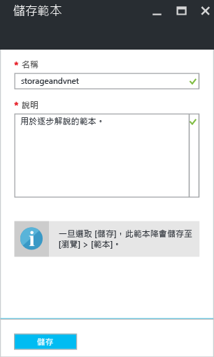
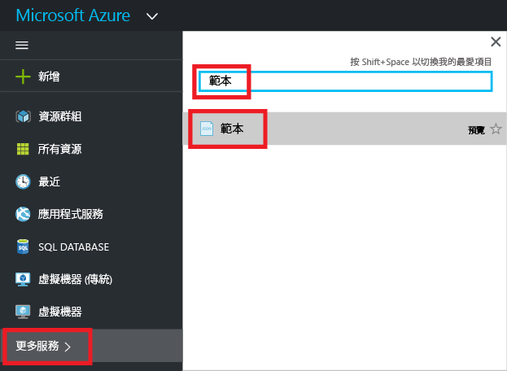
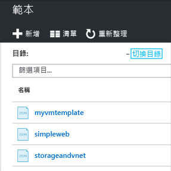
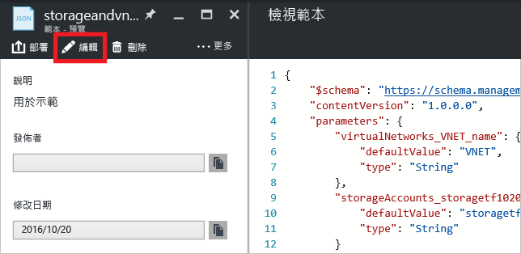
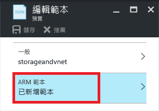
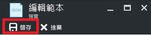
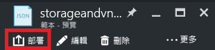

# <a name="export-an-azure-resource-manager-template-from-existing-resources"></a>從現有資源匯出 Azure Resource Manager 範本
Resource Manager 可讓您從您的訂用帳戶中現有的資源匯出 Resource Manager 範本。 您可以使用產生的範本了解範本語法，或視需要自動重新部署解決方案。

請務必注意，有兩種不同的方式可匯出範本︰

* 您可以匯出用於部署的實際範本。 匯出的範本包含與原始範本完全相同的所有參數和變數。 當您已透過入口網站部署資源時，這個方法很有用。 現在，您想要了解如何建構範本來建立這些資源。
* 您可以匯出代表資源群組目前狀態的範本。 匯出的範本不是以任何用於部署的範本為基礎。 反而，它所建立的範本是資源群組的快照。 匯出的範本會有許多硬式編碼值，但數量可能不如您通常會定義的參數數量。 當您已透過入口網站或指令碼修改資源群組時，這個方法很有用。 現在，您需要擷取做為範本的資源群組。

本主題說明這兩種方法。

在本教學課程中，您會登入 Azure 入口網站、建立儲存體帳戶，並匯出該儲存體帳戶的範本。 您會新增虛擬網路以修改資源群組。 最後，您會匯出可表示其目前狀態的新範本。 雖然本文著重於簡化基礎結構，您可以使用這些相同的步驟匯出更複雜的解決方案的範本。

## <a name="create-a-storage-account"></a>建立儲存體帳戶
1. 在 [Azure 入口網站](https://portal.azure.com)中，選取 [新增] > [儲存體] > [儲存體帳戶]。
   
      
2. 使用名稱 **storage**、您的姓名縮寫和日期建立儲存體帳戶。 儲存體帳戶名稱必須是 Azure 中是獨一無二的。 如果名稱已在使用中，您會看到錯誤訊息，指出該名稱已在使用中。 請試著稍加變化。 至於資源群組，請建立新的資源群組，並將它命名為 **ExportGroup**。 您可以對其他屬性使用預設值。 選取 [ **建立**]。
   
      

部署可能需要一會兒的時間。 部署完成後，您的訂用帳戶會包含儲存體帳戶。

## <a name="view-a-template-from-deployment-history"></a>從部署歷程記錄檢視範本
1. 移至您的新資源群組的 [資源群組] 刀鋒視窗。 請注意，刀鋒視窗會顯示最後部署的結果。 選取此連結。
   
      
2. 您會看到群組的部署歷程記錄。 在您的案例中，刀鋒視窗可能只列出一個部署。 選取此部署。
   
     
3. 刀鋒視窗會顯示部署的摘要。 摘要包含部署和其作業的狀態，與您為參數所提供的值。 若要查看用於部署的範本，請選取 [檢視範本] 。
   
     
4. Resource Manager 會為您擷取下列六個檔案：
   
   1. **範本** - 用於定義解決方案之基礎結構的範本。 當您透過入口網站建立儲存體帳戶時，Resource Manager 會使用範本來部署它，並且儲存該範本供日後參考。
   2. **參數** - 您可以在部署期間用來傳入值的參數檔案。 它包含您在第一次部署時提供的值，但是您可以在重新部署範本時變更這些值。
   3. **CLI** - 您可以為了部署範本而使用的 Azure 令列介面 (CLI) 指令碼檔案。
   4. **PowerShell** - 您可以為了部署範本而使用的 Azure PowerShell 指令碼檔案。
   5. **.NET** - 您可以為了部署範本而使用的 .NET 類別。
   6. **Ruby** - 您可以為了部署範本而使用的 Ruby 類別。
      
      這些檔案可以透過刀鋒視窗的連結取得。 根據預設，刀鋒視窗會顯示範本。
      
       
      
      請特別注意範本。 您的範本應該如下所示：
      
        {
      
          "$schema": "https://schema.management.azure.com/schemas/2015-01-01/deploymentTemplate.json#",
          "contentVersion": "1.0.0.0",
          "parameters": {
            "name": {
              "type": "String"
            },
            "accountType": {
              "type": "String"
            },
            "location": {
              "type": "String"
            },
            "encryptionEnabled": {
              "defaultValue": false,
              "type": "Bool"
            }
          },
          "resources": [
            {
              "type": "Microsoft.Storage/storageAccounts",
              "sku": {
                "name": "[parameters('accountType')]"
              },
              "kind": "Storage",
              "name": "[parameters('name')]",
              "apiVersion": "2016-01-01",
              "location": "[parameters('location')]",
              "properties": {
                "encryption": {
                  "services": {
                    "blob": {
                      "enabled": "[parameters('encryptionEnabled')]"
                    }
                  },
                  "keySource": "Microsoft.Storage"
                }
              }
            }
          ]
        }

該範本是用來建立儲存體帳戶的實際範本。 請注意，其中包含的參數可讓您部署不同類型的儲存體帳戶。 若要深入了解範本的結構，請參閱 [編寫 Azure Resource Manager 範本](resource-group-authoring-templates.md)。 如需可以在範本中使用的完整函式清單，請參閱 [Azure Resource Manager 範本函式](resource-group-template-functions.md)。

## <a name="add-a-virtual-network"></a>新增虛擬網路
您在上一節中下載的範本表示該原始部署的基礎結構， 但是它不會計入您在部署後所做的任何變更。
為了說明這個問題，讓我們修改資源群組，方法是透過入口網站新增虛擬網路。

1. 在資源群組刀鋒視窗中，選取 [新增] 。
   
      
2. 從可用的資源中選取 [虛擬網路]  。
   
      
3. 將您的虛擬網路命名為 **VNET**，並且對其他屬性使用預設值。 選取 [ **建立**]。
   
      
4. 虛擬網路成功部署到您的資源群組之後，請再次查看部署歷程記錄。 您現在會看到兩個部署。 如果看不到第二個部署，您可能需要關閉資源群組刀鋒視窗，然後重新開啟它。 選取較新的部署。
   
      
5. 檢視該部署的範本。 請注意，範本中只會定義虛擬網路。 裡面不會包含您稍早部署的儲存體帳戶。 您不再會有代表資源群組中所有資源的範本。

## <a name="export-the-template-from-resource-group"></a>從資源群組匯出範本
若要取得資源群組的目前狀態，請匯出會顯示資源群組快照的範本。  

> [!NOTE]
> 您無法針對具有超過 200 個資源的資源群組匯出範本。
> 
> 

1. 若要檢視資源群組的範本，請選取 [自動化指令碼] 。
   
      
   
     並非所有的資源類型都支援匯出範本功能。 如果您的資源群組只包含本文中顯示的儲存體帳戶和虛擬網路，您不會看到錯誤。 不過，如果您已建立其他資源類型，您可能會看到錯誤，指出匯出有問題。 您會在 [修正匯出問題](#fix-export-issues) 一節中了解如何處理這些問題。
2. 您會再次看到可用來重新部署解決方案的六個檔案，但是這次的範本有點不同。 此範本只包含 2 個參數：一個用於儲存體帳戶名稱，一個用於虛擬網路名稱。
   
        "parameters": {
          "virtualNetworks_VNET_name": {
            "defaultValue": "VNET",
            "type": "String"
          },
          "storageAccounts_storagetf05092016_name": {
            "defaultValue": "storagetf05092016",
            "type": "String"
          }
        },
   
     Resource Manager 未擷取在部署期間使用的範本。 而是根據資源的目前組態產生新的範本。 例如，範本將儲存體帳戶位置和複寫值設為：
   
        "location": "northeurope",
        "tags": {},
        "properties": {
            "accountType": "Standard_RAGRS"
        },
3. 有幾個選項可供您繼續使用此範本。 您可以下載範本，並在本機使用 JSON 編輯器來處理範本。 或者，您可以將範本儲存至程式庫，並透過入口網站處理範本。
   
     如果您熟悉如何使用 JSON 編輯器，例如 [VS Code](resource-manager-vs-code.md) 或 [Visual Studio](vs-azure-tools-resource-groups-deployment-projects-create-deploy.md)，您可能會偏好將範本下載到本機並使用該編輯器。 如果您未設定 JSON 編輯器，則可能會偏好透過入口網站來編輯範本。 本主題的其餘部分假設您已將範本儲存至入口網站中的程式庫。 不過，不論是在本機使用 JSON 編輯器進行工作或透過入口網站來進行，您都要對範本進行相同的語法變更。
   
     若要在本機上工作，請選取 [下載]。
   
      
   
     若要透過入口網站工作，請選取 [新增至程式庫]。
   
      
   
     在程式庫中新增範本時，請為範本提供名稱和描述。 然後選取 [儲存]。
   
     
4. 若要檢視程式庫中儲存的範本，請選取 [更多服務]，輸入**範本**來篩選結果，然後選取 [範本]。
   
      
5. 選取具有您所儲存之名稱的範本。
   
      

## <a name="customize-the-template"></a>自訂範本
如果您想要為每個部署建立相同的儲存體帳戶和虛擬網路，匯出的範本就夠用。 但 Resource Manager 提供了一些選項，以便您可以更有彈性地部署範本。 例如，在部署期間，您可能想要指定要建立的儲存體帳戶類型，或者要對虛擬網路位址前置詞和子網路前置詞使用的值。

在本節中，您會將參數新增至匯出的範本，以便在將這些資源部署至其他環境時，可以重複使用範本。 您也會將一些功能新增至範本，降低部署範本時發生錯誤的可能性。 您不用再猜測儲存體帳戶的唯一名稱。 相反地，範本會建立唯一的名稱。 您會將可對儲存體帳戶類型指定的值限制為僅只有效的選項。

1. 選取 [編輯] 以自訂範本。
   
     
2. 選取範本。
   
     
3. 為了能夠傳遞您可能想要在部署期間指定的值，請將 **parameters** 區段取代為新的參數定義。 請注意 **storageAccount_accountType** 的 **allowedValues** 值。 如果您不小心提供了無效的值，會在部署開始之前辨識該錯誤。 另外請注意，您只提供儲存體帳戶名稱前置詞，前置詞限制為 11 個字元。 將前置詞限制為 11 個字元時，您可以確定完整名稱不會超過儲存體帳戶字元數上限。 前置詞可讓您將命名慣例套用至儲存體帳戶。 您將在下一個步驟中了解如何建立唯一的名稱。
   
        "parameters": {
          "storageAccount_prefix": {
            "type": "string",
            "maxLength": 11
          },
          "storageAccount_accountType": {
            "defaultValue": "Standard_RAGRS",
            "type": "string",
            "allowedValues": [
              "Standard_LRS",
              "Standard_ZRS",
              "Standard_GRS",
              "Standard_RAGRS",
              "Premium_LRS"
            ]
          },
          "virtualNetwork_name": {
            "type": "string"
          },
          "addressPrefix": {
            "defaultValue": "10.0.0.0/16",
            "type": "string"
          },
          "subnetName": {
            "defaultValue": "subnet-1",
            "type": "string"
          },
          "subnetAddressPrefix": {
            "defaultValue": "10.0.0.0/24",
            "type": "string"
          }
        },
4. 範本的 **variables** 區段目前是空的。 在 **variables** 區段中，您可以建立一些值以簡化範本其他部分的語法。 將此區段取代為新的變數定義。 **storageAccount_name** 變數會將參數的前置詞串連至唯一的字串，該字串是根據資源群組的識別碼產生。 您不必再於提供參數值時猜測唯一的名稱。
   
        "variables": {
          "storageAccount_name": "[concat(parameters('storageAccount_prefix'), uniqueString(resourceGroup().id))]"
        },
5. 若要在資源定義中使用參數和變數，請使用新的資源定義取代 **resources** 區段。 請注意，除了指派給資源屬性的值以外，資源定義中的變更不多。 這些屬性與匯出之範本的屬性相同。 您只要將屬性指派至參數值，而不是硬式編碼值。 透過 **resourceGroup().location** 運算式，將資源的位置設為使用與資源群組相同的位置。 您為儲存體帳戶名稱建立的變數是透過 **variables** 運算式參考。
   
        "resources": [
          {
            "type": "Microsoft.Network/virtualNetworks",
            "name": "[parameters('virtualNetwork_name')]",
            "apiVersion": "2015-06-15",
            "location": "[resourceGroup().location]",
            "properties": {
              "addressSpace": {
                "addressPrefixes": [
                  "[parameters('addressPrefix')]"
                ]
              },
              "subnets": [
                {
                  "name": "[parameters('subnetName')]",
                  "properties": {
                    "addressPrefix": "[parameters('subnetAddressPrefix')]"
                  }
                }
              ]
            },
            "dependsOn": []
          },
          {
            "type": "Microsoft.Storage/storageAccounts",
            "name": "[variables('storageAccount_name')]",
            "apiVersion": "2015-06-15",
            "location": "[resourceGroup().location]",
            "tags": {},
            "properties": {
                "accountType": "[parameters('storageAccount_accountType')]"
            },
            "dependsOn": []
          }
        ]
6. 當您編輯好範本時，選取 [確定]。
7. 選取 [儲存] 以儲存對範本所做的變更。
   
     
8. 若要部署更新的範本，請選取 [部署]。
   
     
9. 提供參數值，並選取要將資源部署到哪個新的資源群組。

## <a name="update-the-downloaded-parameters-file"></a>更新下載的參數檔案
如果您正在使用下載的檔案 (而非入口網站的程式庫)，您需要更新下載的參數檔案。 該檔案不再符合範本中的參數。 您不需要使用參數檔案，但是它可以簡化您重新部署環境時的程序。 您會使用範本中針對許多參數定義的預設值，因此您的參數檔案只需要兩個值。

以下列程式碼取代 parameters.json 檔案的內容：

```
{
  "$schema": "https://schema.management.azure.com/schemas/2015-01-01/deploymentParameters.json#",
  "contentVersion": "1.0.0.0",
  "parameters": {
    "storageAccount_prefix": {
      "value": "storage"
    },
    "virtualNetwork_name": {
      "value": "VNET"
    }
  }
}
```

更新後的參數檔案只會針對沒有預設值的參數提供值。 當您想要不同於預設值的值時，您可以為其他參數提供值。

## <a name="fix-export-issues"></a>修正匯出問題
並非所有的資源類型都支援匯出範本功能。 Resource Manager 明確地不匯出某些資源類型，以免公開敏感性資料。 例如，如果您的網站組態中有連接字串，您可能不想讓它明確地顯示在匯出的範本中。 您可以將遺漏資源手動加回您的範本，以解決此問題。

> [!NOTE]
> 從資源群組 (而非部署歷程記錄) 匯出時，您只會遇到匯出問題。 如果上一次部署精確地表示資源群組的目前狀態，您應該從部署歷程記錄 (而非資源群組) 匯出範本。 只有在變更未定義於單一範本中的資源群組時，才能從資源群組匯出。
> 
> 

比方說，如果您針對包含 Web 應用程式、SQL Database 和網站組態中的連接字串的資源群組匯出範本，您會看到下列訊息：


選取此訊息，將會完全顯示未匯出的資源類型。 


本主題顯示一般修正。

### <a name="connection-string"></a>Connection string
在網站資源中，將連接字串的定義新增至資料庫︰

```
{
  "type": "Microsoft.Web/sites",
  ...
  "resources": [
    {
      "apiVersion": "2015-08-01",
      "type": "config",
      "name": "connectionstrings",
      "dependsOn": [
          "[concat('Microsoft.Web/Sites/', parameters('<site-name>'))]"
      ],
      "properties": {
          "DefaultConnection": {
            "value": "[concat('Data Source=tcp:', reference(concat('Microsoft.Sql/servers/', parameters('<database-server-name>'))).fullyQualifiedDomainName, ',1433;Initial Catalog=', parameters('<database-name>'), ';User Id=', parameters('<admin-login>'), '@', parameters('<database-server-name>'), ';Password=', parameters('<admin-password>'), ';')]",
              "type": "SQLServer"
          }
      }
    }
  ]
}
```    

### <a name="web-site-extension"></a>網站擴充功能
在網站資源中，新增要安裝的程式碼的定義︰

```
{
  "type": "Microsoft.Web/sites",
  ...
  "resources": [
    {
      "name": "MSDeploy",
      "type": "extensions",
      "location": "[resourceGroup().location]",
      "apiVersion": "2015-08-01",
      "dependsOn": [
        "[concat('Microsoft.Web/sites/', parameters('<site-name>'))]"
      ],
      "properties": {
        "packageUri": "[concat(parameters('<artifacts-location>'), '/', parameters('<package-folder>'), '/', parameters('<package-file-name>'), parameters('<sas-token>'))]",
        "dbType": "None",
        "connectionString": "",
        "setParameters": {
          "IIS Web Application Name": "[parameters('<site-name>')]"
        }
      }
    }
  ]
}
```

### <a name="virtual-machine-extension"></a>虛擬機器擴充功能
如需虛擬機器擴充功能的範例，請參閱 [Azure Windows VM 擴充功能組態範例](virtual-machines/virtual-machines-windows-extensions-configuration-samples.md)。

### <a name="virtual-network-gateway"></a>虛擬網路閘道
新增虛擬網路閘道資源類型。

```
{
  "type": "Microsoft.Network/virtualNetworkGateways",
  "name": "[parameters('<gateway-name>')]",
  "apiVersion": "2015-06-15",
  "location": "[resourceGroup().location]",
  "properties": {
    "gatewayType": "[parameters('<gateway-type>')]",
    "ipConfigurations": [
      {
        "name": "default",
        "properties": {
          "privateIPAllocationMethod": "Dynamic",
          "subnet": {
            "id": "[resourceId('Microsoft.Network/virtualNetworks/subnets', parameters('<vnet-name>'), parameters('<new-subnet-name>'))]"
          },
          "publicIpAddress": {
            "id": "[resourceId('Microsoft.Network/publicIPAddresses', parameters('<new-public-ip-address-Name>'))]"
          }
        }
      }
    ],
    "enableBgp": false,
    "vpnType": "[parameters('<vpn-type>')]"
  },
  "dependsOn": [
    "Microsoft.Network/virtualNetworks/codegroup4/subnets/GatewaySubnet",
    "[concat('Microsoft.Network/publicIPAddresses/', parameters('<new-public-ip-address-Name>'))]"
  ]
},
```

### <a name="local-network-gateway"></a>區域網路閘道
新增區域網路閘道資源類型。

```
{
    "type": "Microsoft.Network/localNetworkGateways",
    "name": "[parameters('<local-network-gateway-name>')]",
    "apiVersion": "2015-06-15",
    "location": "[resourceGroup().location]",
    "properties": {
      "localNetworkAddressSpace": {
        "addressPrefixes": "[parameters('<address-prefixes>')]"
      }
    }
}
```

### <a name="connection"></a>連線
新增連線資源類型。

```
{
    "apiVersion": "2015-06-15",
    "name": "[parameters('<connection-name>')]",
    "type": "Microsoft.Network/connections",
    "location": "[resourceGroup().location]",
    "properties": {
        "virtualNetworkGateway1": {
        "id": "[resourceId('Microsoft.Network/virtualNetworkGateways', parameters('<gateway-name>'))]"
      },
      "localNetworkGateway2": {
        "id": "[resourceId('Microsoft.Network/localNetworkGateways', parameters('<local-gateway-name>'))]"
      },
      "connectionType": "IPsec",
      "routingWeight": 10,
      "sharedKey": "[parameters('<shared-key>')]"
    }
},
```


## <a name="next-steps"></a>後續步驟
恭喜！ 您已經了解如何從您在入口網站中建立的資源匯出範本。

* 您可以透過 [PowerShell](resource-group-template-deploy.md)、[Azure CLI](resource-group-template-deploy-cli.md) 或 [REST API](resource-group-template-deploy-rest.md) 部署範本。
* 若要查看如何透過 PowerShell 匯出範本，請參閱 [搭配使用 Azure PowerShell 與 Azure Resource Manager](powershell-azure-resource-manager.md)。
* 若要查看如何透過 Azure CLI 匯出範本，請參閱 [搭配使用 Mac、Linux 和 Windows 適用的 Azure CLI 與 Azure Resource Manager](xplat-cli-azure-resource-manager.md)。


<!--HONumber=Nov16_HO2-->


