<properties
   pageTitle="Azure 資訊安全中心不同類型的安全性警示 | Microsoft Azure"
   description="本文件有助於了解 Azure 資訊安全中心可用的安全性警示類型。"
   services="security-center"
   documentationCenter="na"
   authors="YuriDio"
   manager="swadhwa"
   editor=""/>

<tags
   ms.service="security-center"
   ms.topic="hero-article"
   ms.devlang="na"
   ms.tgt_pltfrm="na"
   ms.workload="na"
   ms.date="09/20/2016"
   ms.author="yurid"/>

# Azure 資訊安全中心不同類型的安全性警示
本文件可協助您了解 Azure 資訊安全中心各種可用的安全性警示類型。如需如何管理警示的詳細資訊，請閱讀[管理及回應 Azure 資訊安全中心的安全性警示](security-center-managing-and-responding-alerts.md)。

> [AZURE.NOTE] 若要啟用進階偵測，請升級至 Azure 資訊安全中心標準。提供 90 天的免費試用。若要升級，請選取 [安全性原則] 中的 [定價層]。若要深入了解，請參閱[價格頁面](https://azure.microsoft.com/pricing/details/security-center/)。

## 可以使用何種類型的警示？
Azure 資訊安全中心提供了搭配各階段網路狙殺鏈的各種警示。下圖提供各種警示的一些範例，因為這些範例與其中一些階段相關。

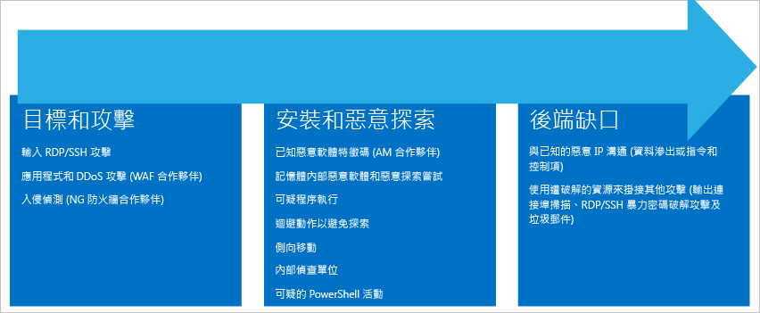

**目標及攻擊**

- 輸入 RDP/SSH 攻擊
- 應用程式和 DDoS 攻擊 (WAF 合作夥伴)
- 入侵偵測 (NG 防火牆合作夥伴)

**安裝及惡意探索**

- 已知的惡意程式碼簽章 (AM 合作夥伴)
- 記憶體內部惡意程式碼和入侵程式嘗試
- 可疑的處理序執行
- 規避調動以避免探索
- 橫向移動
- 內部偵察
- 可疑的 PowerShell 活動

**後防線**

- 對已知惡意 IP 的通訊 (資料外漏或命令和控制項)
- 使用遭入侵的資源來裝載其他攻擊 (輸出連接埠掃描 RDP/SSH 暴力密碼破解攻擊和垃圾郵件)

不同類型的攻擊會與每個階段產生關聯，並以不同的子系統為目標。為了處理這些階段中的攻擊，資訊安全中心有三種警示︰

- 虛擬機器行為分析 (VMBA)
- 網路分析
- 資源分析

## 虛擬機器行為分析

Azure 資訊安全中心可以使用行為分析，根據虛擬機器事件記錄檔 (例如：程序建立事件、登入事件等) 的分析，來識別遭到入侵的資源。此外，還與其他訊號相互關聯，以檢查廣泛行銷活動的支援證明。

> [AZURE.NOTE] 如需資訊安全中心偵測功能運作方式的詳細資訊，請閱讀 [Azure 資訊安全中心的偵測功能](security-center-detection-capabilities.md)。

### 損毀分析

損毀傾印記憶體分析是一種方法，可用來偵測能避開傳統安全性解決方案的複雜惡意程式碼。各種形式的惡意程式碼會藉由決不寫入至磁碟或將寫入至磁碟的軟體元件加密，試圖減少被防毒產品偵測到的機會。如此一來，使用傳統反惡意程式碼方法便難以偵測到惡意程式碼。不過，可以使用記憶體分析來偵測這類惡意程式碼，因為惡意程式碼必須在記憶體中留下蹤跡才能運作。

當軟體損毀時，損毀傾印會在損毀時擷取部分的記憶體。惡意程式碼、一般應用程式或系統問題都可能造成損毀。藉由分析損毀傾印中的記憶體，資訊安全中心可以偵測到用來利用軟體弱點、存取機密資料，以及暗中存在於遭入侵電腦的技術。這可在對主機造成最小效能影響的情況下完成，因為此分析是由資訊安全中心後端所執行。

以下欄位是下列損毀傾印分析警示常見的欄位︰

- DUMPFILE：損毀傾印檔案的名稱
- PROCESSNAME︰損毀處理序的名稱
- PROCESSVERSION︰損毀處理序的版本

### 探索到 Shellcode

Shellcode 是惡意程式碼利用軟體弱點後執行的承載。該警示代表毀損傾印分析偵測到的可執行程式碼顯現經常由惡意承載執行的行為。雖然非惡意軟體可能會執行這種行為，不過這不是一般軟體開發的實務做法。

該警示提供下列額外欄位︰

- ADDRESS：Shellcode 在記憶體中的位置

以下是本類型之警示的範例：

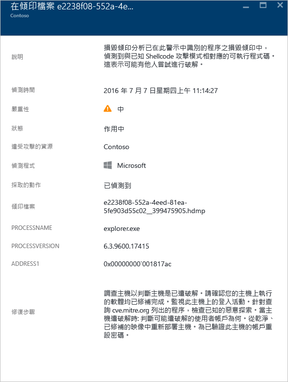

### 探索到模組攔截

Windows 仰賴動態連結程式庫 (DLL) 來允許軟體使用通用 Windows 系統功能。DLL 攔截發生於當惡意程式碼變更 DLL 載入順序，以便將惡意承載載入記憶體時，得手後有心人士便能執行任意程式碼。該警示代表毀損傾印分析偵測到名稱相近的模組從兩個不同的路徑載入，而其中一個載入路徑來自通用 Windows 系統二進位檔位置。

合法軟體開發人員偶爾會為了非惡意的原因而變更 DLL 載入順序，如檢測、擴充 Windows 作業系統或 Windows 應用程式。為了協助您區別 DLL 載入順序的惡意變更和潛在的良性變更，Azure 資訊安全中心會檢查載入的模組是否符合可疑設定檔。這項檢查的結果會以警示的 “SIGNATURE” 欄位來表示，而且會反映在警示嚴重性、警示描述和警示補救步驟中。分析攔截模組的磁碟複本 (如驗證檔案的數位簽章或執行防毒軟體掃描)，可能可以讓您進一步瞭解攔截模組的本質屬於合法或惡意。

除了前文「探索到 Shellcode」一節描述的通用欄位之外，這項警示另提供下列欄位︰

- SIGNATURE︰指出攔截模組是否符合可疑行為設定檔
- HIJACKEDMODULE︰遭到攔截的 Windows 系統模組名稱
- HIJACKEDMODULEPATH︰遭到攔截的 Windows 系統模組路徑
- HIJACKINGMODULEPATH︰攔截模組的路徑

以下是本類型之警示的範例：

### 偵測到偽裝的 Windows 模組

惡意程式碼可能會使用 Windows 系統二進位檔 (如 SVCHOST.EXE) 或模組 (如 NTDLL.DLL) 的常用名稱，以期能蒙混過關，避免系統管理員看清惡意軟體的本質。該警示代表毀損傾印分析偵測到毀損傾印檔案含有使用 Windows 系統模組名稱的模組，但這些模組不符合 Windows 模組的其他典型條件。分析偽裝模組的磁碟複本，可能可以讓您進一步瞭解該模組的本質屬於合法或惡意。分析可能包括︰

- 確認有問題的檔案隨附在合法軟體套件中
- 驗證檔案的數位簽章
- 針對檔案執行防毒軟體掃描

除了前文「探索到 Shellcode」一節描述的通用欄位之外，這項警示另提供下列額外欄位︰

- DETAILS︰描述模組中繼資料是否有效，以及模組是否從系統路徑載入。
- NAME︰偽裝 Windows 模組的名稱
- PATH︰偽裝 Windows 模組的路徑。

該警示也會從模組的 "CHECKSUM" 和 "TIMESTAMP" 等 PE 標頭擷取及顯示某些欄位。唯有當模組有這些欄位時，它們才會出現。如需這些欄位的詳細資料，請參閱 [Microsoft PE 和 COFF 規格](https://msdn.microsoft.com/windows/hardware/gg463119.aspx)。

以下是本類型之警示的範例：

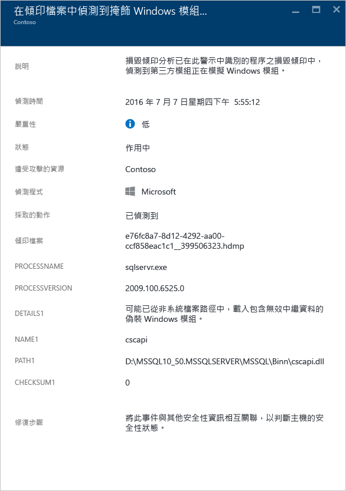

### 探索到修改過的系統二進位檔

惡意程式碼可能會修改核心系統二進位檔，以便秘密存取資料或暗中存留在遭入侵的系統上。該警示代表毀損傾印分析偵測到記憶體中或磁碟上的核心 Windows 作業系統二進位檔已遭到修改。合法軟體開發人員偶爾會為了非惡意的原因而修改記憶體中的系統模組，如 Detours 或處理應用程式相容性。為了協助您區別惡意模組和可能合法的模組，Azure 資訊安全中心會檢查修改過的模組是否符合可疑設定檔。這項檢查的結果會以警示嚴重性、警示描述和警示補救步驟來表示。

除了前文「探索到 Shellcode」一節描述的通用欄位之外，這項警示另提供下列額外欄位︰

- MODULENAME：修改過的系統二進位檔名稱
- MODULEVERSION：修改過的系統二進位檔版本

以下是本類型之警示的範例：

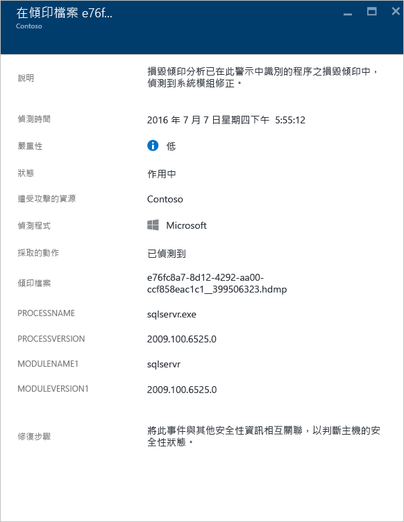

### 已執行可疑的處理序

資訊安全中心會識別目標虛擬機器中執行的可疑處理序並觸發警示。偵測作業不會尋找特定的名稱，但會依照其參數尋找，因此即使攻擊者將可執行檔重新命名，資訊安全中心仍然能夠偵測。
 
以下是本類型之警示的範例：

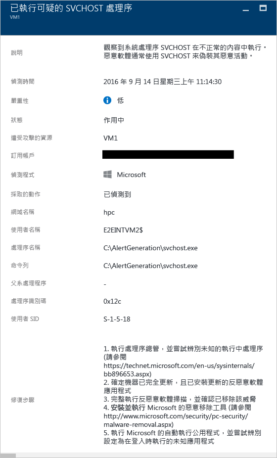

### 已查詢多個網域帳戶

資訊安全中心可以偵測多次查詢網域帳戶的嘗試，這通常是由攻擊者在網路偵察期間所執行。攻擊者可以利用這項技術來查詢網域，以識別誰是使用者、什麼是網域系統管理員帳戶、哪些電腦是網域控制站，以及與其他網域的潛在網域信任關係。

以下是本類型之警示的範例：

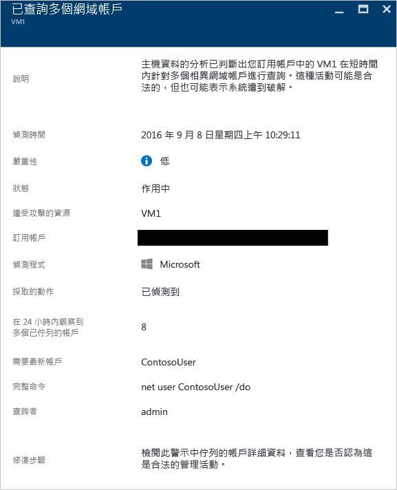

## 網路分析

資訊安全中心網路威脅偵測的運作方式如下：從 Azure IPFIX (Internet Protocol Flow Information Export) 流量自動收集安全性資訊。它會分析這項資訊 (通常是來自多個來源的相互關聯資訊) 以識別威脅。

### 偵測到可疑的連出流量

網路裝置可以受到探索和分析，其方式和其他類型的系統非常類似。攻擊者通常會使用連接埠掃描/連接埠掃掠來開始攻擊。在下列範例中，您有來自 VM 的可疑 SSH 流量，而此流量可以對外部資源執行 SSH 暴力密碼破解攻擊或連接埠掃掠攻擊。

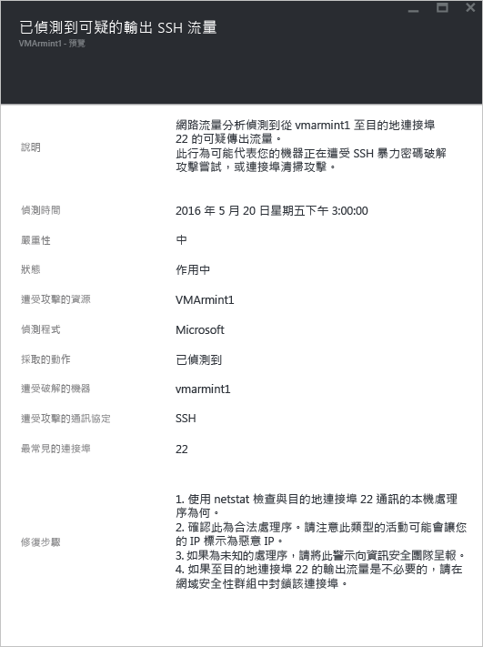

此警示會提供資訊，讓您識別用來起始此攻擊的資源、遭入侵的電腦、偵測時間、通訊協定和所使用的連接埠。此刀鋒視窗也可提供您可用來解決這個問題的補救步驟清單。

### 與惡意電腦的網路通訊

藉由利用 Microsoft 威脅情報摘要，Azure 資訊安全中心可以偵測與惡意 IP 位址通訊的遭入侵電腦，在許多情況下，這會是命令和控制中心。在此情況下，Azure 資訊安全中心偵測到通訊是使用 Pony Loader 惡意程式碼 (也稱為 [Fareit](https://www.microsoft.com/security/portal/threat/encyclopedia/entry.aspx?Name=PWS:Win32/Fareit.AF)) 來進行。

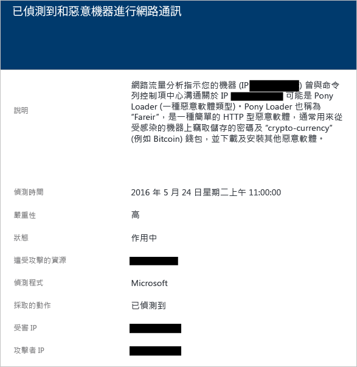

此警示會提供資訊，讓您識別用來起始此攻擊的資源、受攻擊的資源、受害者 IP、攻擊者 IP 和偵測時間。

[AZURE.NOTE] 為了保護隱私權，此螢幕擷取畫面的即時 IP 位址已遭到移除。

### 偵測到可能的連出拒絕服務攻擊

源自一部虛擬機器的異常網路流量可能會導致資訊安全中心觸發潛在的拒絕服務攻擊類型。
 
以下是本類型之警示的範例：

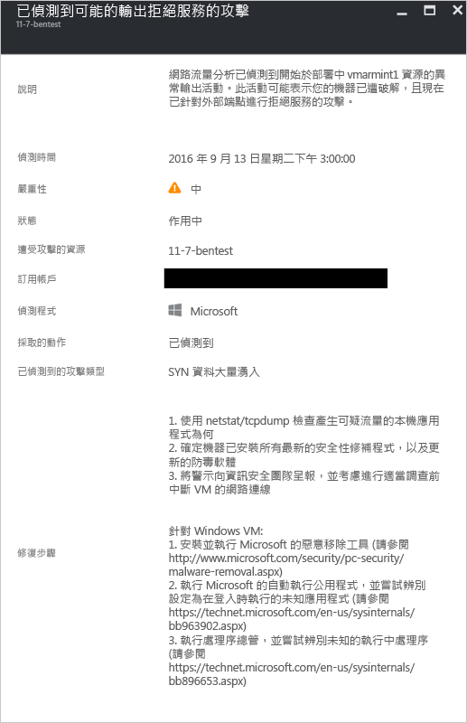

## 資源分析

資訊安全中心資源分析會著重於 PaaS 服務，例如與 [Azure SQL Db 威脅偵測](../sql-database/sql-database-threat-detection-get-started.md)功能整合。根據來自這些區域的分析結果，資訊安全中心會觸發資源相關警示。

### 潛在的 SQL 插入式攻擊

SQL 插入式攻擊會將惡意程式碼插入字串，而此字串稍後會傳遞至 SQL Server 執行個體以進行剖析和執行。建構 SQL 陳述式的任何程序皆應檢閱其中是否有插入式攻擊弱點，因為 SQL Server 會執行所有它收到的語法上有效的查詢。SQL 威脅偵測會使用機器學習、行為分析和異常偵測，判斷 Azure SQL Database 中可能會發生的可疑事件。例如：

- 離職員工嘗試的資料庫存取
- SQL 插入式攻擊
- 從使用者家裡異常存取生產資料庫

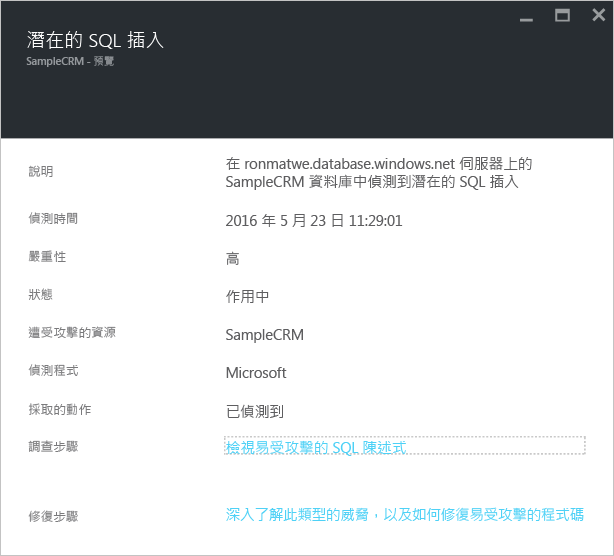

此警示會提供資訊，讓您識別受攻擊的資源、偵測時間、攻擊狀態，並且還會提供進一步調查步驟的連結。

### SQL 插入式攻擊的弱點

在資料庫上偵測到應用程式錯誤時會觸發此警示，這可能表示 SQL 插入式攻擊的可能弱點。

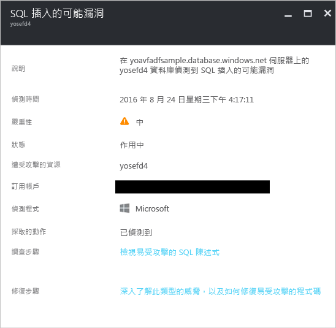

### 來自不熟悉位置的異常存取

在伺服器上偵測到來自不熟悉 IP 位址的存取 (未在最後一個期間看到) 時，會觸發此警示。

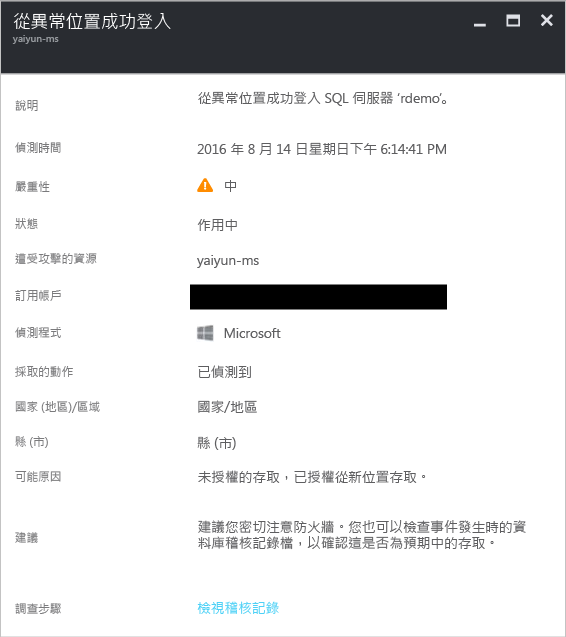

## 另請參閱

在本文件中，您了解到資訊安全中心的各種安全性警示類型。如要深入了解資訊安全中心，請參閱下列主題：

- [在 Azure 資訊安全中心處理安全性事件](security-center-incident.md)
- [Azure 資訊安全中心的偵測功能](security-center-detection-capabilities.md)
- [Azure 資訊安全中心規劃和操作指南](security-center-planning-and-operations-guide.md)
- [Azure 資訊安全中心常見問題集](security-center-faq.md) – 尋找使用服務的常見問題。
- [Azure 安全性部落格](http://blogs.msdn.com/b/azuresecurity/) – 尋找有關 Azure 安全性與相容性的部落格文章。

<!---HONumber=AcomDC_0921_2016-->