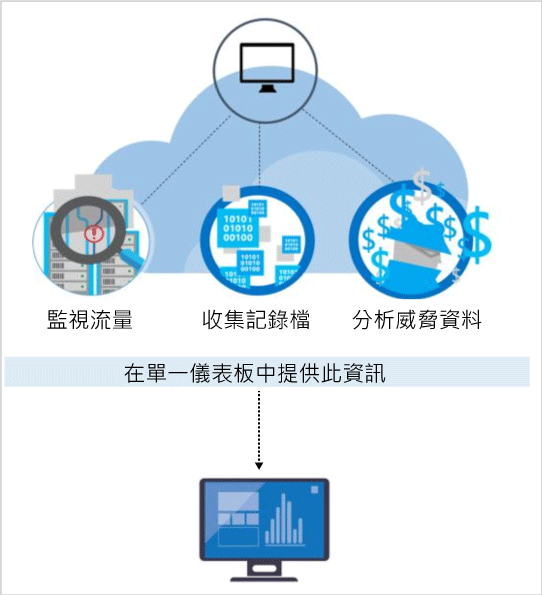

<properties
   pageTitle="Azure 資訊安全中心的偵測功能 | Microsoft Azure"
   description="本文件協助您了解如何使用 Azure 資訊安全中心的偵測功能。"
   services="security-center"
   documentationCenter="na"
   authors="YuriDio"
   manager="swadhwa"
   editor=""/>

<tags
   ms.service="security-center"
   ms.topic="hero-article"
   ms.devlang="na"
   ms.tgt_pltfrm="na"
   ms.workload="na"
   ms.date="08/05/2016"
   ms.author="yurid"/>

# Azure 資訊安全中心的偵測功能
本文件討論 Azure 資訊安全中心的進階偵測功能，協助您識別以您的 Microsoft Azure 資源為目標的作用中威脅，並提供您快速回應所需的深入見解。

## 回應現今的威脅
威脅態勢在過去 20 年來已有重大變更。在過去，公司通常只需擔心網站遭到大多想要查看「他們能做些什麼」的個別攻擊者竄改。現今的攻擊者更加複雜且有組織性。他們通常會有特定的財務和策略性目標。他們也有更多的資源可供利用，因為它們可能是由民族國家或組織型犯罪所資助。

這造就了前所未有的專業攻擊者等級。他們不再對 Web 竄改感興趣。他們現在對於竊取資訊、金融帳戶及私人資料深感興趣 – 他們可利用這些資料在開放性市場上獲取金錢利用，或利用特定的商務、政治及軍事立場。相較於具有財務目標的攻擊者，破壞網路以便對基礎結構和人員造成傷害的攻擊者更加令人關切。

回應時，組織通常會部署數個點解決方案，而這類解決方案會藉由尋找已知的攻擊簽章，進而著重於防禦企業周邊或端點。這些解決方案通常會產生大量的低精確度警示，其需要資訊安全分析師進行分級和調查。大部分的組織沒有回應這些警示所需的時間和專業知識 – 這麼多警示尚未解決。同時，攻擊者的方法已經演變，可以破壞許多以簽章為基礎的防禦措施以及[適應雲端環境](https://azure.microsoft.com/blog/detecting-threats-with-azure-security-center/)。需要新的方法，才能更快速地找出新興威脅並加速偵測和回應。

## Azure 資訊安全中心偵測及回應威脅的方式

Microsoft 資訊安全研究人員會持續監視威脅。他們可以存取從 Microsoft 在雲端和內部部署中的全域支援取得的一組廣泛遙測。這組包羅萬象的資料集，可讓 Microsoft 探索其內部部署消費性和企業產品及其線上服務的新攻擊模式和趨勢。因此，資訊安全中心可以在攻擊者發行新的和日益複雜的攻擊時，快速地更新其偵測演算法。這可協助您跟上瞬息萬變的威脅環境。

資訊安全中心威脅偵測的運作方式如下：從您的 Azure 資源、網路及已連線的協力廠商解決方案自動收集安全性資訊。它會分析這項資訊 (通常是來自多個來源的相互關聯資訊) 以識別威脅。資訊安全中心的安全性警示會排定優先順序，並提供如何補救威脅的建議。

資訊安全中心會運用進階安全性分析，其遠勝於以簽章為基礎的方法。巨量資料和[機器學習](https://azure.microsoft.com/blog/machine-learning-in-azure-security-center/)技術突破可用來評估整個雲端網狀架構的事件 – 使用手動方式來偵測無法識別的威脅，以及預測攻擊的演化。這些安全性分析包括︰

- **整合性威脅情報**：利用 Microsoft 產品和服務、Microsoft 數位犯罪防治中心 (DCU)、Microsoft Security Response Center (MSRC) 以及外部摘要的全域威脅情報，尋找已知的不良執行者。
- **行為分析**：套用已知模式來探索惡意行為。
- **異常偵測**︰使用統計剖析來建置歷程基準。它會對偏離已確立基準 (符合潛在攻擊向量) 的情況提出警示。

> [AZURE.NOTE] 在 Azure 資訊安全中心的標準層中可取得進階偵測。提供 90 天的免費試用。您可以在[安全性原則](security-center-policies.md)中升級定價層選取項目。若要深入了解價格，請瀏覽[資訊安全中心](https://azure.microsoft.com/pricing/details/security-center/)頁面。

### 威脅情報
Microsoft 有大量全域威脅情報。遙測會從多個來源 (例如 Azure、Office 365、Microsoft CRM Online、Microsoft Dynamics AX、outlook.com、MSN.com、Microsoft 數位犯罪防治中心 (DCU) 和 Microsoft 安全性回應中心 (MSRC) 流入。研究人員也會收到主要雲端服務提供者之間共用的威脅情報資訊，並訂閱來自協力廠商的威脅情報摘要。Azure 資訊安全中心可以使用這項資訊來警示您來自已知不良執行者的威脅。部分範例包括：

- **惡意 IP 位址的輸出通訊**︰對已知 botnet 或 darknet 的輸出流量可能表示您的資源已被盜用，以及攻擊者嘗試對系統或外洩資料執行命令。Azure 資訊安全中心會比較網路流量與 Microsoft 的全域威脅資料庫，並在偵測到惡意 IP 位址的通訊時提出警示。

## 行為分析

行為分析是一種可分析及比較資料與一組已知模式的技術。不過，這些模式並非簡單的簽章。它們會透過已套用至大型資料集的複雜機器學習演算法來決定。它們也能透過專業分析師仔細分析惡意行為來判定。Azure 資訊安全中心可以使用行為分析，根據虛擬機器記錄檔、虛擬網路裝置記錄檔、網狀架構記錄檔、毀損傾印和其他來源的分析，來識別遭到入侵的資源。

此外，還與其他訊號相互關聯，以檢查廣泛行銷活動的支援證明。這有助於識別與已確立危害指標一致的事件。部分範例包括：

- **可疑處理程序執行**︰攻擊者不需要偵測，即可運用數種技術來執行惡意軟體。比方說，攻擊者可能會讓惡意程式碼具有與合法系統檔案相同的名稱，但會將這些檔案放在替代位置、使用非常類似良性檔案的名稱，或為檔案的真正副檔名加上遮罩。資訊安全中心會塑造程序行為的模型，並監視處理序執行以偵測這類的極端值。
- **隱藏的惡意程式碼和弱點攻擊嘗試**︰複雜的惡意程式碼能藉由永遠不要寫入至磁碟或加密磁碟上儲存的軟體元件，以避開傳統反惡意程式碼產品。不過，可以使用記憶體分析來偵測這類惡意程式碼，因為惡意程式碼必須在記憶體中留下蹤跡才能運作。當軟體損毀時，損毀傾印會在損毀時擷取部分的記憶體。藉由分析損毀傾印中的記憶體，Azure 資訊安全中心可以偵測到用來利用軟體弱點、存取機密資料，以及暗中存在於遭入侵電腦的技術，而不影響您電腦的效能。
- **橫向移動和內部偵察**︰為了保存在遭入侵網路並找出/獲取重要資料，攻擊者經常會試圖從遭入侵的電腦橫向移到相同網路內的其他電腦。資訊安全中心會監視處理和登入活動，以便探索在網路內展開攻擊者據點的嘗試，例如遠端命令執行網路探查和帳戶列舉。
- **惡意 PowerShell 指令碼**︰ 攻擊者針對各種目的，使用 PowerShell 在目標虛擬機器上執行惡意程式碼。資訊安全中心會檢查 PowerShell 活動，以找到可疑活動的證明。
- **傳出攻擊**︰攻擊者通常會以雲端資源為目標，目的在於使用這些資源來掛載其他攻擊。例如，遭入侵的虛擬機器可用來對其他虛擬機器發動暴力密碼破解攻擊、傳送垃圾郵件，或掃描開啟的連接埠和網際網路上的其他裝置。藉由將機器學習服務套用到網路流量，資訊安全中心可以偵測輸出網路通訊何時超出規範。如果是垃圾郵件，資訊安全中心也會讓不尋常的電子郵件流量與 Office 365 提供的情報相互關聯，以判斷郵件是否可能有惡意或合法電子郵件行銷活動的結果。

### 異常偵測

Azure 資訊安全中心也會使用異常偵測來識別威脅。相較於行為分析 (這取決於衍生自大型資料集的已知模式)，異常偵測更加「個人化」，且著重於您的部署專用的基準。機器學習服務適用於判斷您部署的正常活動，然後產生規則來定義可能代表安全性事件的極端狀況。範例如下：

- **輸入 RDP/SSH 暴力密碼破解攻擊**︰您的部署中可能包含每天都有大量登入的繁忙虛擬機器，以及有極少量或無任何登入的其他虛擬機器。Azure 資訊安全中心可以判斷這些虛擬機器的基準登入活動，並使用機器學習服務來定義正常登入活動以外的登入。如果登入次數、當天登入的時間、要求登入的位置或其他登入相關特性與基準明顯不同，則可能會產生警示。同樣地，機器學習服務會判斷何者值得關注。

## 連續威脅情報監視

Azure 資訊安全中心設有資訊安全研究和資料科學小組，負責持續監視威脅態勢中的變更。這包括下列計劃︰

- **威脅情報監視**︰威脅情報包含有關現有或新興威脅的機制、指標、影響和可採取動作的建議。安全性社群會共用此資訊，而 Microsoft 會持續監視來自內部和外部來源的威脅情報摘要。
- **訊號共用**︰共用和分析 Microsoft 的資訊安全小組對於各種雲端和內部部署服務、伺服器和用戶端端點裝置組合的所提供的深入見解。
- **Microsoft 資訊安全專家**︰持續與擅長特殊資訊安全領域 (例如鑑識與 Web 攻擊偵測) 的 Microsoft 團隊攜手合作。
- **偵測微調**︰對真正的客戶資料集執行演算法，而資訊安全研究人員會與客戶一起驗證結果。真肯定和誤判可用來縮小機器學習演算法的範圍。

結合上述努力終於獲得全新及改善的偵測功能，您因而立即受惠 – 不需採取任何的動作。

## 另請參閱
在本文件中，您已了解如何使用 Azure 資訊安全中心的偵測功能。如要深入了解資訊安全中心，請參閱下列主題：

- [Azure 資訊安全中心規劃和操作指南](security-center-planning-and-operations-guide.md)
- [管理及回應 Azure 資訊安全中心的安全性警示](security-center-managing-and-responding-alerts.md)
- [Azure 資訊安全中心的安全性健全狀況監視](security-center-monitoring.md) — 了解如何監視 Azure 資源的健全狀況。
- [使用 Azure 資訊安全中心監視合作夥伴解決方案](security-center-partner-solutions.md) — 了解如何監視合作夥伴解決方案的健全狀況。
- [Azure 資訊安全中心常見問題集](security-center-faq.md) — 尋找有關使用服務的常見問題。
- [Azure 安全性部落格](http://blogs.msdn.com/b/azuresecurity/) — 尋找有關 Azure 安全性與相容性的部落格文章。

<!---HONumber=AcomDC_0810_2016-->