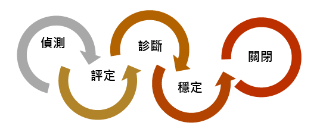
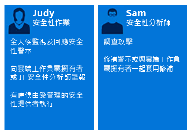
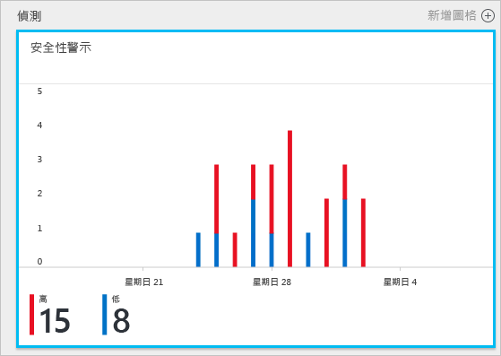
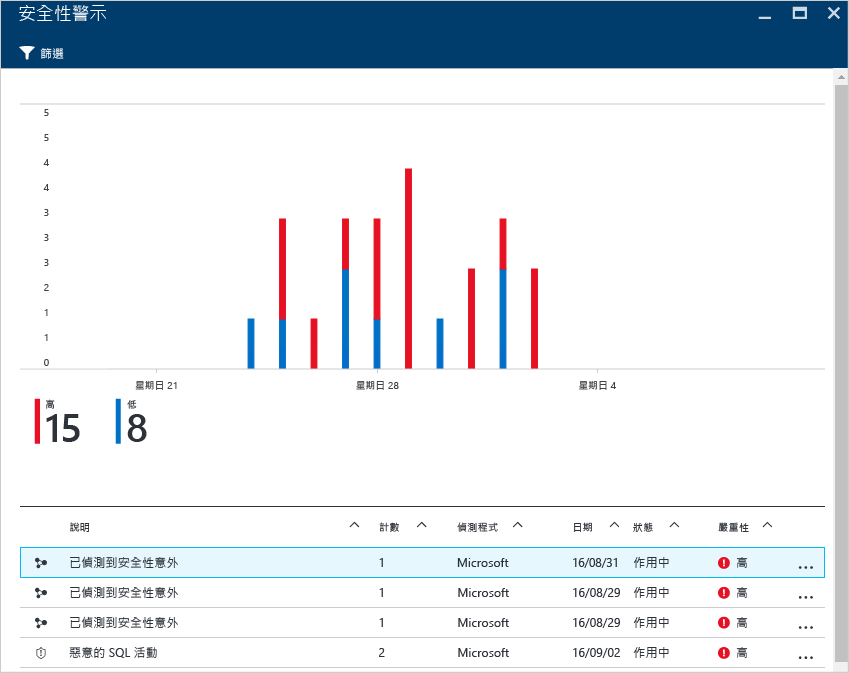
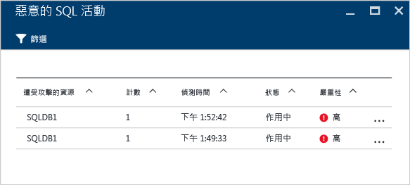
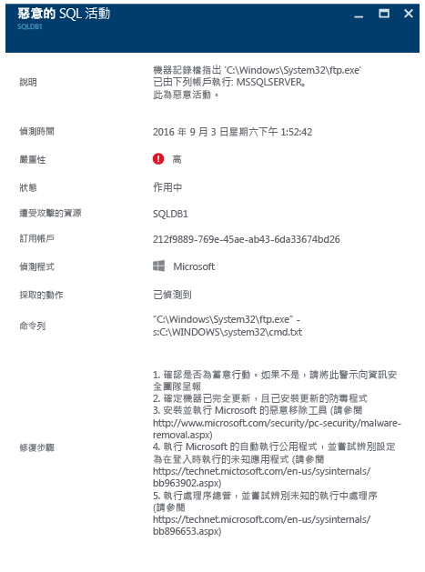

# 善用 Azure 資訊安全中心進行事件回應
許多組織都了解如何只在遭受攻擊之後回應安全性事件。為了降低成本和損害，一定要在攻擊發生前備妥事件回應計劃。Azure 資訊安全中心可用於不同階段的事件回應。

## 事件回應
有效的計劃取決於三項核心功能：保護、偵測及回應威脅的功能。保護是有關防止事件、偵測是有關及早識別威脅，而回應是有關遏止攻擊者及還原系統以緩和缺口的影響。

本文將使用[雲端中的 Microsoft Azure 安全性回應](https://gallery.technet.microsoft.com/Azure-Security-Response-in-dd18c678)一文中的安全性事件回應階段，如下圖所示︰

可在偵測、評估和診斷階段利用資訊安全中心。若要深入了解每個階段。以下是如何在三個初始事件回應階段善用資訊安全中心的範例︰

* **偵測**︰事件調查的首次指示
  * 範例：在 [資訊安全中心] 儀表板中引發高優先順序安全性警示的初始驗證。
* **評估**︰執行初始評估，以取得可疑活動的詳細資訊。
  * 範例︰取得有關安全性警示的詳細資訊。
* **診斷**︰進行技術性調查，找出圍堵、緩和及因應策略
  * 範例︰遵循資訊安全中心在該特定安全性警示中所描述的補救步驟。

接下來的案例示範如何在安全性事件的偵測、評估和回應階段善用資訊安全中心。在資訊安全中心內，[安全性事件](security-center-incident.md)是符合[狙殺鏈](https://blogs.technet.microsoft.com/office365security/addressing-your-cxos-top-five-cloud-security-concerns/)模式之資源的所有警示彙總。事件會出現在 [[安全性警示](security-center-managing-and-responding-alerts.md)] 圖格和刀鋒視窗中。事件會顯示相關警示的清單，以讓您取得所引發的每個警示的詳細資訊。資訊安全中心也會呈現獨立安全性警示，這類警示也可用來追蹤可疑的活動。

## 案例
Contoso 最近將一些內部部署資源移轉至 Azure，包括一些以虛擬機器為基礎的商務營運工作負載和 SQL Database。Contoso 的核心電腦安全性事件回應小組 (CSIRT) 目前因為欠缺與其目前事件回應工具整合的安全性情報，而無法順利調查安全性問題。缺乏此種整合會在偵測期間帶來問題 (太多誤判)，也會在評估和診斷階段造成問題。在此移轉過程中，他們決定選擇加入資訊安全中心，以協助他們解決這個問題。

此移轉的第一個階段會在所有資源上架並解決資訊安全中心的所有安全性建議後完成。Contoso CSIRT 是處理電腦安全性事件的焦點。該小組是由一群負責處理任何安全性事件的人員所組成。小組成員已清楚定義職責，以確保涵蓋所有的回應區域。

基於此案例的目的，我們會將重點放在屬於 Contoso CSIRT 的下列人物的角色︰

Judy 隸屬安全維運單位，她的職責包括︰

* 隨時監視及回應安全性威脅
* 視需要提升至雲端工作負載擁有者或安全性分析師

Sam 是安全性分析師，他的職責包括︰

* 調查攻擊
* 修復警示
* 與工作負載擁有者一起來判斷和套用緩和措施

如您所見，Judy 和 Sam 的責任不同，而他們必須一起共用從資訊安全中心取得的資訊。

## 建議的解決方案
由於 Judy 和 Sam 有不同的角色，他們將會使用資訊安全中心的不同區域來取得日常活動的相關資訊。Judy 會在其日常監視中使用 [安全性警示]。

Judy 會在偵測和評估階段使用 [安全性警示]。Judy 完成初步評估後，如果需要進一步調查，她可能會向 Sam 呈報問題。此時 Sam 會使用資訊安全中心所提供的資訊，有時搭配其他資料來源，以移至診斷階段。

## 如何實作此解決方案
為了查看您如何在事件回應案例中使用 Azure 資訊安全中心，我們將遵循 Judy 在偵測和評估階段中的步驟，並查看 Sam 如何診斷問題。

### 偵測和評估事件回應階段
Judy 登入了 Azure 入口網站，目前位於資訊安全中心主控台。在她的日常監視活動中，她會執行下列步驟，以便開始檢閱高優先順序的安全性警示︰

1. 按一下 [安全性警示] 圖格，然後存取 [安全性警示] 刀鋒視窗。
   
   > [!NOTE]
   > 基於此案例的目的，Judy 即將對 [惡意 SQL 活動] 警示執行評估，如上圖所示。
   > 
   > 
2. 按一下 [惡意 SQL 活動] 警示並在 [惡意 SQL 活動] 刀鋒視窗中檢閱受攻擊的資源︰
   
    在此刀鋒視窗中，Judy 可以做一些筆記：受攻擊資源的相關資訊、此攻擊的發生次數，以及其偵測時間。
3. 按一下 [受到攻擊的資源] 以取得有關此攻擊的詳細資訊。

讀取說明之後，Judy 確信這不是誤判，她就應該向 Sam 呈報此案例。

### 診斷事件回應階段
Sam 會收到來自 Judy 的案例，開始檢閱資訊安全中心所建議的修復步驟。

### 其他資源
事件回應小組也可以利用[資訊安全中心 Power BI](security-center-powerbi.md) 功能來查看不同類型的報告，而這些報告可在進一步調查期間協助他們視覺化、分析和篩選相關建議和安全性警示。對於在調查過程中使用其安全性資訊和事件管理 (SIEM) 解決方案的公司而言，他們也可以[整合資訊安全中心與其解決方案](security-center-integrating-alerts-with-log-integration.md)。也可以使用 [Azure 記錄整合工具](https://blogs.msdn.microsoft.com/azuresecurity/2016/07/21/microsoft-azure-log-integration-preview/)來整合 Azure 稽核記錄檔和 VM 安全性事件。這項資訊可搭配資訊安全中心提供的資訊來調查攻擊。

## 結論
事件發生前召集小組對組織而言非常重要，可正面影響事件的處理方式。擁有可監視資源的適當工具，有助於這個小組採取正確的步驟來修復安全性事件。資訊安全中心[偵測功能](security-center-detection-capabilities.md)將協助 IT 部門快速地回應安全性事件並修復安全性問題。

<!---HONumber=AcomDC_0921_2016-->