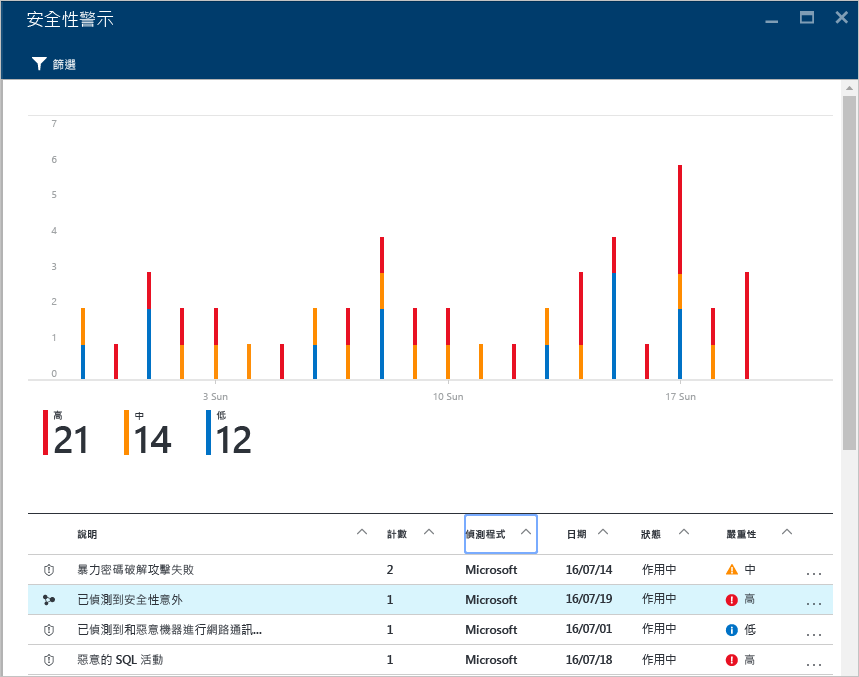
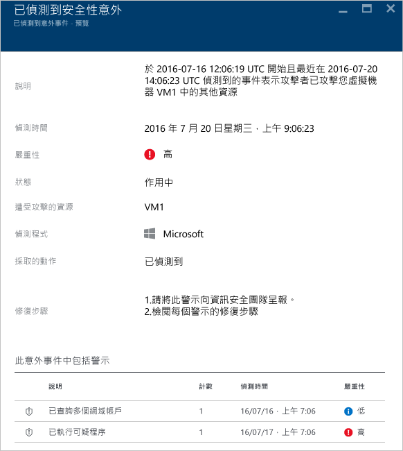
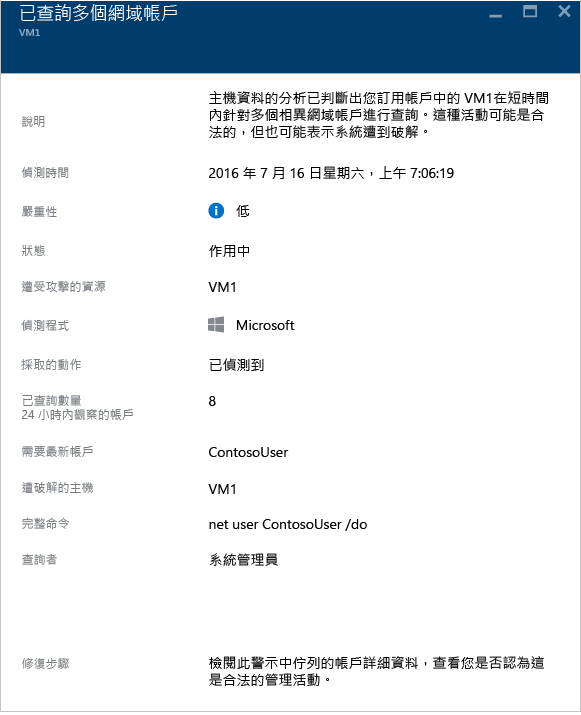

<properties
   pageTitle="在 Azure 資訊安全中心處理安全性事件 | Microsoft Azure"
   description="本文件可協助您使用「Azure 資訊安全中心」功能來處理安全性事件。"
   services="security-center"
   documentationCenter="na"
   authors="YuriDio"
   manager="swadhwa"
   editor=""/>

<tags
   ms.service="security-center"
   ms.topic="hero-article"
   ms.devlang="na"
   ms.tgt_pltfrm="na"
   ms.workload="na"
   ms.date="07/20/2016"
   ms.author="yurid"/>

# 在 Azure 資訊安全中心處理安全性事件 
對安全性警示進行分級和調查是很耗時的工作，即使是最熟練的安全性分析師也是如此，而且對許多人來說，即使要知道從何著手都相當困難。透過使用[分析](security-center-detection-capabilities.md)來連結不同[安全性警示](security-center-managing-and-responding-alerts.md)之間的資訊，資訊安全中心可以提供關於攻擊活動和所有相關警示的單一檢視，讓您快速了解攻擊者所採取的動作以及受到影響的資源。

本文件將討論如何使用資訊安全中心的安全性警示功能，協助您處理安全性事件。

## 什麼是安全性事件？

在資訊安全中心內，安全性事件是符合[狙殺鍊](https://blogs.technet.microsoft.com/office365security/addressing-your-cxos-top-five-cloud-security-concerns/)模式之資源的所有警示彙總。事件會出現在 [[安全性警示](security-center-managing-and-responding-alerts.md)] 圖格和刀鋒視窗中。事件會顯示相關警示的清單，以讓您取得所引發的每個警示的詳細資訊。

## 管理安全性事件

您可以查看 [安全性警示] 圖格來檢閱目前的安全性事件。存取 Azure 入口網站，然後依照下列步驟進行，以查看每個安全性事件的詳細資訊︰

1. 您會在 [資訊安全中心] 儀表板看到 [安全性警示] 圖格。

    ![資訊安全中心的 [安全性警示] 圖格](./media/security-center-incident/security-center-incident-fig1.png)

2.  按一下此圖格來加以展開，如果偵測到安全性事件，它便會出現在安全性警示圖形底下，如此圖所示。

    

3.	請注意，安全性事件描述具有不同於其他警示的圖示。按一下圖示即可檢視此事件的詳細資訊。

	

4. 	在 [偵測到安全性事件] 刀鋒視窗中，您會看到此安全性事件的詳細資訊，其中包含事件的完整描述、嚴重性 (在本例中是 [高])、事件的目前狀態 (在本例中仍為 [作用中])、受到攻擊的資源 (在本例中是 [VM1])、修復步驟，而最底下則是此事件所包含的警示。如果您想要取得每個警示的詳細資訊，只要按一下警示便會開啟另一個刀鋒視窗，如下所示。

	

此刀鋒視窗上的資訊視警示而異。如需如何管理這些警示的詳細資訊，請閱讀[管理及回應 Azure 資訊安全中心的安全性警示](security-center-managing-and-responding-alerts.md)。關於這項功能的一些重要考量︰

- 有新的篩選器可讓您將檢視自訂為 [僅事件] 和/或 [僅警示]。
- 相同的警示可以做為事件的一部分存在 (如果適用)，以及顯示為獨立警示。
- 關閉事件不會關閉相關的警示。

## 另請參閱

在本文件中，您已了解如何使用資訊安全中心的安全性事件功能。如要深入了解資訊安全中心，請參閱下列主題：

- [Azure 資訊安全中心規劃和操作指南](security-center-planning-and-operations-guide.md)
- [管理及回應 Azure 資訊安全中心的安全性警示](security-center-managing-and-responding-alerts.md)
- [Azure 資訊安全中心的安全性健全狀況監視](security-center-monitoring.md) -- 了解如何監視 Azure 資源的健全狀況。
- [使用 Azure 資訊安全中心監視合作夥伴解決方案](security-center-partner-solutions.md) -- 了解如何監視合作夥伴解決方案的健全狀況。
- [Azure 資訊安全中心常見問題集](security-center-faq.md) -- 尋找有關使用服務的常見問題。
- [Azure 安全性部落格](http://blogs.msdn.com/b/azuresecurity/) -- 尋找有關 Azure 安全性與相容性的部落格文章。

<!---HONumber=AcomDC_0720_2016-->