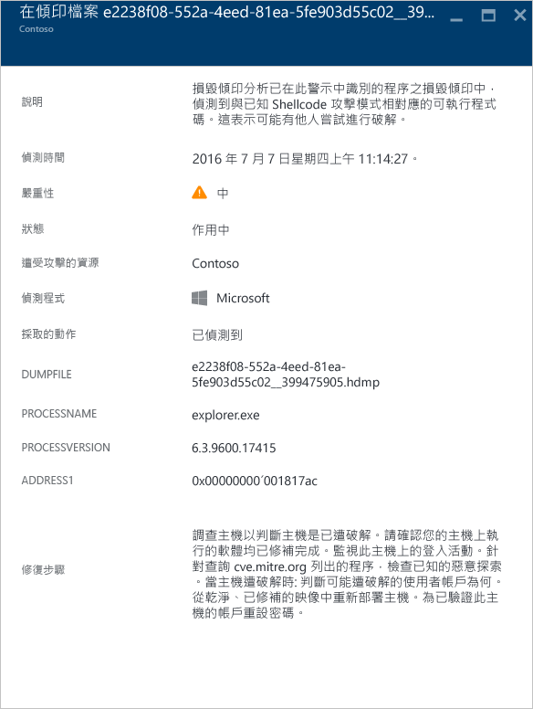
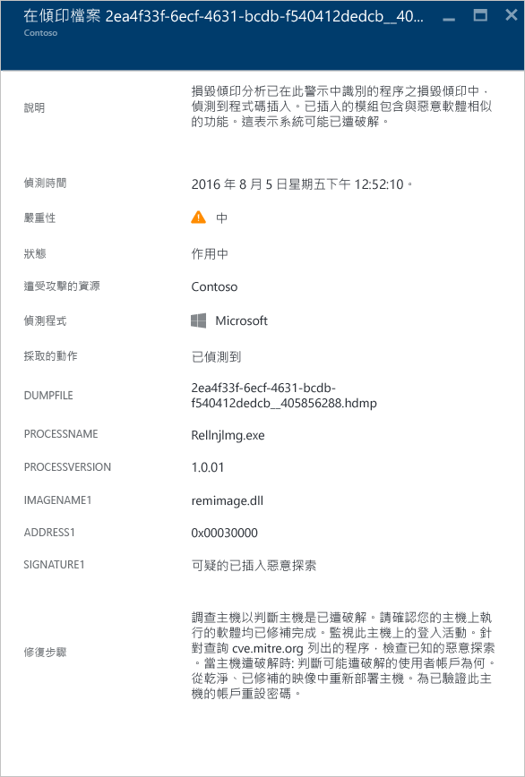
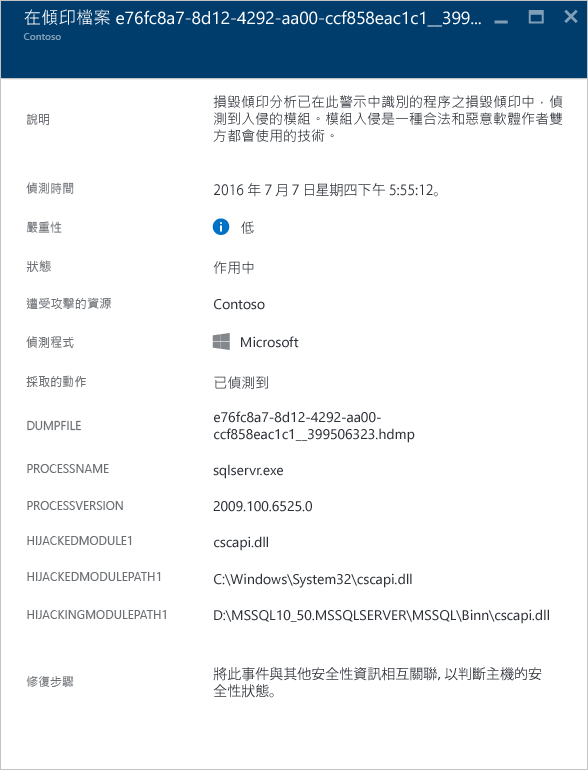
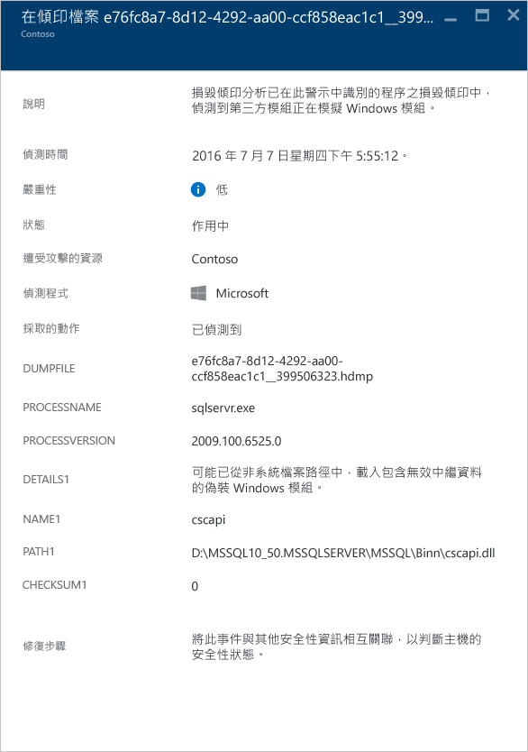
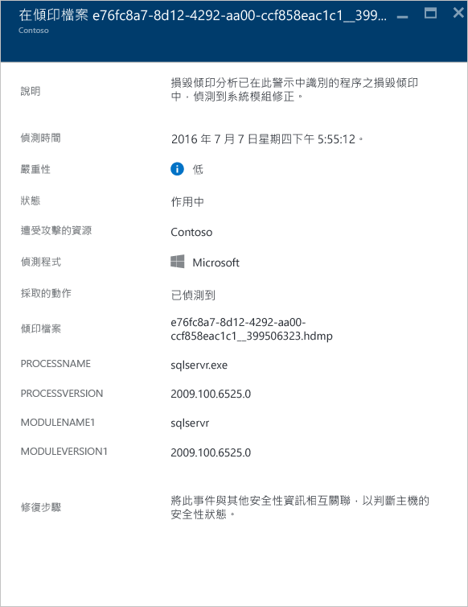

<properties
   pageTitle="管理及回應 Azure 資訊安全中心的安全性警示 | Microsoft Azure"
   description="本文件可協助您使用「Azure 資訊安全中心」功能來管理及回應安全性警示。"
   services="security-center"
   documentationCenter="na"
   authors="YuriDio"
   manager="swadhwa"
   editor=""/>

<tags
   ms.service="security-center"
   ms.topic="hero-article"
   ms.devlang="na"
   ms.tgt_pltfrm="na"
   ms.workload="na"
   ms.date="08/26/2016"
   ms.author="yurid"/>

# 管理及回應 Azure 資訊安全中心的安全性警示
本文件可協助您使用 Azure 資訊安全中心來管理及回應安全性警示。

> [AZURE.NOTE] 若要啟用進階偵測，請升級至 Azure 資訊安全中心標準。提供 90 天的免費試用。若要升級，請選取 [安全性原則](security-center-policies.md) 中的 [定價層]。若要深入了解，請參閱[價格頁面](https://azure.microsoft.com/pricing/details/security-center/)。

## 什麼是安全性警示：
資訊安全中心會自動收集、分析及整合您 Azure 資源、網路和已連線的合作夥伴解決方案 (例如防火牆和端點保護解決方案) 的記錄檔資料，來偵測真正的威脅並減少誤判情形。「資訊安全中心」會顯示優先安全性警示清單，以及需要您快速調查問題的資訊，和如何修復攻擊行為的建議。Azure 資訊安全中心還會將符合狙殺鍊模式的警示彙整到[事件](security-center-incident.md)。

> [AZURE.NOTE] 如需資訊安全中心偵測功能運作方式的詳細資訊，請閱讀 [Azure 資訊安全中心的偵測功能](security-center-detection-capabilities.md)。

## 管理安全性警示

您可以查看 [安全性警示] 圖格來檢視目前的警示。開啟 Azure 入口網站並遵循下列步驟來查看有關每個警示的更多詳細資訊：

1. 您會在「資訊安全中心」的儀表板看到 [安全性警示] 圖格。

    ![資訊安全中心的 [安全性警示] 圖格](./media/security-center-managing-and-responding-alerts/security-center-managing-and-responding-alerts-fig1-ga.png)

2.  按一下圖格，開啟 [安全性警示] 刀鋒視窗，其中包括與警示相關的詳細資料，如下所示。

    ![資訊安全中心的 [安全性警示] 刀鋒視窗](./media/security-center-managing-and-responding-alerts/security-center-managing-and-responding-alerts-fig2-ga.png)

這個刀鋒視窗的底部會顯示每個警示的詳細資料。如要為警示排序，請按一下您要做為排序依據的的資料行。下列為每個資料行的定義：

- **警示**：警示的簡短說明。
- **計數**：在特定一天偵測到這個特定類型的所有警示清單。
- **偵測者**：負責觸發警示的服務。
- **日期**：事件發生的日期。
- **狀態**：該警示目前的狀態。狀態分為兩種：
    - **使用中**：已偵測到安全性警示。
    - **已解除**：使用者已經解除該安全性警示。這個狀態通常用於已經過調查但事件影響已減輕時，或是在調查後發現該事件並非真正攻擊時。

- **嚴重性**：嚴重性層級，分為高、中或低。

### 篩選警示

您可以根據日期、狀態及嚴重性來篩選警示。如果您需要縮小顯示的安全性警示檢視範圍，篩選警示會相當有用。例如，您可能想確認在過去 24 小時發生的安全性警示，因為您正在調查系統中可能的入侵行動。

1. 按一下 [安全性警示] 刀鋒視窗上的 [篩選]。即會開啟 [篩選] 刀鋒視窗，您可以選取想要查看的日期、狀態和嚴重性值。

	

2. 	查閱安全性警示之後，您會可能會發現可以忽略的警示，因為這是對環境的誤判，或指出特定資源預期會有的行為。無論是哪種情況，如果您判斷安全性警示不適用，您可解除該警示，然後將它從您的檢視中篩除。解除安全性警示的方式有兩種。在警示上按一下滑鼠右鍵，然後選取 [解除]，或將滑鼠游標暫留在項目上，然後按一下出現在右邊的三個點，再選取 [解除]。您可以按一下 [篩選]，然後選取 [已解除]，檢視已解除的安全性警示。

	

### 回應安全性警示

選取一個安全性警示以深入了解觸發警示的事件；如果發現項目，您需要進行一些步驟來阻止攻擊。安全性警示會依類型及日期區分。按一下安全性警示會開啟刀鋒視窗，其中包括已分組的警示清單。

在此案例中，所觸發的警示是關於可疑的遠端桌面通訊協定 (RDP) 活動。第一個資料行顯示哪些資源遭到攻擊；第二個資料行顯示資源遭受攻擊的次數；第三個資料行顯示攻擊的時間；第四個資料行顯示警示的狀態；而第五個資料行顯示攻擊的嚴重性。在檢閱這項資訊後，按一下遭到攻擊的資源，隨即會開啟新的刀鋒視窗。

在此刀鋒視窗的 [說明] 欄位中，您會找到關於這個事件的其他詳細資料。這些額外的詳細資料可供深入了解什麼會觸發安全性警示、目標資源、來源 IP 位址 (若適用)，以及有關如何補救的建議。在某些情況下，來源 IP 位址會是空的 (不適用)，因為並非所有的 Windows 安全性事件記錄檔都包含 IP 位址。

> [AZURE.NOTE] 資訊安全中心會根據安全性警示，建議您不同的補救方法。在某些情況下，您可能必須使用其他的 Azure 功能來實作建議的補救方法。例如，這個攻擊的補救方法是使用[網路 ACL](../virtual-network/virtual-networks-acl.md) 或[網路安全性群組](../virtual-network/virtual-networks-nsg.md)規則，將產生此攻擊的 IP 位址列入封鎖清單。

## 不同類型的安全性警示
用來存取可疑 RDP 活動警示的相同步驟可用來存取其他類型的警示。以下是您可能會在資訊安全中心的警示中看到的其他某些警示範例︰

### 潛在的 SQL 插入式攻擊
SQL 插入式攻擊會將惡意程式碼插入字串，而此字串稍後會傳遞至 SQL Server 執行個體以進行剖析和執行。建構 SQL 陳述式的任何程序皆應檢閱其中是否有插入式攻擊弱點，因為 SQL Server 將會執行所有它收到的語法上有效的查詢。

此警示會提供資訊，讓您識別受攻擊的資源、偵測時間、攻擊狀態，並且還會提供進一步調查步驟的連結。

### 偵測到可疑的連出流量

網路裝置可以受到探索和分析，其方式和其他類型的系統非常類似。攻擊者通常會使用連接埠掃描/連接埠掃掠來開始攻擊。在下列範例中，您有來自 VM 的可疑 SSH 流量，而此流量可以對外部資源執行 SSH 暴力密碼破解攻擊或連接埠掃掠攻擊。

此警示會提供資訊，讓您識別用來起始此攻擊的資源、遭入侵的電腦、偵測時間、通訊協定和所使用的連接埠。此刀鋒視窗也可提供您可用來解決這個問題的補救步驟清單。

### 與惡意電腦的網路通訊
 
藉由利用 Microsoft 威脅情報摘要，Azure 資訊安全中心可以偵測與惡意 IP 位址通訊的遭入侵電腦，在許多情況下，這會是命令和控制中心。在此情況下，Azure 資訊安全中心偵測到通訊是使用 Pony Loader 惡意程式碼 (也稱為 [Fareit](https://www.microsoft.com/security/portal/threat/encyclopedia/entry.aspx?Name=PWS:Win32/Fareit.AF)) 來進行。

此警示會提供資訊，讓您識別用來起始此攻擊的資源、受攻擊的資源、受害者 IP、攻擊者 IP 和偵測時間。

> [AZURE.NOTE] 為了保護隱私權，此螢幕擷取畫面的即時 IP 位址已遭到移除。

### 探索到 Shellcode 

Shellcode 是惡意程式碼利用軟體弱點後執行的承載。該警示代表毀損傾印分析偵測到的可執行程式碼顯現經常由惡意承載執行的行為。雖然非惡意軟體可能會執行這種行為，不過這不是一般軟體開發的實務做法。

以下是所有損毀傾印警示皆有的欄位︰

- DUMPFILE：損毀傾印檔案的名稱
- PROCESSNAME︰損毀處理序的名稱
- PROCESSVERSION︰損毀處理序的版本

該警示提供下列額外欄位︰

- ADDRESS：Shellcode 在記憶體中的位置

以下是本類型之警示的範例：

### 探索到程式碼插入

程式碼插入是指將可執行之模組插入執行中的處理序或執行緒。惡意程式碼會使用這項技術來存取資料、隱藏或避免遭到移除 (如持續性)。該警示代表毀損傾印分析在毀損傾印中偵測到插入的模組。
 
合法軟體開發人員偶爾會為了非惡意的原因而執行程式碼插入，如修改或擴充現有的應用程式或作業系統元件。為了協助您區別惡意和非惡意的插入模組，Azure 資訊安全中心會檢查插入的模組是否符合可疑行為設定檔。這項檢查的結果會以警示的 “SIGNATURE” 欄位來表示，而且會反映在警示嚴重性、警示描述和警示補救步驟中。

除了前文「探索到 Shellcode」一節描述的通用欄位之外，這項警示另提供下列額外欄位︰

- ADDRESS：插入之模組在記憶體中的位置
- IMAGENAME︰插入之模組的名稱。請注意，如果映像未提供映像名稱，該欄位可以是空白。
- SIGNATURE︰指出插入的模組是否符合可疑行為設定檔。下表展示結果和其說明的範例︰

| **簽章值** | **說明** |
|--------------------------------------|-------------------------------------------------------------------------------------------------------------------|
| 可疑的反射式載入器入侵程式 | 該可疑行為通常與使用非作業系統載入器插入程式碼有關 |
| 可疑的插入式入侵程式 | 代表經常與將程式碼插入記憶體有關的不良企圖 |
| 可疑的插入入侵程式 | 代表經常與使用插入記憶體之程式碼有關的不良企圖 |
| 可疑的插入式偵錯工具入侵程式 | 代表經常與偵測或規避偵錯工具有關的不良企圖 |
| 可疑的插入式遠端入侵程式 | 代表經常與命令與控制項 (C2) 案例有關的不良企圖 |

以下是本類型之警示的範例：

### 探索到模組攔截

Windows 仰賴動態連結程式庫 (DLL) 來允許軟體使用通用 Windows 系統功能。DLL 攔截發生於當惡意程式碼變更 DLL 載入順序，以便將惡意承載載入記憶體時，得手後有心人士便能執行任意程式碼。該警示代表毀損傾印分析偵測到名稱相近的模組從兩個不同的路徑載入，而其中一個載入路徑來自通用 Windows 系統二進位檔位置。

合法軟體開發人員偶爾會為了非惡意的原因而變更 DLL 載入順序，如檢測、擴充 Windows 作業系統或 Windows 應用程式。為了協助您區別 DLL 載入順序的惡意變更和潛在的良性變更，Azure 資訊安全中心會檢查載入的模組是否符合可疑設定檔。這項檢查的結果會以警示的 “SIGNATURE” 欄位來表示，而且會反映在警示嚴重性、警示描述和警示補救步驟中。分析攔截模組的磁碟複本 (如驗證檔案的數位簽章或執行防毒軟體掃描)，可能可以讓您進一步瞭解攔截模組的本質屬於合法或惡意。

除了前文「探索到 Shellcode」一節描述的通用欄位之外，這項警示另提供下列欄位︰

- SIGNATURE︰指出攔截模組是否符合可疑行為設定檔
- HIJACKEDMODULE︰遭到攔截的 Windows 系統模組名稱
- HIJACKEDMODULEPATH︰遭到攔截的 Windows 系統模組路徑
- HIJACKINGMODULEPATH︰攔截模組的路徑

以下是本類型之警示的範例：

### 偵測到偽裝的 Windows 模組

惡意程式碼可能會使用 Windows 系統二進位檔 (如 SVCHOST.EXE) 或模組 (如 NTDLL.DLL) 的常用名稱，以期能蒙混過關，避免系統管理員看清惡意軟體的本質。該警示代表毀損傾印分析偵測到毀損傾印檔案含有使用 Windows 系統模組名稱的模組，但這些模組不符合 Windows 模組的其他典型條件。分析偽裝模組的磁碟複本，可能可以讓您進一步瞭解該模組的本質屬於合法或惡意。分析可能包括︰

- 確認有問題的檔案隨附在合法軟體套件中
- 驗證檔案的數位簽章
- 針對檔案執行防毒軟體掃描

除了前文「探索到 Shellcode」一節描述的通用欄位之外，這項警示另提供下列額外欄位︰

- DETAILS︰描述模組中繼資料是否有效，以及模組是否從系統路徑載入。
- NAME︰偽裝 Windows 模組的名稱
- PATH︰偽裝 Windows 模組的路徑。

該警示也會從模組的 "CHECKSUM" 和 "TIMESTAMP" 等 PE 標頭擷取及顯示某些欄位。唯有當模組有這些欄位時，它們才會出現。如需這些欄位的詳細資料，請參閱 [Microsoft PE 和 COFF 規格](https://msdn.microsoft.com/windows/hardware/gg463119.aspx)。

以下是本類型之警示的範例：

### 探索到修改過的系統二進位檔 

惡意程式碼可能會修改核心系統二進位檔，以便秘密存取資料或暗中存留在遭入侵的系統上。該警示代表毀損傾印分析偵測到記憶體中或磁碟上的核心 Windows 作業系統二進位檔已遭到修改。

合法軟體開發人員偶爾會為了非惡意的原因而修改記憶體中的系統模組，如 Detours 或處理應用程式相容性。為了協助您區別惡意模組和可能合法的模組，Azure 資訊安全中心會檢查修改過的模組是否符合可疑設定檔。這項檢查的結果會以警示嚴重性、警示描述和警示補救步驟來表示。

除了前文「探索到 Shellcode」一節描述的通用欄位之外，這項警示另提供下列額外欄位︰

- MODULENAME：修改過的系統二進位檔名稱
- MODULEVERSION：修改過的系統二進位檔版本

以下是本類型之警示的範例：

## 另請參閱

在本文件中，您了解到如何在資訊安全中心設定安全性原則。如要深入了解資訊安全中心，請參閱下列主題：

- [在 Azure 資訊安全中心處理安全性事件](security-center-incident.md)
- [Azure 資訊安全中心的偵測功能](security-center-detection-capabilities.md)
- [Azure 資訊安全中心規劃和操作指南](security-center-planning-and-operations-guide.md)
- [Azure 安全性中心常見問題集](security-center-faq.md) – 尋找使用服務的常見問題。
- [Azure 安全性部落格](http://blogs.msdn.com/b/azuresecurity/) – 尋找有關 Azure 安全性與相容性的部落格文章。

<!---HONumber=AcomDC_0831_2016-->