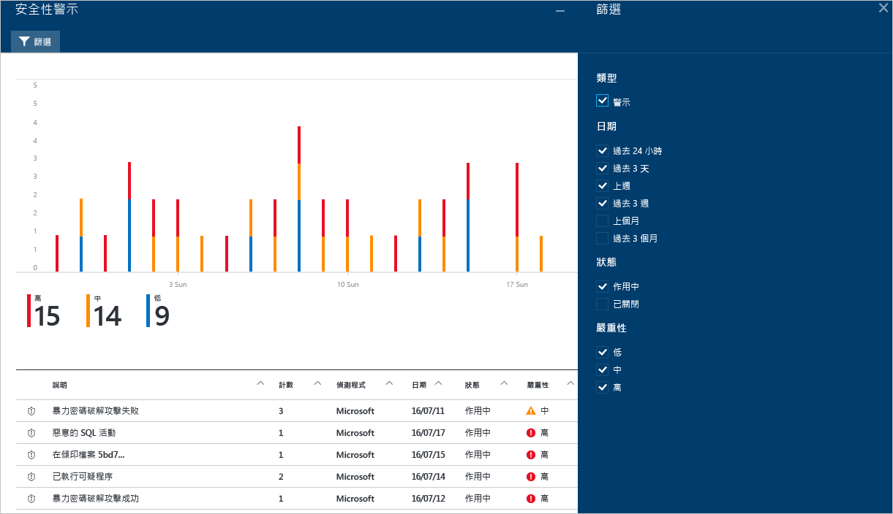
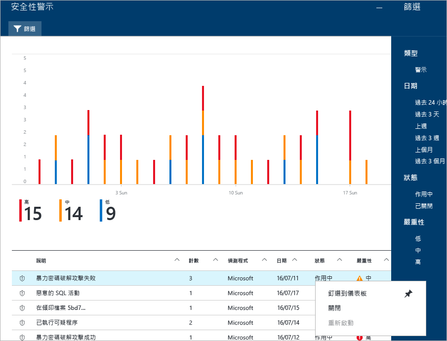
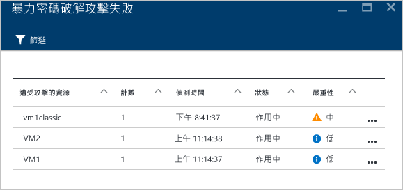
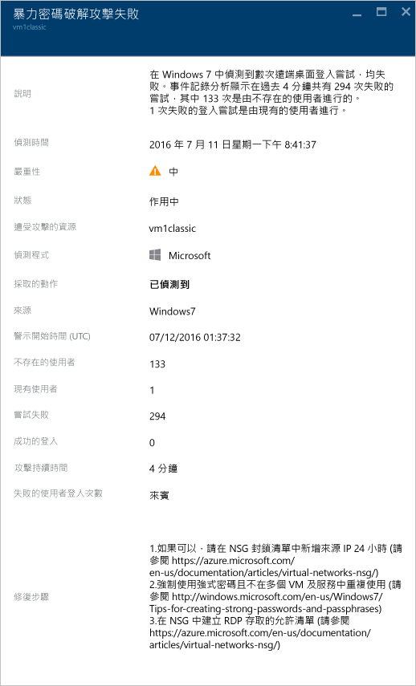

<properties
   pageTitle="管理及回應 Azure 資訊安全中心的安全性警示 | Microsoft Azure"
   description="本文件可協助您使用「Azure 資訊安全中心」功能來管理及回應安全性警示。"
   services="security-center"
   documentationCenter="na"
   authors="YuriDio"
   manager="swadhwa"
   editor=""/>

<tags
   ms.service="security-center"
   ms.topic="hero-article"
   ms.devlang="na"
   ms.tgt_pltfrm="na"
   ms.workload="na"
   ms.date="07/21/2016"
   ms.author="yurid"/>

# 管理及回應 Azure 資訊安全中心的安全性警示
本文件可協助您使用 Azure 資訊安全中心來管理及回應安全性警示。

## 什麼是安全性警示：
資訊安全中心會自動收集、分析及整合您 Azure 資源、網路和已連線的合作夥伴解決方案 (例如防火牆和端點保護解決方案) 的記錄檔資料，來偵測真正的威脅並減少誤判情形。「資訊安全中心」會顯示優先安全性警示清單，以及需要您快速調查問題的資訊，和如何修復攻擊行為的建議。

> [AZURE.NOTE] 如需資訊安全中心偵測功能運作方式的詳細資訊，請閱讀 [Azure 資訊安全中心的偵測功能](security-center-detection-capabilities.md)。

Microsoft 安全性研究人員持續不斷地分析全球新興的威脅，包括新的攻擊模式以及在消費者、企業產品及線上服務中發現的趨勢。如此一來，「資訊安全中心」能夠針對新的漏洞和入侵程式更新其偵測演算法，協助客戶防範各種威脅。「資訊安全中心」可以偵測的部分威脅類型範例如下：

- **暴力偵測網路資料**：使用熟知您應用程式傳統網路流量模式的機器學習模型，對惡意使用者 (不是合法使用者) 執行的存取嘗試進行更有效率的偵測。
- **暴力偵測端點資料**：以機器記錄分析為依據，區隔出失敗及成功的嘗試。
- **與惡意 IP 通訊的 VM**：將網路流量與 Microsoft 全球威脅智慧比較，找出遭到入侵、且與通訊操控伺服器 (C&C) 的電腦通訊的機器，反之亦然。
- **遭到入侵的 VM**：以機器記錄及與其他訊號相關的行為分析為依據，找出可能造成機器遭到入侵及利用的異常活動。

## 管理安全性警示

您可以查看 [安全性警示] 磚來檢視目前的警示。開啟 Azure 入口網站並遵循下列步驟來查看有關每個警示的更多詳細資訊：

1. 您會在「資訊安全中心」的儀表板看到 [安全性警示] 磚。

    ![資訊安全中心的 [安全性警示] 圖格](./media/security-center-managing-and-responding-alerts/security-center-managing-and-responding-alerts-fig1-ga.png)

2.  按一下磚，開啟 [安全性警示] 刀鋒視窗，其中包括與警示相關的詳細資料，如下所示。

    ![資訊安全中心的 [安全性警示] 刀鋒視窗](./media/security-center-managing-and-responding-alerts/security-center-managing-and-responding-alerts-fig2-ga.png)

這個刀鋒視窗的底部會顯示每個警示的詳細資料。如要為警示排序，請按一下您要做為排序依據的的資料行。下列為每個資料行的定義：

- **警示**：警示的簡短說明。
- **計數**：在特定一天偵測到這個特定類型的所有警示清單。
- **偵測者**：負責觸發警示的服務。
- **日期**：事件發生的日期。
- **狀態**：該警示目前的狀態。狀態分為兩種：
    - **使用中**：已偵測到安全性警示。
    - **已解除**：使用者已經解除該安全性警示。這個狀態通常用於已經過調查但事件影響已減輕時，或是在調查後發現該事件並非真正攻擊時。

- **嚴重性**：嚴重性層級，分為高、中或低。

### 篩選警示

您可以根據日期、狀態及嚴重性來篩選警示。如果您需要縮小顯示的安全性警示檢視範圍，篩選警示會相當有用。例如，您可能想確認在過去 24 小時發生的安全性警示，因為您正在調查系統中可能的入侵行動。

1. 按一下 [安全性警示] 刀鋒視窗上的 [篩選]。即會開啟 [篩選] 刀鋒視窗，您可以選取想要查看的日期、狀態和嚴重性值。

	

2. 	查閱安全性警示之後，您會可能會發現可以忽略的警示，因為這是對環境的誤判，或指出特定資源預期會有的行為。無論是哪種情況，如果您判斷安全性警示不適用，您可解除該警示，然後將它從您的檢視中篩除。解除安全性警示的方式有兩種。在警示上按一下滑鼠右鍵，然後選取 [解除]，或將滑鼠游標暫留在項目上，然後按一下出現在右邊的三個點，再選取 [解除]。您可以按一下 [篩選]，然後選取 [已解除]，檢視已解除的安全性警示。

	

### 回應安全性警示

選取一個安全性警示以深入了解觸發警示的事件；如果發現項目，您需要進行一些步驟來阻止攻擊。安全性警示會依類型及日期區分。按一下安全性警示會開啟刀鋒視窗，其中包括已分組的警示清單。

在此案例中，所觸發的警示是關於可疑的遠端桌面通訊協定 (RDP) 活動。第一個資料行顯示哪些資源遭到攻擊；第二個資料行顯示資源遭受攻擊的次數；第三個資料行顯示攻擊的時間；第四個資料行顯示警示的狀態；而第五個資料行顯示攻擊的嚴重性。在檢閱這項資訊後，按一下遭到攻擊的資源，隨即會開啟新的刀鋒視窗。

在此刀鋒視窗的 [說明] 欄位中，您會找到關於這個事件的其他詳細資料。這些額外的詳細資料可供深入了解什麼會觸發安全性警示、目標資源、來源 IP 位址 (若適用)，以及有關如何補救的建議。在某些情況下，來源 IP 位址會是空的 (不適用)，因為並非所有的 Windows 安全性事件記錄檔都包含 IP 位址。

> [AZURE.NOTE] 資訊安全中心會根據安全性警示，建議您不同的補救方法。在某些情況下，您可能必須使用其他的 Azure 功能來實作建議的補救方法。例如，這個攻擊的補救方法是使用[網路 ACL](../virtual-network/virtual-networks-acl.md) 或[網路安全性群組](../virtual-network/virtual-networks-nsg.md)規則，將產生此攻擊的 IP 位址列入黑名單。

## 不同類型的安全性警示
用來存取可疑 RDP 活動警示的相同步驟可用來存取其他類型的警示。以下是您可能會在資訊安全中心的警示中看到的其他某些警示範例︰

### 潛在的 SQL 插入式攻擊
SQL 插入式攻擊會將惡意程式碼插入字串，而此字串稍後會傳遞至 SQL Server 執行個體以進行剖析和執行。建構 SQL 陳述式的任何程序皆應檢閱其中是否有插入式攻擊弱點，因為 SQL Server 將會執行所有它收到的語法上有效的查詢。

此警示會提供資訊，讓您識別受攻擊的資源、偵測時間、攻擊狀態，並且還會提供進一步調查步驟的連結。

### 偵測到可疑的連出流量

網路裝置可以受到探索和分析，其方式和其他類型的系統非常類似。攻擊者通常會使用連接埠掃描/連接埠掃掠來開始攻擊。在下列範例中，您有來自 VM 的可疑 SSH 流量，而此流量可以對外部資源執行 SSH 暴力密碼破解攻擊或連接埠掃掠攻擊。

此警示會提供資訊，讓您識別用來起始此攻擊的資源、遭入侵的電腦、偵測時間、通訊協定和所使用的連接埠。此刀鋒視窗也可提供您可用來解決這個問題的補救步驟清單。

### 與惡意電腦的網路通訊
 
藉由利用 Microsoft 威脅情報摘要，Azure 資訊安全中心可以偵測與惡意 IP 位址通訊的遭入侵電腦，在許多情況下，這會是命令和控制中心。在此情況下，Azure 資訊安全中心偵測到通訊是使用 Pony Loader 惡意程式碼 (也稱為 [Fareit](https://www.microsoft.com/security/portal/threat/encyclopedia/entry.aspx?Name=PWS:Win32/Fareit.AF)) 來進行。

此警示會提供資訊，讓您識別用來起始此攻擊的資源、受攻擊的資源、受害者 IP、攻擊者 IP 和偵測時間。

> [AZURE.NOTE] 為了保護隱私權，此螢幕擷取畫面的即時 IP 位址已遭到移除。

## 另請參閱

在本文件中，您了解到如何在資訊安全中心設定安全性原則。如要深入了解資訊安全中心，請參閱下列主題：

- [Azure 資訊安全中心規劃和操作指南](security-center-planning-and-operations-guide.md)
- [管理及回應 Azure 資訊安全中心的安全性警示](security-center-managing-and-responding-alerts.md)
- [Azure 資訊安全中心的安全性健全狀況監視](security-center-monitoring.md) — 了解如何監視 Azure 資源的健全狀況。
- [使用 Azure 資訊安全中心監視合作夥伴解決方案](security-center-partner-solutions.md) — 了解如何監視合作夥伴解決方案的健全狀況。
- [Azure 資訊安全中心常見問題集](security-center-faq.md) — 尋找有關使用服務的常見問題。
- [Azure 安全性部落格](http://blogs.msdn.com/b/azuresecurity/) — 尋找有關 Azure 安全性與相容性的部落格文章。

<!---HONumber=AcomDC_0803_2016-->