# Azure 資訊安全中心的安全性健康情況監視
本文可協助您使用 Azure 資訊安全中心內的監視功能，監視是否符合原則。

## 什麼是安全性健康情況監視？
我們通常都將監視想像成監看及等候事件發生，以便對該情況作出反應。 安全性監視是指擁有一個主動式策略來稽核您的資源，以識別出不符合組織標準或最佳做法的系統。

## 監視安全性健全狀況
在您為訂用帳戶的資源啟用[安全性原則](security-center-policies.md)之後，資訊安全中心會分析您資源的安全性狀態，以找出潛在的弱點。 您可以立即取得網路組態的相關資訊。 至於虛擬機器組態的相關資訊 (例如安全性更新狀態與作業系統組態)，則可能需要一個小時以上才能取得。 您可以在 [資源安全性健康情況] 刀鋒視窗中，檢視資源的安全性狀態及任何問題。 您也可以在 [建議]  刀鋒視窗上檢視這些問題的清單。

如需如何套用建議的詳細資訊，請參閱[實作 Azure 資訊安全中心的安全性建議](security-center-recommendations.md)。

您可在 [資源安全性健康情況] 圖格上監視資源的安全性狀態。 在下列範例中，您會看到一些需要注意的高度或中度嚴重性問題。 已啟用的安全性原則將會影響受監督的控制項類型。

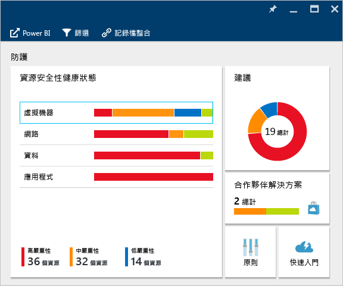

如果資訊安全中心找出必須處理的弱點 (例如遺失了安全性更新的虛擬機器或沒有[網路安全性群組](/virtual-network/virtual-networks-nsg.md)的子網路)，將會在這裡列出。

### 監視虛擬機器
按一下 [資源安全性健康情況] 圖格中的 [虛擬機器] 時，將會開啟 [虛擬機器] 刀鋒視窗，其中會顯示有關訓練的更多詳細資訊、預防步驟，以及受資訊安全中心監視的所有虛擬機器清單，如下列螢幕擷取畫面所示。

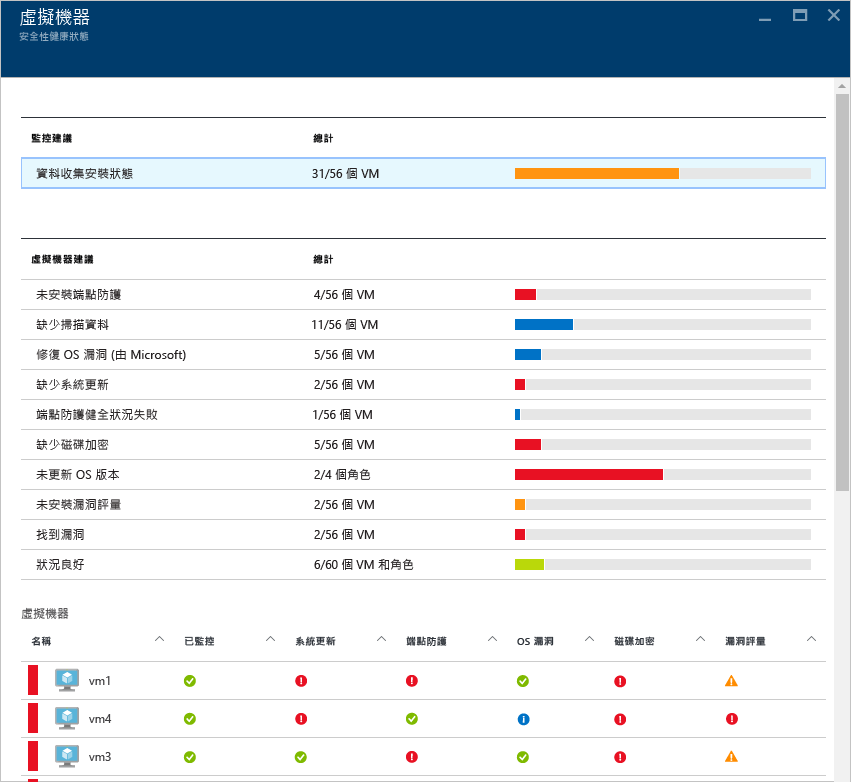

* 登入步驟
* 虛擬機器建議
* 虛擬機器

在每個區段中，您可以選取一個個別的選項，以查看有關解決該問題之建議步驟的更多詳細資訊。 下列各節會更加詳細地說明這方面的資訊。

#### 監視建議
本節顯示已初始化進行資料收集的虛擬機器總數和其目前狀態。 所有虛擬機器都初始化資料收集後，它們就可以接收資訊安全中心的安全性原則。 當您按一下此項目時，[資料收集安裝狀態] 刀鋒視窗會開啟，您會在 [安裝狀態] 資料行中看到虛擬機器名稱和資料收集的目前狀態，如下列螢幕擷取畫面所示。

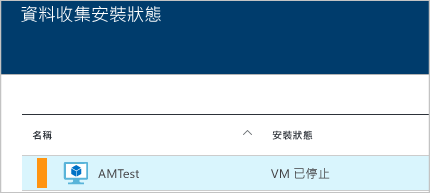

#### 虛擬機器建議
本節提供一組 Azure 資訊安全中心所監視之[每個虛擬機器的建議](security-center-virtual-machine-recommendations.md)。 第一個資料行會列出建議。 第二個資料行則顯示受該項建議影響的虛擬機器總數。 第三個資料行顯示問題的嚴重性，如下列螢幕擷取畫面所示。

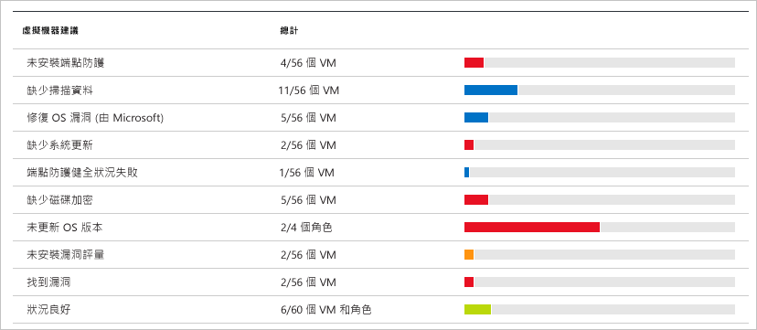

> [!NOTE]
> 只有至少擁有一個公用端點的虛擬機器會顯示在 [網路拓撲] 清單的 [網路健康情況] 刀鋒視窗中。
> 
> 

每個建議在經過點選之後，都會有一組可供執行的動作。 比方說，如果您按一下 [遺失的系統更新]，便會開啟 [遺失的系統更新] 刀鋒視窗。 它會列出遺失修補程式的虛擬機器和遺失更新的嚴重性，如下列螢幕擷取畫面所示。

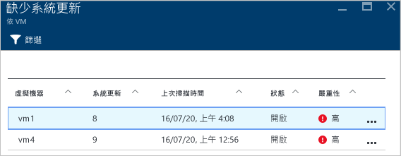

[遺失的系統更新]  刀鋒視窗會顯示含有下列資訊的資料表：

* **虛擬機器**：遺失更新之虛擬機器的名稱。
* **系統更新**：遺漏的系統更新數量。
* **上次掃描時間**：資訊安全中心上次掃描虛擬機器更新的時間。
* **狀態**：建議的目前狀態：
  * **未處理**：建議尚未處理。
  * **進行中**：正在將建議套用到資源，且您不需要採取任何動作。
  * **已解決**︰建議動作已完成  (若問題已解決，該項目會呈現暗灰色)。
* **嚴重性**：描述該特定建議的嚴重性：
  * **高**：某個有意義的資源 (應用程式、虛擬機器或網路安全性群組) 有弱點存在，並且需要注意。
  * **中**：需要執行非關鍵性步驟或其他步驟才能完成程序或消除弱點。
  * **低**：應該處理但不需要立即注意的弱點。 (預設不會顯示嚴重性低的建議，但是如果您要檢視它們，則可以篩選嚴重性低的建議)。

若要檢視建議的詳細資料，請按一下虛擬機器的名稱。 隨即會為該虛擬機器開啟內附更新清單的新刀鋒視窗，如下列螢幕擷取畫面所示。

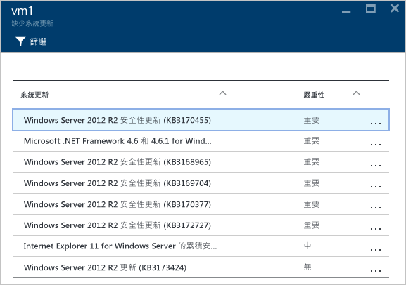

> [!NOTE]
> 這裡的安全性建議與 [建議] 刀鋒視窗中的建議相同。 如需如何處理建議的詳細資訊，請參閱[實作 Azure 資訊安全中心的安全性建議](security-center-recommendations.md)。 這不只適用於虛擬機器，也適用於 [資源健康情況] 圖格中所有可用的資源。
> 
> 

#### 虛擬機器區段
虛擬機器區段提供所有虛擬機器和建議的概觀。 每個資料行代表一組建議，如下列螢幕擷取畫面所示：

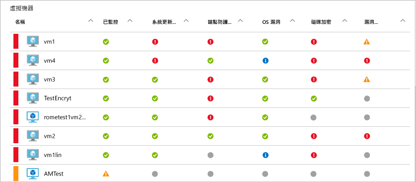

每個建議底下出現的圖示，可協助您快速識別需要關注的虛擬機器以及建議所屬的類型。

在上述範例中，有一個虛擬機器具有與端點保護有關的重要建議。 若要取得虛擬機器的詳細資訊，請對它按一下。 隨即會開啟代表此虛擬機器的新刀鋒視窗，如下列螢幕擷取畫面所示。

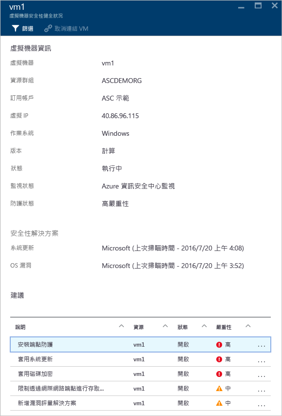

此刀鋒視窗中提供虛擬機器的安全性詳細資料。 您可以在此刀鋒視窗底部看到建議的動作和每個問題的嚴重性。

#### 雲端服務 (預覽) 區段
雲端服務的健康情況狀態會包含在虛擬機器的 [安全性健康情況] 圖格中。 若作業系統版本過時，便會建立建議，如下列螢幕擷取畫面所示︰

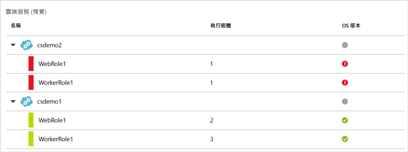

您必須依照建議中的步驟來更新作業系統版本。 例如，如果您按一下 WebRole1 (使用自動部署至 IIS 的 Web 應用程式執行 Windows Server) 或 WorkerRole1 (使用自動部署至 IIS 的 Web 應用程式執行 Windows Server) 資料列中的紅色警示，將會開啟新的刀鋒視窗並顯示這項建議的相關詳細資料，如下列螢幕擷取畫面所示︰

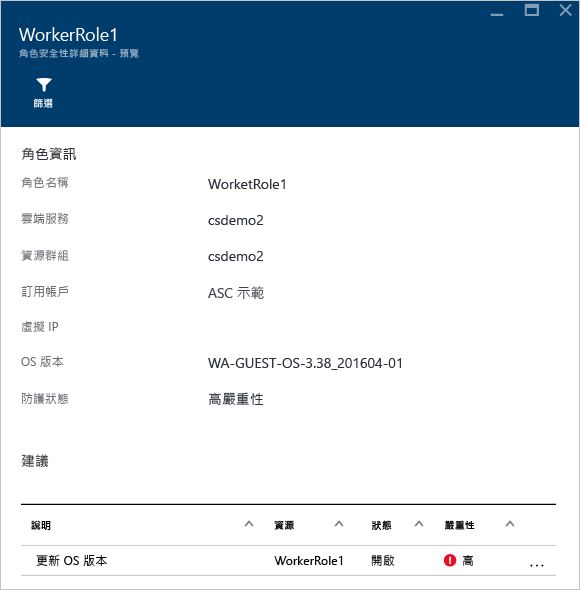

若要查看有關這項建議的更多規範說明，請按一下 [描述] 資料行之下的 [更新OS 版本]。 [更新 OS 版本 (預覽)] 刀鋒視窗會開啟並顯示更多詳細資料。

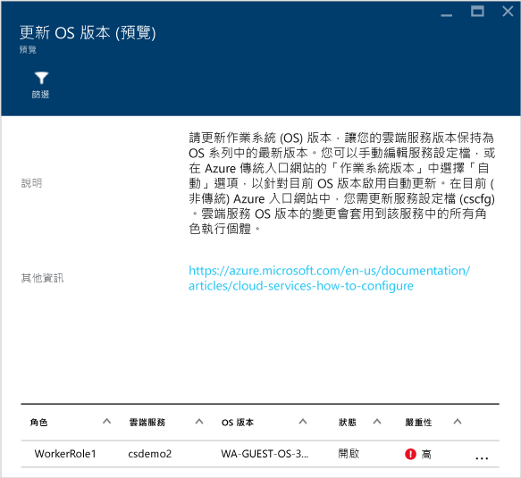  

### 監視虛擬網路
按一下 [資源安全性健康情況] 圖格中的 [網路] 時，將會開啟含有更多詳細資料的 [網路] 刀鋒視窗，如下列螢幕擷取畫面所示：

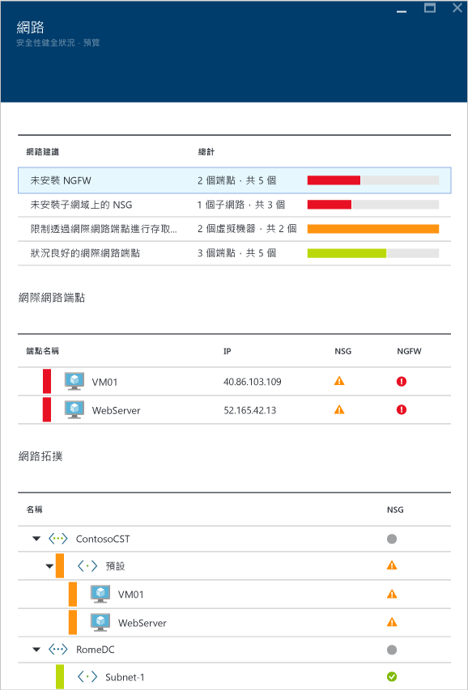

#### 網路功能的建議
和虛擬機器的資源健康情況資訊一樣，這個刀鋒視窗也在刀鋒視窗上半部提供問題的摘要清單，在下半部提供受監督的網路清單。

網路狀態明細區段會列出潛在的安全性問題，並提供 [建議](security-center-network-recommendations.md)。 可能的問題包括：

* 未安裝新一代防火牆 (NGFW)
* 未啟用子網路上的網路安全性群組
* 未啟用虛擬機器上的網路安全性群組
* 限制透過公用外部端點的外部存取
* 狀況良好的網際網路面向端點

當您按一下建議時，便會開啟含有建議詳細資料的新刀鋒視窗，如下列範例所示。

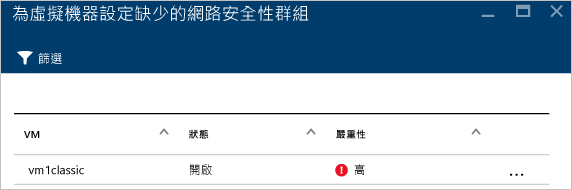

在此範例中，[設定子網路的遺失網路安全性群組] 刀鋒視窗有缺少網路安全性群組保護的子網路和虛擬機器清單。 如果您按一下要對其套用網路安全性群組的子網路，便會開啟另一個刀鋒視窗。

在 [選擇網路安全性群組] 刀鋒視窗中，您可為子網路選取最適當的網路安全性群組，也可以建立新的網路安全性群組。

#### 網際網路面向端點區段
在 [網際網路面向端點] 區段中，您可以看到目前使用網際網路面向端點所設定的虛擬機器和其目前的狀態。

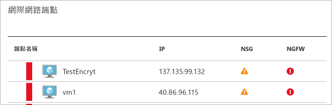

此資料表有代表虛擬機器的端點名稱、網際網路面向的 IP 位址，以及網路安全性群組和 NGFW 目前的嚴重性狀態。 此資料表是依嚴重性排序︰

* 紅色 (在頂端)：高優先順序，應立即處理
* 橘色︰中等優先順序，應儘速處理
* 綠色 (最後一個)︰健康狀態

#### 網路拓撲區段
[網路拓撲] 區段具有資源的階層式檢視，如下列螢幕擷取畫面所示：

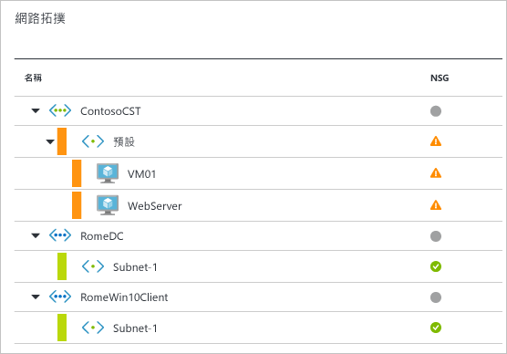

此資料表是依嚴重性排序 (虛擬機器和子網路)︰

* 紅色 (在頂端)：高優先順序，應立即處理
* 橘色︰中等優先順序，應儘速處理
* 綠色 (最後一個)︰健康狀態

在此拓撲檢視中，第一層有[虛擬網路](../virtual-network/virtual-networks-overview.md)、[虛擬網路閘道](/vpn-gateway/vpn-gateway-site-to-site-create.md)和[虛擬網路 (傳統)](/virtual-network/virtual-networks-create-vnet-classic-pportal.md)。 第二層有子網路，第三層有屬於這些子網路的虛擬機器。 右側資料行有這些資源的網路安全性群組的目前狀態，如以下範例所示：

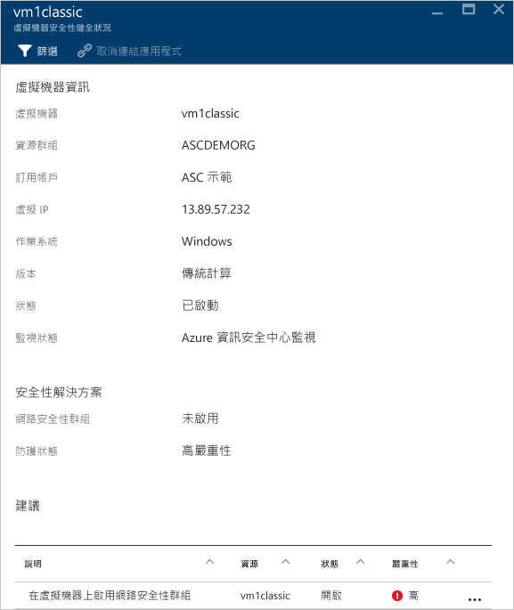

此刀鋒視窗的下半部有此虛擬機器的建議 (類似上面所述)。 您可以按一下建議以深入了解或套用所需的安全性控制或組態。

### 監視資料
當您按一下 [資源安全性健康情況] 圖格中的 [資料] 時，[資料資源] 刀鋒視窗會隨即開啟，其中會有針對 SQL 和儲存體的建議。 它也具有資料庫的一般健全狀況狀態 [建議](security-center-sql-service-recommendations.md) 。 如需儲存體加密的詳細資訊，請在 Azure 資訊安全中心閱讀「啟用 Azure 儲存體帳戶的加密」。

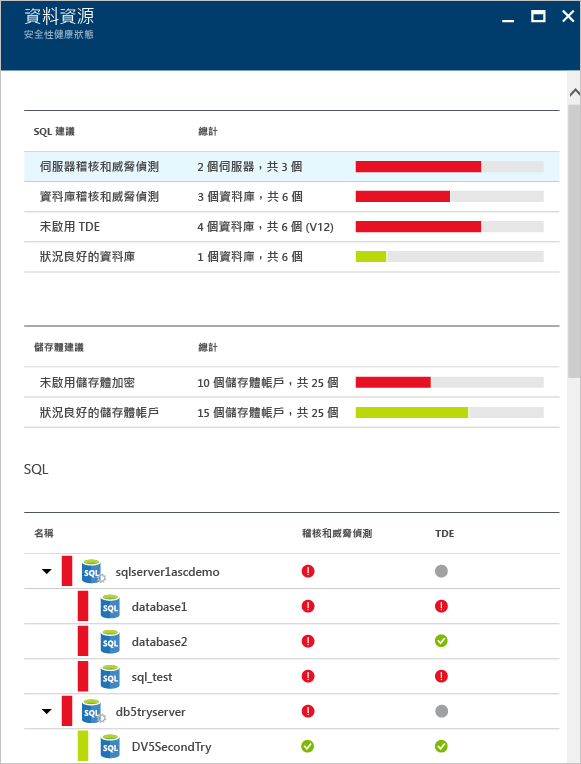

在 [SQL 建議] 底下，您可以按一下任何建議，取得解決問題所需之進一步動作的更多詳細資料。 下列範例顯示已展開的 **SQL Database 上的資料庫稽核和威脅偵測**建議。

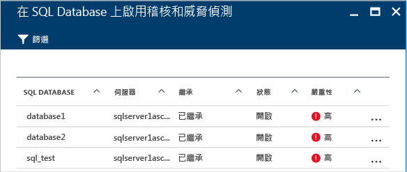

[在 SQL 資料庫上啟用稽核和威脅偵測] 刀鋒視窗具有下列資訊：

* SQL 資料庫的清單
* 其所在的伺服器
* 此設定是否繼承自伺服器，或此設定在此資料庫中是否為唯一的相關資訊
* 目前的狀態
* 問題的嚴重性

當您在資料庫上按一下以解決這項建議時，便會開啟 [稽核與威脅的偵測] 刀鋒視窗，如下列畫面所示。

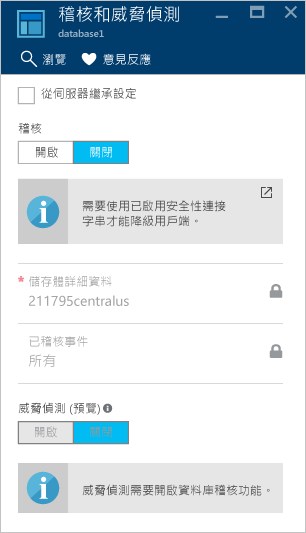

若要啟用稽核，請選取 [稽核] 選項底下的 [開啟]。

### 監視應用程式

如果您的 Azure 工作負載有應用程式位於具有公開 Web 連接埠 (TCP 連接埠 80 和 443) 的[虛擬機器 (透過 Azure Resource Manager 所建立)](../azure-resource-manager/resource-manager-deployment-model.md) 中，資訊安全中心即可監視這些應用程式以找出潛在的安全性問題，並建議補救步驟。 當您按一下 [應用程式] 圖格時，便會開啟 [應用程式] 刀鋒視窗，其 [應用程式建議] 區段中會有一系列的建議。 同時也會顯示每一主機/虛擬 IP 的應用程式明細，如下列螢幕擷取畫面所示。

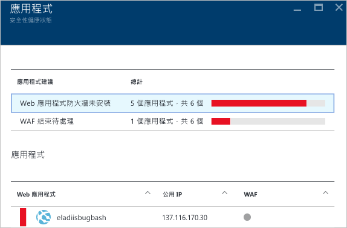

就像您對其他建議的做法一樣，您也可以按一下建議來查看有關問題的更多詳細資訊及其補救方式。 下圖所示範例是識別為不安全的 Web 應用程式之應用程式。 當您選取被視為不安全的應用程式時，會開啟另一個包含以下可用選項的刀鋒視窗：

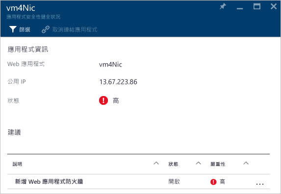

此刀鋒視窗會有此應用程式的所有建議清單。 當您按一下 [新增 Web 應用程式防火牆] 建議時，將會開啟 [新增 Web 應用程式防火牆] 刀鋒視窗，其中包含讓您安裝合作夥伴 Web 應用程式防火牆 (WAF) 的選項，如下列螢幕擷取畫面所示。

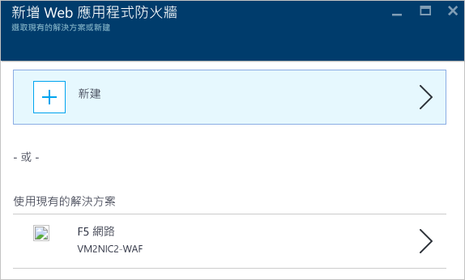

## 另請參閱
在本文中，您已來了解如何使用「Azure 資訊安全中心」的監視功能。 若要深入了解「Azure 資訊安全中心」，請參閱下列主題：

* [在 Azure 資訊安全中心設定安全性原則](security-center-policies.md)：了解如何在 Azure 資訊安全中心設定安全性設定。
* [管理與回應 Azure 資訊安全中心的安全性警示](security-center-managing-and-responding-alerts.md)：了解如何管理與回應安全性警示。
* [使用 Azure 資訊安全中心監視合作夥伴解決方案](security-center-partner-solutions.md)：了解如何監視合作夥伴解決方案的健全狀況。
* [Azure 資訊安全中心常見問題集](security-center-faq.md)：尋找有關使用服務的常見問題。
* [Azure 安全性部落格](http://blogs.msdn.com/b/azuresecurity/)：尋找有關 Azure 安全性與相容性的部落格文章。

<!--HONumber=Jan17_HO1-->

