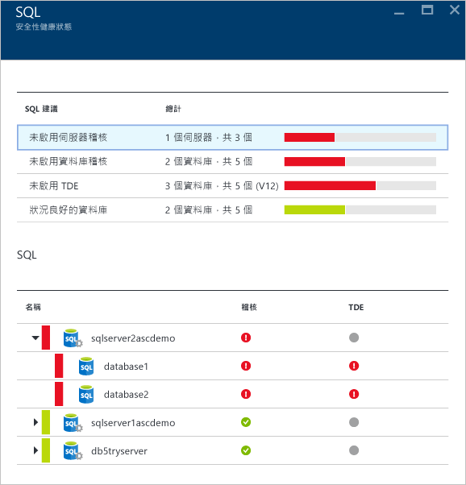
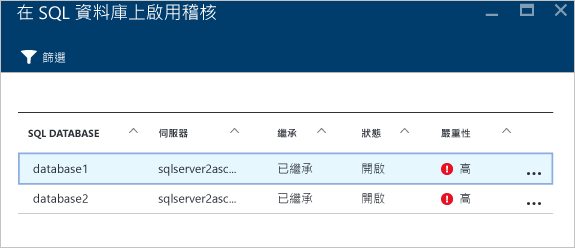

# Azure 資訊安全中心的安全性健康情況監視
本文件可協助您使用 Azure 資訊安全中心內的監視功能，監視是否符合原則。

## 什麼是安全性健康情況監視？
我們通常都將監視想像成監看及等候事件發生，以便對該情況作出反應。安全性監視是指擁有一個主動式策略來稽核您的資源，以識別出不符合組織標準或最佳做法的系統。

## 監視安全性健全狀況
在您為訂用帳戶的資源啟用[安全性原則](security-center-policies.md)之後，資訊安全中心會分析您資源的安全性狀態，以找出潛在的弱點。網路組態的相關資訊立即可用，但虛擬機器組態的相關資訊 (例如安全性更新狀態與作業系統組態) 則可能需要花費一個小時或更久才能提供。您可以在 [資源安全性健全狀況] 刀鋒視窗中，檢視資源的安全性狀態及任何問題。您也可以在 [建議] 刀鋒視窗上檢視這些問題的清單。

如需如何套用建議的詳細資訊，請參閱[實作 Azure 資訊安全中心的安全性建議](security-center-recommendations.md)。

您可在 [資源健全狀況] 圖格上監視資源的安全性狀態。在以下範例中，您會看到一些需要注意的高度或中度嚴重性問題。已啟用的安全性原則將會影響受監督的控制項類型。

如果資訊安全中心找出必須處理的弱點 (例如遺漏安全性更新的 VM 或沒有[網路安全性群組](../virtual-network/virtual-networks-nsg.md)的子網路)，將會在這裡列出。

### 監視虛擬機器
按一下 [資源健全狀況] 圖格中的 [虛擬機器] 時，將會開啟 [虛擬機器] 刀鋒視窗，內含有關訓練與預防步驟的更多詳細資訊，以及受資訊安全中心監視的所有 VM 清單，如下所示。

* 登入步驟
* 虛擬機器建議
* 虛擬機器

在每個區段中，您可以選取一個個別的選項，以查看有關解決該問題之建議步驟的更多詳細資訊。下列各節將詳細討論這方面的資訊。

#### 監視建議
本節顯示已初始化進行資料收集的 VM 總數和其目前狀態。一旦所有 VM 都初始化資料收集，它們就可以接收資訊安全中心的安全性原則。當您按一下此項目時， [資料收集安裝狀態] 刀鋒視窗會開啟，您會在 [安裝狀態] 資料行中看到 VM 名稱和資料收集的目前狀態，如下所示。

#### 虛擬機器建議
本節提供一組 Azure 資訊安全中心所監視之[每個 VM 的建議](security-center-virtual-machine-recommendations.md)。第一個資料行列出建議，第二個資料行列出受到該建議影響的 VM 總數，第三個資料行顯示問題的嚴重性，如下所示。

> [!NOTE]
> 只有至少擁有一個公用端點的 VM 會顯示在 [網路拓撲] 清單的 [網路健全狀況] 刀鋒視窗中。
> 
> 

每個建議會有一組可在您按一下它之後執行的動作。比方說，如果您按一下 [遺失的系統更新]，[遺失的系統更新] 刀鋒視窗會隨即開啟。它會列出遺失修補程式的 VM 和遺失更新的嚴重性，如下所示。

[遺失的系統更新] 刀鋒視窗會顯示含有下列資訊的資料表：

* **虛擬機器**：遺失更新之虛擬機器的名稱。
* **系統更新**：遺漏的系統更新數量。
* **上次掃描時間**：資訊安全中心上次掃描 VM 更新的時間。
* **狀態**：建議的目前狀態：
  * **未處理**：建議尚未處理
  * **進行中**：正在將建議套用到這些資源，您不需要採取任何動作
  * **已解決**：建議已經完成 (問題已解決時，該項目會呈現灰色)。
* **嚴重性**：描述該特定建議的嚴重性：
  * **高**：某個有意義的資源 (應用程式、VM、網路安全性群組) 有弱點存在，並且需要注意
  * **中**：完成某個程序或消除弱點時所需的非關鍵性步驟或其他步驟
  * **低**：應該處理但不需要立即注意的弱點。(預設不會顯示嚴重性低的建議，但是如果您要檢視它們，則可以篩選嚴重性低的建議)。

若要檢視建議的詳細資料，請按一下 VM 的名稱。將會開啟該 VM 的新刀鋒視窗，內含更新清單，如下所示。

> [!NOTE]
> 這裡的安全性建議與 [建議] 刀鋒視窗中的建議相同。如需解決建議的詳細資訊，請參閱[實作 Azure 資訊安全中心的安全性建議](security-center-recommendations.md)一文。這不只適用於 VM，也適用於 [資源健康情況] 磚中所有可用的資源。
> 
> 

#### 虛擬機器區段
虛擬機器區段提供所有 VM 和建議的概觀。每個資料行代表一組建議，如下所示：

每個建議底下出現的圖示，可協助您快速識別哪一個 VM 需要關注以及何種類型的建議。

在上述範例中，有一個 VM 具有與端點保護有關的重要建議。若要取得 VM 的相關詳細資訊，請按一下它。代表此 VM 的新刀鋒視窗會隨即開啟，如下所示。

此刀鋒視窗中提供 VM 的安全性詳細資料。您可以在此刀鋒視窗底部看到建議的動作和每個問題的嚴重性。

#### 雲端服務 (預覽) 區段
雲端服務的健全狀態會包含在虛擬機器的安全性健全狀態圖格中。OS 版本過期時會建立一項建議，如下所示︰

您必須依照建議中的步驟來更新 OS 版本。例如，如果您按一下其中一個 Web 角色 (使用自動部署至 IIS 的 Web 應用程式執行 Windows Server) 或背景工作角色 (使用自動部署至 IIS 的 Web 應用程式執行 Windows Server) 的紅色警示，將會開啟新的刀鋒視窗並顯示這項建議的相關詳細資料，如下所示︰

若要查看有關這項建議的更多規範說明，請按一下 [描述] 資料行之下的 [更新OS 版本]。[更新 OS 版本 (預覽)] 刀鋒視窗會開啟並顯示更多詳細資料。

### 監視虛擬網路
按一下 [資源健全狀況] 圖格中的 [網路] 時，將會開啟含有更多詳細資訊的 [網路] 刀鋒視窗，如下所示：

#### 網路功能的建議
類似於虛擬機器資源健康情況資訊，這個刀鋒視窗也在刀鋒視窗上半部提供問題的摘要清單，在下半部提供受監督的網路清單。

網路狀態明細區段會列出潛在的安全性問題，並提供[建議](security-center-network-recommendations.md)。可能的問題包括：

* 未安裝新一代防火牆 (NGFW)
* 未啟用子網路上的網路安全性群組 (NSG)
* 未啟用 VM 上的 NSG
* 限制透過公用外部端點的外部存取
* 狀況良好的網際網路面向端點

當您按一下這些建議的其中之一時，會開啟新的刀鋒視窗，其中包含與建議相關的更多詳細資料，如下列範例所示。

在此範例中，[設定子網路的遺失網路安全性群組] 刀鋒視窗有缺少 NSG 保護的子網路和虛擬機器清單。如果您按一下想要套用 NSG 的子網路，則會開啟另一個刀鋒視窗。

在 [選擇網路安全性群組] 刀鋒視窗中，您可為子網路選取最適當的網路安全性群組，也可以建立新的網路安全性群組。

#### 網際網路面向端點區段
在 [網際網路面向端點] 區段中，您將能夠看到目前使用網際網路面向端點所設定的 VM 和其目前的狀態。

此資料表有代表 VM 的端點名稱、網際網路面向的 IP 位址、NSG 和 NGFW 目前的嚴重性狀態。此資料表是依嚴重性排序，如下所述︰

* 紅色 (在頂端)：高優先順序，應立即處理
* 橘色︰中等優先順序，應儘速處理
* 綠色 (最後一個)︰健康狀態

#### 網路拓撲區段
在 [網路拓撲] 區段中，資源的階層式檢視如下所示：

此資料表是依重要性排序 (VM 和子網路)，如下所述︰

* 紅色 (在頂端)：高優先順序，應立即處理
* 橘色︰中等優先順序，應儘速處理
* 綠色 (最後一個)︰健康狀態

在此拓撲檢視中，第一層有[虛擬網路](../virtual-network/virtual-networks-overview.md)、[虛擬網路閘道](../vpn-gateway/vpn-gateway-site-to-site-create.md)和[虛擬網路 (傳統)](../virtual-network/virtual-networks-create-vnet-classic-pportal.md)。第二層有子網路，第三層有屬於這些子網路的 VM。右側資料行有這些資源的網路安全性群組 (NSG) 的目前狀態，如以下範例所示：

此刀鋒視窗的下半部有此 VM 的建議 (類似上面所述)。您可以按一下建議以深入了解或套用所需的安全性控制/組態。

### 監視資料
當您按一下 [資源安全性健全狀況] 圖格中的 [資料] 時，將會開啟 [SQL] 刀鋒視窗，內含問題的建議，例如未啟用稽核、透明資料加密。它也具有資料庫的一般健全狀況狀態[建議](security-center-sql-service-recommendations.md)。

您可以按一下這些建議中的任何一項來取得更多解決問題之進一步動作的相關詳細資訊。下列範例顯示**未啟用資料庫稽核**建議的擴充功能。

[在 SQL 資料庫上啟用稽核] 刀鋒視窗具有下列資訊：

* SQL 資料庫的清單
* 其所在的伺服器
* 此設定是否繼承自伺服器，或此設定在此資料庫中是否為唯一的相關資訊
* 目前的狀態
* 問題的嚴重性

當您在資料庫上按一下以解決這項建議時，將會開啟 [稽核與威脅的偵測] 刀鋒視窗，如下所示。

若要啟用稽核，只需選取 [稽核] 選項底下的 [開啟]。

### 監視應用程式
如果您的 Azure 工作負載有應用程式位於具有公開 Web 連接埠 (TCP 連接埠 80 和 443) 的[資源管理員 VM](../resource-manager-deployment-model.md) 中，資訊安全中心即可監視這些應用程式以找出潛在的安全性問題，並建議補救步驟。當您按一下 [應用程式] 圖格時，將會開啟 [應用程式] 刀鋒視窗，其 [預防步驟] 區段中會有一系列的建議。同時也會顯示每一主機/虛擬 IP 的應用程式明細，如下所示。

就像您對其他建議的做法一樣，您也可以按一下它來查看有關問題的更多詳細資訊及其補救方式。下圖所示範例是識別為不安全的 Web 應用程式之應用程式。當您選取被視為不安全的應用程式時，會開啟另一個包含以下可用選項的刀鋒視窗：

此刀鋒視窗會有此應用程式的所有建議清單。當您按一下 [新增 Web 應用程式防火牆] 建議時，將會開啟 [新增 Web 應用程式防火牆] 刀鋒視窗，其中包含讓您安裝第三方 WAF (Web 應用程式防火牆) 的選項，如下所示。

## 另請參閱
在本文件中，您已來了解如何使用「Azure 資訊安全中心」的監視功能。若要深入了解「Azure 資訊安全中心」，請參閱下列主題：

* [在 Azure 資訊安全中心設定安全性原則](security-center-policies.md) — 了解如何在 Azure 資訊安全中心設定安全性設定
* [管理與回應 Azure 資訊安全中心的安全性警示](security-center-managing-and-responding-alerts.md) — 了解如何管理與回應安全性警示。
* [使用 Azure 資訊安全中心監視合作夥伴解決方案](security-center-partner-solutions.md) — 了解如何監視合作夥伴解決方案的健全狀況。
* [Azure 資訊安全中心常見問題集](security-center-faq.md) — 尋找有關使用服務的常見問題。
* [Azure 安全性部落格](http://blogs.msdn.com/b/azuresecurity/) — 尋找有關 Azure 安全性與相容性的部落格文章。

<!---HONumber=AcomDC_0928_2016-->