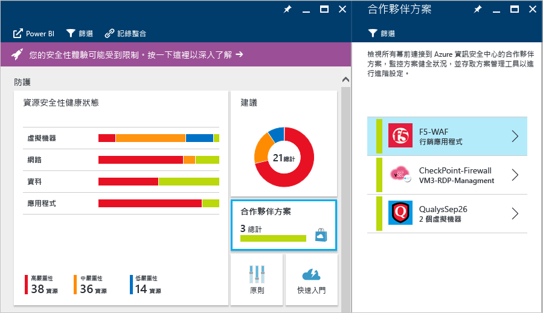

# Azure 資訊安全中心中的合作夥伴整合
此文件說明 Azure 資訊安全中心如何與合作夥伴整合，以提高整體安全性並在 Azure 中提供整合體驗，同時充分利用 Azure Marketplace 進行合作夥伴認證和計費。

## 為什麼要從資訊安全中心部署合作夥伴的解決方案？

運用資訊安全中心中的合作夥伴整合有四個主要原因：

- **部署方式簡單**：依照資訊安全中心的建議來部署合作夥伴解決方案更加容易。 使用預設組態和網路拓撲，部署程序可以完全自動化，或者客戶可以選擇半自動化選項，以允許更大的組態彈性與自訂。
- **整合偵測**：來自合作夥伴解決方案的安全性事件會自動收集、彙總以及顯示為資訊安全中心警示和事件的一部分。 這些事件也會與來自其他來源的偵測整合，以提供進階的威脅偵測功能。
- **統一的健全狀況監視與管理**：整合式的健全狀況事件，可讓客戶一眼就能監視所有合作夥伴解決方案。 提供基本管理功能，而且可以讓您輕鬆使用合作夥伴解決方案存取進階組態。
- **匯出至 SIEM**：客戶現在可以使用 Microsoft Azure Log Integration (預覽) 將所有資訊安全中心與合作夥伴的警示，以 CEF 格式匯出至內部部署 SIEM 系統

## 哪些合作夥伴會與資訊安全中心整合？
資訊安全中心目前與下列合作夥伴整合︰

- Endpoint Protection (Trend Micro)、 
- Web 應用程式防火牆 (Barracuda、F5、Imperva，未來則還有 Microsoft WAF 和 Fortinet)， 
- 新一代防火牆 (Check Point、Barracuda，未來則還有 Fortinet 和 Cisco) 解決方案。 
- 弱點評估 (Qualys - 預覽) 解決方案。 

資訊安全中心會隨時間擴展這些現有類別內合作夥伴的數目，並加入新的類別。 

## 如何部署合作夥伴解決方案？

已部署在資訊安全中心中的合作夥伴解決方案可以輕鬆地從主要資訊安全中心儀表板中的 [合作夥伴解決方案] 圖格存取：

若要根據資訊安全中心建議部署新的合作夥伴解決方案，請執行下列步驟：

> [!NOTE]
> 下列範例中的步驟假設您有一個希望透過 Web 應用程式防火牆保護的工作負載。

1. 在資訊安全中心儀表板上，按一下 [建議] 圖格。
2. 在 [建議] 刀鋒視窗上，按一下 [加入 Web 應用程式防火牆]。
3. 按一下 [加入 Web 應用程式防火牆] 刀鋒視窗下的應用程式名稱。
4. 在 [加入 Web 應用程式防火牆] 刀鋒視窗上，按一下 [新建]。
5. [建立新的 Web 應用程式防火牆] 刀鋒視窗會顯示目前提供 Web 應用程式防火牆功能之合作夥伴的清單。
6. 選取適當的合作夥伴解決方案，並依照步驟 (這會根據合作夥伴而有所不同) 執行。

目前的整體部署體驗，可能會根據合作夥伴而有所不同。 如需管理資訊安全中心中合作夥伴解決方案的相關資訊，請閱讀[透過 Azure 資訊安全中心監視合作夥伴解決方案](security-center-partner-solutions.md)。

## 另請參閱
在此文件中，您已了解如何在 Azure 資訊安全中心中整合合作夥伴解決方案。 若要深入了解資訊安全中心，請參閱下列主題：

* [Azure 資訊安全中心規劃和操作指南](security-center-planning-and-operations-guide.md)
* [管理及回應 Azure 資訊安全中心的安全性警示](security-center-managing-and-responding-alerts.md)
* [Azure 資訊安全中心不同類型的安全性警示](security-center-alerts-type.md)
* [Azure 資訊安全中心的安全性健全狀況監視](security-center-monitoring.md) — 了解如何監視 Azure 資源的健全狀況。
* [使用 Azure 資訊安全中心監視合作夥伴解決方案](security-center-partner-solutions.md) — 了解如何監視合作夥伴解決方案的健全狀況。
* [Azure 資訊安全中心常見問題集](security-center-faq.md) — 尋找有關使用服務的常見問題。
* [Azure 安全性部落格](http://blogs.msdn.com/b/azuresecurity/) — 尋找有關 Azure 安全性與相容性的部落格文章。

<!--HONumber=Nov16_HO5-->

