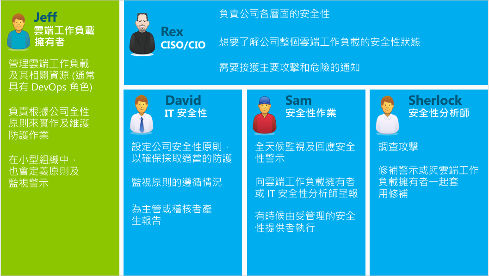
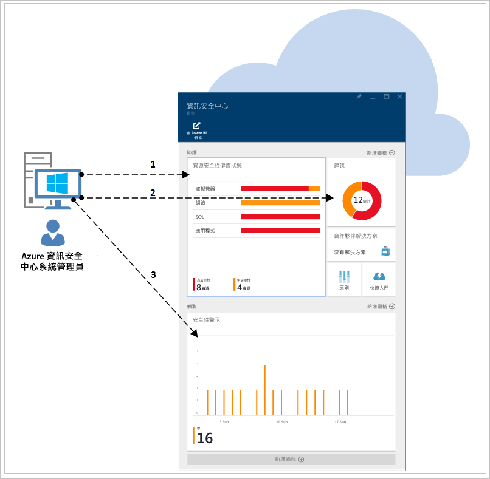

<properties
   pageTitle="資訊安全中心規劃和操作指南 | Microsoft Azure"
   description="本文件可協助您在採用 Azure 資訊安全中心和日常作業相關考量之前進行規劃。"
   services="security-center"
   documentationCenter="na"
   authors="YuriDio"
   manager="swadhwa"
   editor=""/>

<tags
   ms.service="security-center"
   ms.topic="hero-article" 
   ms.devlang="na"
   ms.tgt_pltfrm="na"
   ms.workload="na"
   ms.date="04/25/2016"
   ms.author="yurid"/>
 
# Azure 資訊安全中心規劃和操作指南
本指南適用於組織打算採用 Azure 資訊安全中心的資訊技術 (IT) 專業人員、IT 架構設計人員、資訊安全性分析師和雲端系統管理員。

> [AZURE.NOTE] 本文件中的資訊適用於「Azure 資訊安全中心」的預覽版本。

## Azure 資訊安全中心概觀
Azure 資訊安全中心利用加強對 Azure 資源的能見度及安全性控制權，以預防、偵測並回應威脅。它提供您訂用帳戶之間的整合式安全性監視和原則管理，協助您偵測可能會忽略的威脅，且適用於廣泛的安全性解決方案生態系統。

如需在設計和規劃階段也很好用的常見問題清單，請閱讀 [Azure 資訊安全中心常見問題集 (FAQ)](security-center-faq.md)。

## 規劃指南
本指南涵蓋您可以遵循的一組步驟和工作，以根據您組織的安全性需求和雲端管理模型，將您的 Azure 資訊安全中心使用最佳化。若要充分利用 Azure 資訊安全中心，務必了解您組織中的不同人員或小組如何使用此服務，來滿足安全開發和作業、監視、控管和事件回應需要。規劃使用 Azure 資訊安全中心時所應考量的主要領域如下︰

- 安全性角色和存取控制
- 安全性原則和建議
- 資料收集和儲存
- 持續安全性監視 
- 事件回應

在下一節中，您將學習如何根據您的需求來規劃每個領域及套用這些建議。

## 安全性角色和存取控制 

根據您組織的大小和結構，多個個人和小組可以使用資訊安全中心來執行不同的安全性相關工作。下面是虛構人物與其各自角色和安全性責任的範例︰

Azure 資訊安全中心可讓這些人符合不同的責任。例如：

**Jeff (雲端工作負載擁有者)**

- 在 Azure 入口網站中檢視和完成資訊安全中心建議 
- 也可能使用票證系統來追蹤變更 (使用 API 來填入建議)

**Rex (CISO/CIO)**

- 從 Power BI 或 Excel 檢視資訊安全中心報告

**David (IT 安全性)**

- 在 Azure 入口網站中設定安全性原則和檢視安全性健康情況
- 在 Power BI 中分析資料和產生報告 

**Sam (安全性作業)**

- 在 Azure 入口網站中檢視和分級資訊安全中心警示 
- 可以使用現有的儀表板 (使用 API 來填入警示)

**Sherlock (安全性分析師)**

- 在 Azure 入口網站中檢視資訊安全中心警示 
- 可以使用現有的儀表板 (使用 API 來填入警示)
- 在 Power BI 中分析警示趨勢 
- 檢閱儲存體中的事件記錄檔

Azure 資訊安全中心會使用[角色型存取控制 (RBAC)](../active-directory/role-based-access-control-configure.md)，以提供可在 Azure 中指派給使用者、群組與服務的[內建角色](../active-directory/role-based-access-built-in-roles.md)。當使用者開啟 Azure 資訊安全中心時，他們只會看到其有權存取的資源相關資訊，這表示使用者具備訂用帳戶或資源所屬資源群組的「擁有者」、「參與者」或「讀取者」角色。使用上述人物，需要下列 RBAC：

**Jeff (雲端工作負載擁有者)**

- 資源群組擁有者/共同作業者

**David (IT 安全性)**

- 訂用帳戶擁有者/共同作業者

**Sam (安全性作業)**

- 可檢視警示的訂用帳戶讀者
- 解除警示所需的訂用帳戶擁有者/共同作業者

**Sherlock (安全性分析師)**

- 可檢視警示的訂用帳戶讀者
- 補救或解除警示所需的訂用帳戶擁有者/共同作業者
- 可能需要存取儲存體

需要考量的其他重要資訊︰

- 只有訂用帳戶擁有者和參與者可以編輯安全性原則
- 只有訂用帳戶和資源群組擁有者和參與者可以套用資源的安全性建議

使用 RBAC 規劃 Azure 資訊安全中心的存取控制時，請務必了解您的組織中有誰會使用 Azure 資訊安全中心，以及他們將執行哪些類型的工作。然後據以設定 RBAC。

> [AZURE.NOTE] 我們建議您指派所需的最寬鬆角色，以便使用者完成其工作。例如，只需要檢視資源安全性狀態的相關資訊，但不採取行動 (例如套用建議或編輯原則) 的使用者應被指派「讀者」角色。

## 安全性原則和建議
安全性原則定義了針對指定之訂用帳戶或資源群組內的資源建議的一組控制項。在 Azure 資訊安全中心，您可以根據公司的安全性需求，以及應用程式的類型或資料的敏感性來定義原則。

在訂用帳戶層級啟用的原則將會自動傳播至訂用帳戶中的所有資源群組，如下圖所示︰

如上圖所示，資源群組的安全性原則可以繼承自訂用帳戶層級。

在某些情況下，資源群組中的資源可能需要一組不同的原則，您可以停用繼承並將自訂原則套用到特定的資源群組。

如果您需要特定資源群組中的自訂原則，您應該在此資源群組中停用繼承並變更安全性原則。比方說，如果您的某些工作負載不需要 SQL 透明資料加密原則，請關閉訂用帳戶層級的原則，只在需要 SQL TDE 的資源群組中加以啟用。
 
當您開始建立不同資源群組的自訂原則時，您應該規劃您的原則部署，但在發生原則衝突 (訂用帳戶與資源群組) 時，以資源群組原則為準。

> [AZURE.NOTE] 如果您需要檢閱哪些原則已變更，您可以使用 [Azure 稽核記錄檔](https://blogs.msdn.microsoft.com/cloud_solution_architect/2015/03/10/audit-logs-for-azure-events/)。原則變更一定都會記錄在 Azure 稽核記錄檔中。

### 安全性建議

在設定安全性原則之前，您應該檢閱每個[安全性建議](security-center-recommendations.md)，並判斷這些建議是否適合您各種的訂用帳戶和資源群組。此外，務必了解為了處理安全性建議所要採取的動作。

**端點保護**︰如果虛擬機器並未啟用端點保護解決方案，Azure 資訊安全中心會建議您安裝一個。如果您已經有在內部部署採用的慣用端點保護解決方案，您必須決定是否對您的 Azure VM 使用相同的反惡意程式碼。Azure 資訊安全中心為您提供數個端點保護選項。您可以使用免費的 Microsoft Antimalware，或從整合式合作夥伴提供的端點保護解決方案中選擇。如需有關如何使用 Azure 資訊安全中心部署反惡意程式碼的詳細資訊，請閱讀[在 Azure 資訊安全中心啟用反惡意程式碼](security-center-enable-antimalware.md)。

**系統更新**：Azure 資訊安全中心會識別遺漏安全性或重大作業系統更新的虛擬機器。請考慮誰會在必要時負責套用更新，以及套用的方式。許多組織會使用 WSUS、Windows Update 或其他工具。

**基準組態**︰如果虛擬機器的作業系統組態不符合建議的基準，將會呈現一項建議。您應該檢閱[這裡](https://gallery.technet.microsoft.com/Azure-Security-Center-a789e335)的基準集，並考慮如何套用作業系統組態。

**磁碟加密**︰如果您有未加密的虛擬機器磁碟，Azure 資訊安全中心會建議您套用 Azure 磁碟加密，其利用 BitLocker for Windows 與 DM-Crypt for Linux 來提供作業系統和資料磁碟的磁碟區加密。這項建議會將您重新導向至[逐步指南](security-center-disk-encryption.md)，其中包含如何執行此加密的指示。

請注意，有幾個您需要處理的加密案例。您必須為每個案例規劃獨特的需求︰

- 您已使用自己的加密金鑰來加密之 VHD 中新 Azure 虛擬機器的加密
- 從 Azure 資源庫建立之新 Azure 虛擬機器的加密
- 已在 Azure 中執行之 Azure 虛擬機器的加密

每個案例的規劃需求都不同。如需每個案例的詳細資訊，請參閱 [Azure 磁碟加密白皮書](https://gallery.technet.microsoft.com/Azure-Disk-Encryption-for-a0018eb0)。

**Web 應用程式防火牆**：Azure 資訊安全中心會識別執行 Web 應用程式的虛擬機器，並建議您安裝 Web 應用程式防火牆 (WAF)。評估可用的合作夥伴解決方案，以判斷哪一個最適合用於您的組織，並判斷解決方案的授權方式 (合作夥伴可能支援「自備授權」和/或「隨用隨付」模型)。如需有關如何使用 Azure 資訊安全中心在 Azure VM 中部署 Web 應用程式防火牆的詳細資訊，請參閱[在 Azure 資訊安全中心新增 Web 應用程式防火牆](security-center-add-web-application-firewall.md)。

**虛擬網路**：Azure 資訊安全中心會評估您的 [Azure 虛擬網路](https://azure.microsoft.com/documentation/services/virtual-network/)基礎結構和組態，以檢查[網路安全性群組](../virtual-network/virtual-networks-nsg.md)是否已套用輸入流量規則並正確進行設定。您應該考慮應定義哪些流量規則，並將此訊息傳達給要套用相關安全性建議的人員。

## 資料收集和儲存

強烈建議您為每個訂用帳戶開啟資料收集功能，因為這將確保安全性監視可用於所有的 VM。資料收集是透過 Azure 監視代理程式 (ASMAgentLauncher.exe) 和 Azure 安全性監視擴充功能 (ASMMonitoringAgent.exe) 來啟用。

Azure 安全性監視擴充功能會掃描各種安全性相關組態，並從虛擬機器收集安全性記錄檔。這項資料會傳送到您指定的儲存體帳戶。掃描管理員 (ASMSoftwareScanner.exe) 也會安裝在虛擬機器，並做為修補程式掃描器。

在安全性原則中啟用資料收集之後，監視代理程式和延伸模組會自動安裝在 Azure 中佈建的所有現有和任何新支援的虛擬機器上。代理程式的程序非侵入式，並不會影響 VM 的效能。
 
如果您想在某個時間點停用資料收集，您可以在安全性原則中將它關閉。若要刪除先前部署的監視代理程式，請選取 [刪除代理程式] 功能表選項。

> [AZURE.NOTE] 若要尋找支援的 VM 清單，請閱讀 [Azure 資訊安全中心常見問題集 (FAQ)](security-center-faq.md)。

針對每個有虛擬機器在其中執行的區域，您需選擇儲存體帳戶，以儲存從這些虛擬機器收集到的資料。如不為每個區域選擇儲存體帳戶，系統會為您建立。您可以選擇每個區域的儲存位置，或將所有資訊集中儲存在一個位置。雖然安全性原則可以在 Azure 訂用帳戶層級和資源群組層級進行設定，但您的儲存體帳戶區域只可在訂用帳戶層級選取。

如果您使用在不同 Azure 資源之間共用的儲存體帳戶，請確認您已閱讀 [Azure 儲存體延展性和效能目標](../storage/storage-scalability-targets.md)一文，以取得大小限制和條件約束的詳細資訊。您的訂用帳戶也有儲存體帳戶限制，請檢閱 [Azure 訂用帳戶和服務限制、配額和條件約束](../azure-subscription-service-limits)來深入了解這些限制。

> [AZURE.NOTE] 與此儲存體相關的費用不包含在 Azure 資訊安全中心服務價格中，而將以一般 [Azure 儲存體費率](https://azure.microsoft.com/pricing/details/storage/)分別計費。

您也應該根據 Azure 環境大小和取用您的儲存體帳戶的資源，規劃效能和延展性考量。如需詳細資訊，請參閱 [Microsoft Azure 儲存體效能與延展性檢查清單](../storage/storage-performance-checklist.md)。

## 持續安全性監視

初始設定和套用 Azure 資訊安全中心建議之後，下一步是考量 Azure 資訊安全中心操作程序。

若要從 Azure 入口網站存取 Azure 資訊安全中心，您可以按一下 [瀏覽] 並在 [篩選] 欄位中輸入 [資訊安全中心]。使用者會根據所套用的篩選條件取得檢視。

Azure 資訊安全中心不會干擾一般作業程序，它會被動地監視您的部署，並根據您啟用的安全性原則提供建議。

Azure 資訊安全中心儀表板分成兩個主要部分︰

- 預防 
- 偵測 

當您第一次在目前 Azure 環境的 Azure 資訊安全中心啟用資料收集時，請務必檢閱所有的建議，您可以在 [建議] 刀鋒視窗或依照資源進行檢閱 ([虛擬機器]、[網路]、[SQL] 和 [應用程式])。

一旦您處理所有的建議，所有已處理資源的 [預防] 區段應該是綠色。持續監視此時變得更容易，因為您只會根據資源安全性健康情況和建議圖格中的變更採取動作。

[偵測] 區段更有反應，這些是正在發生，或過去發生及 Azure 資訊安全中心控制項和第三方系統所偵測到的問題的相關警示。[安全性警示] 圖格會顯示橫條圖，代表每天找到的威脅偵測警示數目，以及其分布在不同嚴重性分類 (低、中、高) 的情形。如需安全性警示的詳細資訊，請閱讀[管理與回應 Azure 資訊安全中心的安全性警示](security-center-managing-and-responding-alerts.md)。

> [AZURE.NOTE] 您也可以利用 Microsoft Power BI，將您的 Azure 資訊安全中心資料視覺化。請閱讀[使用 Power BI 從 Azure 資訊安全中心的資料取得見解](security-center-powerbi.md)。

### 監視新的或已變更的資源

大多數 Azure 環境是動態的，包含定期上下波動的新資源、組態或變更等。Azure 資訊安全中心有助於確保您看得到這些新資源的安全性狀態。

當您將新資源 (VM、SQL DB) 加入至 Azure 環境時，Azure 資訊安全中心會自動探索這些資源並開始監視其安全性。如果安全性原則中已啟用資料收集，則會自動為您的虛擬機器啟用其他監視功能。

1.	對於虛擬機器，存取 [資源安全性健康情況] 圖格，按一下 [虛擬機器]。[監視建議] 區段會呈現有關啟用資料收集的問題或相關建議。
2.	檢視 [建議] 以查看針對新資源所找出的安全性風險。
3.	，將新的 VM 加入至您的環境時，通常一開始只會安裝作業系統。資源擁有者可能需要一些時間來部署這些 VM 將使用的其他應用程式。在理想情況下，您應該知道此工作負載的最終目的。它會成為應用程式伺服器？ 以這個新工作負載將會成為的項目為基礎，您可以啟用適當的**安全性原則** (這是此工作流程中的第三個步驟)。
4.	當新資源加入至 Azure 環境時，[安全性警示] 圖格中可能會出現新的警示。請隨時確認此圖格中是否有新的警示，並根據 Azure 資訊安全中心的建議採取動作。

您也會想要定期監視現有資源的狀態，以找出已造成安全性風險、偏離建議基準和安全性警示的組態變更。從 Azure 資訊安全中心儀表板開始。在這裡，您可以用一致的方式檢閱三個主要區域。

1.	[資源安全性健康情況] 面板可供您快速存取關鍵資源。使用此選項來監視虛擬機器、網路、SQL 和應用程式。 
2.	[建議] 面板可讓您檢閱 Azure 資訊安全中心建議。在持續監視期間，您可能會發現您沒有每天收到建議，這是正常現象，因為您已處理初始 Azure 資訊安全中心設定的所有建議。基於這個理由，這個區段中可能不會每天都有新資訊，您只需要視需要進行存取。
3.	[偵測] 面板的變更頻率可能非常頻繁或非常不頻繁。請隨時檢閱安全性警示，並根據 Azure 資訊安全中心的建議採取動作。 

## 事件回應

Azure 資訊安全中心會偵測並在發生威脅時警示您。組織應監視新的安全性警示並視需要採取動作，進一步調查或修補攻擊。

> [AZURE.NOTE] 這篇文章並不打算協助您建立自己的事件回應計劃。您可以使用美國國家標準技術局 (NIST) 的 [Computer Security Incident Handling Guide](http://nvlpubs.nist.gov/nistpubs/SpecialPublications/NIST.SP.800-61r2.pdf) 做為參考來協助您建置自己的計劃。

每個安全性警示都提供可用來進一步了解攻擊本質及建議可能補救措施的資訊。有些警示也會提供更多資訊或 Azure 中其他資訊來源的連結。您可以使用所提供的資訊，通知進一步研究並開始緩和。

下列範例說明正在發生的可疑 RDP 活動︰

如您所見，此刀鋒視窗會顯示有關攻擊發生時間、來源主機名稱、目標 VM 的詳細資訊，也會提供建議步驟。在某些情況下，攻擊的來源資訊可能是空的。如需有關這類行為的詳細資訊，請閱讀[Azure 資訊安全中心警示中的遺失來源資訊](https://blogs.msdn.microsoft.com/azuresecurity/2016/03/25/missing-source-information-in-azure-security-center-alerts/)。

| **Level** | **攻擊偵測** | **提議的緩和** |
|------------------|------------------------------------------|-----------------------------------------------------------------------------------------------|
| 網路 | RDP 暴力偵測 | 藉由移除不需要的開放端點來降低受攻擊面、設定 ACL、使用強式密碼 |
| 虛擬機器 | 從錯誤目錄執行的 SVCHOST | 將 VM 移到不同的子網路 (已隔離)，進行掃描並加以重建 |
| 應用程式 | Azure 資料庫上的 SQL 插入 | 強化資料庫組態 |

## 後續步驟
在本文件中，您了解到如何在資訊安全中心設定安全性原則。如要深入了解資訊安全中心，請參閱下列主題：

- [Azure 資訊安全中心的安全性健康狀態監視](security-center-monitoring.md) -- 了解如何監視 Azure 資源的健康狀態。
- [Azure 資訊安全中心常見問題集](security-center-faq.md) -- 尋找有關使用服務的常見問題。
- [Azure 安全性部落格](http://blogs.msdn.com/b/azuresecurity/) -- 尋找有關 Azure 安全性與相容性的部落格文章。

<!---HONumber=AcomDC_0427_2016-->