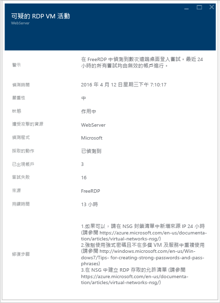

# Azure 資訊安全中心規劃和操作指南
本指南適用於計劃採用 Azure 資訊安全中心的組織中的資訊技術 (IT) 專業人員、IT 架構設計人員、資訊安全性分析師和雲端系統管理員。

>[!NOTE] 
>從 2017 年 6 月初開始，資訊安全中心會使用 Microsoft Monitoring Agent 來收集和儲存資料。 若要深入了解，請參閱 [Azure 資訊安全中心平台移轉](security-center-platform-migration.md)。 本文中的資訊說明轉換至 Microsoft Monitoring Agent 後的資訊安全中心功能。
>

## 規劃指南
本指南涵蓋您可以遵循的一組步驟和工作，以根據您組織的安全性需求和雲端管理模型，將您的資訊安全中心使用最佳化。 若要充分利用資訊安全中心，務必了解您組織中的不同人員或小組如何使用此服務，來滿足安全地開發和作業、監視、控管和事件回應的需求。 規劃使用資訊安全中心時所應考量的主要領域如下︰

* 安全性角色和存取控制
* 安全性原則和建議
* 資料收集和儲存
* 持續安全性監視
* 事件回應

在下一節中，您將學習如何根據需求來規劃每個領域及套用這些建議。

> [!NOTE]
> 如需在設計和規劃階段也很好用的常見問題清單，請閱讀 [Azure 資訊安全中心常見問題集 (FAQ)](security-center-faq.md) 。
> 

## 安全性角色和存取控制
根據您組織的大小和結構，多個個人和小組可以使用資訊安全中心來執行不同的安全性相關工作。 下圖是虛構人物與其各自角色和安全性責任的範例︰

資訊安全中心可讓這些人符合不同的責任。 例如：

**Jeff (雲端工作負載擁有者)**

* 管理雲端工作負載和其相關的資源
* 負責根據公司的安全性原則來實作和維護保護

**Ellen (CISO/CIO)**

* 負責公司安全性的所有層面
* 想要了解各雲端工作負載之間公司的安全性狀態
* 需要知道有關主要攻擊和風險的資訊

**David (IT 安全性)**

* 設定公司安全性原則，以確保適當的保護已就位
* 監控安全性原則的遵循狀態
* 產生報告以供主管或稽核人員使用

**Judy (安全性作業)**

* 隨時監控並回應安全性警示
* 呈報給雲端工作負載擁有者或 IT 安全性分析師

**Sam (安全性分析師)**

* 調查攻擊
* 與雲端工作負載擁有者合作以套用補救方法 

資訊安全中心會使用[角色型存取控制 (RBAC)](../active-directory/role-based-access-control-configure.md)，以提供可在 Azure 中指派給使用者、群組與服務的[內建角色](../active-directory/role-based-access-built-in-roles.md)。 當使用者開啟資訊安全中心時，他們只能看到與自己能夠存取的資源相關的資訊。 這表示會為使用者指派資源所屬訂用帳戶或資源群組的「擁有者」、「參與者」或「讀者」角色。 除了這些角色，有兩個特定的資訊安全中心角色：

- **安全性讀取者**：屬於此角色的使用者能夠檢視資訊安全中心的權限 (包括建議、警示、原則和健康情況)，但它無法進行變更。
- **安全性管理員**：與安全性讀取者相同，但它也可以更新安全性原則，解除建議和警示。

上述的資訊安全中心角色無法存取 Azure 的其他服務區域，例如儲存體、Web 和行動或物聯網。  

> [!NOTE]
> 使用者必須至少是訂用帳戶、資源群組的擁有者或參與者，才能在 Azure 中看到資訊安全中心。 
> 
> 

使用在上圖中所述的人物，會需要下列 RBAC：

**Jeff (雲端工作負載擁有者)**

* 資源群組擁有者/共同作業者

**David (IT 安全性)**

* 訂用帳戶擁有者/共同作業者或安全性管理員

**Judy (安全性作業)**

* 可檢視警示的訂用帳戶讀取者或安全性讀取者
* 可解除警示的訂用帳戶擁有者/共同作業者的安全性管理員

**Sam (安全性分析師)**

* 可檢視警示的訂用帳戶讀取者
* 可解除警示的訂用帳戶擁有者/共同作業者
* 可能需要存取工作區

需要考量的其他重要資訊︰

* 只有訂用帳戶擁有者/參與者和安全性管理員可以編輯安全性原則
* 只有訂用帳戶和資源群組擁有者和參與者可以套用資源的安全性建議

使用 RBAC 規劃資訊安全中心的存取控制時，請務必了解您的組織中有誰會使用資訊安全中心， 以及他們會執行的工作，然後據此設定 RBAC。

> [!NOTE]
> 我們建議您指派所需的最寬鬆角色，以便使用者完成其工作。 例如，只需要檢視資源安全性狀態的相關資訊，但不採取行動 (例如套用建議或編輯原則) 的使用者應被指派「讀者」角色。
> 
> 

## 安全性原則和建議
安全性原則可定義針對指定之訂用帳戶內的資源，所建議的一組控制項。 在資訊安全中心，您可以根據公司的安全性需求，以及應用程式的類型或資料的敏感性來定義原則。

在訂用帳戶層級啟用的原則將會自動傳播至訂用帳戶中的所有資源群組，如下圖所示︰

> [!NOTE]
> 如果您需要檢閱已變更的原則，可以使用 [Azure 稽核記錄檔](https://blogs.msdn.microsoft.com/cloud_solution_architect/2015/03/10/audit-logs-for-azure-events/)。 原則變更一定都會記錄在 Azure 稽核記錄檔中。
> 
> 

### 安全性建議
在設定安全性原則之前，請檢閱每個 [安全性建議](security-center-recommendations.md)，並判斷這些原則是否適合您的各種訂用帳戶和資源群組。 此外，也務必了解該採取什麼動作才能處理[安全性建議](https://docs.microsoft.com/en-us/azure/security-center/security-center-recommendations)，以及您組織將負責監視新建議及採取必要步驟的人員。

資訊安全中心會建議您針對您的 Azure 訂用帳戶提供安全性連絡人詳細資料。 如果 Microsoft 安全性回應中心 (MSRC) 發現您的客戶資料遭到非法或未經授權的對象存取，Microsoft 會使用此資訊連絡您。 如需如何啟用這項建議的詳細資訊，請閱讀 [在 Azure 資訊安全中心提供安全性連絡人詳細資料](security-center-provide-security-contact-details.md) 。

## 資料收集和儲存
Azure 資訊安全中心會使用 Microsoft Monitoring Agent (這是 Operations Management Suite 和 Log Analytics 服務所用的相同代理程式) 從虛擬機器收集安全性資料。 從這個代理程式收集的資料會儲存在 Log Analytics 工作區中。

### 代理程式

在安全性原則中啟用資料收集之後，Microsoft Monitoring Agent (適用於 [Windows](https://docs.microsoft.com/azure/log-analytics/log-analytics-windows-agents) 或 [Linux](https://docs.microsoft.com/azure/log-analytics/log-analytics-linux-agents)) 已安裝於所有支援的 Azure VM 和任何新建的 VM 上。  如果 VM 已經安裝 Microsoft Monitoring Agent，則 Azure 資訊安全中心將會利用目前安裝的代理程式。 代理程式的程序會設計為非侵入式，對 VM 效能的影響很少。

適用於 Windows 的 Microsoft Monitoring Agent 需要使用 TCP 通訊埠 443。 如需詳細資訊，請參閱[疑難排解文章](security-center-troubleshooting-guide.md)。

如果您想在某個時間點停用資料收集，您可以在安全性原則中將它關閉。 不過，因為其他 Azure 管理和監視服務可能會使用 Microsoft Monitoring Agent，所以當您在資訊安全中心關閉資料收集時，並不會自動解除安裝代理程式。 您可以視需要手動解除安裝代理程式。

> [!NOTE]
> 若要尋找支援的 VM 清單，請閱讀 [Azure 資訊安全中心常見問題集 (FAQ)](security-center-faq.md)。
> 

### 工作區

從 Microsoft Monitoring Agent (代表 Azure 資訊安全中心) 收集的資料，將會儲存在與您的 Azure 訂用帳戶相關聯的現有 Log Analytics 工作區或新的工作區中 (將 VM 的地理位置納入考量)。 

在 Azure 入口網站中，您可以瀏覽以查看 Log Analytics 工作區清單，包括 Azure 資訊安全中心所建立的任何工作區。 將會針對新的工作區建立相關的資源群組。 兩者都會遵照此命名慣例： 

* 工作區：*DefaultWorkspace-[subscription-ID]-[geo]*
* 資源群組：*DefaultResouceGroup-[geo]*

若為 Azure 資訊安全中心所建立的工作區，資料會保留 30 天。 若為現有工作區，保留是以工作區定價層為基礎。

> [!NOTE]
> Microsoft 大力承諾會保護此資料的隱私權和安全性。 Microsoft 從撰寫程式碼到運作服務均遵守嚴格的規範與安全性指導方針。 如需資料處理和隱私權的詳細資訊，請閱讀 [Azure 資訊安全中心資料安全性](security-center-data-security.md)。
> 

## 持續安全性監視
初始設定和套用資訊安全中心建議之後，下一步是考量資訊安全中心操作程序。

若要從 Azure 入口網站存取資訊安全中心，您可以按一下 [瀏覽] 並在 [篩選] 欄位中輸入 [資訊安全中心]。 使用者會根據這些套用的篩選條件取得檢視，以下範例顯示有許多待處理問題的環境：

> [!NOTE]
> 資訊安全中心不會干擾一般作業程序，它會被動地監視您的部署，並根據您啟用的安全性原則提供建議。

當您第一次選擇在目前 Azure 環境中使用資訊安全中心時，請務必檢閱所有的建議，您可以在 [建議] 圖格中檢閱，或依照資源 ([計算]、[網路服務]、[儲存體和資料]、[應用程式]) 檢閱。

一旦處理完所有的建議，所有已處理資源的 [預防]  區段應該是綠色。 持續監視此時變得更容易，因為您只會根據資源安全性健康情況和建議圖格中的變更採取動作。

[偵測]  區段的反應會更明顯，這些是正在發生，或過去曾發生，且資訊安全中心控制項和第三方系統所偵測到之問題的相關警示。 [安全性警示] 圖格會顯示橫條圖，代表每天找到的威脅偵測警示數目，以及其分布在不同嚴重性分類 (低、中、高) 的情形。 如需安全性警示的詳細資訊，請閱讀 [管理與回應 Azure 資訊安全中心的安全性警示](security-center-managing-and-responding-alerts.md)。

> [!NOTE]
> 您也可以利用 Microsoft Power BI，將資訊安全中心資料視覺化。 請閱讀 [使用 Power BI 從 Azure 資訊安全中心的資料取得見解](security-center-powerbi.md)。
> 
> 

### 監視新的或已變更的資源
大多數 Azure 環境是動態的，包含定期上下波動的新資源、組態或變更等。資訊安全中心有助於確保您看得到這些新資源的安全性狀態。

當您將新資源 (VM、SQL DB) 新增至 Azure 環境時，資訊安全中心會自動探索這些資源並開始監視其安全性。 這也包括 PaaS Web 角色和背景工作角色。 如果已在 [安全性原則](security-center-policies.md)中啟用資料收集，則會自動為您的虛擬機器啟用其他監視功能。

1. 針對虛擬機器，按一下 [預防] 區段下的 [計算]。 [概觀] 索引標籤和 [監視建議] 區段會呈現有關啟用資料的問題或相關建議。
2. 檢視 [建議]  以查看針對新資源所找出的任何 (若有的話) 安全性風險。
3. 將新的 VM 新增至您的環境時，通常一開始只會安裝作業系統。 資源擁有者可能需要一些時間來部署這些 VM 將使用的其他應用程式。  在理想情況下，您應該知道此工作負載的最終目的。 它會成為應用程式伺服器？ 以這個新工作負載將會成為的項目為基礎，您可以啟用適當的 **安全性原則**(這是此工作流程中的第三個步驟)。
4. 將新資源新增至 Azure 環境時，[安全性警示]  圖格中可能會出現新的警示。 請隨時確認此圖格中是否有新的警示，並根據資訊安全中心的建議採取動作。

您也會想要定期監視現有資源的狀態，以找出已造成安全性風險、偏離建議基準和安全性警示的組態變更。 從資訊安全中心儀表板開始。 在這裡，您可以用一致的方式檢閱三個主要區域。

1. [預防] 區段面板可供您快速存取關鍵資源。 使用此選項來監視 [計算]、[網路服務]、[儲存體和資料] 及 [應用程式]。
2. **建議** 面板可讓您檢閱資訊安全中心建議。 在持續監視期間，您可能會發現您沒有每天收到建議，這是正常現象，因為您已處理初始資訊安全中心設定的所有建議。 基於這個理由，這個區段中可能不會每天都有新資訊，您只需要視需要進行存取。
3. [偵測] 區段的變更頻率可能非常頻繁或非常不頻繁。 請隨時檢閱安全性警示，並根據資訊安全中心的建議採取動作。

## 事件回應
資訊安全中心會偵測並在發生威脅時警示您。 組織應監視新的安全性警示並視需要採取動作，進一步調查或修補攻擊。 如需資訊安全中心威脅偵測運作方式的詳細資訊，請閱讀 [Azure 資訊安全中心的偵測功能](security-center-detection-capabilities.md)。

雖然本文目的並非要幫助您建立自己的事件回應計劃，但我們會在雲端生命週期中使用 Microsoft Azure 安全性回應做為事件回應階段的基礎。 這些階段如下圖所示：

> [!NOTE]
> 您可以使用美國國家標準技術局 (NIST) 的 [Computer Security Incident Handling Guide](http://nvlpubs.nist.gov/nistpubs/SpecialPublications/NIST.SP.800-61r2.pdf) 做為參考來協助您建置自己的計劃。
> 

在下列階段期間，您可以使用資訊安全中心警示︰

* **偵測**︰識別一或多個資源中的可疑活動。 
* **評估**︰執行初始評估，以取得可疑活動的詳細資訊。
* **診斷**︰使用補救步驟來進行解決問題的技術程序。

每個安全性警示都提供可用來進一步了解攻擊本質及建議可能補救措施的資訊。 有些警示也會提供更多資訊或 Azure 中其他資訊來源的連結。 您可以使用所提供的資訊進一步研究並開始補救，也可以搜尋儲存在工作區中的安全性相關資料。

下列範例說明正在發生的可疑 RDP 活動︰

如您所見，此刀鋒視窗會顯示有關攻擊發生時間、來源主機名稱、目標 VM 的詳細資訊，也會提供建議步驟。 在某些情況下，攻擊的來源資訊可能是空的。 如需有關這類行為的詳細資訊，請閱讀 [Azure 資訊安全中心警示中的缺少來源資訊](https://blogs.msdn.microsoft.com/azuresecurity/2016/03/25/missing-source-information-in-azure-security-center-alerts/) 。

在[如何利用 Azure 資訊安全中心和 Microsoft Operations Management Suite 進行事件回應](https://channel9.msdn.com/Blogs/Taste-of-Premier/ToP1703)影片中，您可以看到一些示範，有助於您了解如何在每個階段使用資訊安全中心。

> [!NOTE]
> 如需有關如何使用資訊安全中心功能協助進行事件回應程序的詳細資訊，請參閱 [善用 Azure 資訊安全中心進行事件回應](security-center-incident-response.md) 。 
> 
> 

## 另請參閱
在本文件中，您已了解如何規劃資訊安全中心的採用。 如要深入了解資訊安全中心，請參閱下列主題：

* [管理及回應 Azure 資訊安全中心的安全性警示](security-center-managing-and-responding-alerts.md)
* [Azure 資訊安全中心的安全性健全狀況監視](security-center-monitoring.md) — 了解如何監視 Azure 資源的健全狀況。
* [使用 Azure 資訊安全中心監視合作夥伴解決方案](security-center-partner-solutions.md) — 了解如何監視合作夥伴解決方案的健全狀況。
* [Azure 資訊安全中心常見問題集](security-center-faq.md) — 尋找有關使用服務的常見問題。
* [Azure 安全性部落格](http://blogs.msdn.com/b/azuresecurity/) — 尋找有關 Azure 安全性與相容性的部落格文章。

