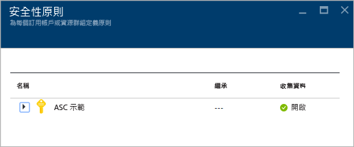
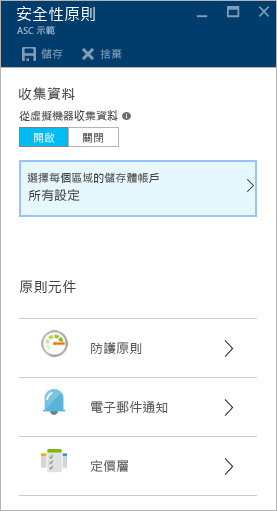
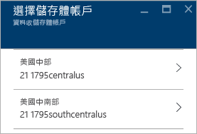
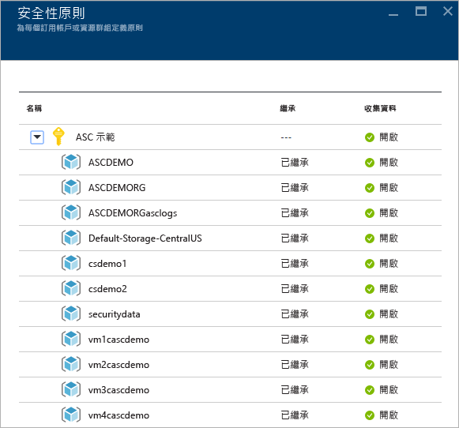
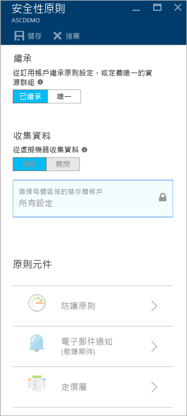

<properties
   pageTitle="在 Azure 資訊安全中心設定安全性原則 | Microsoft Azure"
   description="本文件可協助您在「Azure 資訊安全中心」設定安全性原則。"
   services="security-center"
   documentationCenter="na"
   authors="YuriDio"
   manager="swadhwa"
   editor=""/>

<tags
   ms.service="security-center"
   ms.devlang="na"
   ms.topic="hero-article"
   ms.tgt_pltfrm="na"
   ms.workload="na"
   ms.date="07/21/2016"
   ms.author="yurid"/>

# 在 Azure 資訊安全中心設定安全性原則
這份文件透過帶領您完成執行這項工作的必要步驟，協助您設定資訊安全中心的安全性原則。

## 什麼是安全性原則？
安全性原則定義了針對指定之訂用帳戶或資源群組內的資源建議的一組控制項。在「資訊安全中心」中，您可以根據公司安全性需求，以及每個訂用帳戶中應用程式的類型或資料的敏感性，為您的 Azure 訂用帳戶或資源群組定義原則。

例如，用於開發或測試的資源與用於實際執行應用程式的資源，兩者的安全性需求可能不同。同樣地，具有 PII (個人識別資訊) 這類規範資料的應用程式可能會需要較高層級的安全性。「Azure 資訊安全中心」中啟用的安全性原則將會決定安全性建議與監視，以協助您識別可能的弱點並減輕威脅。如需如何決定哪個選項較適合您的詳細資訊，請閱讀 [Azure 資訊安全中心規劃和操作指南](security-center-planning-and-operations-guide.md)。

## 設定訂用帳戶的安全性原則

您可以為每個訂用帳戶或資源群組設定安全性原則。若要修改安全性原則，您必須是該訂用帳戶的「擁有者」或「參與者」。存取 Azure 入口網站並依照下列步驟在「資訊安全中心」設定安全性原則：

1. 按一下資訊安全中心儀表板中的 [原則] 圖格。

2. 在於右側開啟的 [安全性原則 - 定義每個訂用帳戶或資源群組的原則] 刀鋒視窗中，選取您想要啟用安全性原則的訂用帳戶。如果您想要啟用資源群組而非整個訂用帳戶的安全性原則，請向下捲動到下一節，該節會討論如何設定資源群組的安全性原則。

    

3. 隨即會開啟該訂用帳戶的 [安全性原則] 刀鋒視窗，內含一組類似如下的選項：

    

4. 確定 [從虛擬機器收集資料] 選項為 [開啟]。此選項可啟用現有資源與新資源的自動記錄收集。

    >[AZURE.NOTE] 強烈建議您為每個訂用帳戶開啟資料收集功能，因為這將確保安全性監視可用於所有現有的 VM 和新的 VM。如果啟用資料收集，將會安裝監視代理程式。如果您不想現在從這個位置開啟資料收集，可以稍後從健康情況和建議檢視開啟。您也可以只針對訂用帳戶或特定 VM 啟用資料收集。若要深入了解支援的 VM，請參閱 [Azure 資訊安全中心常見問題集](security-center-faq.md)。

5. 如果尚未設定儲存體帳戶，當您開啟 [安全性原則] 時，可能會看到類似下圖的警告：

    

6. 如果您看到這個警告，請按一下此選項並選取區域，如下圖所示：

    

7. 針對每個有虛擬機器在其中執行的區域，請選擇儲存體帳戶，以儲存從這些虛擬機器收集到的資料。這可讓您針對隱私權和資料主權的考量，輕鬆將資料保留在相同的地理區域。您決定將使用哪一個區域之後，請選取該區域，然後選取儲存體帳戶。

8. 在 [選擇儲存體帳戶] 刀鋒視窗中，按一下 [確定]。

    > [AZURE.NOTE] 如果想要的話，您也可以從不同區域的虛擬機器，將資料彙總到一個集中的儲存體帳戶。如需詳細資訊，請參閱 [Azure 資訊安全中心常見問題集](security-center-faq.md)。

9. 在 [安全性原則] 刀鋒視窗中按一下 [開啟]，啟用您想要在此訂用帳戶使用的安全性建議。按一下 [預防原則] 選項。[安全性原則] 刀鋒視窗會開啟，如下所示。

	

請使用下表做為參考，以了解每個選項會執行的動作：

| 原則 | 當狀態為開啟時 |
|----- |-----|
| 系統更新 | 根據為該虛擬機器設定的服務，每天會從 Windows Update 或 WSUS 抓取可用的安全性和重大更新清單，並建議套用遺漏的更新。它會使用散發套件提供的套件管理系統檢查 Linux 系統的最新更新，以判斷哪些套件有可用更新。它也會檢查來自[雲端服務](./cloud-services/cloud-services-how-to-configure.md)虛擬機器的安全性和重大更新。 |
| 作業系統弱點 | 每天分析可能造成虛擬機器更容易受到攻擊的作業系統組態，並建議進行組態變更來處理這些弱點。如需受監視之特定設定的詳細資訊，請參閱[建議的基準清單](https://gallery.technet.microsoft.com/Azure-Security-Center-a789e335)。 |
| 端點保護 | 建議為所有 Windows 虛擬機器佈建端點保護，以協助識別和移除病毒、間諜軟體及其他惡意軟體，以及受監視的特定組態。 |
| 磁碟加密 | 在所有虛擬機器中啟用磁碟加密以增強待用資料保護的建議。 
| 網路安全性群組 | 建議設定[網路安全性群組](../virtual-network/virtual-networks-nsg.md) (NSG) 來控制使用公用端點輸入與輸出 VM 的流量。除非另有指定，否則所有虛擬機器網路介面都會繼承為子網路設定的 NSG。除了檢查是否已設定 NSG 之外，此選項還會評估輸入安全性規則來識別是否有任何允許連入流量的規則。 |
| Web 應用程式防火牆 | 建議於下列情況下，在虛擬機器上佈建 Web 應用程式防火牆：使用[執行個體層級公用 IP](../virtual-network/virtual-networks-instance-level-public-ip.md) (ILPIP) 並設定相關聯的「NSG 輸入安全性規則」來允許存取連接埠 80/443。使用負載平衡 IP (VIP) 並設定相關聯的負載平衡與輸入 NAT 規則，來允許存取連接埠 80/443 (如需詳細資訊，請參閱 [Azure 資源管理員的負載平衡器支援](../load-balancer/load-balancer-arm.md))。 |
| 新一代防火牆 | 這會擴充超越 Azure 內建網路安全性群組的網路保護。資訊安全中心會探索建議使用新一代防火牆的部署，並可讓您佈建虛擬應用裝置。 |
| SQL 稽核 | 建議針對法規遵循、進階偵測及調查用途，啟用 Azure SQL 伺服器與資料庫的存取稽核。 |
| SQL 透明資料加密 | 建議為您的 Azure SQL 資料庫、關聯的備份及交易記錄檔啟用待用期加密，讓您的資料即使遭到入侵也無法被讀取。 |
	
一旦完成所有選項的設定，請在具有建議的 [安全性原則] 刀鋒視窗中按一下 [確定]，然後在具有初始設定的 [安全性原則] 刀鋒視窗中按一下 [儲存]。

## 設定資源群組的安全性原則

如果您想要設定每個資源群組的安全性原則，其步驟與用於設定訂用帳戶安全性原則的步驟類似。主要差異是您必須展開訂用帳戶名稱，然後選取想要設定唯一的安全性原則的資源群組：

選取資源群組後，[安全性原則] 刀鋒視窗會隨即開啟。依預設會啟用 [繼承] 選項，這表示此資源群組的所有安全性原則都繼承自訂用帳戶層級。如果您想自訂每個資源群組的安全性原則，您可以變更此組態。如果情況是這樣，您需要選取 [唯一] 並在 [預防原則] 選項底下進行變更。

> [AZURE.NOTE] 如果訂用帳戶層級原則與資源群組層級原則間有衝突，將會優先採用資源層級原則。

## 另請參閱

在本文件中，您已了解如何在「Azure 資訊安全中心」設定安全性原則。若要深入了解「Azure 資訊安全中心」，請參閱下列主題：

- [Azure 資訊安全中心規劃和操作指南](security-center-planning-and-operations-guide.md) — 了解如何規劃及了解採用 Azure 資訊安全中心的設計考量。
- [Azure 資訊安全中心的安全性健全狀況監視](security-center-monitoring.md) — 了解如何監視 Azure 資源的健全狀況。
- [管理與回應 Azure 資訊安全中心的安全性警示](security-center-managing-and-responding-alerts.md) — 了解如何管理與回應安全性警示。
- [使用 Azure 資訊安全中心監視合作夥伴解決方案](security-center-partner-solutions.md) — 了解如何監視合作夥伴解決方案的健全狀況。
- [Azure 資訊安全中心常見問題集](security-center-faq.md) — 尋找有關使用服務的常見問題。
- [Azure 安全性部落格](http://blogs.msdn.com/b/azuresecurity/) — 尋找有關 Azure 安全性與相容性的部落格文章。

<!---HONumber=AcomDC_0803_2016-->