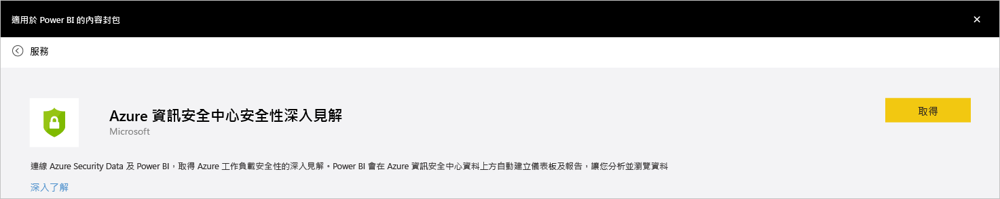
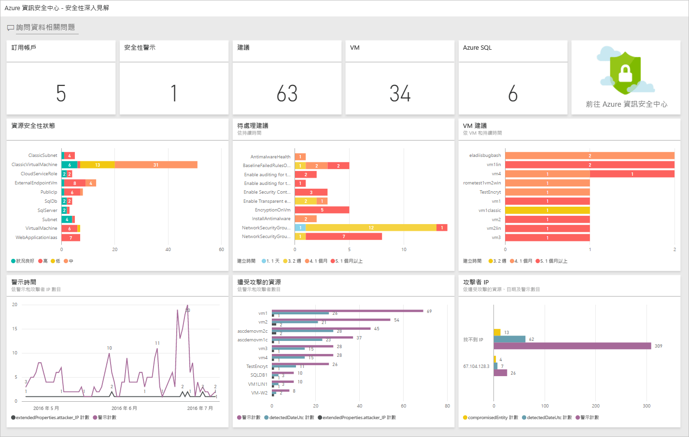
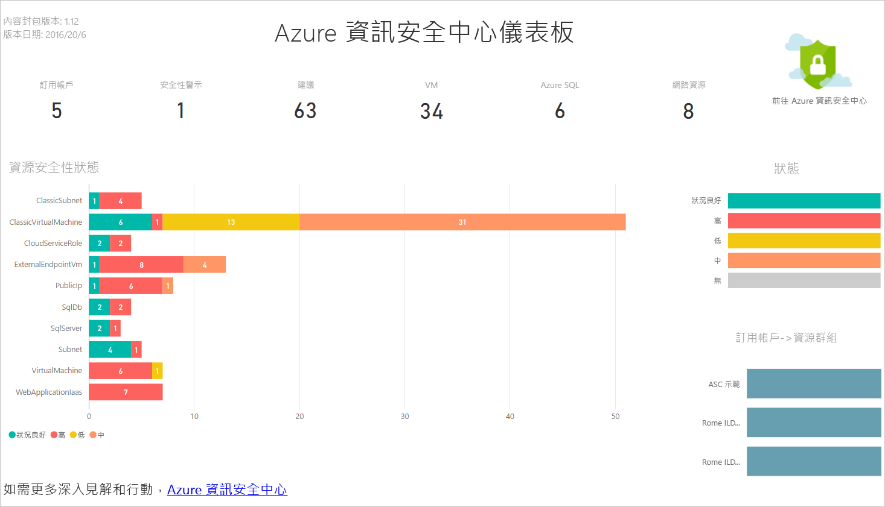
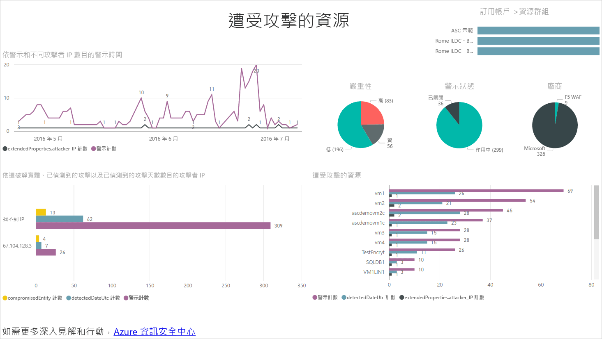
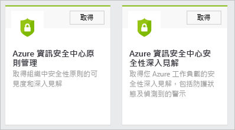
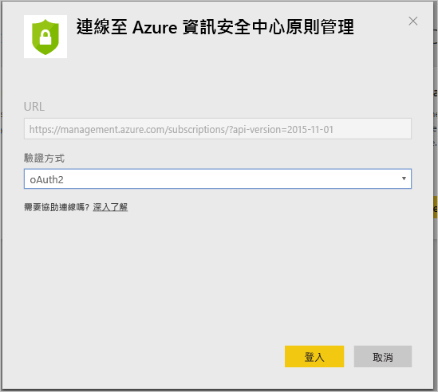
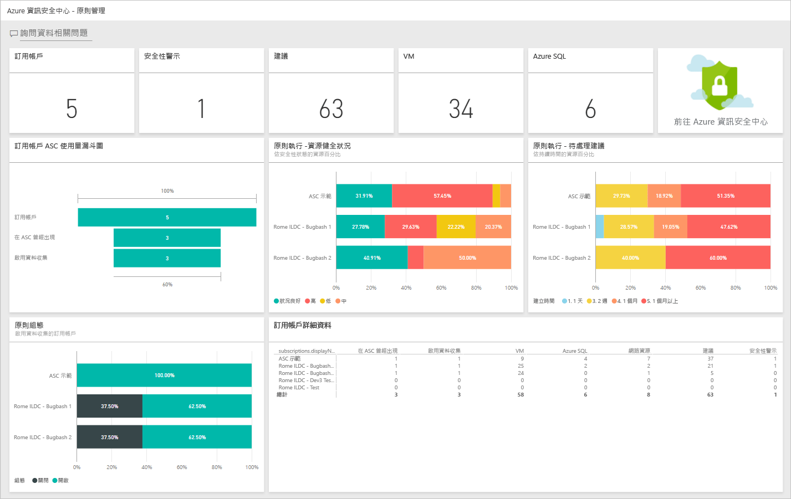

# 使用 Power BI 從 Azure 資訊安全中心的資料取得見解
Azure 資訊安全中心的 [Power BI 儀表板](http://aka.ms/azure-security-center-power-bi) 可讓您從任何地方 (包括行動裝置) 視覺化、分析和篩選建議與安全性警示。 使用 Power BI 儀表板即可顯示趨勢和攻擊模式，依資源或來源 IP 位址檢視安全性警示以及依資源或存留期檢視尚未解決的安全性風險。

您也可以用相關方式結合資訊安全中心建議、安全性警示和其他資料，例如使用 [Azure 稽核記錄檔](https://powerbi.microsoft.com/blog/monitor-azure-audit-logs-with-power-bi/)和 [Azure SQL Database 稽核](https://powerbi.microsoft.com/blog/monitor-your-azure-sql-database-auditing-activity-with-power-bi/)中的資料。 兩者都提供 Power BI 儀表板，您也可以將此資料匯出至 Excel，方便進行雲端資源的安全性狀態報告。

## 使用 Azure 資訊安全中心儀表板存取 Power BI
您也可以使用 Azure 資訊安全中心儀表板存取 Power BI 報告。 請按照步驟來執行這項工作：

1. 在 [Azure 資訊安全中心] 儀表板中，按一下 [Power BI] 按鈕。

    
2. [Power BI] 刀鋒視窗隨即會在右側開啟，如下列畫面所示：

    
3. 如果您第一次建立 Power BI 儀表板，可以在 [在 Power BI 中瀏覽]  刀鋒視窗中選擇下列的其中一個選項：

   * **安全性深入解析儀表板**︰如果您要建立包含安全性狀態、執行緒和偵測的儀表板，請選擇這個選項。 對於負責分析各訂用帳戶的防護狀態及偵測到之警示的 DevOps 角色而言，這是較常見的選項。
   * **原則管理儀表板**︰如果您想要瀏覽管理和強制執行原則，請選擇這個選項。  對於偏重控管的中心 IT 人員而言，這是較常見的選項。 他們可以使用此儀表板來取得其組織所堅守之安全性原則的可見性和深入資訊。
   * 如果您已經有 Power BI 儀表板，請按一下 [移至您目前的 Power BI 儀表板] 。
4. 在這個範例中，請點選 [安全性深入解析儀表板]  選項。 如果這是您第一次建立資訊安全中心的 Power BI 儀表板，系統會提示您安裝內容套件。 在如下列畫面所示的 [Power BI 內容套件] 視窗中，按一下 [取得] 按鈕：

    
5. [連接到 Azure 資訊安全中心安全性深入解析]  視窗隨即出現。 確定 [驗證] 方法為 oAuth2 (如下所示)，然後按一下 [登入] 按鈕。

    
6. 系統可能會要求您再次使用您的 Azure 認證進行驗證。 驗證之後，將會建立您的儀表板。 建立儀表板後，您會看到具有類似結構的報告，如下列畫面所示：

    

> [!NOTE]
> 報告已排定每日進行重新整理。 如果遇到重新整理失敗，請參閱 [Azure 資訊安全中心 Power BI 的潛在重新整理問題](https://blogs.msdn.microsoft.com/azuresecurity/2016/04/07/azure-security-center-power-bi-refresh-fails/)，以取得疑難排解方式的詳細資訊。
>
>

您可以在此看到安全性警示和建議的數目，以及 Azure 資訊安全中心所監控的 VM、Azure SQL Database 和網路資源的數目。

Azure 資訊安全中心的連結會將您重新導向至 Azure 入口網站。 圖表則可讓您輕鬆視覺化關於安全性建議和警示的資訊，包括：

* 資源安全性狀態
* 擱置建議
* VM 建議
* 不同時間的警示
* 受到攻擊的資源
* 受到攻擊的 IP

每個圖表背後都有額外的見解。 選取圖格，以查看詳細資訊。 例如 [資源安全性狀態]  圖格會顯示依資源分類之擱置建議的其他詳細資料，如以下畫面所示：

如果您按一下此圖形中的任一行，其他行就會變為灰色，而您只會聚焦在所選的那一行。 若要返回儀表板，請按一下此頁左窗格之 [儀表板] 選項底下的 [Azure 資訊安全中心]。

> [!NOTE]
> 如果您想要自訂報告，只要透過新增其他欄位或變更現有視覺效果即可編輯報告。 如需詳細資訊，請閱讀 [在 Power BI 中與編輯檢視的報告互動](https://powerbi.microsoft.com/documentation/powerbi-service-interact-with-a-report-in-editing-view/) 。
>
>

當您分別按一下 [不同時間的警示]、[受到攻擊的資源] 和 [攻擊者 IP] 圖格時，都會有相似的輸出。 會有這個情況是因為報告會彙總這三個變數的所有相關資訊，並將它稱為**遭受攻擊的資源**，如以下畫面所示：

此時您也可以使用 [檔案]  功能表中提供的選項儲存一份這個報告、列印或將它發佈在網站上。

![[檔案] 功能表](./media/security-center-powerbi/security-center-powerbi-fig8.png)

## 使用 Power BI 服務探索 Azure 資訊安全中心的資料
在 Power BI 中連線到 [Power BI 內容套件服務](https://msit.powerbi.com/groups/me/getdata/services) ，並執行下列步驟：

1. 在 [Power BI 內容套件]  視窗中，您會看到兩個選項，如下所示。

    

   > [!NOTE]
   > 如果已經執行本文的第一個部分，您只會看到一個選項，這是 Azure 資訊安全中心原則管理。
   >
   >
2. 如此範例所述，按一下 [Azure 資訊安全中心原則管理] 圖格中的 [取得]。
3. 在 [連接到 Azure 資訊安全中心原則管理] 視窗中，請務必選取 [驗證方法] 下拉式清單下方的 oAuth2 (如下所示)，然後按一下 [登入] 按鈕。

    
4. 系統會將您重新導向至驗證頁面，請在此輸入您要用來連線到 Azure 資訊安全中心的認證。 驗證程序完成後，Power BI 會開始匯入資料以建置報告。 在這段期間，您可能會在瀏覽器右側角落看到下列訊息：

    

   > [!NOTE]
   > 第一次建立儀表板時可能需要較長的時間，主要是因為您有多個訂用帳戶。
   >
   >
5. 程序完成後，Azure 資訊安全中心 Power BI 儀表板就會載入如下所示的 **原則管理** 報告：

    

## 另請參閱
在本文件中，您已了解如何在 Azure 資訊安全中心內使用 Power BI。 若要深入了解「Azure 資訊安全中心」，請參閱下列主題：

* [Azure 資訊安全中心規劃和操作指南](security-center-planning-and-operations-guide.md) — 了解如何規劃 Azure 資訊安全中心的採用。
* [在 Azure 資訊安全中心設定安全性原則](security-center-policies.md) — 了解如何在 Azure 資訊安全中心設定安全性設定
* [管理與回應 Azure 資訊安全中心的安全性警示](security-center-managing-and-responding-alerts.md) — 了解如何管理與回應安全性警示
* [Azure 資訊安全中心常見問題集](security-center-faq.md) — 尋找有關使用服務的常見問題
* [Azure 安全性部落格](http://blogs.msdn.com/b/azuresecurity/) — 尋找有關 Azure 安全性與相容性的部落格文章。

