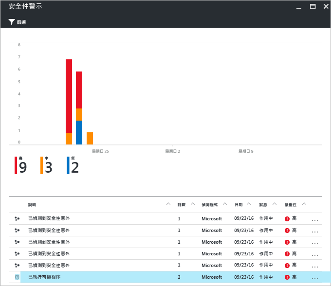
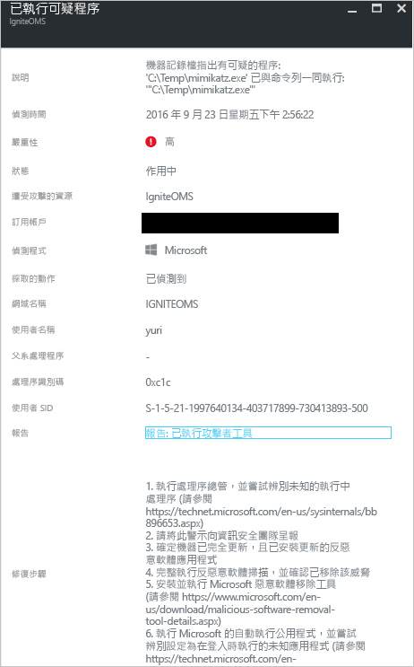

# Azure 資訊安全中心威脅情報報告
本文件說明 Azure 資訊安全中心威脅情報報告可如何協助您深入了解產生安全性警示的威脅。

## 何謂威脅情報報告？
資訊安全中心威脅偵測的運作方式如下：監視來自 Azure 資源、網路和已連線合作夥伴解決方案的安全性資訊。 它會分析這項資訊 (通常是來自多個來源的相互關聯資訊) 以識別威脅。 此程序為資訊安全中心[偵測功能](security-center-detection-capabilities.md)的一部分。

當資訊安全中心識別到威脅時，便會觸發[安全性警示](security-center-managing-and-responding-alerts.md)，其內含關於特定事件的詳細資訊，包括修復方面的建議。 為了協助事件回應小組調查和修復威脅，資訊安全中心包含威脅情報報告，報告中含有偵測到之威脅的相關資訊，包括如下資訊：

* 攻擊者的身分識別或關聯 (如果有提供這項資訊)
* 攻擊者的目標
* 目前和過往的攻擊活動 (如果有提供這項資訊)
* 攻擊者的策略、工具和程序
* 關聯的入侵指標 (IoC)，例如 URL 和檔案雜湊
* 受害者研究 (Victimology)，亦即在業界和地理區域方面的盛行情況，可協助您判斷 Azure 資源是否有風險
* 緩和與修復資訊

> [!NOTE]
> 任何特定報告中所含的資訊數量各有不同；詳細程度視惡意程式碼的活動和盛行情況而定。
>
>

資訊安全中心有三種威脅報告，不同攻擊會提供不同的報告。 所提供的報告如下︰

* **群組活動報告**︰提供攻擊者、其目標和策略的深入探討。
* **活動報告**︰著重說明特定攻擊活動的詳細資料。
* **威脅摘要報告**︰涵蓋先前兩種報告的所有項目。

這種類型的資訊在[事件回應](security-center-incident-response.md)程序期間非常有用，因為該期間會持續進行調查，以了解攻擊來源、攻擊者的動機，以及日後該如何緩和此問題。

## 如何存取威脅情報報告？
您可以查看 [安全性警示]  圖格來檢視目前的警示。 開啟 Azure 入口網站並遵循下列步驟來查看有關每個警示的更多詳細資訊：

1. 您會在「資訊安全中心」的儀表板看到 [安全性警示]  圖格。
2. 按一下圖格便可開啟 [安全性警示] 刀鋒視窗，其中包含有關警示的更多詳細資料，按一下您想了解的安全性警示即可取得更多相關資訊。

    
3. 在此案例中，[已執行的可疑處理程序] 刀鋒視窗會顯示警示的詳細資料，如下圖所示︰

    
4. 根據警示類型而定，針對每個安全性警示所提供的資訊數量會有所不同。 [報告] 欄位中有威脅情報報告的連結。 按一下連結，便會出現另一個含有 PDF 檔案的瀏覽器視窗。

   

您可以從這裡下載此報告的 PDF，深入了解偵測到的安全性問題，並根據所提供的資訊採取動作。

## 另請參閱
在本文件中，您已了解 Azure 資訊安全中心威脅情報報告如何在安全性警示調查期間幫上忙。 若要深入了解「Azure 資訊安全中心」，請參閱下列主題：

* [Azure 資訊安全中心常見問題集](security-center-faq.md)。 尋找有關使用服務的常見問題。
* [善用 Azure 資訊安全中心進行事件回應](security-center-incident-response.md)
* [Azure 資訊安全中心的偵測功能](security-center-detection-capabilities.md)
* [Azure 資訊安全中心規劃和操作指南](security-center-planning-and-operations-guide.md)。 了解如何規劃及了解採用 Azure 資訊安全中心的設計考量。
* [管理及回應 Azure 資訊安全中心的安全性警示](security-center-managing-and-responding-alerts.md)。 了解如何管理和回應安全性警示。
* [在 Azure 資訊安全中心處理安全性事件](security-center-incident.md)
* [Azure 安全性部落格](http://blogs.msdn.com/b/azuresecurity/)。 尋找有關 Azure 安全性與相容性的部落格文章。

