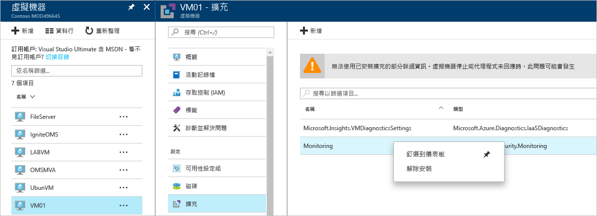

# Azure 資訊安全中心疑難排解指南
本指南適用於組織目前採用 Azure 資訊安全中心，且需要針對資訊安全中心相關問題進行疑難排解的資訊技術 (IT) 專業人員、資訊安全性分析師和雲端系統管理員。

## 疑難排解指南
本指南說明如何針對資訊安全中心相關問題進行疑難排解。 大多數在資訊安全中心進行的疑難排解作業會先查看失敗元件的 [稽核記錄檔](https://azure.microsoft.com/updates/audit-logs-in-azure-preview-portal/) 記錄。 透過稽核記錄檔，您可以判斷︰

* 已發生的作業
* 起始作業的人員
* 發生作業的時間
* 作業的狀態
* 其他可能協助您研究作業的屬性值

稽核記錄檔包含在您的資源上執行的所有寫入作業 (PUT、POST、DELETE)，但不包含讀取作業 (GET)。

## 疑難排解 Windows 中的監視代理程式安裝
資訊安全中心監視代理程式用來執行資料收集。 啟用資料收集且代理程式已正確安裝在目標電腦之後，下列處理序應在執行中︰

* ASMAgentLauncher.exe - Azure 監視代理程式 
* ASMMonitoringAgent.exe - Azure 安全性監視擴充功能
* ASMSoftwareScanner.exe – Azure 掃描管理員

Azure 安全性監視擴充功能會掃描各種安全性相關組態，並從虛擬機器收集安全性記錄檔。 掃描管理員將會做為修補程式掃描器。

如果成功執行安裝，您應該會在目標 VM 的稽核記錄檔中看到類似下面的畫面︰

讀取代理程式記錄檔 (位於「%systemdrive%\windowsazure\logs」) (範例︰C:\WindowsAzure\Logs)，也可以取得安裝程序的詳細資訊。

> [!NOTE]
> 如果 Azure 資訊安全中心代理程式運作不正常，您必須重新啟動目標 VM，因為沒有任何命令可停止和啟動此代理程式。

如果您仍有收集資料方面的問題，可遵循以下步驟來解除安裝代理程式：

1. 從 **Azure 入口網站**中，選取遇到資料收集問題的虛擬機器，然後按一下 [擴充功能]。
2. 以滑鼠右鍵按一下 **Microsoft.Azure.Security.Monitoring**，然後按一下 [解除安裝]。

Azure 安全性監視擴充功能應該會在幾分鐘內自行重新安裝。

## 疑難排解 Linux 中的監視代理程式安裝
在 Linux 系統中疑難排解 VM 代理程式安裝時，您應該確定延伸模組已下載到 /var/lib/waagent/。 您可以執行下列命令來確認已安裝該延伸模組︰

`cat /var/log/waagent.log` 

您可檢閱以便用於疑難排解的其他記錄檔︰ 

* /var/log/mdsd.err
* /var/log/azure/

在工作系統中，您應該看到 TCP 29130 上 mdsd 處理序的連線。 這是與 mdsd 處理序通訊的 syslog。 執行下列命令，即可驗證此行為：

`netstat -plantu | grep 29130`

## 針對端點保護無法正常運作的問題進行疑難排解

客體代理程式為 [Microsoft Antimalware](../security/azure-security-antimalware.md) 擴充功能所做一切的父處理序。 當客體代理程式處理序失敗時，做為客體代理程式子處理序執行的 Microsoft Antimalware 可能也會失敗。  在類似案例中，建議您確認下列選項：

- 目標 VM 是否為自訂映像，而且 VM 的建立者從未安裝客體代理程式。
- 如果目標為 Linux VM 而不是 Windows VM，則在 Linux VM 上安裝反惡意程式碼擴充功能的 Windows 版本將會失敗。 Linux 客體代理程式對於 OS 版本和所需的封裝具有特定需求，而且如果未符合這些需求，VM 代理程式也無法在該處運作。 
- VM 是否是使用舊版客體代理程式所建立。 如果是，您應該注意，某些舊版代理程式可能不會將本身自動更新為較新版本，而這會導致此問題。 如果建立您自己的映像，請一律使用最新版的客體代理程式。
- 某些協力廠商系統管理軟體可能會停用客體代理程式，或封鎖特定檔案位置的存取。 如果您在 VM 上安裝了協力廠商軟體，請確定代理程式位於排除清單上。
- 某些防火牆設定或網路安全性群組 (NSG) 可能會封鎖進出客體代理程式的網路流量。
- 某些存取控制清單 (ACL) 可能會防止磁碟存取。
- 磁碟空間不足會封鎖客體代理程式而使其無法正確運作。 

預設會停用 Microsoft Antimalware 使用者介面，如需如何視需要啟用此功能的詳細資訊，請閱讀[在 Azure Resource Manager VM 後續部署上啟用 Microsoft Antimalware 使用者介面 (英文)](https://blogs.msdn.microsoft.com/azuresecurity/2016/03/09/enabling-microsoft-antimalware-user-interface-post-deployment/)。

## 針對載入儀表板的問題進行疑難排解

如果您遇到載入資訊安全中心儀表板的問題，請確定向資訊安全中心註冊訂用帳戶的使用者 (也就是第一位使用訂用帳戶開啟資訊安全中心的使用者) 以及想要開啟資料收集的使用者，應該是訂用帳戶的「擁有者」或「參與者」。 另外，從那時起，訂用帳戶上具有「讀取者」身分的使用者就可以看到儀表板/警示/建議/原則。

## 連絡 Microsoft 支援服務
使用本文提供的指導方針可識別一些問題，您也可能發現的其他問題則記載於資訊安全中心的公開 [論壇](https://social.msdn.microsoft.com/Forums/en-US/home?forum=AzureSecurityCenter)。 不過，如果您需要進一步疑難排解，您可以使用 **Azure 入口網站**開啟新的支援要求，如下所示︰ 

## 另請參閱
在本文件中，您已了解如何在「Azure 資訊安全中心」設定安全性原則。 若要深入了解「Azure 資訊安全中心」，請參閱下列主題：

* [Azure 資訊安全中心規劃和操作指南](security-center-planning-and-operations-guide.md) — 了解如何規劃及了解採用 Azure 資訊安全中心的設計考量。
* [Azure 資訊安全中心的安全性健全狀況監視](security-center-monitoring.md) — 了解如何監視 Azure 資源的健全狀況。
* [管理與回應 Azure 資訊安全中心的安全性警示](security-center-managing-and-responding-alerts.md) — 了解如何管理與回應安全性警示。
* [使用 Azure 資訊安全中心監視合作夥伴解決方案](security-center-partner-solutions.md) — 了解如何監視合作夥伴解決方案的健全狀況。
* [Azure 資訊安全中心常見問題集](security-center-faq.md) — 尋找有關使用服務的常見問題。
* [Azure 安全性部落格](http://blogs.msdn.com/b/azuresecurity/) — 尋找有關 Azure 安全性與相容性的部落格文章。

