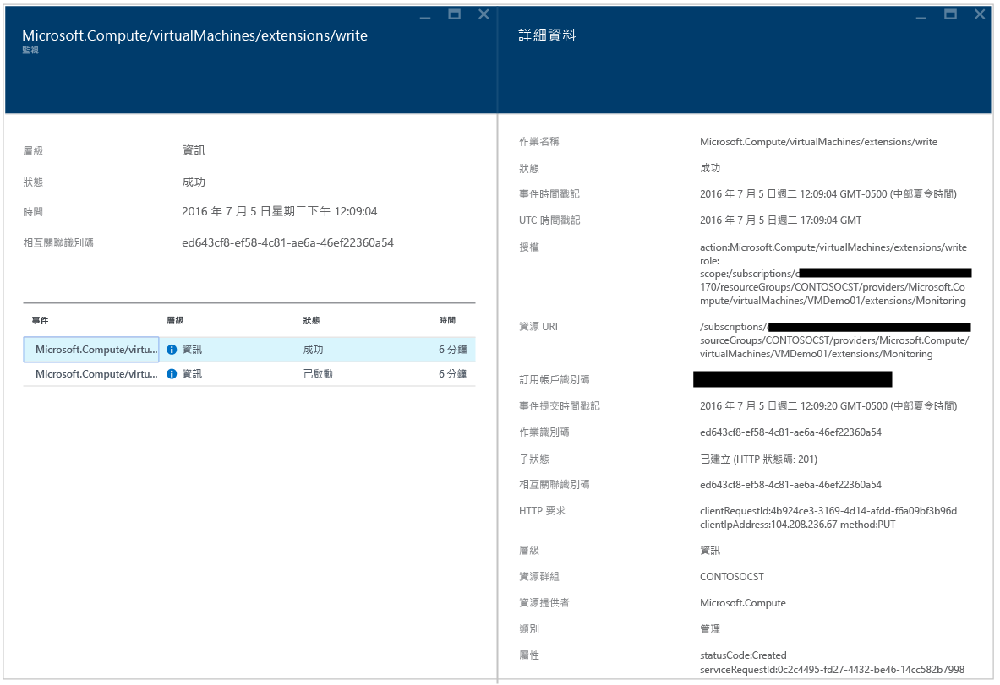
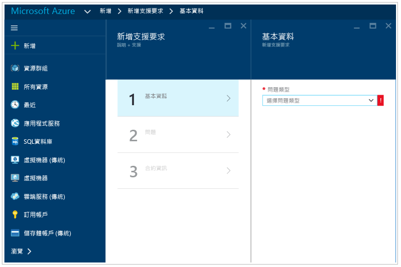

<properties
   pageTitle="Azure 資訊安全中心疑難排解指南 | Microsoft Azure"
   description="本文件有助於在 Azure 資訊安全中心排解疑難問題。"
   services="security-center"
   documentationCenter="na"
   authors="YuriDio"
   manager="swadhwa"
   editor=""/>

<tags
   ms.service="security-center"
   ms.devlang="na"
   ms.topic="hero-article"
   ms.tgt_pltfrm="na"
   ms.workload="na"
   ms.date="07/21/2016"
   ms.author="yurid"/>

# Azure 資訊安全中心疑難排解指南
本指南適用於組織目前採用 Azure 資訊安全中心，且需要針對資訊安全中心相關問題進行疑難排解的資訊技術 (IT) 專業人員、資訊安全性分析師和雲端系統管理員。

## 疑難排解指南
本指南說明如何針對資訊安全中心相關問題進行疑難排解。大多數在資訊安全中心進行的疑難排解作業會先查看失敗元件的[稽核記錄檔](https://azure.microsoft.com/updates/audit-logs-in-azure-preview-portal/)記錄。透過稽核記錄檔，您可以判斷︰

- 已發生的作業
- 起始作業的人員
- 發生作業的時間
- 作業的狀態
- 其他可能協助您研究作業的屬性值

稽核記錄檔包含在您的資源上執行的所有寫入作業 (PUT、POST、DELETE)，但不包含讀取作業 (GET)。

## 疑難排解 Windows 中的監視代理程式安裝

資訊安全中心監視代理程式用來執行資料收集。啟用資料收集且代理程式已正確安裝在目標電腦之後，下列處理序應在執行中︰

- ASMAgentLauncher.exe - Azure 監視代理程式
- ASMMonitoringAgent.exe - Azure 安全性監視擴充功能
- ASMSoftwareScanner.exe – Azure 掃描管理員

Azure 安全性監視擴充功能會掃描各種安全性相關組態，並從虛擬機器收集安全性記錄檔。掃描管理員將會做為修補程式掃描器。

如果成功執行安裝，您應該會在目標 VM 的稽核記錄檔中看到類似下面的畫面︰

讀取代理程式記錄檔 (位於「%systemdrive%\\windowsazure\\logs」) (範例︰C:\\WindowsAzure\\Logs)，也可以取得安裝程序的詳細資訊。

> [AZURE.NOTE] 如果 Azure 資訊安全中心代理程式運作不正常，您必須重新啟動目標 VM，因為沒有任何命令可停止和啟動此代理程式。

## 疑難排解 Linux 中的監視代理程式安裝
在 Linux 系統中疑難排解 VM 代理程式安裝時，您應該確定延伸模組已下載到 /var/lib/waagent/。您可以執行下列命令來確認已安裝該延伸模組︰

`cat /var/log/waagent.log`

您可檢閱以便用於疑難排解的其他記錄檔︰

- /var/log/mdsd.err
- /var/log/azure/

在工作系統中，您應該看到 TCP 29130 上 mdsd 處理序的連線。這是與 mdsd 處理序通訊的 syslog。執行下列命令，即可驗證此行為：

`netstat -plantu | grep 29130`

## 連絡 Microsoft 支援服務

使用本文提供的指導方針可識別一些問題，您也可能發現的其他問題則記載於資訊安全中心的公開[論壇](https://social.msdn.microsoft.com/Forums/zh-TW/home?forum=AzureSecurityCenter)。不過，如果您需要進一步疑難排解，您可以使用 Azure 入口網站開啟新的支援要求，如下所示︰

## 另請參閱

在本文件中，您已了解如何在「Azure 資訊安全中心」設定安全性原則。若要深入了解「Azure 資訊安全中心」，請參閱下列主題：

- [Azure 資訊安全中心規劃和操作指南](security-center-planning-and-operations-guide.md) - 了解如何規劃及了解採用 Azure 資訊安全中心的設計考量。
- [Azure 資訊安全中心的安全性健全狀況監視](security-center-monitoring.md) – 了解如何監視 Azure 資源的健全狀況
- [管理與回應 Azure 資訊安全中心的安全性警示](security-center-managing-and-responding-alerts.md) – 了解如何管理與回應安全性警示
- [使用 Azure 資訊安全中心監視合作夥伴解決方案](security-center-partner-solutions.md) -- 了解如何監視合作夥伴解決方案的健全狀況。
- [Azure 安全性中心常見問題集](security-center-faq.md) – 尋找使用服務的常見問題
- [Azure 安全性部落格](http://blogs.msdn.com/b/azuresecurity/) – 尋找有關 Azure 安全性與相容性的部落格文章

<!---HONumber=AcomDC_0727_2016-->