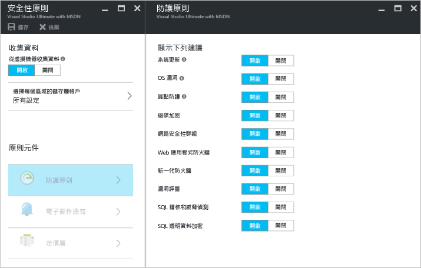
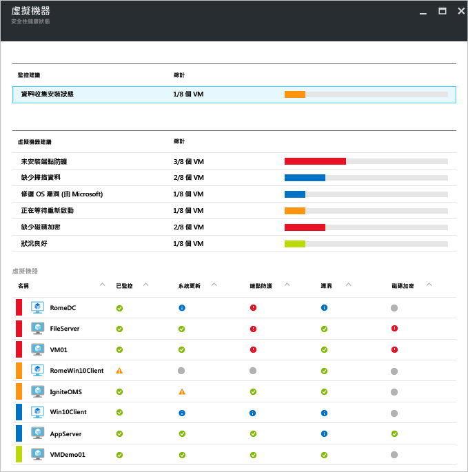
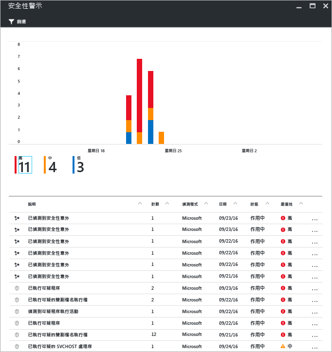

# Azure 資訊安全中心和 Azure 虛擬機器
[Azure 資訊安全中心](https://azure.microsoft.com/services/security-center/)可協助您保護、偵測威脅並採取相應的措施。 它提供您 Azure 訂用帳戶之間的整合式安全性監視和原則管理，協助您偵測可能會忽略的威脅，且適用於廣泛的安全性解決方案生態系統。

本文說明資訊安全中心如何協助您保護 Azure 虛擬機器 (VM)。

## 為何使用資訊安全中心？
資訊安全中心可協助您保護 Azure 中的虛擬機器資料，方法為提供虛擬機器的安全性設定可見性。 當資訊安全中心保護您的 VM 時，可使用下列功能︰

* 具有建議設定規則的作業系統 (OS) 安全性設定
* 系統安全性和重大更新遺失
* 端點保護建議
* 磁碟加密驗證
* 弱點評估和補救
* 威脅偵測

除了協助您保護 Azure VM，資訊安全中心也提供雲端服務、應用程式服務、虛擬網路等的安全性監視和管理功能。 

> [!NOTE]
> 請參閱 [Azure 資訊安全中心簡介](security-center-intro.md)一文，以深入了解 Azure 資訊安全中心。
> 
> 

## 必要條件
若要開始使用 Azure 資訊安全中心，您將需要知道並考慮下列項目︰

* 您需要 Microsoft Azure 訂用帳戶。 請參閱[安全性中心價格](https://azure.microsoft.com/pricing/details/security-center/)，以深入了解資訊安全中心的免費和標準層。
* 規劃資訊安全中心的採用，請參閱 [Azure 資訊安全中心規劃和操作指南](security-center-planning-and-operations-guide.md)，以深入了解規劃和作業考量。
* 如需作業系統可支援性的相關資訊，請參閱 [Azure 資訊安全中心常見問題集 (FAQ)](security-center-faq.md)。 

## 設定安全性原則
必須啟用資料收集，讓 Azure 資訊安全中心可收集其提供建議所需的資訊，以及根據您所設定之安全性原則所產生的警示。 在下圖中，您可以看到**資料收集**已**開啟**。

安全性原則定義了一組控制項，這組控制項是針對指定之訂用帳戶或資源群組內的資源所建議的。 啟用安全性原則之前，您必須啟用資料收集，資訊安全中心會收集虛擬機器的資料，以便評估其安全性狀態、提供安全性建議，並對您發出威脅警示。 在資訊安全中心，您可以根據公司安全性需求，以及每個訂用帳戶中應用程式的類型或資料的敏感性，為您的 Azure 訂用帳戶或資源群組定義原則。 

> [!NOTE]
> 若要深入了解每個可用的**防止原則**，請參閱[設定安全性原則](security-center-policies.md)文章。
> 
> 

## 管理安全性建議
資訊安全中心會分析 Azure 資源的安全性狀態。 當資訊安全中心識別潛在的安全性弱點時，它會建立建議。 這些建議會引導您完成設定所需控制項的程序。

設定安全性原則之後，「資訊安全中心」會分析您資源的安全性狀態，以識別潛在的弱點。 系統會以表格格式顯示建議，其中每一行代表一個特定的建議。 下表提供 Azure VM 建議以及套用時每一個會執行之作業的一些範例。 當您選取建議時，會提供您說明如何在資訊安全中心實作建議的資訊。

| 建議 | 說明 |
| --- | --- |
| [啟用訂用帳戶的資料收集](security-center-enable-data-collection.md) |建議您為每個訂用帳戶和訂用帳戶中的所有虛擬機器 (VM) 開啟安全性原則中的 [資料收集]。 |
| [修復 OS 弱點](security-center-remediate-os-vulnerabilities.md) |建議您讓作業系統組態符合建議的設定規則，例如不允許儲存密碼。 |
| [套用系統更新](security-center-apply-system-updates.md) |建議您將遺漏的系統安全性與重大更新部署到 VM。 |
| [在系統更新之後重新開機](security-center-apply-system-updates.md#reboot-after-system-updates) |建議您重新啟動 VM 以完成套用系統更新的程序。 |
| [安裝端點保護](security-center-install-endpoint-protection.md) |建議您將反惡意程式碼程式佈建到 VM (僅適用於 Windows VM)。 |
| [解決端點保護健全狀況警示](security-center-resolve-endpoint-protection-health-alerts.md) |建議您先解決端點保護失敗。 |
| [啟用 VM 代理程式](security-center-enable-vm-agent.md) |可讓您查看哪些 VM 需要「VM 代理程式」。 為了佈建修補程式掃描、基準掃描及反惡意程式碼程式，必須在 VM 上安裝「VM 代理程式」。 預設會為從 Azure Marketplace 部署的 VM 安裝「VM 代理程式」。 如需如何安裝 VM 代理程式的相關資訊，請參閱 [VM 代理程式和擴充功能 – 第 2 部分](http://azure.microsoft.com/blog/2014/04/15/vm-agent-and-extensions-part-2/) 。 |
| [套用磁碟加密](security-center-apply-disk-encryption.md) |建議您使用 Azure 磁碟加密來加密您的 VM 磁碟 (Windows 和 Linux VM)。 建議您的 VM 上的作業系統和資料磁碟區都進行加密。 |
| [未安裝弱點評估](security-center-vulnerability-assessment-recommendations.md) |建議在 VM 上安裝弱點評估解決方案。 |
| [修復弱點](security-center-vulnerability-assessment-recommendations.md#review-recommendation) |可讓您查看 VM 上安裝的弱點評估解決方案所偵測到的系統和應用程式弱點。 |

> [!NOTE]
> 若要深入了解相關建議，請參閱[管理安全性建議](security-center-recommendations.md)文章。
> 
> 

## 監視安全性健康狀態
在您為訂用帳戶的資源啟用 [安全性原則](security-center-policies.md) 之後，資訊安全中心會分析您資源的安全性狀態，以找出潛在的弱點。  您可以在 [資源安全性健全狀況] 刀鋒視窗中，檢視資源的安全性狀態及任何問題。 當您在 [資源安全性] 健全狀況圖格中按一下 [虛擬機器] 時，會開啟 [虛擬機器] 刀鋒視窗，並提供您 VM 的建議。 

## 管理和回應安全性警示
資訊安全中心會自動收集、分析及整合您 Azure 資源、網路和已連線的合作夥伴解決方案 (例如防火牆和端點保護解決方案) 的記錄檔資料，來偵測真正的威脅並減少誤判情形。 藉由利用[偵測功能](security-center-detection-capabilities.md)的各種彙總，資訊安全中心能夠產生優先順序的安全性警示，協助您快速地調查問題並提供如何修正可能攻擊的建議。

選取一個安全性警示以深入了解觸發警示的事件；如果發現項目，您需要進行一些步驟來阻止攻擊。 安全性警示會依[類型](security-center-alerts-type.md)及日期區分。

## 另請參閱
如要深入了解資訊安全中心，請參閱下列主題：

* [在 Azure 資訊安全中心設定安全性原則](security-center-policies.md) -- 了解如何為您的 Azure 訂用帳戶及資源群組設定安全性原則。
* [管理與回應 Azure 資訊安全中心的安全性警示](security-center-managing-and-responding-alerts.md) -- 了解如何管理與回應安全性警示。
* [Azure 資訊安全中心常見問題集](security-center-faq.md) -- 尋找有關使用服務的常見問題。

<!--HONumber=Nov16_HO2-->

