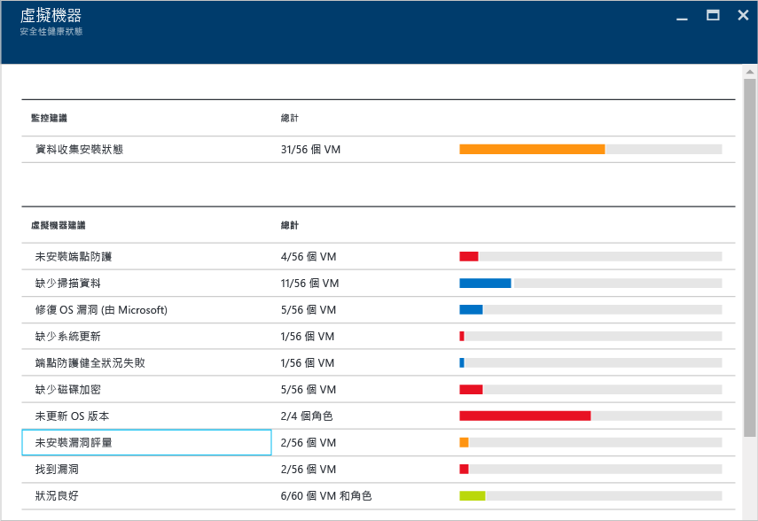
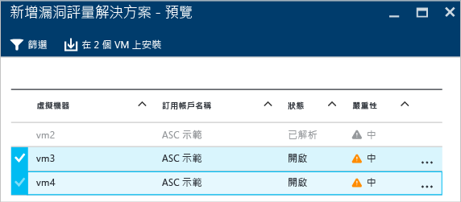
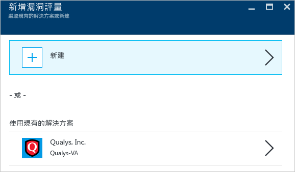
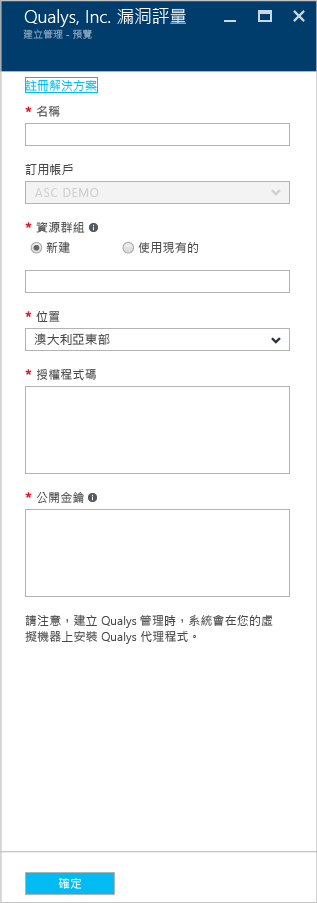
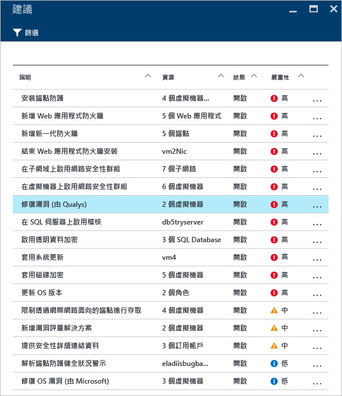
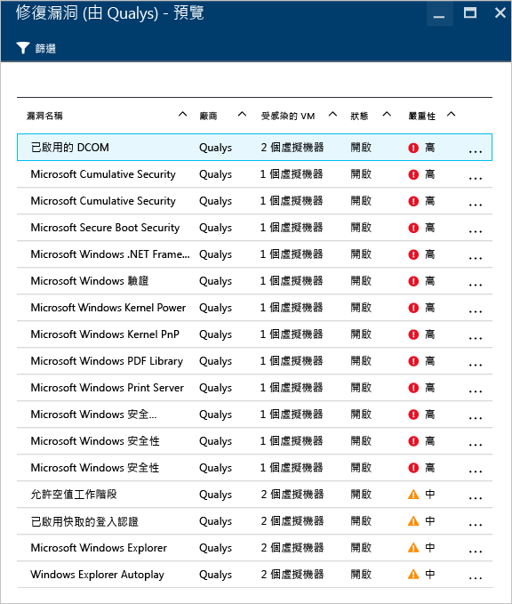
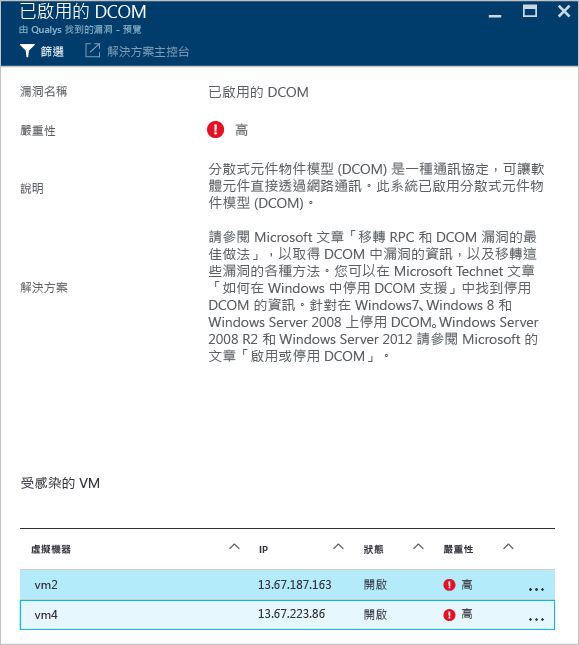

# Azure 資訊安全中心的弱點評估
本文件所探討的弱點評估建議適用於在 Azure 中執行的虛擬機器。

## 什麼是弱點評估？
Azure 資訊安全中心的弱點評估是虛擬機器 (VM) 建議的一部分。如果資訊安全中心找不到您的 VM 上安裝的弱點評估解決方案，它會建議您安裝一個。一旦部署，合作夥伴代理程式就會開始向交易夥伴的管理平台回報弱點資料，而管理平台會提供弱點和健全狀況監視資料給資訊安全中心。使用者可以從資訊安全中心儀表板快速識別有弱點的 VM，並可直接從資訊安全中心切換到合作夥伴管理主控台，以取得更多報告和資訊。

> [!NOTE]
> 本文件將使用範例部署來介紹服務。這不是逐步指南。
> 
> 

## 公開預覽限制
下列限制適用於目前的弱點評估公開預覽︰

* 唯一可用的合作夥伴弱點評估解決方案是來自 [Qualys](https://www.qualys.com/lp/azure)。未來將新增更多。
* 您可以將弱點評估解決方案安裝在多個 VM 中，只要這些 VM 屬於相同的訂用帳戶即可。
* 只支援 Windows VM，Linux VM 即將正式運作 (GA)。

## 實作虛擬機器建議
當資訊安全中心找出一或多個支援的 VM 缺少弱點評估解決方案時，將會觸發 VM 建議。下列步驟顯示如何針對屬於相同訂用帳戶的多個 VM 存取及套用此建議：

1. 在 [資源安全性健全狀況] 圖格中，按一下 [虛擬機器]
2. 在 [虛擬機器] 刀鋒視窗中，選取 [未安裝弱點評估]，如下列畫面所示︰
   
    
3. 在 [新增弱點評估解決方案 - 預覽] 刀鋒視窗中，選取您要安裝弱點評估解決方案的 VM，如下列畫面所示：
   
    
4. 在 [新增弱點評估解決方案 - 預覽] 刀鋒視窗中，按一下 [安裝於 2 部 VM]\(名稱會隨著您選取的 VM 數目而有所不同) 選項，而 [新增弱點評估] 刀鋒視窗會出現，如下列畫面所示︰
   
    
5. 在此刀鋒視窗中，您可以選擇建立新的弱點評估，這讓您從 [Azure Marketplace] 選取合作夥伴解決方案，也可以選取 [使用現有解決方案] 之下的現有合作夥伴解決方案，在此例中為 **Qualys**。

## 建立新的弱點評估解決方案
如果您有多個訂用帳戶，您可以針對每個訂用帳戶建立一個弱點評估解決方案。主要步驟與上一節列舉的步驟相同，唯一差別是您在步驟 4 中會按一下 [新建] 選項。選取此選項之後，使用下列步驟繼續執行。

> [!NOTE]
> 下列範例使用 Qualys。若要部署資訊安全中心提供的 Qualys 雲端代理程式，您需要來自 Qualys 的授權碼和公開金鑰。請參閱 [Qualys 文件](https://community.qualys.com/docs/DOC-5823-deploying-qualys-cloud-agents-from-microsoft-azure-security-center)，以了解如何擷取授權碼和公開金鑰。
> 
> 

1. 在 [建立新的弱點評估] 刀鋒視窗中，按一下合作夥伴的名稱，在此例中為 **Qualys**。
2. 合作夥伴的刀鋒視窗隨即開啟。此刀鋒視窗中顯示的欄位可能會根據合作夥伴而變更，在此範例中我們將使用 **Qualys**：
   
    
3. 在 [名稱] 欄位中，輸入此解決方案的名稱。您可以使用與您嘗試繫結的資源群組或訂用帳戶相互關聯的名稱。
4. 在 [訂用帳戶] 欄位中，選取您要用於此解決方案的訂用帳戶。
5. 在 [資源群組] 欄位中，選取現有資源群組或建立新的群組。
6. 在 [位置] 欄位中，選取此解決方案所在的地理位置。
7. 在 [授權碼] 欄位 (這是 Qualys 特有) 中，輸入合作夥伴所提供的授權號碼。
8. 在 [公開金鑰] 欄位 (這是 Qualys 特有) 中，輸入合作夥伴所提供的公開金鑰資訊，然後按一下 [確定]。

## 檢閱建議
在目標 VM 上安裝弱點評估解決方案後，它會掃描 VM 以偵測並找出系統和應用程式弱點。

> [!NOTE]
> 第一次掃描可能需要幾個小時才能完成，之後就是每小時執行的處理序。
> 
> 

這些問題將會呈現在 [虛擬機器建議] 選項之下。下列範例顯示建議如何顯示在 [建議] 刀鋒視窗之下︰

在此範例中，選取的建議會顯示 Qualys 已執行偵測。如果您按一下此建議，將會出現如下列畫面所示的新刀鋒視窗，其中列出各項弱點︰

此清單會依照嚴重性順序顯示所有弱點，以及受到這項弱點影響的虛擬機器數目。此範例中，已選取 [啟用 DCOM] 這項弱點，而新的刀鋒視窗會顯示解決此弱點的建議步驟︰

## 另請參閱
在本文件中，您已了解如何在 Azure 資訊安全中心套用弱點評估建議。若要深入了解「Azure 資訊安全中心」，請參閱下列主題：

* [Azure 資訊安全中心規劃和操作指南](security-center-planning-and-operations-guide.md)。了解如何規劃及了解採用 Azure 資訊安全中心的設計考量。
* [Azure 資訊安全中心的安全性健全狀況監視](security-center-monitoring.md)。了解如何監視 Azure 資源的健全狀況。
* [管理及回應 Azure 資訊安全中心的安全性警示](security-center-managing-and-responding-alerts.md)。了解如何管理和回應安全性警示。
* [使用 Azure 資訊安全中心監視合作夥伴解決方案](security-center-partner-solutions.md)。了解如何監視合作夥伴解決方案的健全狀態。
* [Azure 資訊安全中心常見問題集](security-center-faq.md)。尋找有關使用服務的常見問題。
* [Azure 安全性部落格](http://blogs.msdn.com/b/azuresecurity/)。尋找有關 Azure 安全性與相容性的部落格文章。

<!---HONumber=AcomDC_0928_2016-->
