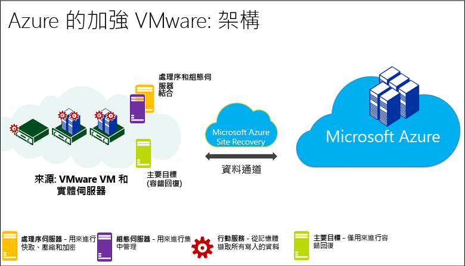
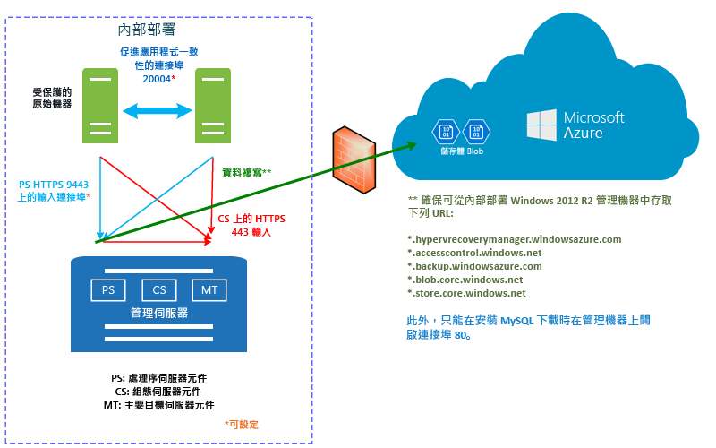
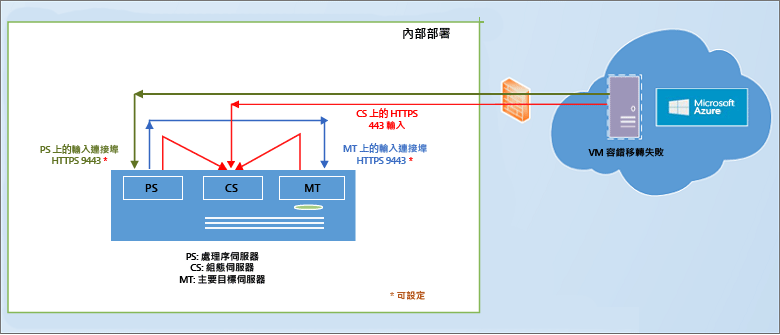
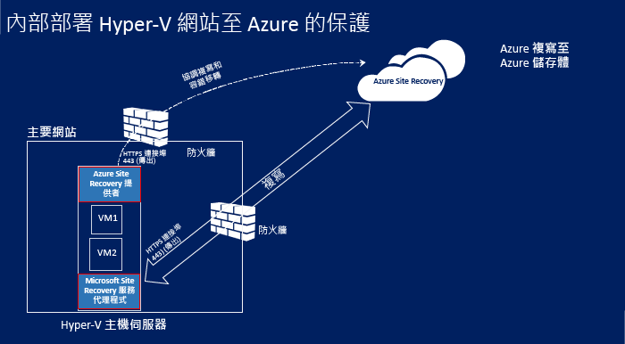
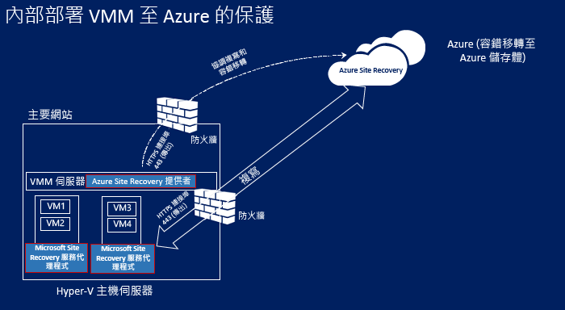
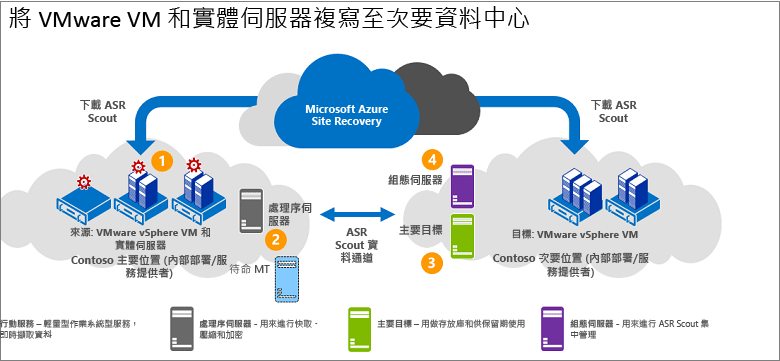
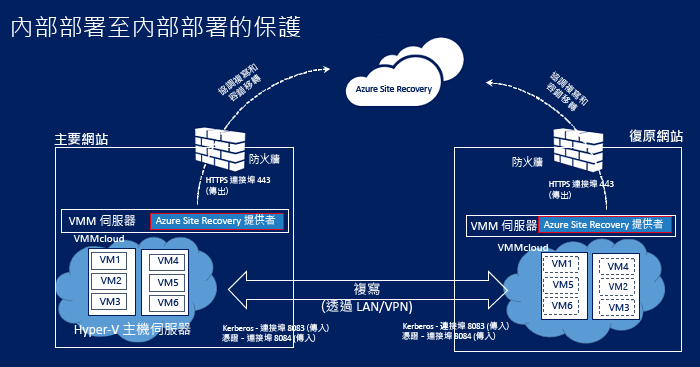

# Azure Site Recovery 如何在內部部署基礎結構中運作？

> [!div class="op_single_selector"]
> * [複寫 Azure 虛擬機器](site-recovery-azure-to-azure-architecture.md)
> * [複寫內部部署機器](site-recovery-components.md)

本文說明 [Azure Site Recovery](site-recovery-overview.md) 服務的基礎架構，以及可供它進行複寫工作 (將工作負載從內部部署複寫到 Azure) 的元件。

如有任何意見，請張貼於這篇文章下方或 [Azure 復原服務論壇 (英文)](https://social.msdn.microsoft.com/forums/azure/home?forum=hypervrecovmgr) 中。

## 複寫至 Azure

您可以將下列內部部署基礎結構複寫至 Azure，並對其提供保護：

- **VMware**︰[支援主機](site-recovery-support-matrix-to-azure.md#support-for-datacenter-management-servers)上執行的內部部署 VMware VM。 您可以複寫執行[支援的作業系統](site-recovery-support-matrix-to-azure.md#support-for-replicated-machine-os-versions)的 VMware VM
- **Hyper-V**︰[支援主機](site-recovery-support-matrix-to-azure.md#support-for-datacenter-management-servers)上執行的內部部署 Hyper-V VM。
- **實體機器**︰[支援的作業系統](site-recovery-support-matrix-to-azure.md#support-for-replicated-machine-os-versions)上執行 Windows 或 Linux 的內部部署實體伺服器。 您可以複寫 Hyper-V VM，執行 [Hyper-V 和 Azure 支援](https://technet.microsoft.com/en-us/windows-server-docs/compute/hyper-v/supported-windows-guest-operating-systems-for-hyper-v-on-windows)的任何客體作業系統。

## VMware 至 Azure

以下是要將 VMware VM 複寫到 Azure 的所需項目。

領域 | 元件 | 詳細資料
--- | --- | ---
**組態伺服器** | 單一管理伺服器 (VMWare VM) 執行所有內部部署元件 - 組態伺服器、處理序伺服器、主要目標伺服器 | 組態伺服器會協調內部部署與 Azure 之間的通訊，以及管理資料複寫。
 **處理序伺服器**：  | 預設會安裝在組態伺服器上。 | 會做為複寫閘道器。 接收複寫資料，以快取、壓縮和加密進行最佳化，然後將複寫資料傳送至 Azure 儲存體。   處理序伺服器還會處理用來保護機器的行動服務的推入安裝，並執行 VMWare VM 的自動探索。   隨著部署規模擴大，您可以新增更多個別的專用處理序伺服器，以處理日益增加的複寫流量。
 **主要目標伺服器** | 預設會安裝在內部部署組態伺服器上。 | 在從 Azure 容錯回復期間，處理複寫資料。   如果容錯回復的流量很高，您可以部署個別的主要目標伺服器來供容錯回復使用。
**VMware 伺服器** | VMware VM 裝載在 vSphere ESXi 伺服器上，我們建議使用 vCenter 伺服器來管理主機。 | 您可以將 VMware 伺服器新增至您的復原服務保存庫。  
**複寫的機器** | 行動服務將會安裝在您要複寫的每部 VMware VM 上。 您可以手動將它安裝在每部電腦上，或是從處理序伺服器進行推入安裝。| -

**圖 1：VMware 到 Azure 的元件**

### 複寫程序

1. 您要設定部署 (包括 Azure 元件) 和復原服務保存庫。 在保存庫中指定複寫來源和目標、設定組態伺服器、新增 VMware 伺服器、建立複寫原則、部署行動服務、啟用複寫，以及執行測試容錯移轉。
2.  機器根據複寫原則開始複寫，並將資料的初始複本複寫到 Azure 儲存體。
4. 初始複寫完成之後，就會開始將差異變更複寫到 Azure。 機器的追蹤變更會保存在 .hrl 檔案中。
    - 複寫機器會在輸入連接埠 HTTPS 443 上與組態伺服器進行通訊，以管理複寫。
    - 複寫機器會在輸入連接埠 HTTPS 9443 (可加以設定) 上將複寫資料傳送至處理序伺服器。
    - 組態伺服器會透過輸出連接埠 HTTPS 443 與 Azure 協調複寫管理。
    - 處理序伺服器會透過輸出連接埠 443，接收來源機器所傳來的資料、將其最佳化並加密，再將它傳送至 Azure 儲存體。
    - 如果您啟用多部 VM 一致性，則複寫群組中的機器會透過連接埠 20004 彼此通訊。 如果您將多部機器群組為幾個共用當機時保持一致復原點和應用程式一致復原點的複寫群組，當這些群組在進行容錯移轉時，便會使用多部 VM。 如果機器執行的是相同的工作負載，且需要保持一致，此功能就很實用。
5. 流量透過網際網路複寫到 Azure 儲存體的公用端點。 或者，您可以使用 Azure ExpressRoute [公用對等](https://docs.microsoft.com/en-us/azure/expressroute/expressroute-circuit-peerings#public-peering)。 不支援從內部部署網站透過站台對站台 VPN 將流量複寫至 Azure。

**圖 2：VMware 到 Azure 的複寫**

### 容錯移轉和容錯回復

1. 確認測試容錯移轉如預期般運作之後，您可以視需要執行至 Azure 的未計劃容錯移轉。 不支援有計劃的容錯移轉。
2. 您可以容錯移轉單一機器，或建立[復原計劃](site-recovery-create-recovery-plans.md)，來容錯移轉多部 VM。
3. 當您執行容錯移轉時，會在 Azure 中建立複本 VM。 您要認可讓容錯移轉開始存取來自複本 Azure VM 的工作負載。
4. 當主要的內部部署網站恢復可用狀態時，您就可以容錯回復。 您要設定容錯回復基礎結構、開始將機器從次要網站複寫到主要網站，以及從次要網站執行非計劃性容錯移轉。 在認可此容錯移轉後，資料會回到內部部署網站，而您必須再次啟用複寫至 Azure 的功能。 [深入了解](site-recovery-failback-azure-to-vmware.md)

**圖 3：VMware/實體容錯回復**

## 實體至 Azure

當您將實體內部部署伺服器複寫至 Azure 時，複寫作業也會使用和 [VMware 至 Azure](#vmware-replication-to-azure) 相同的元件和程序，但請注意這些差異︰

- 您可以針對組態伺服器使用實體伺服器，而不是 VMware VM
- 您需要內部部署的 VMware 基礎結構以供進行容錯回復。 您無法容錯回復到實體機器。

## Hyper-V 至 Azure

### 複寫程序

1. 您要設定 Azure 元件。 我們建議您先設定儲存體和網路帳戶，再開始 Site Recovery 部署。
2. 您要建立用於 Site Recovery 的複寫服務保存庫，並設定保存庫設定，包括︰
    - 來源與目標設定。 如果您不是在 VMM 雲端中管理 Hyper-V 主機，則針對目標建立 Hyper-V 網站容器，並對其新增 Hyper-V 主機。 如果 Hyper-V 主機是在 VMM 中進行管理，來源是 VMM 雲端。 目標是 Azure。
    - 安裝 Azure Site Recovery 提供者和 Microsoft Azure 復原服務代理程式。 如果您有 VMM，提供者將會安裝在其中，至於代理程式，則會安裝在每一部 Hyper-V 主機上。 如果您沒有 VMM，提供者和代理程式則會安裝在每部主機上。
    - 您要建立 Hyper-V 網站或 VMM 雲端的複寫原則。 此原則會套用至位於網站或雲端中之主機上的所有 VM。
    - 您要啟用 Hyper-V VM 的複寫。 初始複寫會根據複寫原則設定來進行。
4. 資料變更會受到追蹤，在初始複寫完成之後，就會開始將差異變更複寫到 Azure。 項目的追蹤變更會保存在 .hrl 檔案中。
5. 您要執行測試容錯移轉，以確定一切都沒問題。

### 容錯移轉和容錯回復程序

1. 您可以執行從內部部署 Hyper-V VM 至 Azure 的計劃性或非計劃性[容錯移轉](site-recovery-failover.md)。 如果您執行計劃性容錯移轉，則來源 VM 會關閉以確保不會遺失資料。
2. 您可以容錯移轉單一機器，或建立[復原計劃](site-recovery-create-recovery-plans.md)來協調多部機器的容錯移轉。
4. 執行容錯移轉之後，您應該就會在 Azure 中看到所建立的複本 VM。 如有必要，您可以對 VM 指派公用 IP 位址。
5. 然後，您要認可讓容錯移轉開始存取來自複本 Azure VM 的工作負載。
6. 當主要的內部部署網站恢復可用狀態時，您就可以[容錯回復](site-recovery-failback-from-azure-to-hyper-v.md)。 您可以啟動從 Azure 至主要網站的計劃性容錯移轉。 針對計劃性容錯移轉，您可以選取要容錯回復至相同 VM 或其他位置，並同步處理 Azure 和內部部署之間的變更，以確保不會遺失任何資料。 在內部部署中建立了 VM 後，您就可以認可容錯移轉。

**圖 4：Hyper-V 網站至 Azure 的複寫**

**圖 5：VMM 雲端中之 Hyper-V 至 Azure 的複寫**

## 複寫至次要站台

您可以將下列項目複寫至次要網站：

- **VMware**︰[支援主機](site-recovery-support-matrix-to-sec-site.md#on-premises-servers)上執行的內部部署 VMware VM。 您可以複寫執行[支援的作業系統](site-recovery-support-matrix-to-sec-site.md#support-for-replicated-machine-os-versions)的 VMware VM
- **實體機器**︰[支援的作業系統](site-recovery-support-matrix-to-sec-site.md#support-for-replicated-machine-os-versions)上執行 Windows 或 Linux 的內部部署實體伺服器。
- **Hyper-V**：在 VMM 雲端中進行管理之[支援 Hyper-V 主機](site-recovery-support-matrix-to-sec-site.md#on-premises-servers)上執行的內部部署 Hyper-V VM。 [支援的主機](site-recovery-support-matrix-to-azure.md#support-for-datacenter-management-servers). 您可以複寫 Hyper-V VM，執行 [Hyper-V 和 Azure 支援](https://technet.microsoft.com/en-us/windows-server-docs/compute/hyper-v/supported-windows-guest-operating-systems-for-hyper-v-on-windows)的任何客體作業系統。

## VMware/實體至次要網站

您可以使用 InMage Scout 將 VMware VM 或實體伺服器複寫至次要網站。

### 元件

**領域** | **元件** | **詳細資料**
--- | --- | ---
**處理序伺服器** | 位於主要網站 | 您部署處理序伺服器來處理快取、壓縮和資料最佳化。   它也會處理您想要保護的機器的整合代理程式推入安裝。
**組態伺服器** | 位於次要網站 | 組態伺服器會使用管理網站或 vContinuum 主控台來管理、設定和監視您的部署。
**vContinuum 伺服器** | 選用。 與組態伺服器安裝在相同的位置。 | 它會提供主控台來管理及監視您的受保護的環境。
**主要目標伺服器** | 位於次要網站 | 主要目標伺服器保留複製的資料。 它會從處理序伺服器接收資料，在次要網站中建立複本機器，並且保存資料保留點。   您需要的主要目標伺服器的數目取決於您要保護的機器數目。   如果您想要容錯回復到主要網站，您也需要主要目標伺服器。 此伺服器上會安裝整合代理程式。
**VMware ESX/ESXi 和 vCenter 伺服器** |  VM 裝載於 ESX/ESXi 主機。 主機是使用 vCenter 伺服器進行管理 | 您需要 VMware 基礎結構以便複寫 VMware VM。
**VM/實體伺服器** |  安裝於 VMware VM 上的整合代理程式和您想要複寫的實體伺服器 | 此代理程式會做為所有元件之間的通訊提供者。

### 複寫程序

1. 您會在每個網站 (組態、處理序、主要目標) 中設定元件伺服器，並在您要複寫的機器上安裝整合代理程式。
2. 初始複寫之後，每部機器上的代理程式會將差異複寫變更傳送至處理序伺服器。
3. 處理序伺服器會最佳化此資料，並且將其傳輸至次要網站上的主要目標伺服器。 設定伺服器會管理複寫程序。

**圖 6：VMware 到 VMware 的複寫**

## Hyper-V 至次要網站

以下是要將 Hyper-V VM 複寫到次要網站的所需項目。

**領域** | **元件** | **詳細資料**
--- | --- | ---
**VMM 伺服器** | 我們建議主要網站與次要網站中各要有一部 VMM 伺服器 | 每部 VMM 伺服器應連線至網際網路。   每一部伺服器都應該有至少一個 VMM 私人雲端，並設定好 Hyper-V 功能設定檔。   您會在 VMM 伺服器上安裝 Azure Site Recovery Provider。 此提供者會透過網際網路與 Site Recovery 服務協調進行複寫。 Provider 和 Azure 之間的通訊都是安全且加密的。
**Hyper-V 伺服器** |  在主要和次要 VMM 雲端中，有一或多部 Hyper-V 主機伺服器。   伺服器應連線到網際網路。   在主要和次要 Hyper-V 主機伺服器之間，使用 Kerberos 或憑證驗證透過 LAN 或 VPN 來複寫資料。  
**Hyper-V VM** | 位於來源 Hyper-V 主機伺服器。 | 來源主機伺服器應該至少有一個您想要複寫的 VM。

### 複寫程序

1. 您要設定 Azure 帳戶。
2. 您要建立用於 Site Recovery 的複寫服務保存庫，並設定保存庫設定，包括︰

    - 複寫來源和目標 (主要和次要網站)。
    - 安裝 Azure Site Recovery 提供者和 Microsoft Azure 復原服務代理程式。 提供者安裝在 VMM 伺服器上，代理程式則安裝在每一部 Hyper-V 主機上。
    - 您要建立來源 VMM 雲端的複寫原則。 此原則會套用至位於雲端主機上的所有 VM。
    - 您要啟用 Hyper-V VM 的複寫。 初始複寫會根據複寫原則設定來進行。
4. 資料變更會受到追蹤，而在初始複寫完成之後，就會開始複寫差異變更。 項目的追蹤變更會保存在 .hrl 檔案中。
5. 您要執行測試容錯移轉，以確定一切都沒問題。

**圖 7：VMM 至 VMM 的複寫**

### 容錯移轉和容錯回復

1. 您可以在內部部署網站間執行計劃性或非計劃性的[容錯移轉](site-recovery-failover.md)。 如果您執行計劃性容錯移轉，則來源 VM 會關閉以確保不會遺失資料。
2. 您可以容錯移轉單一機器，或建立[復原計劃](site-recovery-create-recovery-plans.md)來協調多部機器的容錯移轉。
4. 如果您執行非計劃性容錯移轉到次要網站，則在容錯移轉之後，次要位置中的容錯移轉機器不會啟用保護或複寫。 如果您執行了計劃性容錯移轉，則在容錯移轉之後，次要位置中的容錯移轉機器會受到保護。
5. 然後，您要認可讓容錯移轉開始存取來自複本 VM 的工作負載。
6. 當主要網站恢復可用狀態時，您就可以起始從次要網站到主要網站的反向複寫作業。 反向複寫會讓虛擬機器進入受保護的狀態，但是次要資料中心仍是使用中位置。
7. 若要讓主要網站再次成為使用中位置，您需要起始從次要網站到主要網站的計劃性容錯移轉，然後再進行另一個反向複寫。

## 後續步驟

- [深入了解](site-recovery-hyper-v-azure-architecture.md) Hyper-V 複寫工作流程。
- [檢查必要條件](site-recovery-prereq.md)

