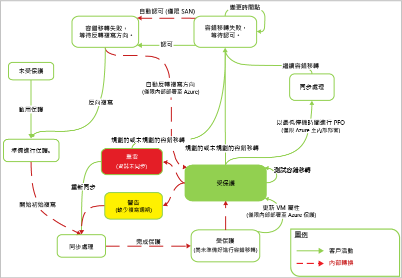

# Azure Site Recovery 如何運作？

閱讀本文，了解 Azure Site Recovery 服務的基礎架構以及讓它運作的元件。

組織需要 BCDR 策略，以決定應用程式、工作負載和資料如何在規劃與未規劃停機期間維持運作，並儘速復原到正常運作的情況。 BCDR 策略應保護商務資料安全且可復原，並確保發生災害時工作負載仍持續可用。

Site Recovery 是一項 Azure 服務，可藉由將內部部署實體伺服器和虛擬機器的複寫協調至雲端 (Azure) 或次要資料中心，協助您的 BCDR 策略。 當您的主要位置發生故障時，您容錯移轉至次要位置，讓應用程式和工作負載保持可用。 當它恢復正常作業時，容錯回復至您的主要位置。 深入了解 [什麼是 Site Recovery？](site-recovery-overview.md)

本文說明 [Azure 入口網站](https://portal.azure.com)中的部署作業。 [Azure 傳統入口網站](https://manage.windowsazure.com/)可用來維護現有的 Site Recovery 保存庫，但無法建立新的保存庫。

若有任何意見，請張貼於文末。 請在 [Azure Recovery Services Forum (Azure 復原服務論壇)](https://social.msdn.microsoft.com/forums/azure/home?forum=hypervrecovmgr)提出技術問題。

## 部署案例

部署 Site Recovery 即可在一些案例中協調複寫：

- **複寫 VMware 虛擬機器**：您可以將內部部署 VMware 虛擬機器複寫至 Azure 或次要資料中心。
- **複寫實體機器**：您可以將實體機器 (Windows 或 Linux) 複寫至 Azure 或次要資料中心。 複寫實體機器的程序和複寫 VMware VM 的程序幾乎完全相同。
- **複寫 Hyper-V VM**︰您可以將 Hyper-V VM 複寫至 Azure 或次要 VMM 網站。 想要複寫至次要網站的 Hyper-V VM 必須是在 System Center Virtual Machine Manager (VMM) 雲端中進行管理。
- **移轉 VM**︰除了將內部部署 VM 和實體伺服器複寫 (複寫、容錯移轉和容錯回復) 至 Azure 外，您也可以將其移轉至 Azure VM (複寫、容錯移轉，但不可容錯回復)。 以下是您可以移轉的項目︰
    - 將在內部部署 Hyper-V VM、VMware VM 和實體伺服器上執行的工作負載，移轉到 Azure VM 上來執行。
    - 在 Azure 區域之間移轉 [Azure IaaS VM](site-recovery-migrate-azure-to-azure.md)。 此案例目前只支援移轉，亦即不支援容錯回復。
    - 將 [AWS Windows 執行個體](site-recovery-migrate-aws-to-azure.md)移轉到 Azure IaaS VM。 此案例目前只支援移轉，亦即不支援容錯回復。

Site Recovery 可複寫在受支援 VM 和實體伺服器上執行的應用程式。 您可以在 [Azure Site Recovery 可以保護哪些工作負載？](site-recovery-workload.md)

## 將 VMware VM/實體伺服器複寫至 Azure

### 元件

**元件** | **詳細資料**
--- | ---
**Azure** | 在 Azure 中，您需要 Microsoft Azure 帳戶、Azure 儲存體帳戶和 Azure 網路。   儲存體和網路可以是 Resource Manager 帳戶或傳統帳戶。    所複寫的資料會儲存在儲存體帳戶中，而在從內部部署網站進行容錯移轉時，便會以複寫的資料建立 Azure VM。 Azure VM 在建立後會連線到 Azure 虛擬網路。
**組態伺服器** | 您會在內部部署環境設定組態伺服器，以協調內部部署網站和 Azure 之間的通訊，以及管理資料複寫。
**處理序伺服器** | 預設會安裝在內部部署組態伺服器上。   會做為複寫閘道器。 從受保護的來源機器接收複寫資料、以快取最佳化、壓縮和加密，以及將資料傳送至 Azure 儲存體。   處理用來保護機器的行動服務的推入安裝，並執行 VMWare VM 的自動探索。   隨著部署規模擴大，您可以新增更多個別的專用處理序伺服器，以處理日益增加的複寫流量。
**主要目標伺服器** | 預設會安裝在內部部署組態伺服器上。   在從 Azure 容錯回復期間，處理複寫資料。 如果容錯回復的流量很高，您可以部署個別的主要目標伺服器來供容錯回復使用。
**VMware 伺服器** | 您會將 vCenter 和 vSphere 伺服器新增至復原服務保存庫，以便複寫 VMware VM。   如果您要複製實體伺服器，則需要內部部署的 VMware 基礎結構以供進行容錯回復。 您無法容錯回復到實體機器。
**複寫的機器** | 行動服務必須安裝在您要複寫的每部機器上。 您可以手動將它安裝在每部電腦上，或是從處理序伺服器進行推入安裝。

**圖 1：VMware 到 Azure 的元件**

### 複寫程序

1. 您要設定部署 (包括 Azure 元件) 和復原服務保存庫。 在保存庫中指定複寫來源和目標、設定組態伺服器、新增 VMware 伺服器、建立複寫原則、部署行動服務、啟用複寫，以及執行測試容錯移轉。
2.  機器根據複寫原則開始複寫，並將資料的初始複本複寫到 Azure 儲存體。
4. 初始複寫完成之後，就會開始將差異變更複寫到 Azure。 機器的追蹤變更會保存在 .hrl 檔案中。
    - 複寫機器會在輸入連接埠 HTTPS 443 上與組態伺服器進行通訊，以管理複寫。
    - 複寫機器會在輸入連接埠 HTTPS 9443 (可加以設定) 上將複寫資料傳送至處理序伺服器。
    - 組態伺服器會透過輸出連接埠 HTTPS 443 與 Azure 協調複寫管理。
    - 處理序伺服器會透過輸出連接埠 443，接收來源機器所傳來的資料、將其最佳化並加密，再將它傳送至 Azure 儲存體。
    - 如果您啟用多部 VM 一致性，則複寫群組中的機器會透過連接埠 20004 彼此通訊。 如果您將多部機器群組為幾個共用當機時保持一致復原點和應用程式一致復原點的複寫群組，當這些群組在進行容錯移轉時，便會使用多部 VM。 如果機器執行的是相同的工作負載，且需要保持一致，此功能就很實用。
5. 流量透過網際網路複寫到 Azure 儲存體的公用端點。 或者，您可以使用 Azure ExpressRoute [公用對等](https://docs.microsoft.com/en-us/azure/expressroute/expressroute-circuit-peerings#public-peering)。 不支援從內部部署網站透過站台對站台 VPN 將流量複寫至 Azure。

**圖 2：VMware 到 Azure 的複寫**

### 容錯移轉和容錯回復程序

1. 您要執行從內部部署 VMware VM 與實體伺服器至 Azure 的非計劃性容錯移轉。 不支援有計劃的容錯移轉。
2. 您可以容錯移轉單一機器，或建立[復原計劃](site-recovery-create-recovery-plans.md)來協調多部機器的容錯移轉。
3. 當您執行容錯移轉時，Azure 中會建立複本 VM。 您要認可讓容錯移轉開始存取來自複本 Azure VM 的工作負載。
4. 當主要的內部部署網站恢復可用狀態時，您就可以容錯回復。 您要設定容錯回復基礎結構、開始將機器從次要網站複寫到主要網站，以及從次要網站執行非計劃性容錯移轉。 在認可此容錯移轉後，資料會回到內部部署網站，而您必須再次啟用複寫至 Azure 的功能。 [深入了解](site-recovery-failback-azure-to-vmware.md)

容錯回復有以下幾項需求︰

- **不支援實體對實體容錯回復**︰這表示如果您將實體伺服器容錯移轉至 Azure，然後想要容錯回復，則必須容錯回復至 VMware VM。 您無法容錯回復到實體伺服器。 您需要 Azure VM 以供容錯回復，如果您並未將組態伺服器部署為 VMware VM，則必須設定個別的主要目標伺服器來做為 VMware VM。 之所以需要如此，是因為主要目標伺服器會與 VMware 儲存體互動並與其連接，以將磁碟還原至 VMware VM。
- **Azure 中的暫存處理序伺服器**︰如果您想要在容錯移轉後從 Azure 容錯回復，您必須將 Azure VM 設定為處理序伺服器，以處理來自 Azure 的複寫。 容錯回復完成後，您可以刪除此 VM。
- **VPN 連線**：如需容錯回復，您需要設定從 Azure 網路到內部部署網站的 VPN 連線 (或 Azure ExpressRoute)。
- **個別內部部署主要目標伺服器**︰內部部署主要目標伺服器會處理容錯回復。 主要目標伺服器預設會安裝在管理伺服器上，但如果要容錯回復大量資料，您應該就此目的設定個別的內部部署主要目標伺服器。
- **容錯回復原則**︰若要複寫回到內部部署網站，您需要容錯回復原則。 此原則會在您建立複寫原則時自動建立。

**圖 3：VMware/實體容錯回復**

## 將 VMware VM/實體伺服器複寫至次要網站

### 元件

**元件** | **詳細資料**
--- | ---
**Azure** | 您會使用 InMage Scout 部署此案例。 若要取得它，您必須要有 Azure 訂用帳戶。   建立復原服務保存庫之後，您可下載 InMage Scout 並安裝最新的更新，以設定部署。
**處理序伺服器** | 您可以在主要網站中部署處理序伺服器元件，以處理快取、壓縮和資料最佳化。   它也會處理您想要保護的機器的整合代理程式推入安裝。
**VMware ESX/ESXi 和 vCenter 伺服器** |  您需要 VMware 基礎結構以便複寫 VMware VM。
**VM/實體伺服器** |  您可以在想要複寫的 VMware VM 或 Windows/Linux 實體伺服器上安裝整合代理程式。   此代理程式會做為所有元件之間的通訊提供者。
**組態伺服器** | 次要網站上會安裝組態伺服器，以使用管理網站或 vContinuum 主控台來管理、設定和監視您的部署。
**vContinuum 伺服器** | 與組態伺服器安裝在相同的位置。   它會提供主控台來管理及監視您的受保護的環境。
**主要目標伺服器 (次要網站)** | 主要目標伺服器保留複製的資料。 它會從處理序伺服器接收資料，在次要網站中建立複本機器，並且保存資料保留點。   您需要的主要目標伺服器的數目取決於您要保護的機器數目。   如果您想要容錯回復到主要網站，您也需要主要目標伺服器。 此伺服器上會安裝整合代理程式。

### 複寫程序

1. 您會在每個網站 (組態、處理序、主要目標) 中設定元件伺服器，並在您要複寫的機器上安裝整合代理程式。
2. 初始複寫之後，每部機器上的代理程式會將差異複寫變更傳送至處理序伺服器。
3. 處理序伺服器會最佳化此資料，並且將其傳輸至次要網站上的主要目標伺服器。 設定伺服器會管理複寫程序。

**圖 4：VMware 到 VMware 的複寫**

## 將 Hyper-V VM 複寫至 Azure

### 元件

**元件** | **詳細資料**
--- | ---
**Azure** | 在 Azure 中，您需要 Microsoft Azure 帳戶、Azure 儲存體帳戶和 Azure 網路。   儲存體和網路可以是 Resource Manager 型帳戶或傳統帳戶。   所複寫的資料會儲存在儲存體帳戶中，而在從內部部署網站進行容錯移轉時，便會以複寫的資料建立 Azure VM。   Azure VM 在建立後會連線到 Azure 虛擬網路。
**VMM 伺服器** | 如果您的 Hyper-V 主機位於 VMM 雲端中，則需要設定邏輯和 VM 網路以設定[網路對應](site-recovery-network-mapping.md)。 VM 網路應該連結到與雲端相關聯的邏輯網路。
**Hyper-V 主機** | 您需要一或多個 Hyper-V 主機伺服器。
**Hyper-V VM** | 您必須在 Hyper-V 主機伺服器上擁有一或多個 VM。 在 Hyper-V 主機上執行的提供者會透過網際網路協調使用 Site Recovery 服務的複寫。 此代理程式會透過 HTTPS 443 來處理資料複寫。 來自提供者和代理程式的通訊都是安全且加密的。 Azure 儲存體中的複寫的資料也會加密。

## 複寫程序

1. 您要設定 Azure 元件。 我們建議您先設定儲存體和網路帳戶，再開始 Site Recovery 部署。
2. 您要建立用於 Site Recovery 的複寫服務保存庫，並設定保存庫設定，包括︰
    - 如果您不是在 VMM 雲端中管理 Hyper-V 主機，則要建立 Hyper-V 網站容器，並對其新增 Hyper-V 主機。
    - 複寫來源和目標。 如果 Hyper-V 主機是在 VMM 中進行管理，來源是 VMM 雲端。 如果不是，則來源是 Hyper-V 網站。
    - 安裝 Azure Site Recovery 提供者和 Microsoft Azure 復原服務代理程式。 如果您有 VMM，提供者將會安裝在其中，至於代理程式，則會安裝在每一部 Hyper-V 主機上。 如果您沒有 VMM，提供者和代理程式則會安裝在每部主機上。
    - 您要建立 Hyper-V 網站或 VMM 雲端的複寫原則。 此原則會套用至位於網站或雲端中之主機上的所有 VM。
    - 您要啟用 Hyper-V VM 的複寫。 初始複寫會根據複寫原則設定來進行。
4. 資料變更會受到追蹤，在初始複寫完成之後，就會開始將差異變更複寫到 Azure。 項目的追蹤變更會保存在 .hrl 檔案中。
5. 您要執行測試容錯移轉，以確定一切都沒問題。

### 容錯移轉和容錯回復程序

1. 您可以執行從內部部署 Hyper-V VM 至 Azure 的計劃性或非計劃性[容錯移轉](site-recovery-failover.md)。 如果您執行計劃性容錯移轉，則來源 VM 會關閉以確保不會遺失資料。
2. 您可以容錯移轉單一機器，或建立[復原計劃](site-recovery-create-recovery-plans.md)來協調多部機器的容錯移轉。
4. 執行容錯移轉之後，您應該就會在 Azure 中看到所建立的複本 VM。 如有必要，您可以對 VM 指派公用 IP 位址。
5. 然後，您要認可讓容錯移轉開始存取來自複本 Azure VM 的工作負載。
6. 當主要的內部部署網站恢復可用狀態時，您就可以容錯回復。 您可以啟動從 Azure 至主要網站的計劃性容錯移轉。 針對計劃性容錯移轉，您可以選取要容錯回復至相同 VM 或其他位置，並同步處理 Azure 和內部部署之間的變更，以確保不會遺失任何資料。 在內部部署中建立了 VM 後，您就可以認可容錯移轉。

**圖 5：Hyper-V 網站至 Azure 的複寫**

**圖 6：VMM 雲端中之 Hyper-V 至 Azure 的複寫**

## 將 Hyper-V VM 複寫至次要站台

### 元件

**元件** | **詳細資料**
--- | ---
**Azure 帳戶** | 您需要 Microsoft Azure 帳戶。
**VMM 伺服器** | 我們建議主要網站與次要網站中各要有一部連線到網際網路的 VMM 伺服器。   每一部伺服器都應該有至少一個 VMM 私人雲端，並設定好 Hyper-V 功能設定檔。   您會在 VMM 伺服器上安裝 Azure Site Recovery Provider。 此提供者會透過網際網路與 Site Recovery 服務協調進行複寫。 Provider 和 Azure 之間的通訊都是安全且加密的。
**Hyper-V 伺服器** |  在主要和次要 VMM 雲端中，您需要有一或多部 Hyper-V 主機伺服器。 伺服器應連線到網際網路。   在主要和次要 Hyper-V 主機伺服器之間，使用 Kerberos 或憑證驗證透過 LAN 或 VPN 來複寫資料。  
**來源機器** | 來源 Hyper-V 主機伺服器應該至少有一個您想要複寫的 VM。

## 複寫程序

1. 您要設定 Azure 帳戶。
2. 您要建立用於 Site Recovery 的複寫服務保存庫，並設定保存庫設定，包括︰

    - 複寫來源和目標 (主要和次要網站)。
    - 安裝 Azure Site Recovery 提供者和 Microsoft Azure 復原服務代理程式。 提供者安裝在 VMM 伺服器上，代理程式則安裝在每一部 Hyper-V 主機上。
    - 您要建立來源 VMM 雲端的複寫原則。 此原則會套用至位於雲端主機上的所有 VM。
    - 您要啟用 Hyper-V VM 的複寫。 初始複寫會根據複寫原則設定來進行。
4. 資料變更會受到追蹤，而在初始複寫完成之後，就會開始複寫差異變更。 項目的追蹤變更會保存在 .hrl 檔案中。
5. 您要執行測試容錯移轉，以確定一切都沒問題。

**圖 7：VMM 至 VMM 的複寫**

### 容錯移轉和容錯回復程序

1. 您可以在內部部署網站間執行計劃性或非計劃性的[容錯移轉](site-recovery-failover.md)。 如果您執行計劃性容錯移轉，則來源 VM 會關閉以確保不會遺失資料。
2. 您可以容錯移轉單一機器，或建立[復原計劃](site-recovery-create-recovery-plans.md)來協調多部機器的容錯移轉。
4. 如果您執行非計劃性容錯移轉到次要網站，則在容錯移轉之後，次要位置中的容錯移轉機器不會啟用保護或複寫。 如果您執行計劃性容錯移轉，則在容錯移轉之後，次要位置中的容錯移轉機器會受到保護。
5. 然後，您要認可讓容錯移轉開始存取來自複本 VM 的工作負載。
6. 當主要網站恢復可用狀態時，您就可以起始從次要網站到主要網站的反向複寫作業。 反向複寫會讓虛擬機器進入受保護的狀態，但是次要資料中心仍是使用中位置。
7. 若要讓主要網站再次成為使用中位置，您需要起始從次要網站到主要網站的計劃性容錯移轉，然後再進行另一個反向複寫。

### Hyper-V 複寫工作流程

**工作流程階段** | **動作**
--- | ---
1.**啟用保護** | 啟用 Hyper-V VM 的保護之後，便會起始**啟用保護**作業，以檢查機器是否符合先決條件。 該作業會叫用兩種方法︰   [CreateReplicationRelationship](https://msdn.microsoft.com/library/hh850036.aspx)，以使用您的設定來設定複寫。   [StartReplication](https://msdn.microsoft.com/library/hh850303.aspx)，以初始化完整的 VM 複寫。
2.**初始複寫** |  擷取虛擬機器快照，並且逐一複寫虛擬硬碟，直到它們全部複製到次要位置。   完成此作業所需的時間取決於 VM 大小、網路頻寬，以及初始複寫方法。   如果在初始複寫正在進行時發生磁碟變更，Hyper-V 複本複寫追蹤器會追蹤這些變更，並記錄在 Hyper-V 複寫記錄檔 (.hrl)，這類檔案位於與磁碟相同的資料夾中。   每個磁碟都有一個相關聯的.hrl 檔案，將會傳送至次要儲存體。   當初始複寫正在進行時，快照和記錄檔會取用磁碟資源。 當初始複寫完成時，會刪除 VM 快照，並且會同步處理和合併記錄檔中的差異磁碟變更。
3.**完成保護** | 初始複寫完成之後，**完成保護**作業會設定網路和其他複寫後設定，如此就能讓虛擬機器受到保護。   如果您要複寫至 Azure，您可能需要調整虛擬機器的設定，使其準備好進行容錯移轉。   此時，您可以執行測試容錯移轉，以確認一切如預期般運作。
4.**複寫** | 在初始複寫之後，會根據複寫設定，開始進行差異同步處理。   **複寫失敗**：如果差異複寫失敗且完整複寫因為頻寬或時間需要大量成本，就會發生重新同步處理。 例如，如果 .hrl 檔案達到磁碟大小的 50%，系統就會標示 VM 以便重新同步處理。 重新同步處理會計算來源和目標虛擬機器的總和檢查碼，並只傳送差異部分，藉此將傳送的資料量降至最低。 重新同步處理完成之後，會繼續進行差異複寫。 根據預設，重新同步處理會排程在上班時間以外的時間自動執行，但是您可以手動重新同步處理虛擬機器。   **複寫錯誤**：如果發生複寫錯誤，會有內建的重試。 如果它是無法復原的錯誤，例如驗證或授權錯誤，或複本機器處於無效狀態，則不會嘗試重試。 如果它是可復原的錯誤，例如網路錯誤，或低磁碟空間/記憶體，則會發生重試，重試之間的間隔會遞增 (1、2、4、8、10，然後每隔 30 分鐘)。
5.**計劃性/非計劃性容錯移轉** | 您可以視需要執行計劃性或非計劃性容錯移轉。   如果您執行計劃性容錯移轉，則來源 VM 會關閉以確保不會遺失資料。   建立複本 VM 之後，它們即會處於認可擱置中的狀態。 您需要認可它們以完成容錯移轉。   主要網站已啟動並執行之後，您就可以在主要網站可用時容錯回復至其中。

**圖 8：Hyper-V 工作流程**

## 後續步驟

[準備部署](site-recovery-best-practices.md)

<!--HONumber=Jan17_HO1-->

