#Azure Site Recovery Deployment Planner
這是 VMware 到 Azure 生產部署的 Azure Site Recovery Deployment Planner 使用者指南。

##概觀

使用 Azure Site Recovery 保護任何 VMware 虛擬機器之前，您必須根據每日資料變化率來配置足夠的頻寬，以符合所需的 RPO。 您必須在內部部署環境中部署適當的組態伺服器和處理序伺服器數目。 您還必須建立適當的目標 Azure 儲存體帳戶類型 (標準或進階) 和數目，將使用量隨時間增加所造成的來源生產伺服器成長納入考量。 每部虛擬機器的儲存體類型是根據工作負載特性 (R/W IOPS、資料變換) 和 Azure Site Recovery 限制來決定。  

Azure Site Recovery Deployment Planner Public Preview 是一項命令列工具，目前僅適用於 VMware 到 Azure 案例。 您可以使用此工具從遠端剖析 VMware 虛擬機器 (完全不影響實際運作)，以了解成功複寫與測試容錯移轉的頻寬和 Azure 儲存體需求。  您不需安裝任何 Azure Site Recovery 內部部署元件，即可執行此工具。然而要取得精確的已達成輸送量結果，則建議在以下 Windows 伺服器上執行 Planner：符合您在生產環境部署的前幾個步驟中最終需要部署之 Azure Site Recovery 組態伺服器的最低需求。

此工具提供下列詳細資料︰

**相容性評估** 
* 以磁碟數目、磁碟大小、IOPS 和變換為基礎的虛擬機器合適性評估

**網路頻寬需求與RPO 評估** 
* 差異複寫所需的預估網路頻寬 
* Azure Site Recovery 可以從內部部署至 Azure 取得的輸送量 
* 要根據在給定時間量內完成初始複寫所需預估頻寬劃分批次的虛擬機器數目 

**Microsoft Azure 基礎結構需求** 
* 每部虛擬機器的儲存體類型 (標準或進階儲存體) 需求 
* 為了複寫所要佈建的標準和進階儲存體帳戶總數 
* 以 Azure 儲存體指引為基礎的儲存體帳戶命名建議 
* 每部虛擬機器的儲存體帳戶放置 
* 在訂用帳戶上進行測試容錯移轉/容錯移轉之前所要佈建的 Microsoft Azure 核心數目 
* 每部內部部署虛擬機器的建議 Microsoft Azure 虛擬機器大小 

**內部部署基礎結構需求** 
* 要在內部部署環境中部署的必要組態伺服器和處理序伺服器數目 

>[!IMPORTANT]
>
>工具中的上述所有計算都假設工作負載特性的成長因子為 30% (因為使用量可能會隨時間增加)，並採用所有剖析計量 (R/W IOPS、變換等) 的第 95 個百分位數。這兩個參數 – 成長因子和百分位數計算皆可設定。 深入了解[成長因子](site-recovery-deployment-planner.md#growth-factor)和[用於計算的百分位數值](site-recovery-deployment-planner.md#percentile-value-used-for-the-calculation)。
>

## 需求
此工具有兩個主要階段 – 剖析和報告產生。 另外還有第三個選項：只計算輸送量。 以下是起始剖析 / 輸送量測量之伺服器的需求。

| 需求 | 說明|
|---|---|
|剖析和輸送量測量|  作業系統：Microsoft Windows Server 2012 R2  最好至少符合下列組態伺服器[大小](https://aka.ms/asr-v2a-on-prem-components) 機器組態︰8 個 vCPu、16 GB RAM、300 GB HDD [VMware vSphere PowerCLI 6.0 R3](https://developercenter.vmware.com/tool/vsphere_powercli/6.0) [適用於 Visual Studio 2012 的 Microsoft Visual C++ 可轉散發套件](https://aka.ms/vcplusplus-redistributable)  透過網際網路從這部伺服器存取 Microsoft Azure  Microsoft Azure 儲存體帳戶 伺服器的系統管理員存取權 100 GB 的可用磁碟空間下限 (假設剖析平均各有 3 個磁碟的 1000 部虛擬機器 30 天)|
| 報告產生| 任何具有 Microsoft Excel 2013 和更新版本的 Windows PC/Windows Server |
| 使用者權限 | 使用者帳戶的唯讀權限，在剖析期間用來存取 VMware vCenter/vSphere 伺服器|

> [!NOTE]
>
> 此工具只能剖析具有 VMDK 和 RDM 磁碟的虛擬機器。 不能剖析具有 iSCSI 或 NFS 磁碟的虛擬機器。 雖然 Azure Site Recovery 支援 VMware 伺服器適用的 iSCSI 和 NFS 磁碟 (前提是部署規劃工具不在客體內，而且只使用 vCenter 效能計數器進行剖析)，但此工具看不見這些磁碟類型。
>

##下載
[下載](https://aka.ms/asr-deployment-planner)最新版的 Azure Site Recovery Deployment Planner Public Preview。  此工具是以 zip 格式進行封裝。  目前的工具版本僅支援 VMware 到 Azure 案例。

從您要執行工具的位置將 zip 檔案複製到 Windows Server。 雖然您可以從任何可透過網路連接到 VMware vCenter Server 或 VMware vSphere ESXi 主機 (其中包含要剖析的虛擬機器) 的 Windows Server 2012 R2 執行此工具，建議您在硬體組態依循[組態伺服器調整大小指導方針](https://aka.ms/asr-v2a-on-prem-components)的伺服器上執行此工具。  如果您已在內部部署環境部署 Azure Site Recovery 元件，您應該從組態伺服器執行此工具。 建議您執行此工具的伺服器具有與組態伺服器 (已內建處理序伺服器) 相同的硬體組態，這麼一來，工具回報的達成輸送量將符合 Azure Site Recovery 可在複寫期間達成的實際輸送量 - 輸送量計算取決於伺服器上可用的網路頻寬與伺服器的硬體組態 (CPU、儲存體等)。 如果您從任何其他伺服器執行此工具，將會計算從該伺服器至 Microsoft Azure 的輸送量，再加上伺服器的硬體組態可能會不同於組態伺服器，所以工具回報的達成輸送量便不精確。

將 zip 資料夾解壓縮。 您可以看到多個檔案和子資料夾。 可執行檔是父資料夾中的 ASRDeploymentPlanner.exe。

範例：將 .zip 檔案複製到 E:\ 磁碟機並將它解壓縮。
E:\ASR Deployment Planner-Preview_v1.1.zip

E:\ASR Deployment Planner-Preview_v1.1\ ASR Deployment Planner-Preview_v1.1\ ASRDeploymentPlanner.exe

##功能
可以使用下列任何模式 (共三種) 執行命令列工具 (ASRDeploymentPlanner.exe)：

1.    剖析  
2.    報告產生
3.    取得輸送量

您必須先在剖析模式中執行此工具，以蒐集虛擬機器資料變換和 IOPS。  然後執行此工具來產生報告，以找出網路頻寬、儲存體需求。

##剖析
在剖析模式中，Deployment Planner 工具會連接到 vCenter Server 或 vSphere ESXi 主機，以收集有關虛擬機器的效能資料。

* 剖析作業並不會直接連線到生產虛擬機器，所以不會影響生產虛擬機器的效能。 所有效能資料都是從 vCenter Server / vSphere ESXi 主機收集而來。
* 系統會每隔 15 分鐘查詢一次 VCenter Server / vSphere EXSi 主機，以確保剖析對伺服器造成的影響微不足道。 不過，這並不會損及剖析精確度，因為此工具會儲存每分鐘的效能計數器資料。

####建立要剖析的虛擬機器清單
首先，您需要有想要剖析的虛擬機器清單。 您可以使用下列 VMware vSphere PowerCLI 命令，取得 VMware vCenter 或 VMware vSphere ESXi 主機上的所有虛擬機器名稱。 或者，您可以只列出您想要以手動方式在檔案中剖析的好記虛擬機器名稱 / IP 位址。

1.    登入已安裝 VMware vSphere PowerCLI 的虛擬機器
2.    開啟 VMware vSphere PowerCLI 主控台
3.    確保指令碼的執行原則並未停用。 如果已停用啟動系統管理員模式中的 VMware vSphere PowerCLI 主控台，請執行下列命令來啟用它︰

            Set-ExecutionPolicy –ExecutionPolicy AllSigned

4.    執行下列兩個命令以取得 VMware vCenter 或 VMware vSphere ESXi 上所有的虛擬機器名稱，並儲存在 .txt 檔案中。
以您的輸入取代 &lsaquo;server name&rsaquo;、&lsaquo;user name&rsaquo;、&lsaquo;password&rsaquo;、&lsaquo;outputfile.txt&rsaquo;。

            Connect-VIServer -Server <server name> -User <user name> -Password <password>

            Get-VM |  Select Name | Sort-Object -Property Name >  <outputfile.txt>

5.    在「記事本」中開啟輸出檔案。 將您想要剖析的所有虛擬機器名稱複製到另一個檔案 (例如 ProfileVMList.txt)，每一行一個虛擬機器名稱。 此檔案將做為命令列工具之 -VMListFile 參數的輸入

    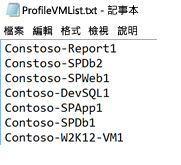

####開始剖析
取得要剖析的 VM 清單之後，您現在可以在剖析模式中執行此工具。 以下是要在剖析模式中執行之工具的必要和選擇性參數清單。 [] 中的參數是選擇性的。

ASRDeploymentPlanner.exe -Operation StartProfiling /?

| 參數名稱 | 說明 |
|---|---|
| -Operation |      StartProfiling |
| -Server | 要剖析其虛擬機器之 vCenter Server/ESXi 主機的完整網域名稱或 IP 位址。|
| -User | 用於連線至 vCenter Server/ESXi 主機的使用者名稱。 使用者必須至少具備唯讀存取權限。|
| -VMListFile |    包含要剖析之虛擬機器清單的檔案。 此檔案路徑可以是絕對或相對路徑。 此檔案的每一行應包含一個虛擬機器名稱/IP 位址。 檔案中指定的虛擬機器名稱應該與 vCenter Server 或 ESXi 主機上的 VM 名稱相同。   例如：“VMList.txt” 檔案包含下列虛擬機器︰ virtual_machine_A  10.150.29.110 virtual_machine_B |
| -NoOfDaysToProfile | 要執行剖析的天數。 建議您執行剖析 15 天以上，以確保觀察到指定期間內您環境中的工作負載模式，並用來提供精確的建議 |
| [-Directory] |    用來儲存剖析期間所產生之剖析資料的 UNC 或本機目錄路徑。 如果未指定，目前路徑下名為 'ProfiledData' 的目錄將會做為預設目錄。 |
| [-Password ] | 用於連線至 vCenter Server/ESXi 主機的密碼。 如果現在未指定，系統將會在命令執行時提示您輸入密碼。|
|  [-StorageAccountName]  | Azure 儲存體帳戶名稱，用於找出從內部部署至 Azure 的資料複寫可達成的輸送量。 此工具會將測試資料上傳到此儲存體帳戶，以計算輸送量。|
| [-StorageAccountKey] | 用來存取儲存體帳戶的 Azure 儲存體帳戶金鑰。 移至 Azure 入口網站 > 儲存體帳戶 > [儲存體帳戶名稱] > 設定 > 存取金鑰 > Key1 (或傳統儲存體帳戶的主要存取金鑰)。 |

建議至少剖析您的虛擬機器 15 到 30 天。 在剖析期間，ASRDeploymentPlanner.exe 會持續執行。 此工具會採用剖析階段輸入 (以天為單位)。 如果您想要剖析數小時或數分鐘的時間，以便進行工具的快速測試，在 Public Preview 中，您必須將時間轉換成相等的天數量值。  例如，若要剖析 30 分鐘，輸入必須是 30 / (60*24) = 0.021 天。  允許的最小剖析時間為 30 分鐘。

在剖析期間，您可以選擇性地傳送 Azure 儲存體帳戶名稱和金鑰，以尋找 Azure Site Recovery 可在從組態伺服器 / 處理序伺服器複寫至 Azure 時達成的輸送量。 如果未在剖析期間傳送 Azure 儲存體帳戶名稱和金鑰，此工具就不會計算可達成的輸送量。

您可以針對不同組的虛擬機器執行多個工具執行個體。 確保虛擬機器名稱不會在任何剖析集中重複出現。 例如，您已剖析&10; 部虛擬機器 (VM1 - VM10)，而在幾天後您想要剖析另外&5; 部虛擬機器 (VM11 - VM15)，您可以針對第二組的虛擬機器 (VM11 - VM15) 從另一個命令列主控台執行此工具。 但確保第二組的虛擬機器沒有任何來自第一個剖析執行個體的虛擬機器名稱，或您使用不同的輸出目錄進行第二次執行。 如有兩個工具執行個體用於剖析相同的虛擬機器並使用相同的輸出目錄，所產生的報告則會不正確。

在剖析作業開始時會擷取一次虛擬機器組態，並儲存在名為 VMDetailList.xml 的檔案。 在產生報告時，將使用這項資訊。 不會擷取從剖析開始至剖析結束之間的任何 VM 組態變更 (例如增加核心、磁碟、NIC 等的數目)。 如有任何剖析的虛擬機器組態在剖析過程中發生變更，在 Public Preview 中，以下是在產生報告時取得最新虛擬機器詳細資料的因應措施。   

* 備份 'VMdetailList.xml' 並從其目前的位置刪除檔案。
* 在報告產生時傳遞 -User 和 -Password 引數。

剖析命令會在剖析目錄中產生數個檔案 - 請不要刪除任何一個檔案，否則報告產生會受到影響。

#####範例 1︰剖析虛擬機器 30 天，並找出從內部部署至 Azure 的輸送量
ASRDeploymentPlanner.exe **-Operation** StartProfiling -Directory “E:\vCenter1_ProfiledData” **-Server** vCenter1.contoso.com **-VMListFile** “E:\vCenter1_ProfiledData\ProfileVMList1.txt”  **-NoOfDaysToProfile**  30  **-User** vCenterUser1 **-StorageAccountName**  asrspfarm1 **-StorageAccountKey** Eby8vdM02xNOcqFlqUwJPLlmEtlCDXJ1OUzFT50uSRZ6IFsuFq2UVErCz4I6tq/K1SZFPTOtr/KBHBeksoGMGw==

#####範例 2：剖析虛擬機器 15 天
ASRDeploymentPlanner.exe **-Operation** StartProfiling **-Directory** “E:\vCenter1_ProfiledData” **-Server** vCenter1.contoso.com **-VMListFile** “E:\vCenter1_ProfiledData\ProfileVMList1.txt”  **-NoOfDaysToProfile**  15  -User vCenterUser1

#####範例 3：剖析虛擬機器 1 小時以便快速測試工具
ASRDeploymentPlanner.exe **-Operation** StartProfiling **-Directory** “E:\vCenter1_ProfiledData” **-Server** vCenter1.contoso.com **-VMListFile** “E:\vCenter1_ProfiledData\ProfileVMList1.txt”  **-NoOfDaysToProfile**  0.04  **-User** vCenterUser1

>[!NOTE]
>
> * 如果此工具執行所在的伺服器已重新啟動或已當機，或如果您使用 Ctrl + C 結束工具，則會保留剖析的資料。 因此，過去 15 分鐘的剖析資料有可能會遺失。 您必須在伺服器開始備份之後，在剖析模式中重新執行此工具。
>
> * 傳遞 Azure 儲存體帳戶名稱和金鑰時，此工具會在剖析的最後一個步驟測量輸送量。 如果此工具在剖析正常完成前終止，則不會計算輸送量。 您可以一律從命令列主控台執行 GetThroughput 作業，以在產生報告之前找到輸送量，否則產生的報告不會包含達成的輸送量資訊。
>

##產生報告
此工具會產生 XLSM (啟用巨集的 Microsoft Excel 檔案) 做為報告輸出，其中摘要說明所有的部署建議 – 報告名為 DeploymentPlannerReport_<Unique Numeric Identifier>.xlsm 且置於指定的目錄中。

剖析完成後，您可以在報告產生模式中執行工具。 以下是要在報告產生模式中執行之工具的必要和選擇性參數清單。 [] 中的參數是選擇性的。

ASRDeploymentPlanner.exe -Operation GenerateReport /?

|參數名稱 | 說明 |
|-|-|
| -Operation | GenerateReport |
| -Server |  將產生報告之已剖析虛擬機器所在的 vCenter/vSphere Server 完整網域名稱或 IP 位址 (使用與您剖析時所用的名稱或 IP 位址完全相同)。 請注意，如果您在剖析時使用 vCenter Server，則無法使用 vSphere Server 產生報告，反之亦然。|
| -VMListFile | 包含要產生報告的剖析虛擬機器清單的檔案。 此檔案路徑可以是絕對或相對路徑。 此檔案的每一行應包含一個虛擬機器名稱/IP 位址。 檔案中指定的虛擬機器名稱應該與 vCenter Server 或 ESXi 主機上的虛擬機器名稱相同，並符合剖析時所用的名稱。|
| [-Directory] | 儲存剖析資料 (剖析期間產生的檔案) 的 UNC 或本機目錄路徑。 產生報告時需要這項資料。 如未指定，將會使用 ‘ProfiledData’ 目錄。 |
| [-GoalToCompleteIR] |    必須完成已剖析虛擬機器之初始複寫的時數。 所產生的報告會提供可以在指定的時間內完成初始複寫的虛擬機器數目。 預設值為 72 小時。 |
| [-User] | 用於連線至 vCenter/vSphere Server 的使用者名稱。 這用來擷取虛擬機器的最新組態資訊 (如磁碟數目、核心數目、NIC 數目等)，以使用於報告中。 如未提供，則會使用剖析開始時收集的組態資訊。 |
| [-Password] | 用於連線至 vCenter Server/ESXi 主機的密碼。 如果未指定為一個參數，系統將會在命令執行時提示您稍後輸入密碼。 |
| [-DesiredRPO] | 以分鐘為單位的所需復原點目標 (RPO)。 預設值為 15 分鐘。|
| [-Bandwidth] | 頻寬 (以 Mbps 為單位)。 這用來計算指定的頻寬可達成的 RPO。 |
| [-StartDate]  | 採用 MM-DD-YYYY:HH:MM 格式 (24 小時制) 的開始日期和時間。 ‘StartDate’ 必須與 ‘EndDate’ 一起指定。 若已指定，將會針對在 StartDate 與 EndDate 之間收集的剖析資料產生報告。 |
| [-EndDate] | 採用 MM-DD-YYYY:HH:MM 格式 (24 小時制) 的結束日期和時間。 ‘EndDate’ 必須與 ‘StartDate’ 一起指定。 若已指定，將會針對在 StartDate 與 EndDate 之間收集的剖析資料產生報告。 |
| [-GrowthFactor] |以百分比表示的成長因子。 預設值為 30%。  |

##### 範例 1︰當剖析的資料位於本機磁碟機時，使用預設值來產生報告
ASRDeploymentPlanner.exe **-Operation** GenerateReport **-Server** vCenter1.contoso.com **-Directory** “E:\vCenter1_ProfiledData” **-VMListFile** “E:\vCenter1_ProfiledData\ProfileVMList1.txt”

##### 範例 2︰當剖析的資料位於遠端伺服器時產生報告。 使用者應具備遠端目錄的讀取/寫入存取權。
ASRDeploymentPlanner.exe **-Operation** GenerateReport **-Server** vCenter1.contoso.com **-Directory** “\\\\PS1-W2K12R2\vCenter1_ProfiledData” **-VMListFile** “\\\\PS1-W2K12R2\vCenter1_ProfiledData\ProfileVMList1.txt”

##### 範例 3︰使用特定頻寬和目標來產生報告，以在指定的時間內完成 IR
ASRDeploymentPlanner.exe **-Operation** GenerateReport **-Server** vCenter1.contoso.com **-Directory** “E:\vCenter1_ProfiledData” **-VMListFile** “E:\vCenter1_ProfiledData\ProfileVMList1.txt” **-Bandwidth** 100 **-GoalToCompleteIR** 24

##### 範例 4︰使用 5% (而非預設值 30%) 的成長因子來產生報告
ASRDeploymentPlanner.exe **-Operation** GenerateReport **-Server** vCenter1.contoso.com **-Directory** “E:\vCenter1_ProfiledData” **-VMListFile** “E:\vCenter1_ProfiledData\ProfileVMList1.txt” **-GrowthFactor** 5

##### 範例 5︰使用剖析資料子集來產生報告。 假設您有 30 天的剖析資料，而只想要產生 20 天的報告。
ASRDeploymentPlanner.exe **-Operation** GenerateReport **-Server** vCenter1.contoso.com **-Directory** “E:\vCenter1_ProfiledData” **-VMListFile** “E:\vCenter1_ProfiledData\ProfileVMList1.txt” **-StartDate**  01-10-2017:12:30 -**EndDate** 01-19-2017:12:30

##### 範例 6：針對 5 分鐘 RPO 產生報告。
ASRDeploymentPlanner.exe **-Operation** GenerateReport **-Server** vCenter1.contoso.com **-Directory** “E:\vCenter1_ProfiledData” **-VMListFile** “E:\vCenter1_ProfiledData\ProfileVMList1.txt”  **-DesiredRPO** 5

### 用來計算的百分位數值
**產生報告時會使用剖析期間所收集之效能計量的哪些預設百分位數值？**

此工具預設為在所有 VM 的剖析期間收集之 R/W IOPS、寫入 IOPS 及資料變換的第 95 個百分位數值。 這可確保您的 VM 可能由於暫存事件 (例如：一天執行一次的備份作業、定期資料庫索引編製或分析報告產生活動)，或在剖析期間發生的任何其他類似時間點短期事件而看見的第 100 個百分位數高點，不會用來判斷目標 Azure 儲存體和來源頻寬需求。 使用第 95 個百分位數值可提供實際工作負載特性的真實情況，並且讓您在 Microsoft Azure 上執行這些工作負載時獲得最佳效能。 我們不希望您經常變更這個數字，但如果您選擇降低 (例如第 90 個百分位數)，您可以更新預設資料夾中的這個組態檔 'ASRDeploymentPlanner.exe.config' 並加以儲存，以產生現有剖析資料的新報告。

        &lsaquo;add key="WriteIOPSPercentile" value="95" /&rsaquo;>      
        &lsaquo;add key="ReadWriteIOPSPercentile" value="95" /&rsaquo;>      
        &lsaquo;add key="DataChurnPercentile" value="95" /&rsaquo;

### 成長因子
**規劃部署時為何應考量成長因子？**

假設使用量可能會隨著時間增加，請務必考量您的工作負載特性成長。 這是因為如果工作負載特性在受保護後變更，若未停用並重新啟用保護，目前便無法切換到不同的 Azure 儲存體帳戶進行保護。 例如 如果由於在虛擬機器上執行的應用程式使用者數目增加，而有一部虛擬機器符合標準儲存體複寫帳戶&3; 個月的時間；假設 VM 上的變換增加並且需要移至進階儲存體，以便 Azure Site Recovery 複寫能夠處理新的較高變換，您必須停用並重新啟用對進階儲存體帳戶的保護。 因此，強烈建議您在規劃部署時規劃成長，預設值為 30%。 您最瞭解您的應用程式使用量模式和成長預測，可以在產生報告時相應變更此數字。 事實上，您可以使用不同的成長因子，針對相同的剖析資料產生多份報告，看看哪些目標 Azure 儲存體和來源頻寬建議最適合您。

產生的 Microsoft Excel 報告具有下列工作表

* [輸入](site-recovery-deployment-planner.md#input)
* [建議](site-recovery-deployment-planner.md#recommendations-with-desired-rpo-as-input)
* [建議 - 頻寬輸入](site-recovery-deployment-planner.md#recommendations-with-available-bandwidth-as-input)
* [VM<->儲存體放置](site-recovery-deployment-planner.md#vm-storage-placement)
* [相容的 VM](site-recovery-deployment-planner.md#compatible-vms)
* [不相容的 VM](site-recovery-deployment-planner.md#incompatible-vms)

##取得輸送量
若要預估 Azure Site Recovery 在複寫期間可以達成的輸送量 (從內部部署至 Azure)，請以 GetThroughput 模式執行工具。 此工具會計算來自工具執行所在伺服器 (最好是以組態伺服器調整大小指南為基礎的伺服器) 的輸送量。  如果您已在內部部署環境部署 Azure Site Recovery 基礎結構元件，請在組態伺服器上執行此工具。

開啟命令列主控台並移至 ASR 部署計劃工具資料夾。  使用下列參數執行 ASRDeploymentPlanner.exe。 [] 中的參數是選擇性的。

ASRDeploymentPlanner.exe -Operation GetThroughput /?

|參數名稱 | 說明 |
|-|-|
| -operation | GetThroughput |
| [-Directory] | 儲存剖析資料 (剖析期間產生的檔案) 的 UNC 或本機目錄路徑。 產生報告時需要這項資料。 如未指定，將會使用 ‘ProfiledData’ 目錄。  |
| -StorageAccountName | Azure 儲存體帳戶名稱，用於找出從內部部署至 Azure 的資料複寫所耗用的頻寬。 此工具會將測試資料上傳到此儲存體帳戶，以找出所耗用的頻寬。 |
| -StorageAccountKey | 用來存取儲存體帳戶的 Azure 儲存體帳戶金鑰。 移至 Azure 入口網站 > 儲存體帳戶 > [儲存體帳戶名稱] > 設定 > 存取金鑰 > Key1 (或傳統儲存體帳戶的主要存取金鑰)。 |
| -VMListFile | 包含要剖析之虛擬機器清單的檔案，以便計算所耗用的頻寬。 此檔案路徑可以是絕對或相對路徑。 此檔案的每一行應包含一個虛擬機器名稱/IP 位址。 檔案中指定的虛擬機器名稱應該與 vCenter Server 或 ESXi 主機上的虛擬機器名稱相同。 例如 “VMList.txt” 檔案包含下列虛擬機器︰ 虛擬機器_A  10.150.29.110 虛擬機器_B|

此工具會在指定的目錄中建立數個 64MB ‘asrvhdfile<#>.vhd’ (其中 # 是數字) 檔案。  它會將這些檔案上傳至 Azure 儲存體帳戶，以找出輸送量。 測量輸送量後，就會從 Azure 儲存體帳戶和本機伺服器中刪除所有這類檔案。 如果此工具在計算輸送量時因為任何原因而中途終止，它不會從 Azure 儲存體或本機伺服器中刪除檔案，您必須手動加以刪除。

輸送量會在指定的時間點進行測量，而這是 Azure Site Recovery 可以在複寫期間內達成的最大輸送量 (前提是所有其他因子都相同)。 例如，如果任何應用程式開始在相同網路上耗用更多頻寬，則複寫期間的實際輸送量會有所不同。 如果您是從組態伺服器執行 GetThroughput 命令，此工具不會留意任何受保護的虛擬機器和進行中的複寫作業。 如果 GetThroughput 作業在受保護的虛擬機器有高度資料變換與低度資料變換時執行，則測量的輸送量結果會不同。  建議在剖析期間的不同時間點執行工具，以了解可在不同時間達成的輸送量。 在報告中，此工具會顯示最後測量的輸送量。

##### 範例
ASRDeploymentPlanner.exe **-Operation** GetThroughput **-Directory**  E:\vCenter1_ProfiledData **-VMListFile** E:\vCenter1_ProfiledData\ProfileVMList1.txt  **-StorageAccountName**  asrspfarm1 **-StorageAccountKey** by8vdM02xNOcqFlqUwJPLlmEtlCDXJ1OUzFT50uSRZ6IFsuFq2UVErCz4I6tq/K1SZFPTOtr/KBHBeksoGMGw==

>[!NOTE]
>
> * 在具有與組態伺服器相同的儲存體和 CPU 特性的伺服器上執行此工具
>
> * 如需複寫，請佈建建議的頻寬，以符合當時的 RPO 100%。 即使在佈建適當頻寬之後，如果您未看到此工具所報告的達成輸送量有任何增加，請檢查下列各項︰
>
> a. 檢查是否有任何網路服務品質 (QoS) 會限制 Azure Site Recovery 輸送量
>
> b. 檢查 Azure Site Recovery 保存庫是否位於支援的最近實體 Microsoft Azure 區域，以縮小網路延遲
>
> c. 檢查本機儲存體特性並尋求改善硬體 (例如 HDD 變成 SSD 等等)
>
> d. 變更處理序伺服器中的 Azure Site Recovery 設定，以[增加用於複寫的網路頻寬](./site-recovery-plan-capacity-vmware.md#control-network-bandwidth)。
>

##建議以所需的 RPO 做為輸入

###剖析的資料

[剖析的資料期間] 是執行剖析的持續時間。 根據預設，此工具會將所有的剖析資料用於計算，除非在報告產生期間使用 StartDate 和 EndDate 選項針對特定期間產生此報告。

[伺服器名稱] 是為其產生虛擬機器報告之 VMware vCenter 或 ESXi 主機的名稱或 IP 位址。

[所需的 RPO] 是您部署的復原點目標 (RPO)。 預設會計算 RPO 值 15、30 和 60 分鐘所需的網路頻寬。 根據選取項目，在工作表上更新受影響的值。 如果您在產生報告時使用了 DesiredRPOinMin 參數，該值會顯示於此所需的 RPO 下拉式清單中。

###剖析概觀

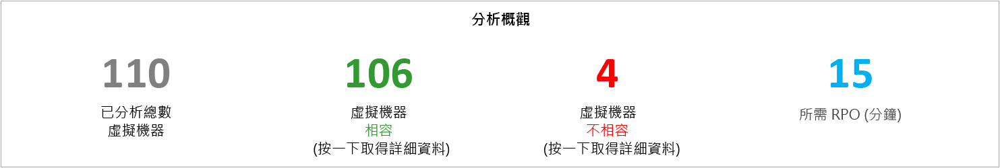

[剖析的虛擬機器總數] 是可取得其剖析資料的虛擬機器總數。 如果 VMListFile 包含任何未剖析虛擬機器的名稱，則這些虛擬機器不會納入報告產生考量並從剖析的虛擬機器總計數中排除。

[相容的虛擬機器] 是可以使用 Azure Site Recovery 受 Azure 保護的虛擬機器數目。 這是相容的虛擬機器總數，系統計算其所需的網路頻寬、Azure 儲存體帳戶數目、Microsoft Azure 核心數目以及組態伺服器和其他處理序伺服器數目。 在報告的 [相容 VM] 工作表中可取得每部相容虛擬機器的詳細資料。

[不相容的虛擬機器] 是可使用 Azure Site recovery 保護之不相容的剖析虛擬機器數目。 底下 [不相容的 VM] 一節會提到不相容的原因。 如果 VMListFile 包含任何未剖析虛擬機器的名稱，則這些虛擬機器會從不相容的虛擬機器計數中排除。 這些虛擬機器會在 [不相容的 VM] 工作表結尾列為「找不到資料」。

[所需的 RPO] 是您所需的 RPO (以分鐘為單位)。 此報告會針對三個 RPO 值 – 15、30 和 60 分鐘而產生 (預設值 15 分鐘)。 報告中的頻寬建議將會隨著您在工作表右上方的 [所需的 RPO] 下拉式清單中選取的項目變更。 如果您已使用 "-DesiredRPO" 參數以自訂值產生報告，這個自訂值將會顯示為 [所需的 RPO] 下拉式清單中的預設值。

###所需的網路頻寬 (Mbps)

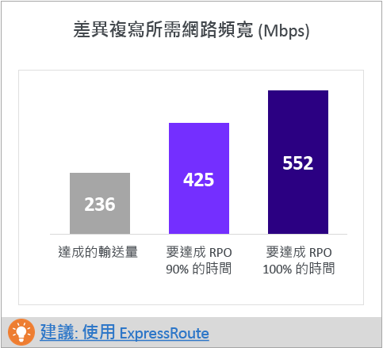

**符合當時的 RPO 100%︰**這是所要配置的建議頻寬 (以 Mbps 為單位)，以符合當時所需的 RPO 100%。 此頻寬量必須專用於您所有相容虛擬機器的穩定狀態差異複寫，以避免任何 RPO 違規。

**符合當時的 RPO 90%**︰如果由於寬頻價格或任何其他原因，您無法佈建符合當時所需 RPO 100% 所需的頻寬，您可以選擇佈建較低的頻寬量，以符合當時所需的 RPO 90%。 若要了解佈建此低頻寬的含意，報告提供了可預期之 RPO 違規次數和持續時間的假設分析。

**達成的輸送量**︰此輸送量來自您已對 Azure 儲存體帳戶所在的 Microsoft Azure 區域執行 GetThroughput 命令的伺服器。 它會指出當您使用 Azure Site Recovery 保護相容虛擬機器時可達成的大概輸送量，前提是您的組態伺服器 / 處理序伺服器儲存體和網路特性仍與您執行此工具的伺服器相同。    

如需複寫，您應該佈建建議的頻寬，以符合當時的 RPO 100%。 即使在佈建適當頻寬之後，如果您未看到此工具所報告的達成輸送量有任何增加，請檢查下列各項︰

a.    檢查是否有任何網路服務品質 (QoS) 會限制 Azure Site Recovery 輸送量

b.    檢查 Azure Site Recovery 保存庫是否位於支援的最近實體 Microsoft Azure 區域，以縮小網路延遲

c.    檢查本機儲存體特性並尋求改善硬體 (例如 HDD 變成 SSD 等等)

d. 變更處理序伺服器中的 Azure Site Recovery 設定，以[增加用於複寫的網路頻寬](./site-recovery-plan-capacity-vmware.md#control-network-bandwidth)。

如果在已有受保護虛擬機器的組態伺服器 / 處理序伺服器上執行此工具，請執行此工具數次，因為達成的輸送量數字會隨著在該特定時間點處理的變換量而改變。

對於所有企業 Azure Site Recovery 部署，建議使用 [ExpressRoute](https://aka.ms/expressroute)。

###所需的 Azure 儲存體帳戶
此圖表顯示保護所有相容虛擬機器所需的 Azure 儲存體帳戶 (標準和進階) 總數。  按一下 [建議 VM 放置計劃] 以得知每部虛擬機器應該使用的儲存體帳戶。  

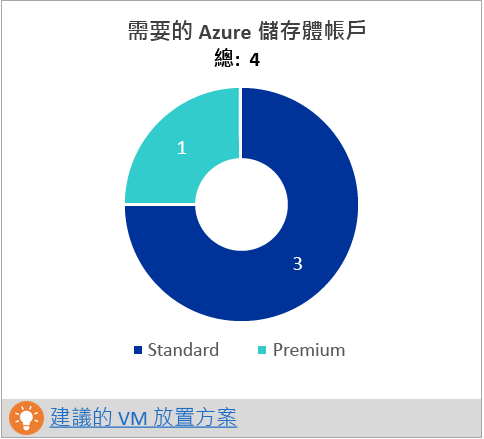

###所需的 Azure 核心數目
這是在所有相容虛擬機器的容錯移轉或測試容錯移轉之前佈建的核心總數。 如果訂用帳戶中沒有足夠的核心，Azure Site Recovery 無法在測試容錯移轉或容錯移轉時建立虛擬機器。

###所需的內部部署基礎結構
這是為了保護所有相容的虛擬機器，所要設定的組態伺服器與其他處理序伺服器總數。 根據最大組態支援的[限制](https://aka.ms/asr-v2a-on-prem-components) - 每日變換或受保護虛擬機器數目上限 (假設每部虛擬機器平均有三個磁碟)，無論在組態伺服器或其他處理序伺服器上何者先達到，此工具都會建議額外的伺服器。 在[輸入](site-recovery-deployment-planner.md#input)工作表中可找到每日變換總計和受保護磁碟總數的詳細資料。

###假設分析
此分析概述當您佈建較低的頻寬，讓所需的 RPO 只符合當時的 90% 時，在剖析期間可發生多少次違規。 在任何指定的一天，可能發生一或多次 RPO 違規 - 以下圖形顯示當天的尖峰 RPO。
根據這項分析，您可以判斷指定的較低頻寬是否可接受所有天數的 RPO 違規次數和每日的尖峰 RPO 目標達成。 如果可接受，您可以配置較低的頻寬進行複寫，否則依照建議配置較高的頻寬，以符合當時所需的 RPO 100%。

###初始複寫的建議 VM 批次大小
本節建議可平行保護的虛擬機器數目，以使用建議的頻寬在 72 小時內完成初始複寫 (可設定的值 – 在報告產生階段使用 GoalToCompleteIR 參數來變更此值)，進而符合佈建階段所需的 RPO 100%。  圖形會顯示各種頻寬值和計算的虛擬機器批次大小計數，以根據在所有相容的虛擬機器中偵測到的平均虛擬機器大小，在 72 小時內完成初始複寫。  

在 Public Preview 中，報告不會指定哪些虛擬機器應包含在某個批次中。 您可以使用 [相容的 VM] 工作表中顯示的磁碟大小，找出每部虛擬機器的大小並選取某個批次的虛擬機器，或根據已知的工作負載特性進行選取。  初始複寫完成時間會根據實際的虛擬機器磁碟大小、已使用的磁碟空間和可用的網路輸送量按比例變更。

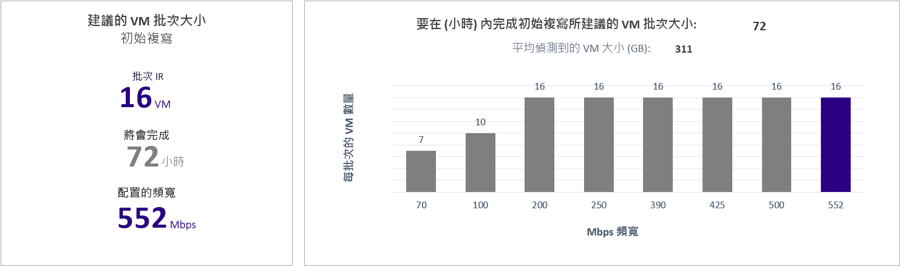

###使用的成長因子和百分位數值
位於工作表底部的這個區段會顯示用於剖析虛擬機器之所有效能計數器的百分位數值 (預設值為第 95 個百分位數)，以及所有計算中用於的成長因子 (預設值為 30%)。

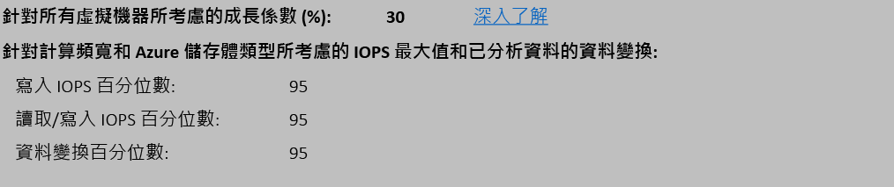

##以可用頻寬做為輸入的建議

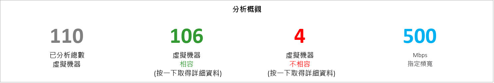

您可能會遇到您知道無法針對 Azure Site Recovery 複寫提供超過 x Mbps 頻寬的情況。 此工具可讓您輸入可用的頻寬 (在產生報告時使用 -Bandwidth 參數)，並取得可達成的 RPO (以分鐘為單位)。 使用此達成的 RPO 值，您可以判斷是否需要佈建額外的頻寬，或可接受具有此 RPO 的災害復原解決方案。

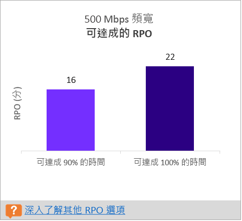

##輸入
[輸入] 頁面提供剖析的 VMware 環境概觀。

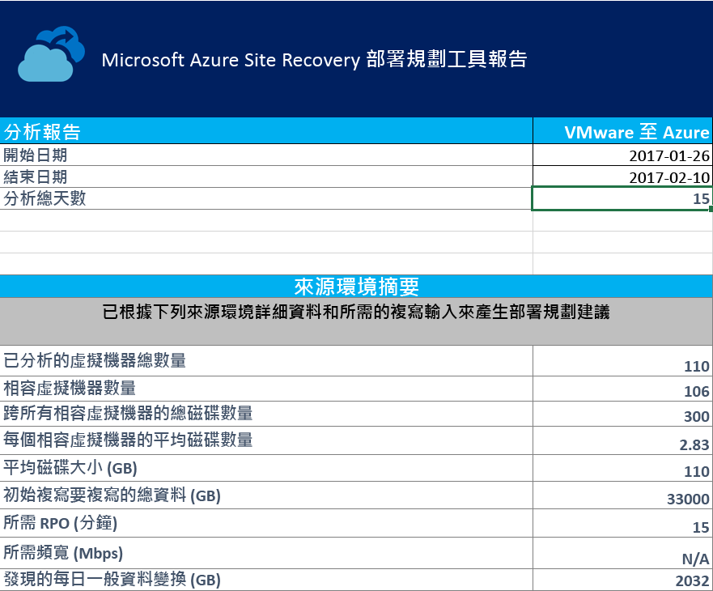

[開始日期和結束日期] 是考慮用於產生報告之剖析資料的開始和結束日期。 根據預設，開始日期是剖析開始的日期，而結束日期是剖析停止的日期。  如果使用這些參數產生報告，這可以是 'StartDate' 和 'EndDate' 值。 開始日期和結束日期：這些是考慮用於產生報告之剖析資料的開始和結束日期。 根據預設，開始日期是剖析開始的日期，而結束日期是剖析停止的日期。  如果使用這些參數產生報告，這可以是 'StartDate' 和 'EndDate' 值。

[剖析總天數] 是為其產生報告之開始和結束日期之間的剖析總天數。 剖析總天數是為其產生報告之開始和結束日期之間的剖析總天數。

[相同的虛擬機器數目] 是相容的虛擬機器總數，系統計算其所需的網路頻寬、所需的 Azure 儲存體帳戶、Microsoft Azure 核心及組態伺服器和其他處理序伺服器數目。
所有相容虛擬機器的磁碟總數就是所有相容虛擬機器中的磁碟總數。 此數字可做為其中一個輸入值，以決定部署中所要使用的組態伺服器與其他處理序伺服器數目。

[每部相容虛擬機器的平均磁碟數] 是在所有相容虛擬機器中計算的平均磁碟數。

[平均磁碟大小 (GB)] 是在所有相容虛擬機器中計算的平均磁碟大小。

[所需的 RPO (分鐘)] 是預設 RPO 或在產生報告時針對 'DesiredRPO' 參數所傳遞的值，用來估計所需的頻寬。

[所需的頻寬 (Mbps)] 是在產生報告時針對 ‘Bandwidth’ 參數所傳遞的值，用來估計可用的 RPO。

[每日觀察到的典型資料變換 (GB)] 是在所有剖析天數中觀察到的平均資料變換。 此數字可做為其中一個輸入值，以決定部署中所要使用的組態伺服器與其他處理序伺服器數目。

##VM 儲存體放置

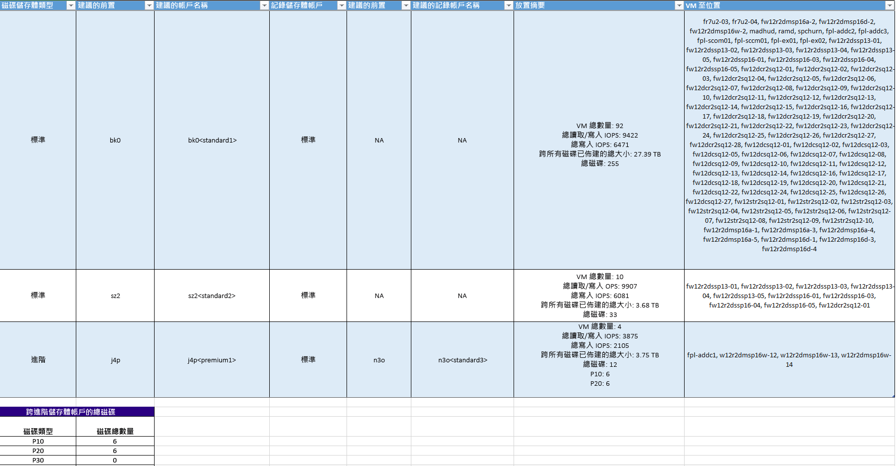

[磁碟儲存體類型] 是「標準」或「進階」Azure 儲存體帳戶，用來複寫 [要放置的 VM] 資料行中提到的所有對應虛擬機器。

[建議的前置詞] 是建議的三個字元前置詞，可用來命名 Azure 儲存體帳戶。 您可以一律使用自己的前置詞，但工具所提供的建議會遵循 [Azure 儲存體帳戶的磁碟分割命名慣例](https://aka.ms/storage-performance-checklist)。

[建議的帳戶名稱] 表示在包含建議的前置詞之後，您的 Azure 儲存體帳戶名稱所應呈現的外觀。 以您的自訂輸入取代 < > 中的名稱。

**記錄檔儲存體帳戶︰**所有複寫記錄檔會儲存在標準 Azure 儲存體帳戶中。 對於要複寫至進階 Azure 儲存體帳戶的虛擬機器，需要針對記錄檔儲存體佈建其他標準 Azure 儲存體帳戶。 多個進階複寫儲存體帳戶可以使用單一標準記錄檔儲存體帳戶。 複寫到標準儲存體帳戶的虛擬機器會對記錄檔使用相同的儲存體帳戶。

[建議的記錄檔帳戶名稱] 表示在包含建議的前置詞之後，您的記錄檔 Azure 儲存體帳戶名稱所應呈現的外觀。 以您的自訂輸入取代 < > 中的名稱。

[放置摘要] 提供在複寫和測試容錯移轉 / 容錯移轉時 Azure 儲存體帳戶上載入的虛擬機器總數摘要。 其中包含對應到 Azure 儲存體帳戶的虛擬機器總數、置於此 Azure 儲存體帳戶之所有虛擬機器的讀取/寫入 IOPS 總計、寫入 (複寫) IOPS 總計、所有磁碟的佈建大小總計，以及磁碟總數。

[要放置的虛擬機器] 會列出應置於指定之 Azure 儲存體帳戶的所有虛擬機器，以提供最佳效能和使用量。

## 相容的 VM
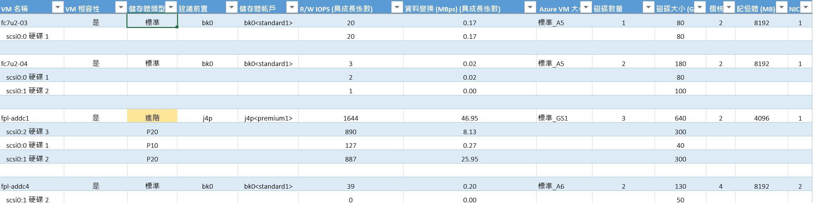

[VM 名稱] 是在產生報告時用於 VMListFile 的虛擬機器名稱或 IP 位址。 此資料行也會列出連接至虛擬機器的磁碟 (VMDK)。 vCenter 上具有重複名稱或 IP 位址的虛擬機器，在提及時會加上 ESXi 主機名稱以便區別每個虛擬機器。 所列出的 ESXi 主機是此工具在分析期間首次探索到虛擬機器時其所在位置的主機。

[VM 相容性] 有兩個值 - 是 / 是*。*「是」適用於虛擬機器適合以下[進階 Azure 儲存體](https://aka.ms/premium-storage-workload)的情況：剖析的高變換 / IOPS 磁碟符合 P20 或 P30 類別，但磁碟大小會導致它向下對應至 P10 或 P20。 Azure 儲存體會根據磁碟大小決定磁碟所要對應至的進階儲存體大小類型 – 即 < 128 GB 為 P10、128 至 512 GB 為 P20，而 512 GB 至 1023 GB 為 P30。 因此如果磁碟的工作負載特性符合 P20 或 P30，但大小使其對應至較低的進階儲存體磁碟類型，此工具會將該虛擬機器標示為 [是*]，並建議您變更來源磁碟大小以符合右邊建議的進階儲存體磁碟類型，或變更容錯移轉後的目標磁碟類型。
儲存體類型為標準或進階。

[建議的前置詞] 是三個字元的 Azure 儲存體帳戶前置詞

[儲存體帳戶] 是使用建議前置詞的名稱

[R/W IOPS (含成長因子)] 是磁碟上的尖峰工作負載 IOPS (預設值為第 95 個百分位數)，包括未來的成長因子 (預設值為 30%)。 請注意，虛擬機器的 R/W IOPS 總計不一定會計入虛擬機器個別磁碟的讀取/寫入 IOPS 總和，因為虛擬機器的尖峰 R/W IOPS 是其個別磁碟在剖析期間每一分鐘之 R/W IOPS 總和的尖峰。

[資料變換 (Mbps) (含成長因子)] 是磁碟上的尖峰變換率 (預設值為第 95 個百分位數)，包括未來的成長因子 (預設值為 30%)。 請注意，虛擬機器的資料變換總計不一定會計入虛擬機器個別磁碟的資料變換總和，因為虛擬機器的尖峰資料變換是其個別磁碟在剖析期間每一分鐘之變換總和的尖峰。

[Azure VM 大小] 是此內部部署虛擬機器理想的對應 Azure 計算虛擬機器大小。 此對應是以內部部署虛擬機器的記憶體、磁碟/核心/NIC 數目及 R/W IOPS 數目為基礎 - 建議一律是符合上述所有內部部署虛擬機器特性的最低 Azure 虛擬機器大小。

[磁碟數目] 是虛擬機器上的磁碟 (VMDK) 總數

[磁碟大小 (GB)] 是虛擬機器的所有磁碟的總佈建大小。 工具也會顯示虛擬機器中個別磁碟的磁碟大小。

[核心] 是虛擬機器上的 CPU 核心數目。

[記憶體 (MB)] 是虛擬機器上的 RAM。

[NIC] 是虛擬機器上的 NIC 數目。

##不相容的 VM

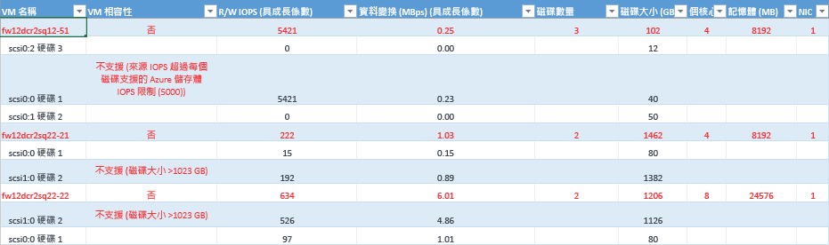

[VM 名稱] 是在產生報告時用於 VMListFile 的虛擬機器名稱或 IP 位址。 此資料行也會列出連接至虛擬機器的磁碟 (VMDK)。 vCenter 上具有重複名稱或 IP 位址的虛擬機器，在提及時會加上 ESXi 主機名稱以便區別每個虛擬機器。 所列出的 ESXi 主機是此工具在分析期間首次探索到虛擬機器時其所在位置的主機。

[VM 相容性] 會指出為何指定的虛擬機器不適合與 Azure Site Recovery 搭配使用。 相關原因會按照虛擬機器的不相容磁碟進行概述，而且可能是以發佈的 Azure 儲存體為基礎的下列其中一項[限制](https://aka.ms/azure-storage-scalbility-performance)。

* 磁碟大小 > 1023 GB – Azure 儲存體目前不支援 > 1 TB 的磁碟大小
* VM 總大小 (複寫 + TFO) 超過支援的 Azure 儲存體帳戶大小上限 (35 TB) – 這通常會在虛擬機器中具備部分效能特性的單一磁碟，超過可將虛擬機器推送至進階儲存體區域之標準儲存體的最大支援 Microsoft Azure / Azure Site Recovery 限制的情況下發生。 不過，進階 Azure 儲存體帳戶支援的大小上限為 35 TB，而單一的受保護虛擬機器無法跨多個儲存體帳戶受到保護。 也請注意，當 TFO (測試容錯移轉) 在受保護的虛擬機器上執行時，它會在進行複寫的相同儲存體帳戶中執行，因此我們需要佈建 2 倍的磁碟大小，同時讓複寫得以繼續進行且測試容錯移轉得以成功。
* 來源 IOPS 超過支援的 Azure 儲存體 IOPS 限制 (每個磁碟 5000)
* 來源 IOPS 超過支援的 Azure 儲存體 IOPS 限制 (每個 VM 80,000)
* 平均資料變換超出磁碟平均 IO 大小支援的 Azure Site Recovery 資料變換限制 10 MBps
* VM 上所有磁碟的資料變換總計超過每個 VM 支援的 Azure Site Recovery 資料變換限制 54 MBps
* 磁碟的平均有效寫入 IOPS 超過支援的 Azure Site Recovery IOPS 限制 840
* 計算的快照集儲存體超過支援的快照集儲存體限制 10 TB

[R/W IOPS (含成長因子)] 是磁碟上的尖峰工作負載 IOPS (預設值為第 95 個百分位數)，包括未來的成長因子 (預設值為 30%)。 請注意，虛擬機器的 R/W IOPS 總計不一定會計入虛擬機器個別磁碟的讀取/寫入 IOPS 總和，因為虛擬機器的尖峰 R/W IOPS 是其個別磁碟在剖析期間每一分鐘之 R/W IOPS 總和的尖峰。

[資料變換 (Mbps) (含成長因子)] 是磁碟上的尖峰變換率 (預設值為第 95 個百分位數)，包括未來的成長因子 (預設值為 30%)。 請注意，虛擬機器的資料變換總計不一定會計入虛擬機器個別磁碟的資料變換總和，因為虛擬機器的尖峰資料變換是其個別磁碟在剖析期間每一分鐘之變換總和的尖峰。

[磁碟數目] 是虛擬機器上的磁碟 (VMDK) 總數

[磁碟大小 (GB)] 是虛擬機器的所有磁碟的總佈建大小。 工具也會顯示虛擬機器中個別磁碟的磁碟大小。

[核心] 是虛擬機器上的 CPU 核心數目。

[記憶體 (MB)] 是虛擬機器上的 RAM。

[NIC] 是虛擬機器上的 NIC 數目。

##Azure Site Recovery 限制

**複寫儲存體目標** | **平均來源磁碟 I/O 大小** |**平均來源磁碟資料變換** | **每日的來源磁碟資料變換總計**
---|---|---|---
標準儲存體 | 8 KB    | 2 MB/秒 | 每個磁碟&168; GB
進階 P10 磁碟 | 8 KB    | 2 MB/秒 | 每個磁碟&168; GB
進階 P10 磁碟 | 16 KB | 4 MB/秒 |    每個磁碟&336; GB
進階 P10 磁碟 | 32 KB 或更高 | 8 MB/秒 | 每個磁碟&672; GB
進階 P20/P30 磁碟 | 8 KB    | 5 MB/秒 | 每個磁碟&421; GB
進階 P20/P30 磁碟 | 16 KB 或更高 |10 MB/秒    | 每個磁碟&842; GB

以上是採用 30% IO 重疊時的平均數字。 Azure Site Recovery 能夠處理更高的輸送量 (以重疊比為基礎)、較大的寫入大小和實際工作負載 I/O 行為。 上述數字採用 ~5 分鐘的典型儲備，也就是資料一旦上傳就會立即處理，並且在 5 分鐘內建立復原點。

上述發佈的限制是以我們的測試為基礎，但無法涵蓋所有可能的應用程式 I/O 組合。 實際的結果會隨著您的應用程式 I/O 混合而有所不同。 為了獲得最佳結果，即使在部署規劃之後，仍一律建議使用測試容錯移轉來執行廣泛的應用程式測試，以了解真正的效能情況。

## 如何更新 Deployment Planner？
[下載](site-recovery-deployment-planner.md#download)最新版的 Azure Site Recovery Deployment Planner。 將 zip 檔案複製到您要執行所在的伺服器。 解壓縮 zip 檔案。
如果您已有舊版 Deployment Planner 且正在進行分析作業，則不需要停止分析，除非新版本有分析修正。 如果該版本的分析元件中包含修正，則建議您停止使用舊版進行分析，然後使用新版本再次啟動分析。 請注意，當您開始使用新版本進行分析時，需要傳遞相同的輸出目錄路徑，以便工具能在現有檔案附加設定檔資料，並使用一組完整的分析資料來產生報告。 如果您傳遞不同的輸出目錄，則會建立新檔案，舊的分析資料將無法用來產生報告。  每次更新都是含有 zip 檔案的累積更新。 您不需要將新版檔案複製到先前版本的資料夾就能使用它。 您可以為其使用新資料夾。

##版本歷程記錄
### 1.1
更新日期︰2017 年 3 月 9 日  

修正下列問題 

* 如果 vCenter 在不同的 ESXi 主機上有兩部或多部虛擬機器具有相同的名稱/IP 位址，就無法剖析虛擬機器。 
* 相容的 VM 和不相容的 VM 工作表已停用複製和搜尋。

### 1.0 
更新日期︰2017 年 2 月 23 日 

Azure Site Recovery Deployment Planner Public Preview 1.0 具有下列已知問題，這些問題將會在即將推出的更新中獲得解決。

* 此工具僅適用於 VMware 到 Azure 案例，而不適用於 Hyper-V 到 Azure 部署。 對於 Hyper-V 到 Azure 案例，使用 [Hyper-V 容量規劃工具](./site-recovery-capacity-planning-for-hyper-v-replication.md)。
* 美國政府和中國 Microsoft Azure 區域不支援 GetThroughput 作業。
* 如果 vCenter 在不同的 ESXi 主機上有兩部或多部虛擬機器具有相同的名稱/IP 位址，此工具就無法剖析虛擬機器。 在此版本中，此工具會略過 VMListFile 中重複虛擬機器名稱/IP 位址的剖析。 因應措施是以 ESXi 主機 (而非 vCenter 伺服器) 剖析虛擬機器。 您必須為每部 ESXi 主機執行一個執行個體。

