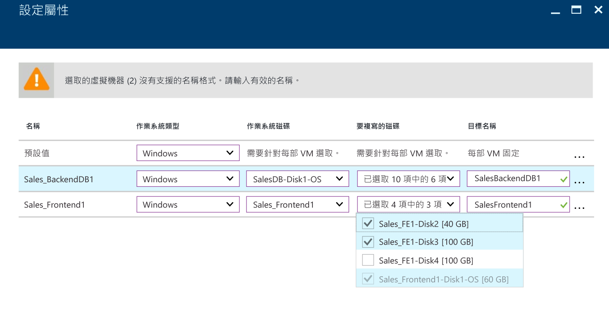
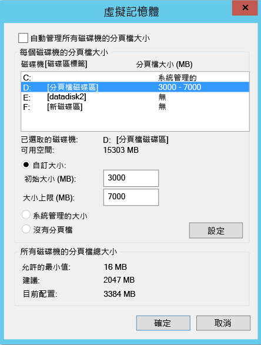
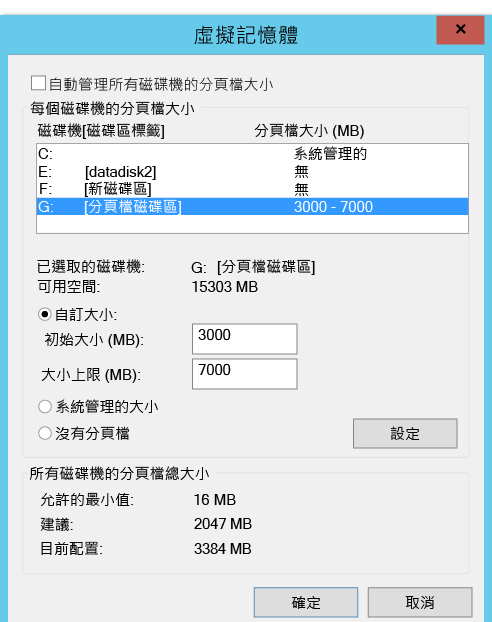
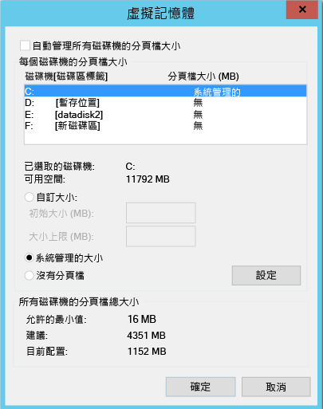

# 從複寫排除磁碟
本文說明如何從複寫排除磁碟。 這種排除可以最佳化已使用的複寫頻寬，或最佳化此類磁碟使用的目標端資源。 VMware 到 Azure 和 Hyper-V 到 Azure 案例支援此功能。

## 必要條件

依預設會複寫機器上的所有磁碟。 若要排除磁碟不要複寫，如果您是從 VMware 複寫至 Azure，您必須先在機器上手動安裝行動服務，然後才啟用複寫。

## 為什麼要排除磁碟不要複寫？
排除磁碟不要複寫往往是因為︰

- 在排除的磁碟上變換的資料不重要或不需要複寫。

- 您想要儲存儲存體和網路資源時可以不要複寫此變換。

## 有哪些典型的案例？
您可以識別資料變換的特定範例，它是排除的絕佳候選項目。 範例可能包括寫入分頁檔 (pagefile.sys) 和寫入 Microsoft SQL Server 的 tempdb 檔案。 根據工作負載和儲存體子系統，分頁檔可以註冊大量變換。 不過，將這項資料從主要網站複寫至 Azure 需要大量資源。 因此，您可以使用下列步驟來最佳化具有單一虛擬磁碟 (同時具有作業系統和分頁檔) 的虛擬機器複寫︰

1. 將單一虛擬磁碟分割成兩個虛擬磁碟。 一個虛擬磁碟具有作業系統，另一個具有分頁檔。
2. 排除分頁檔磁碟不要複寫。

同樣地，您可以使用下列步驟來最佳化同時具有 Microsoft SQL Server tempdb 檔案和系統資料庫檔案的磁碟︰

1. 將系統資料庫和 tempdb 放在兩個不同的磁碟上。
2. 排除 tempdb 磁碟不要複寫。

## 如何排除磁碟不要複寫？

### VMware 至 Azure
從 Azure Site Recovery 入口網站，依照[啟用複寫](site-recovery-vmware-to-azure.md)工作流程來保護虛擬機器。 在工作流程的第四個步驟中，使用 [要複寫的磁碟] 資料行，排除磁碟不要複寫。 依預設會選取所有磁碟進行複寫。 針對您想排除而不要複寫的磁碟清除核取方塊，然後完成步驟以啟用複寫。

>[!NOTE]
>
> * 您只能排除已經安裝行動服務的磁碟。 您需要手動安裝行動服務，因為在啟用複寫後，只會透過推送機制來安裝行動服務。
> * 只有基本磁碟可以從複寫排除。 您無法排除作業系統或動態磁碟。
> * 啟用複寫之後，您無法新增或移除磁碟以進行複寫。 如果您想要新增或排除磁碟，必須停用機器的保護，然後再次啟用它。
> * 如果您排除應用程式運作所需的磁碟，在容錯移轉至 Azure 之後，您將必須在 Azure 中手動建立磁碟，複寫的應用程式才能執行。 或者，您可以將 Azure 自動化整合至復原計劃，在機器容錯移轉期間建立磁碟。
> * Windows 虛擬機器：您以手動方式在 Azure 中建立的磁碟將不會容錯回復。 例如，如果您容錯移轉三個磁碟，並直接在 Azure 虛擬機器中建立兩個磁碟，則只有三個已容錯移轉的磁碟會容錯回復。 您無法將手動建立的磁碟納入從內部部署至 Azure 的容錯回復或重新保護中。
> * Linux 虛擬機器：您以手動方式在 Azure 中建立的磁碟將會容錯回復。 例如，如果您容錯移轉三個磁碟，並直接在 Azure 虛擬機器中建立兩個磁碟，則五個磁碟全都將容錯回復。 您無法從容錯回復排除手動建立的磁碟。
>

### Hyper-V 至 Azure
從 Azure Site Recovery 入口網站，依照[啟用複寫](site-recovery-hyper-v-site-to-azure.md)工作流程來保護虛擬機器。 在工作流程的第四個步驟中，使用 [要複寫的磁碟] 資料行，排除磁碟不要複寫。 依預設會選取所有磁碟進行複寫。 針對您想排除而不要複寫的磁碟清除核取方塊，然後完成步驟以啟用複寫。

>[!NOTE]
>
> * 您只能排除基本磁碟不要複寫。 您無法排除作業系統磁碟。 我們建議您不要排除動態磁碟。 Azure Site Recovery 無法識別在客體虛擬機器中哪些虛擬硬碟 (VHD) 是基本或動態。  如果未排除所有相依動態磁碟區磁碟，受保護的動態磁碟會在容錯移轉虛擬機器上成為失敗的磁碟，且該磁碟上的資料無法存取。
> * 啟用複寫之後，您無法新增或移除磁碟以進行複寫。 如果您想要新增或排除磁碟，必須停用虛擬機器的保護，然後再次啟用它。
> * 如果您排除應用程式運作所需的磁碟，在容錯移轉至 Azure 之後，您將必須在 Azure 中手動建立磁碟，複寫的應用程式才能執行。 或者，您可以將 Azure 自動化整合至復原計劃，在機器容錯移轉期間建立磁碟。
> * 您以手動方式在 Azure 中建立的磁碟不會容錯回復。 例如，如果您容錯移轉三個磁碟，並直接在 Azure 虛擬機器中建立兩個磁碟，則只有那三個容錯移轉的磁碟會從 Azure 容錯回復至 Hyper-V。 您無法包含在從 Hyper-V 到 Azure 的容錯回復中或反向複寫中手動建立的磁碟。

## 排除磁碟的端對端案例
我們來看一下兩個案例，以了解排除磁碟功能：

- SQL Server tempdb 磁碟
- 分頁檔 (pagefile.sys) 磁碟

### 排除 SQL Server tempdb 磁碟
我們來看一下有 tempdb 可排除的 SQL Server 虛擬機器。

虛擬磁碟的名稱是 SalesDB。

來源虛擬機器上的磁碟如下所示︰

**磁碟名稱** | **客體作業系統磁碟#** | **磁碟機代號** | **磁碟上的資料類型**
--- | --- | --- | ---
DB-Disk0-OS | DISK0 | C:\ | 作業系統磁碟
DB-Disk1| Disk1 | D:\ | SQL 系統資料庫和使用者資料庫 1
DB-Disk2 (已排除磁碟不要保護) | Disk2 | E:\ | 暫存檔案
DB-Disk3 (已排除磁碟不要保護) | Disk3 | F:\ | SQL tempdb 資料庫 (資料夾路徑 (F:\MSSQL\Data\)    容錯移轉之前記下資料夾路徑。
DB-Disk4 | Disk4 |G:\ |使用者資料庫 2

因為當您保護 SalesDB 虛擬機器時，虛擬機器上兩個磁碟的資料變換是暫時的，所以排除 Disk2 和 Disk3 不要複寫。 Azure Site Recovery 不會複寫這些磁碟。 在容錯移轉時，這些磁碟將不會出現在 Azure 上的容錯移轉虛擬機器上。

Azure 虛擬機器上的磁碟在容錯移轉之後如下所示︰

**客體作業系統磁碟#** | **磁碟機代號** | **磁碟上的資料類型**
--- | --- | ---
DISK0 | C:\ | 作業系統磁碟
Disk1 | E:\ | 暫存儲存體   Azure 會新增此磁碟，並指派第一個可用的磁碟機代號。
Disk2 | D:\ | SQL 系統資料庫和使用者資料庫 1
Disk3 | G:\ | 使用者資料庫 2

因為已從 SalesDB 虛擬機器中排除 Disk2 和 Disk3，E: 是可用清單中的第一個磁碟機代號。 Azure 會將 E: 指派給暫時存放磁碟區。 對於所有複寫的磁碟，磁碟機代號維持不變。

Disk3，這是 SQL tempdb 磁碟 (tempdb 資料夾路徑 F:\MSSQL\Data\)，排除不要複寫。 磁碟在容錯移轉虛擬機器上無法使用。 因此，SQL 服務會處於停止狀態，需要 F:\MSSQL\Data 路徑。

有兩種方式可以建立此路徑：

- 新增磁碟和指派 tempdb 資料夾路徑。
- 使用現有的暫存磁碟來設定 tempdb 資料夾路徑。

#### 新增磁碟：

1. 容錯移轉之前，記下 SQL tempdb.mdf 和 tempdb.ldf 的路徑。
2. 從 Azure 入口網站中，將等於或大於來源 SQL tempdb 磁碟 (Disk3) 大小的新磁碟，新增至容錯移轉虛擬機器。
3. 登入 Azure 虛擬機器。 從磁碟管理 (diskmgmt.msc) 主控台，初始化並格式化剛新增的磁碟。
4. 指派 SQL tempdb 磁碟所使用的相同磁碟機代號 (F:)。
5. 在 F: 磁碟區上建立 tempdb 資料夾 (F:\MSSQL\Data)。
6. 從服務主控台啟動 SQL 服務。

#### 使用現有的暫存磁碟來設定 SQL tempdb 資料夾路徑：

1. 開啟命令提示字元。
2. 從命令提示字元，在復原模式下執行 SQL Server。

        Net start MSSQLSERVER /f / T3608

3. 執行下列 sqlcmd，將 tempdb 路徑變更為新的路徑。

        sqlcmd -A -S SalesDB        **Use your SQL DBname**
        USE master;     
        GO      
        ALTER DATABASE tempdb       
        MODIFY FILE (NAME = tempdev, FILENAME = 'E:\MSSQL\tempdata\tempdb.mdf');
        GO      
        ALTER DATABASE tempdb       
        MODIFY FILE (NAME = templog, FILENAME = 'E:\MSSQL\tempdata\templog.ldf');       
        GO

4. 停止 Microsoft SQL Server 服務。

        Net stop MSSQLSERVER
5. 啟動 Microsoft SQL Server 服務。

        Net start MSSQLSERVER

關於暫存磁碟，請參閱下列 Azure 指導方針：

* [使用 Azure VM 中的 SSD 來儲存 SQL Server TempDB 和緩衝集區擴充](https://blogs.technet.microsoft.com/dataplatforminsider/2014/09/25/using-ssds-in-azure-vms-to-store-sql-server-tempdb-and-buffer-pool-extensions/)
* [Azure 虛擬機器中的 SQL Server 效能最佳做法](https://docs.microsoft.com/azure/virtual-machines/windows/sql/virtual-machines-windows-sql-performance)

### 容錯回復 (從 Azure 至內部部署主機)
現在讓我們了解從 Azure 容錯移轉至內部部署 VMware 或 Hyper-V 主機時，將會複製的磁碟。 您以手動方式在 Azure 中建立的磁碟不會複寫。 例如，如果您容錯移轉三個磁碟，並直接在 Azure 虛擬機器中建立兩個磁碟，則只有三個已容錯移轉的磁碟會容錯回復。 您無法將手動建立的磁碟納入從內部部署至 Azure 的容錯回復或重新保護中。 暫存磁碟也不會複寫至內部部署主機。

#### 容錯回復至原始位置復原

在上述範例中，Azure 虛擬機器磁碟組態如下所示︰

**客體作業系統磁碟#** | **磁碟機代號** | **磁碟上的資料類型**
--- | --- | ---
DISK0 | C:\ | 作業系統磁碟
Disk1 | E:\ | 暫存儲存體   Azure 會新增此磁碟，並指派第一個可用的磁碟機代號。
Disk2 | D:\ | SQL 系統資料庫和使用者資料庫 1
Disk3 | G:\ | 使用者資料庫 2

#### VMware 至 Azure
容錯回復至原始位置完成之後，容錯回復虛擬機器磁碟組態不會有已排除的磁碟。 從 WMware 到 Azure 中排除的磁碟，不會出現在容錯回復虛擬機器上。

從 Azure 到內部部署 VMware 之規劃的容錯移轉之後，VMWare 虛擬機器 (原始位置) 上的磁碟如下所示︰

**客體作業系統磁碟#** | **磁碟機代號** | **磁碟上的資料類型**
--- | --- | ---
DISK0 | C:\ | 作業系統磁碟
Disk1 | D:\ | SQL 系統資料庫和使用者資料庫 1
Disk2 | G:\ | 使用者資料庫 2

#### Hyper-V 至 Azure
容錯回復至原始位置後，容錯回復虛擬機器磁碟組態與 Hyper-V 的原始虛擬機器磁碟組態維持相同。 從 Hyper-V 網站到 Azure 中排除的磁碟，不會出現在容錯回復虛擬機器上。

從 Azure 到內部部署 Hyper-V 之規劃的容錯移轉之後，Hyper-V 虛擬機器 (原始位置) 上的磁碟如下所示︰

**磁碟名稱** | **客體作業系統磁碟#** | **磁碟機代號** | **磁碟上的資料類型**
--- | --- | --- | ---
DB-Disk0-OS | DISK0 |   C:\ | 作業系統磁碟
DB-Disk1 | Disk1 | D:\ | SQL 系統資料庫和使用者資料庫 1
DB-Disk2 (排除的磁碟) | Disk2 | E:\ | 暫存檔案
DB-Disk3 (排除的磁碟) | Disk3 | F:\ | SQL tempdb 資料庫 (資料夾路徑 (F:\MSSQL\Data\)
DB-Disk4 | Disk4 | G:\ | 使用者資料庫 2

#### 排除分頁檔 (pagefile.sys) 磁碟

我們來看一下有分頁檔磁碟可排除的虛擬機器。
有兩種案例。

#### 案例 1：D: 磁碟機上設定分頁檔
以下是磁碟組態︰

**磁碟名稱** | **客體作業系統磁碟#** | **磁碟機代號** | **磁碟上的資料類型**
--- | --- | --- | ---
DB-Disk0-OS | DISK0 | C:\ | 作業系統磁碟
DB-Disk1 (已排除磁碟不要保護) | Disk1 | D:\ | pagefile.sys
DB-Disk2 | Disk2 | E:\ | 使用者資料 1
DB-Disk3 | Disk3 | F:\ | 使用者資料 2

以下是來源虛擬機器上的分頁檔設定︰

從 VMware 到 Azure 或 Hyper-V 到 Azure 的虛擬機器容錯移轉之後，Azure 虛擬機器上的磁碟如下所示︰

**磁碟名稱** | **客體作業系統磁碟#** | **磁碟機代號** | **磁碟上的資料類型**
--- | --- | --- | ---
DB-Disk0-OS | DISK0 | C:\ | 作業系統磁碟
DB-Disk1 | Disk1 | D:\ | 暫存儲存體   pagefile.sys
DB-Disk2 | Disk2 | E:\ | 使用者資料 1
DB-Disk3 | Disk3 | F:\ | 使用者資料 2

因為已排除 Disk1 (D:)，D: 是可用清單中的第一個磁碟機代號。 Azure 會將 D: 指派給暫時存放磁碟區。 因為 D: 可以在 Azure 虛擬機器上使用，虛擬機器的分頁檔設定維持不變。

以下是 Azure 虛擬機器上的分頁檔設定︰

#### 案例 2︰在其他磁碟機 (非 D: 磁碟機) 上設定分頁檔

以下是來源虛擬機器磁碟組態︰

**磁碟名稱** | **客體作業系統磁碟#** | **磁碟機代號** | **磁碟上的資料類型**
--- | --- | --- | ---
DB-Disk0-OS | DISK0 | C:\ | 作業系統磁碟
DB-Disk1 (已排除磁碟不要保護) | Disk1 | G:\ | pagefile.sys
DB-Disk2 | Disk2 | E:\ | 使用者資料 1
DB-Disk3 | Disk3 | F:\ | 使用者資料 2

以下是內部部署虛擬機器上的分頁檔設定︰

從 VMware/Hyper-V 到 Azure 的虛擬機器容錯移轉之後，Azure 虛擬機器上的磁碟如下所示︰

**磁碟名稱**| **客體作業系統磁碟#**| **磁碟機代號** | **磁碟上的資料類型**
--- | --- | --- | ---
DB-Disk0-OS | DISK0  |C:\ |作業系統磁碟
DB-Disk1 | Disk1 | D:\ | 暫存儲存體   pagefile.sys
DB-Disk2 | Disk2 | E:\ | 使用者資料 1
DB-Disk3 | Disk3 | F:\ | 使用者資料 2

因為 D: 是可用清單中的第一個磁碟機代號，Azure 會將 D: 指派給暫時存放磁碟區。 對於所有複寫的磁碟，磁碟機代號維持不變。 因為 G: 磁碟無法使用，系統會針對分頁檔使用 C: 磁碟機。

以下是 Azure 虛擬機器上的分頁檔設定︰

## 後續步驟
在您的部署設定完成並開始執行之後，請 [深入了解](site-recovery-failover.md) 不同類型的容錯移轉。

