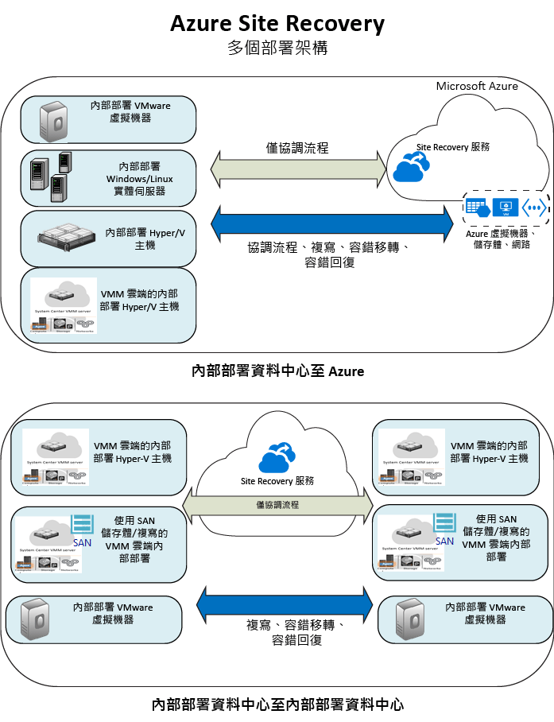

<properties
    pageTitle="什麼是 Site Recovery？ | Microsoft Azure"
    description="提供 Azure Site Recovery 服務的概觀，並摘要說明部署案例。"
    services="site-recovery"
    documentationCenter=""
    authors="rayne-wiselman"
    manager="cfreeman"
    editor=""/>

<tags
    ms.service="site-recovery"
    ms.devlang="na"
    ms.topic="get-started-article"
    ms.tgt_pltfrm="na"
    ms.workload="storage-backup-recovery"
    ms.date="10/13/2016"
    ms.author="raynew"/>

#  什麼是 Site Recovery？

歡迎使用 Azure Site Recovery！ 本文提供 Site Recovery 服務及其如何有助於業務的快速概觀。

您的組織需要商務持續性和災害復原 (BCDR) 策略，以便讓應用程式、工作負載和資料在計劃性停機與非計劃性停機期間保持安全且可供使用，並儘速復原到正常運作的情況。 Site Recovery 是一項有助於建立此策略的 Azure 服務。

Site Recovery 可協調在內部部署實體伺服器和虛擬機器上執行之工作負載的複寫作業。 您可以將伺服器和 VM 從主要資料中心複寫到雲端 (Azure) 或次要資料中心。 當主要網站發生故障時，您會容錯移轉至次要網站，讓應用程式和工作負載保持可供存取和使用。 當它恢復正常作業時，容錯回復至您的主要位置。

## Azure 入口網站中的 Site Recovery

Azure 有二種用來建立和處理資源的不同[部署模型](../resource-manager-deployment-model.md)。 Azure Resource Manager 模型和傳統的服務管理模型。 Azure 也有兩個入口網站 – 支援傳統部署模型的 [Azure 傳統入口網站](https://manage.windowsazure.com/)，以及同時支援傳統模型和 Resource Manager 模型的 [Azure 入口網站](https://portal.azure.com)。

- 在傳統入口網站和 Azure 入口網站中都有提供 Site Recovery。
- 在 Azure 傳統入口網站中，您可以支援搭配傳統服務管理模型的 Site Recovery。
- 在 Azure 入口網站中，您可以支援傳統模型或 Resource Manager 部署。 

本文資訊適用於傳統和 Azure 入口網站的部署。 兩者差異之處會適用指出。

## 為什麼要部署 Site Recovery？

以下是 Site Recovery 可以為企業提供的協助︰

- **簡化 BCDR** — 您可以在 Azure 入口網站內集中處理多個工作負載的複寫、容錯移轉和復原。 Site Recovery 會協調複寫和容錯移轉，但不會攔截應用程式資料或擁有任何相關資訊。
- **提供彈性的複寫** — 使用 Site Recovery，您就可以複寫在支援的 Hyper-V VM、VMware VM 和 Windows/Linux 實體伺服器上執行的工作負載。
- **執行輕鬆不費力的覆寫測試** — Site Recovery 提供測試用容錯移轉，既能支援災害復原演練，又不會影響生產環境。
- **容錯移轉和復原** — 您可以執行計劃性容錯移轉，因為是預期中的中斷，所以不會遺失任何資料；或是執行非計劃性容錯移轉，以在發生非未預期的災害時將資料損失減到最少 (取決於複寫頻率)。 在容錯移轉之後，您可以容錯回復到主要站台。 Site Recovery 提供了包含指令碼和 Azure 自動化作業手冊的復原計畫，以供您自訂多層式應用程式的容錯移轉和復原。
- **排除次要資料中心** — 您可以將工作負載複寫至 Azure，而不是次要網站。 這可排除維護次要資料中心的成本和複雜度。 複寫的資料會儲存在 Azure 儲存體中，並具備所有提供的彈性。 進行容錯移轉時，會以複寫的資料建立 VM。
- **與現有 BCDR 技術整合** — Site Recovery 能夠與其他 BCDR 功能整合。 例如，您可以使用 Site Recovery 保護公司工作負載的 SQL Server 後端，包括原生支援 SQL Server AlwaysOn 以便管理可用性群組的容錯移轉。

## 我可以複寫哪些項目？

以下是可以使用 Site Recovery 複寫之項目的摘要。

**REPLICATE** | **複寫目標** 
---|---
在內部部署 VMware VM 上執行的工作負載 | [Azure](site-recovery-vmware-to-azure-classic.md)   [次要網站](site-recovery-vmware-to-vmware.md)
在 VMM 雲端中管理並於內部部署 Hyper-V VM 上執行的工作負載  | [Azure](site-recovery-vmm-to-azure.md)   [次要網站](site-recovery-vmm-to-vmm.md) 
使用 SAN 儲存體在 VMM 雲端中管理並於內部部署 Hyper-V VM 上執行的工作負載|  [次要網站](site-recovery-vmm-san.md)
在內部部署 Hyper-V VM 上執行的工作負載 (未使用 VMM) | [Azure](site-recovery-hyper-v-site-to-azure.md)
在內部部署實體 Windows/Linux 伺服器上執行的工作負載 | [Azure](site-recovery-vmware-to-azure-classic.md)   [次要網站](site-recovery-vmware-to-vmware.md)

## 可以保護哪些工作負載？

Site Recovery 可實現應用程式感知 BCDR，讓工作負載和應用程式在中斷發生時繼續以一致的方式執行。 Site Recovery 提供：

- **應用程式一致快照** — 機器會使用單一或多層應用程式的應用程式一致快照進行複寫。 除了擷取磁碟資料，應用程式一致快照還會擷取記憶體中的所有資料和處理序中的所有交易。
- **近乎同步複寫** — Site Recovery 提供 Hyper-V 的複寫頻率最低可為 30 秒，VMware 則可連續複寫。
- **彈性復原方案** — 您可以使用外部指令碼和手動動作建立並自訂復原方案。 與 Azure 自動化 Runbook 的整合可讓您只要按一下就能復原整個應用程式堆疊。
- **與 SQL Server AlwaysOn 整合**- 您可以在 Site Recovery 復原計畫中管理可用性群組的容錯移轉。
- **自動化程式庫**- 豐富的 Azure 自動化程式庫，提供已可用於生產環境，且可下載並已經與 Site Recovery 整合的應用程式特定指令碼。
- **簡易網路管理** - Site Recovery 和 Azure 中的進階網路管理可簡化應用程式網路需求，包括保留 IP 位址、設定負載平衡器和整合 Azure 流量管理員以進行有效率的網路轉換。

## 後續步驟

- 如需詳細資料，請閱讀 [Site Recovery 可以保護哪些工作負載？](site-recovery-workload.md)
- 若要深入了解 Site Recovery 架構，請閱讀 [Site Recovery 如何運作？](site-recovery-components.md)
 

<!--HONumber=Oct16_HO2-->

