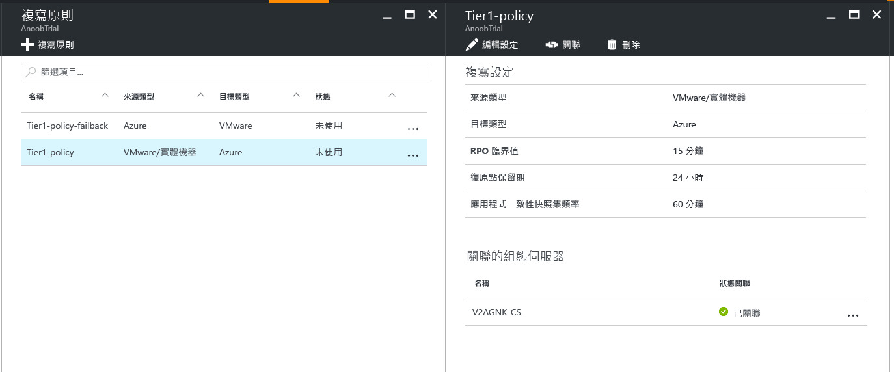
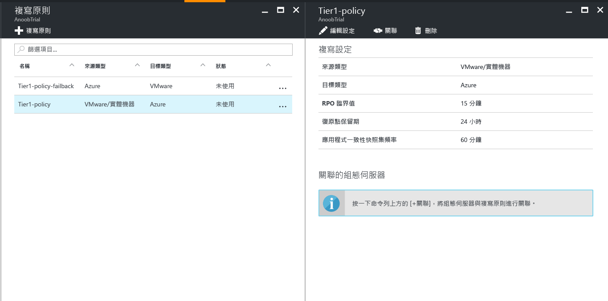

# 管理 VMware 至 Azure 的複寫原則

## 建立複寫原則

1. 選取 [管理] > [Site Recovery 基礎結構]。
2. 在 [VMware 和實體機器] 下選取 [複寫原則]。
3. 選取 [+複寫原則]。

      

4. 輸入原則名稱。

5. 在 [RPO 臨界值] 中，指定 RPO 限制。 連續複寫超過此限制時，會產生警示。
6. 在 [復原點保留] 中，指定每個復原點的保留週期 (以小時為單位)。 受保護的機器可以復原到保留週期內的任意點。

    > [!NOTE]
    > 針對複寫到進階儲存體的機器支援最多保留 24 小時。 針對複寫到標準儲存體的機器支援最多保留 72 小時。

    > [!NOTE]
    > 系統會自動建立容錯回復的複寫原則。

7. 在 [應用程式一致快照頻率] 中，指定建立包含應用程式一致快照之復原點的頻率 (以分鐘為單位)。

8. 按一下 [確定] 。 原則應該會在 30 至 60 秒內建立。

## 使組態伺服器與複寫原則產生關聯
1. 選擇要與組態伺服器產生關聯的複寫原則。
2. 按一下 [關聯]。

3. 從伺服器清單中選取組態伺服器。
4. 按一下 [確定] 。 組態伺服器應該會在&1; 至&2; 分鐘內產生關聯。

## 編輯複寫原則
1. 選擇您要編輯複寫設定的複寫原則。

2. 按一下 [編輯設定] 。

3. 根據需要來變更設定。
4. 按一下 [儲存] 。 根據多少 VM 使用該複寫原則而定，應該會在&2; 至&5; 分鐘內儲存原則。

## 使組態伺服器與複寫原則中斷關聯
1. 選擇要與組態伺服器產生關聯的複寫原則。
2. 按一下 [中斷關聯]。
3. 從伺服器清單中選取組態伺服器。
4. 按一下 [確定] 。 組態伺服器應該會在&1; 至&2; 分鐘內中斷關聯。

    > [!NOTE]
    > 如果至少有一個複寫項目使用該原則，您就無法與組態伺服器中斷關聯。 與組態伺服器中斷關聯之前，請確定沒有複寫項目使用該原則。

## 刪除複寫原則

1. 按一下要刪除的複寫原則。
2. 按一下 [刪除] 。 原則應該會在 30 至 60 秒內刪除。

    > [!NOTE]
    > 如果複寫原則至少有一個相關聯的組態伺服器，您就無法刪除該複寫原則。 請確定沒有複寫項目使用該原則，然後先刪除所有相關聯的組態伺服器，再刪除原則。

