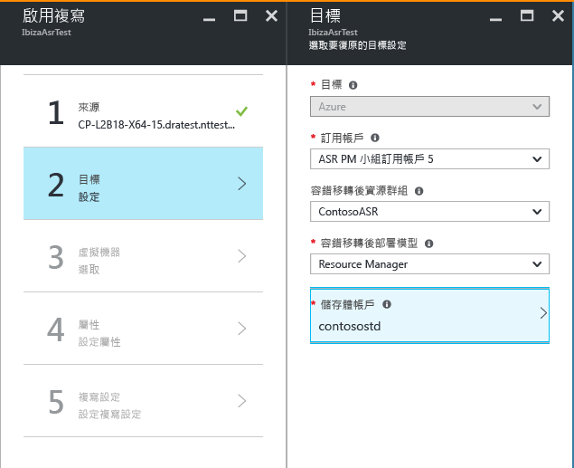

# 使用 Azure 入口網站中的 Site Recovery 將 Hyper-V 虛擬機器 (位於 VMM 雲端中) 複寫至 Azure
> [!div class="op_single_selector"]
> * [Azure 入口網站](site-recovery-vmm-to-azure.md)
> * [Azure 傳統型](site-recovery-vmm-to-azure-classic.md)
> * [PowerShell Resource Manager](site-recovery-vmm-to-azure-powershell-resource-manager.md)
> * [PowerShell 傳統](site-recovery-deploy-with-powershell.md)

本文說明如何在 Azure 入口網站中使用 [Azure Site Recovery](site-recovery-overview.md) 服務，將 System Center VMM 雲端中管理的內部部署 Hyper-V 虛擬機器複寫至 Azure。

在閱讀本文之後，請在下方或 [Azure 復原服務論壇](https://social.msdn.microsoft.com/forums/azure/home?forum=hypervrecovmgr)中張貼任何意見。

如果您想要將電腦移轉至 Azure (不含容錯回復)，請在[這篇文章](site-recovery-migrate-to-azure.md)中深入了解。

## 部署步驟

請依照下列文件完成這些部署步驟︰

1. [深入了解](site-recovery-components.md#hyper-v-to-azure)此部署的架構。 此外，[深入了解](site-recovery-hyper-v-azure-architecture.md) Site Recovery 中 Hyper-V 複寫的運作方式。
2. 確認必要條件和限制。
3. 設定 Azure 網路和儲存體帳戶。
4. 準備內部部署 VMM 伺服器和 Hyper-V 主機。
5. 建立復原服務保存庫。 保存庫包含組態設定，並協調複寫。
6. 指定來源設定。 在保存庫中註冊 VMM 伺服器。 在 VMM 伺服器上安裝 Azure Site Recovery Provider。在 Hyper-V 主機上安裝 Microsoft 復原服務代理程式。
7. 設定目標和複寫設定。
8. 啟用 VM 複寫。
9. 執行測試容錯移轉，確定一切都沒問題。

## 必要條件

**支援需求** | **詳細資料**
--- | ---
**Azure** | 了解 [Azure 需求](site-recovery-prereq.md#azure-requirements)。
**內部部署伺服器** | [深入了解](site-recovery-prereq.md#disaster-recovery-of-hyper-v-virtual-machines-in-virtual-machine-manager-clouds-to-azure)內部部署 VMM 伺服器和 Hyper-V 主機的需求。
**內部部署 Hyper-V VM** | 您想要複寫的 VM 應該執行[支援的作業系統](site-recovery-support-matrix-to-azure.md#support-for-replicated-machine-os-versions)，也要符合 [Azure 必要條件](site-recovery-support-matrix-to-azure.md#failed-over-azure-vm-requirements)。
**Azure URL** | VMM 伺服器需要存取這些 URL：   [!INCLUDE [site-recovery-URLS](../../includes/site-recovery-URLS.md)]   如果您有以 IP 位址為基礎的防火牆規則，請確定這些規則允許對 Azure 的通訊。   允許 [Azure 資料中心 IP 範圍](https://www.microsoft.com/download/confirmation.aspx?id=41653)和 HTTPS (443) 連接埠。   允許訂用帳戶的 Azure 區域和美國西部使用 IP 位址範圍 (用於存取控制和身分識別管理)。

## 準備部署
若要準備進行部署，您必須︰

1. [設定 Azure 網路](#set-up-an-azure-network) ，這是 Azure VM 於容錯移轉後所在的網路。
2. [設定 Azure 儲存體帳戶](#set-up-an-azure-storage-account) 。
3. [準備 VMM 伺服器](#prepare-the-vmm-server) 以便進行 Site Recovery 部署。
4. 準備網路對應。 設定網路，以便在 Site Recovery 部署期間設定網路對應。

### 設定 Azure 網路
您需要 Azure 網路，以便在容錯移轉後建立的 Azure VM 進行連接。

* 此網路應位於與復原服務保存庫相同的區域。
* 視您想要針對已容錯移轉的 Azure VM 使用的資源模型而定，您會以 [Resource Manager 模式](../virtual-network/virtual-networks-create-vnet-arm-pportal.md)或[傳統模式](../virtual-network/virtual-networks-create-vnet-classic-pportal.md)設定 Azure 網路。
* 建議您在開始之前先設定網路。 若非如此，則必須在 Site Recovery 部署期間這麼做。
Site Recovery 所使用的 Azure 網路不能在相同訂用帳戶內或跨越不同的訂用帳戶[移動](../azure-resource-manager/resource-group-move-resources.md)。

### 設定 Azure 儲存體帳戶
* 您需要標準/進階 Azure 儲存體帳戶才可將複寫到 Azure 的資料進行保存。[進階儲存體](../storage/storage-premium-storage.md)是用於需要持續高 IO 效能和低延遲性，以裝載 IO 密集型工作負載的虛擬機器。 如果您想要使用進階帳戶來儲存複寫的資料，就也需要標準儲存體帳戶來儲存複寫記錄檔，這些記錄檔會擷取內部部署資料的進行中變更。 此帳戶必須位於與復原服務保存庫相同的區域中。
* 視您想要針對已容錯移轉的 Azure VM 使用的資源模型而定，您會以 [Resource Manager 模式](../storage/storage-create-storage-account.md)或[傳統模式](../storage/storage-create-storage-account-classic-portal.md)設定帳戶。
* 建議您在開始之前先設定帳戶。 若非如此，則必須在 Site Recovery 部署期間這麼做。
- 請注意，Site Recovery 所使用的儲存體帳戶不能在相同訂用帳戶內或跨越不同的訂用帳戶[移動](../azure-resource-manager/resource-group-move-resources.md)。

### 準備 VMM 伺服器
* 確定 VMM 伺服器符合 [必要條件](#prerequisites)。
* 在 Site Recovery 部署期間，您可以指定 VMM 伺服器上的所有雲端應可在 Azure 入口網站中使用。 如果只希望特定雲端出現在入口網站中，您可以在 VMM 管理主控台中對此雲端啟用該設定。

### 準備網路對應
您必須在 Site Recovery 部署期間設定網路對應。 網路對應會對應來源 VMM VM 網路與目標 Azure 網路，以便︰

* 在相同網路上容錯移轉的機器可以彼此連接，即使它們不是以方式相同或在相同的復原方案中容錯移轉。
* 如果目標 Azure 網路上已設定網路閘道，則 Azure 虛擬機器可以連接到內部部署虛擬機器。
* 若要設定網路對應，以下是您需要的事項︰

  * 確認來源 Hyper-V 主機伺服器上的 VM 已連接到 VMM VM 網路。 該網路應該連結到與雲端相關聯的邏輯網路。
  * [如上](#set-up-an-azure-network)

## 建立復原服務保存庫
1. 登入 [Azure 入口網站](https://portal.azure.com)。
2. 按一下 [新增] > [監視 + 管理] > [備份和 Site Recovery (OMS)]。

    
3. 在 [名稱] 中，指定保存庫的易記識別名稱。 如果您有多個訂用帳戶，請選取其中一個。
4. [建立資源群組](../azure-resource-manager/resource-group-template-deploy-portal.md)，或選取現有的資源群組。 指定 Azure 區域。 機器將會複寫到此區域。 若要查看支援的地區，請參閱 [Azure Site Recovery 定價詳細資料](https://azure.microsoft.com/pricing/details/site-recovery/)
5. 如果您想要從儀表板快速存取保存庫，請按一下 [釘選到儀表板] > [建立保存庫]。

    

新的保存庫會出現在 [儀表板] > [所有資源] 上，以及主要 [復原服務保存庫] 刀鋒視窗上。

## 選取保護目標

選取您要複寫的項目以及您要複寫到的位置。

1. 在 [復原服務保存庫] 中選取保存庫。
2. 在 [快速入門] 中，按一下 [Site Recovery] > [準備基礎結構] > [保護目標]。

    
3. 在 [保護目標] 中選取 [至 Azure]，然後選取 [是，利用 Hyper-V]。 選取 [是]  ，確認您使用 VMM 來管理 Hyper-V 主機和復原網站。 然後按一下 [確定] 。

## 設定來源環境

在 VMM 伺服器上安裝 Azure Site Recovery Provider，並在保存庫中註冊伺服器。 在 Hyper-V 主機上安裝 Azure Recovery Services 代理程式。

1. 按一下 [準備基礎結構]  >  [來源]。

    

2. 在 [準備來源] 中，按一下 [+ VMM] 以新增 VMM 伺服器。

    

3. 在 [新增伺服器] 中，檢查 [System Center VMM 伺服器] 是否出現在 [伺服器類型] 中，以及 VMM 伺服器是否符合[必要條件和 URL 需求](#prerequisites)。
4. 下載 Azure Site Recovery Provider 安裝檔案。
5. 下載註冊金鑰。 您會在執行安裝程式時用到此金鑰。 該金鑰在產生後會維持 5 天有效。

    

## 在 VMM 伺服器上將提供者解除安裝

1. 在 VMM 伺服器上執行 Provider 安裝檔案。
2. 在 [Microsoft Update] 中，您可以選擇進行更新，以便根據您的 Microsoft Update 原則安裝 Provider 更新。
3. 在 [安裝] 中接受或修改預設 Provider 安裝位置，然後按一下 [安裝]。

    
4. 安裝完成時，請按一下 [註冊] 以在保存庫中註冊 VMM 伺服器。
5. 在 [保存庫設定] 頁面中，按一下 [瀏覽] 來選取保存庫金鑰檔案。 指定 Azure Site Recovery 訂用帳戶和保存庫名稱。

    
6. 在 [網際網路連線] 中，指定在 VMM 伺服器上執行的 Provider 透過網際網路連接到 Site Recovery 的方式。

   * 如果您想要讓 Provider 直接連線，請選取 [不使用 Proxy 直接連接至 Azure Site Recovery]。
   * 如果您現有的 Proxy 需要驗證，或您想要使用自訂 Proxy，請選取 [使用 Proxy 伺服器連接至 Azure Site Recovery]。
   * 如果您使用自訂 proxy，請指定位址、連接埠以及認證
   * 如果您使用 Proxy，您應該已經允許[必要條件](#on-premises-prerequisites)中所述的 URL。
   * 如果您使用的是自訂 proxy，則會使用指定的 proxy 認證自動建立 VMM RunAs 帳戶 (DRAProxyAccount)。 設定 proxy 伺服器，讓此帳戶可以成功進行驗證。 在 VMM 主控台中，可以修改 VMM RunAs 帳戶設定。 在 [設定] 中，展開 [安全性] > [執行身分帳戶]，然後修改 DRAProxyAccount 的密碼。 您必須重新啟動 VMM 服務，這項設定才會生效。

     
7. 接受或修改自動為資料加密產生的 SSL 憑證位置。 如果您在 Azure 站台復原入口網站中為 Azure 所保護的雲端啟用資料加密，則會使用此憑證。 請保護此憑證的安全。 當您執行容錯移轉至 Azure 時，如果已啟用資料加密，您需要使用它來解密。
8. 在 [伺服器名稱] 中，指定保存庫中 VMM 伺服器的易記識別名稱。 在叢集設定中，指定 VMM 叢集角色名稱。
9. 如果您想要將 VMM 伺服器上所有雲端的中繼資料與保存庫進行同步，請啟用 [同步處理雲端中繼資料]。 這個動作只需要在每個伺服器上進行一次。 如果不要同步所有雲端，您可以取消核取這項設定，再於 VMM 主控台的雲端屬性中個別同步每個雲端。 按一下 [註冊]  完成此程序。

    
10. 註冊作業隨即開始。 註冊完成後，伺服器會顯示在 [Site Recovery 基礎結構]  >  [VMM 伺服器] 中。

## 在 Hyper-V 主機上安裝 Azure 復原服務代理程式

1. 設定 Provider 之後，您需要下載 Azure 復原服務代理程式的安裝檔案。 在 VMM 雲端中的每部 Hyper-V 伺服器上執行安裝程式。

    
2. 在 [檢查先決條件] 中，按 [下一步]。 將自動安裝任何缺少的必要元件。

    
3. 在 [安裝設定] 中，接受或修改安裝位置和快取位置。 您可以在至少有 5 GB 可用儲存體的磁碟機上設定快取，但我們建議快取磁碟機有 600 GB 或更多可用空間。 然後按一下 [安裝] 。
4. 安裝完成後，按一下 [關閉]  即可完成。

    

### 命令列安裝
您可以使用下列命令，從命令列安裝 Microsoft Azure 復原服務代理程式：

     marsagentinstaller.exe /q /nu

### 設定從 Hyper-V 主機對 Site Recovery 的網際網路 Proxy 存取

在 Hyper-V 主機上執行的復原服務代理程式需要 Azure 的網際網路存取權才能進行 VM 複寫。 如果您透過 Proxy 存取網際網路，請如下所示設定它︰

1. 在 Hyper-V 主機上開啟 Microsoft Azure 備份 MMC 嵌入式管理單元。 根據預設，Microsoft Azure 備份的捷徑位於桌面上或在 C:\Program Files\Microsoft Azure Recovery Services Agent\bin\wabadmin 中。
2. 在嵌入式管理單元中，按一下 [變更屬性]。
3. 在 [Proxy 設定]  索引標籤上指定 Proxy 伺服器資訊。

    
4. 確定代理程式可以連到[必要條件](#on-premises-prerequisites)中所述的 URL。

## 設定目標環境
指定要用於複寫的 Azure 儲存體帳戶，以及 Azure VM 在容錯移轉後會連接的 Azure 網路。

1. 按一下 [準備基礎結構] > [目標]，選取您想要在其中建立容錯移轉虛擬機器的訂用帳戶和資源群組。 選擇您想要在 Azure (傳統或資源管理) 中，針對容錯移轉虛擬機器使用的部署模型。

    

2. Site Recovery 會檢查您是否有一或多個相容的 Azure 儲存體帳戶和網路。

    

3. 如果您尚未建立儲存體帳戶而想要使用 Resource Manager 建立一個帳戶，請按一下 [+儲存體帳戶] 以內嵌方式執行該作業。  在 [建立儲存體帳戶]  刀鋒視窗中，指定帳戶名稱、類型、訂用帳戶和位置。 此帳戶應位於與復原服務保存庫相同的位置。

   

   * 如果您想要使用傳統模型建立儲存體帳戶，請在 Azure 入口網站中執行該作業。 [深入了解](../storage/storage-create-storage-account-classic-portal.md)
   * 如果您將進階儲存體帳戶使用於複寫的資料，則須設定其他標準儲存體帳戶來儲存複寫記錄檔，而這類記錄檔會擷取內部部署資料的進行中變更。
5. 如果您尚未建立 Azure 網路，而且想要使用 Resource Manager 建立一個，請按一下 [+網路] 以內嵌方式執行該作業。 在 [建立虛擬網路]  刀鋒視窗上，指定網路名稱、位址範圍、子網路詳細資料、訂用帳戶和位置。 此網路應位於與復原服務保存庫相同的位置。

   

   如果您想要使用傳統模型建立網路，請在 Azure 入口網站中執行該作業。 [深入了解](../virtual-network/virtual-networks-create-vnet-classic-pportal.md)。

### 設定網路對應

* [閱讀](#prepare-for-network-mapping) 網路對應的快速概觀。
* 確認 VMM 伺服器上的虛擬機器已連接到 VM 網路，以及您已建立至少一個 Azure 虛擬網路。 多個 VM 網路可對應至單一 Azure 網路。

設定對應，如下所示︰

1. 在 [Site Recovery 基礎結構]  >  [網路對應]  >  [網路對應]中，按一下 [+網路對應] 圖示。

    
2. 在 [新增網路對應] 上選取來源 VMM 伺服器，並選 [Azure] 做為目標。
3. 在容錯移轉後確認訂用帳戶和部署模型。
4. 在 [來源網路] 中，從與 VMM 伺服器相關聯的清單中，選取您要對應的來源內部部署 VM 網路。
5. 在 [目標網路] 中，選取複本 Azure VM 建立後所在的 Azure 網路。 然後按一下 [確定] 。

    

以下是網路對應開始時發生的事情︰

* 開始對應時，來源 VM 網路上的現有 VM 會連接到目標網路。 連接到來源 VM 網路的新 VM 會在發生複寫時連接到對應的 Azure 網路。
* 如果您修改現有的網路對應，則複本虛擬機器會使用新設定進行連線。
* 如果目標網路具有多個子網路，且其中一個子網路的名稱和來源虛擬機器所在之子網路名稱相同，複本虛擬機器會在容錯移轉之後連線到該目標子網路。
* 如果沒有目標子網路具有相符的名稱，虛擬機器會連線到網路中的第一個子網路。

## 設定複寫設定
1. 若要建立新的複寫原則，請按一下 [準備基礎結構] > [複寫設定] > [+建立及關聯]。

    
2. 在 [建立及關聯原則] 中指定原則名稱。
3. 在 [複製頻率] 中，指定您要在初始複寫後複寫差異資料的頻率 (每隔 30 秒、5 或 15 分鐘)。

    > [!NOTE]
    >  複寫到進階儲存體時，不支援 30 秒的頻率。 限制取決於進階儲存體所支援之每 blob (100) 的快照集數目。 [深入了解](../storage/storage-premium-storage.md#snapshots-and-copy-blob)

4. 在 [復原點保留] 中，針對每個復原點指定保留週期的長度 (以小時為單位)。 受保護的機器可以復原到週期內的任意點。
5. 在 [應用程式一致快照頻率] 中，指定建立包含應用程式一致快照之復原點的頻率 (1-12 小時)。 Hyper-V 使用兩種類型的快照，一個是標準快照，提供整個虛擬機器的增量快照，另一個是應用程式一致快照，會建立虛擬機器內應用程式資料的時間點快照。 應用程式一致快照會使用「磁碟區陰影複製服務」(VSS) 來確保建立快照時，應用程式是處於一致狀態。 請注意，如果您啟用應用程式一致快照，它會影響在來源虛擬機器上執行的應用程式效能。 確認您設定的值低於您設定的其他復原點數目。
6. 在 [初始複寫開始時間] 中，指出開始初始複寫的時間。 複寫會透過您的網際網路頻寬發生，所以您可能想將它排程在忙碌時間之外。
7. 在 [加密儲存在 Azure 上的資料] 中，指定是否加密 Azure 儲存體中的待用資料。 然後按一下 [確定] 。

    
8. 當您建立新的原則時，該原則會自動與 VMM 雲端產生關聯。 按一下 [確定] 。 您可以在 [複寫] > 原則名稱 > [關聯 VMM 雲端] 中，將其他 VMM 雲端 (及其中的 VM) 與此複寫原則產生關聯。

    

## 容量規劃

您現已設定您的基本基礎結構，請思考容量規劃並找出您是否需要額外的資源。

Site Recovery 會提供 Capacity Planner 以協助您為來源環境、Site Recovery 元件、網路及儲存體配置適當的資源。 您可以在快速模式中執行規劃工具，以便根據 VM、磁碟和儲存體的平均數量進行估計，或在詳細模式中執行規劃工具，以輸入工作負載層級的數據。 開始之前：

* 收集有關複寫環境的資訊，包括 VM、每個 VM 的磁碟和每個磁碟的儲存體。
* 估計複寫資料的每日變更 (流失) 率。 您可以使用 [Capacity Planner for Hyper-V Replica (適用於 Hyper-V 複本的 Capacity Planner)](https://www.microsoft.com/download/details.aspx?id=39057) 來協助您執行這項操作。

1. 按一下 [下載] 來下載此工具並加以執行。 [文章](site-recovery-capacity-planner.md) 。
2. 當您完成時，請在 [是否已執行 Capacity Planner?]中選取 [是]。

   

   深入了解[控制網路頻寬](#network-bandwidth-considerations)

## 啟用複寫

在開始之前，請確定您的 Azure 使用者帳戶具有必要的[權限](site-recovery-role-based-linked-access-control.md#permissions-required-to-enable-replication-for-new-virtual-machines)，才能將新的虛擬機器複寫至 Azure。

立即啟用複寫，如下所示︰

1. 按一下 [步驟 2: 複寫應用程式]  >  [來源]。 第一次啟用複寫之後，請按一下保存庫中的 [+複寫]，以對其他機器啟用複寫。

    
2. 在 [來源] 刀鋒視窗中，選取 VMM 伺服器和 Hyper-V 主機所在的雲端。 然後按一下 [確定] 。

    
3. 在 [目標] 中，選取訂用帳戶、容錯移轉後的部署模型，以及您用於複寫資料的儲存體帳戶。

    
4. 選取您要使用的儲存體帳戶。 如果您想使用與現有不同的儲存體帳戶，您可以[建立一個](#set-up-an-azure-storage-account)。 如果您將進階儲存體帳戶使用於複寫的資料，則必須選取其他標準儲存體帳戶來儲存複寫記錄，而這類記錄會擷取內部部署資料的進行中變更。若要使用 Resource Manager 模型建立儲存體帳戶，按一下 [新建]。 如果您想要使用傳統模型建立儲存體帳戶，請[在 Azure 入口網站中](../storage/storage-create-storage-account-classic-portal.md)執行該作業。 然後按一下 [確定] 。
5. 選取 Azure VM 在容錯移轉後啟動時所要建立的 Azure 網路和子網路。 選取 [立即設定選取的機器]，將網路設定套用至您選取要進行保護的所有機器。 選取 [稍後設定] 以選取每部機器的 Azure 網路。 如果您想使用與現有不同的網路，您可以[建立一個](#set-up-an-azure-network)。 若要使用 Resource Manager 模型來建立網路，請按一下 [新建]。 如果您想要使用傳統模型建立網路，請[在 Azure 入口網站中](../virtual-network/virtual-networks-create-vnet-classic-pportal.md)執行該作業。 選取適用的子網路。 然後按一下 [確定] 。
6. 在 [虛擬機器] > [選取虛擬機器] 中，按一下並選取您要複寫的每部機器。 您只能選取可以啟用複寫的機器。 然後按一下 [確定] 。

    

7. 在 [名稱]  > 中，為選取的 VM 選取作業系統，以及 OS 磁碟。

    - 確認 Azure VM 名稱 (目標名稱) 符合 [Azure 虛擬機器需求](site-recovery-support-matrix-to-azure.md#failed-over-azure-vm-requirements)。   
    - 依預設會選取 VM 的所有磁碟以進行複寫，但您可以將磁碟清除以排除它們。

        - 您可能想要排除磁碟來減少複寫頻寬。 例如，您可能不想要複寫具有暫存資料的磁碟，或是每次電腦或應用程式重新啟動時便重新整理的資料 (例如 pagefile.sys 或 Microsoft SQL Server tempdb)。 您可以取消選取磁碟以將磁碟排除複寫。
        - 只有基本磁碟可以排除。 您無法排除作業系統磁碟。
        - 我們建議不要排除動態磁碟。 Site Recovery 無法識別客體 VM 內的虛擬硬碟為基本還是動態磁碟。 如果未排除所有的相依動態磁碟區磁碟，受保護的動態磁碟會在 VM 容錯移轉時顯示為失敗的磁碟，且該磁碟上的資料無法存取。
        - 啟用複寫後，您無法加入或移除複寫的磁碟。 如果您想要新增或排除磁碟，必須停用 VM 的保護，然後重新啟用它。
        - 您以手動方式在 Azure 中建立的磁碟將不會容錯回復。 例如，如果您容錯移轉三個磁碟，並直接在 Azure VM 中建立兩個磁碟，則只有那三個容錯移轉的磁碟會從 Azure 容錯回復至 Hyper-V。 您無法在容錯回復，或是從 Hyper-V 至 Azure 的反向複寫中包含手動建立的磁碟。
        - 如果您排除應用程式運作所需的磁碟，在容錯移轉至 Azure 之後，您必須在 Azure 中手動建立它，複寫的應用程式才能執行。 或者，您可以將 Azure 自動化整合至復原計畫，在電腦容錯移轉期間建立磁碟。

    按一下 [確定] 儲存變更。 您可以稍後再設定其他屬性。

    

8. 在 [複寫設定]  >  [進行複寫設定] 中，選取您要套用於受保護 VM 的複寫原則。 然後按一下 [確定] 。 您可以在 > [複寫原則] > 原則名稱 > [編輯設定] 中，修改複寫原則。 您套用的變更用於已在複寫的機器和新的機器。

   

您可以在 [作業] >  [Site Recovery 作業] 中，追蹤 [啟用保護] 作業的進度。 執行 [完成保護] 作業之後，機器即準備好進行容錯移轉。

### 檢視及管理 VM 屬性

建議您確認來源機器的屬性。 請記住，Azure VM 名稱應該符合 [Azure 虛擬機器需求](site-recovery-support-matrix-to-azure.md#failed-over-azure-vm-requirements)。

1. 在 [受保護的項目] 中，按一下 [複寫的項目]，然後選取機器以查看其詳細資料。

    
2. 在 [屬性] 中，您可以檢視 VM 的複寫和容錯移轉資訊。

    
3. 在 [計算和網路] > [計算屬性] 中，您可以指定 Azure VM 名稱和目標大小。 視需要修改名稱以符合 [Azure 需求](site-recovery-support-matrix-to-azure.md#failed-over-azure-vm-requirements) 。 您也可以檢視和修改目標網路、子網路的相關資訊，以及指派給 Azure VM 的 IP 位址。
請注意：

   * 您可以設定目標 IP 位址。 如果您未提供地址，則容錯移轉的機器會使用 DHCP。 如果您設定無法用於容錯移轉的位址，則容錯移轉會失敗。 如果位址可用於測試容錯移轉網路，則相同的目標 IP 位址可用於測試容錯移轉。
   * 網路介面卡的數目會視您指定給目標虛擬機器的大小而有所不同，如下所示：

     * 如果來源電腦上的網路介面卡數目小於或等於針對目標機器大小所允許的介面卡數目，則目標將具備與來源相同的介面卡數目。
     * 如果來源虛擬機器的介面卡數目超過針對目標大小所允許的數目，則使用目標大小的最大值。
     * 例如，如果來源機器具有兩張網路介面卡，而目標機器大小支援四張，則目標機器將會有兩張介面卡。 如果來源機器具有兩張介面卡，但支援的目標大小僅支援一張，則目標機器將只會有一張介面卡。     
     * 如果 VM 有多張網路介面卡，則全部會連接至相同的網路。

     

4. 在 [磁碟]  中，您可以看見 VM 上將要複寫的作業系統和資料磁碟。

#### 受控磁碟

在 [計算和網路] > [計算屬性] 中，如果您想要將受控磁碟連結至您要移轉至 Azure 的電腦上，可以將 VM 的 [使用受控磁碟] 設定為 [是]。 受控磁碟會管理與 VM 磁碟相關的儲存體帳戶，從而簡化 Azure IaaS VM 的磁碟管理。 [深入了解受控磁碟](https://docs.microsoft.com/en-us/azure/storage/storage-managed-disks-overview)。

   - 只有容錯移轉至 Azure 的受控磁碟會加以建立並連結至虛擬機器。 啟用保護時，內部部署電腦的資料會繼續複寫至儲存體帳戶。
   只有使用 Resource Manager 部署模型部署的虛擬機器才能建立受控磁碟。  

  > [!NOTE]
  > 具有受控磁碟的電腦目前不支援從 Azure 容錯回復到內部部署 Hyper-V 環境。 只在您想要將這台電腦移轉至 Azure 時，才將 [使用受控磁碟] 設定為 [是]。

   - 當您將 [使用受控磁碟] 設定為 [是] 時，只能選取資源群組中 [使用受控磁碟] 設定為 [是] 的可用性設定組。 這是因為只有當 [使用受控磁碟] 屬性設定為 [是] 時，具有受控磁碟的虛擬機器才能成為可用性設定組的一部分。 請確定您建立的可用性設定組，是以容錯移轉時使用受控磁碟的意圖作為基礎設定 [使用受控磁碟] 屬性。  同樣地，當您將 [使用受控磁碟] 設定為 [否] 時，只能選取資源群組中 [使用受控磁碟] 屬性設定為 [否] 的可用性設定組。 [深入了解受控磁碟和可用性設定組](https://docs.microsoft.com/en-us/azure/virtual-machines/windows/manage-availability#use-managed-disks-for-vms-in-an-availability-set)。

  > [!NOTE]
  > 如果用於複寫的儲存體帳戶在任何時間點透過儲存體服務加密進行加密，在容錯移轉期間建立受控磁碟就會失敗。 您可以將 [使用受控磁碟] 設定為 [否] 並重試容錯移轉，或將虛擬機器保護停用，並在未於任何時間點啟用儲存體服務加密的儲存體帳戶中加以保護。
  > [深入了解儲存體服務加密及受控磁碟](https://docs.microsoft.com/en-us/azure/storage/storage-managed-disks-overview#managed-disks-and-encryption)。

## 測試部署

若要測試部署，您可以針對單一虛擬機器執行測試容錯移轉，或執行包含一或多部虛擬機器的復原方案。

### 開始之前

 - 如果您想要在容錯移轉後使用 RDP 連線到 Azure VM，請了解[準備連線](site-recovery-test-failover-to-azure.md#prepare-to-connect-to-azure-vms-after-failover)。
 - 若要完整測試，您需要在測試環境中將 Active Directory 和 DNS 進行複製。 [深入了解](site-recovery-active-directory.md#test-failover-considerations)。

### 執行測試容錯移轉

1. 若要容錯移轉單一 VM，請在 [複寫的項目] 中，按一下 [VM] > [+測試容錯移轉]。
2. 若要容錯移轉復原方案，請在 [復原方案] 中，以滑鼠右鍵按一下方案 > [測試容錯移轉]。 若要建立復原方案，請[遵循這些指示](site-recovery-create-recovery-plans.md)。
3. 在 [測試容錯移轉] 中，選取 Azure VM 在容錯移轉後要連接的 Azure 網路。
4. 按一下 [確定]  即可開始容錯移轉。 您可以按一下 VM 以開啟其屬性，或在 [Site Recovery 作業] 中的 [測試容錯移轉] 作業上追蹤進度。
5. 容錯移轉完成之後，您應該也會看到複本 Azure 機器出現在 Azure 入口網站 > [虛擬機器]中。 您應該確定 VM 為適當的大小、已連接到適當的網路，而且正在執行中。
6. 如果您已準備好在容錯移轉後進行連線，應該能夠連線到 Azure VM。
7. 完成後，在復原方案上按一下 [清除測試容錯移轉]。 在 [記事]  中，記錄並儲存關於測試容錯移轉的任何觀察。 這將刪除在測試容錯移轉期間所建立的虛擬機器。

如需詳細資訊，請參閱[測試容錯移轉至 Azure](site-recovery-test-failover-to-azure.md) 文章。

## 監視部署

以下是監視 Site Recovery 部署的組態設定、狀態和健康情況的方式︰

1. 按一下保存庫名稱來存取 [基本資訊]  儀表板。 在此儀表板中，您可以看見 Site Recovery 作業、複寫狀態、復原方案、伺服器健康狀態和事件。  您可以自訂 [基本資訊] 以顯示最適合您的圖格和配置，包括其他 Site Recovery 和備份保存庫的狀態。

    
2. 在 [健全狀況] 中，您可以監視內部部署伺服器 (VMM 或組態伺服器) 上的問題，以及 Site Recovery 在過去 24 小時內引發的事件。
3. 在 [複寫的項目]、[復原方案] 和 [Site Recovery 作業] 圖格中，您可以管理和監視複寫。 您可以在 [作業]  > [Site Recovery 作業] 中鑽研作業。

## Azure Site Recovery Provider 的命令列安裝

您可以從命令列安裝 Azure Site Recovery Provider。 這個方法可以用來在適用於 Windows Server 2012 R2 的伺服器核心上安裝 Provider。

1. 將提供者安裝檔案和註冊金鑰下載至資料夾。 例如，C:\ASR。
2. 在提高權限的命令提示字元中，執行下列命令來擷取 Provider 安裝程式：

            C:\Windows\System32> CD C:\ASR
            C:\ASR> AzureSiteRecoveryProvider.exe /x:. /q
3. 執行這個命令來安裝元件︰

            C:\ASR> setupdr.exe /i
4. 然後執行下列命令﹐以在保存庫中註冊伺服器：

        CD C:\Program Files\Microsoft System Center 2012 R2\Virtual Machine Manager\bin
        C:\Program Files\Microsoft System Center 2012 R2\Virtual Machine Manager\bin\> DRConfigurator.exe /r  /Friendlyname <friendly name of the server> /Credentials <path of the credentials file> /EncryptionEnabled <full file name to save the encryption certificate>       

其中：

* **/Credentials**：必要參數，用來指定註冊金鑰檔案所在的位置。  
* **/FriendlyName**：對於 Hyper-V 主機伺服器名稱的必要參數，該伺服器會出現在 Azure Site Recovery 入口網站中。
* * **/EncryptionEnabled**：當您將 VMM 雲端中的 Hyper-V VM 複寫至 Azure 時的選用參數。 指定是否要在 Azure 中加密虛擬機器 (靜態加密)。 確定檔案名稱具有 **.pfx** 副檔名。 預設會關閉加密。
* **/proxyAddress**：指定 Proxy 伺服器位址的選用參數。
* **/proxyport**：指定 Proxy 伺服器連接埠的選用參數。
* **/proxyUsername**：指定 Proxy 使用者名稱 (如果 Proxy 需要驗證) 的選用參數。
* **/proxyPassword**：指定用以驗證 Proxy 伺服器之密碼 (如果 Proxy 需要驗證) 的選用參數。

### 網路頻寬考量
您可以使用容量規劃工具來計算複寫 (初始複寫，而後是差異複寫) 所需的頻寬 。 若要控制複寫所用的頻寬數量，您有幾個選項可用︰

* **節流頻寬**︰複寫至次要網站的 Hyper-V 流量會經過特定的 Hyper-V 主機。 您可以在主機伺服器上進行頻寬節流。
* **調整頻寬**︰您可以使用幾個登錄機碼來影響用於複寫的頻寬。

#### 節流頻寬
1. 在 Hyper-V 主機伺服器上開啟 Microsoft Azure 備份 MMC 嵌入式管理單元。 根據預設，Microsoft Azure 備份的捷徑位於桌面上或在 C:\Program Files\Microsoft Azure Recovery Services Agent\bin\wabadmin 中。
2. 在嵌入式管理單元中，按一下 [變更屬性]。
3. 在 [節流] 索引標籤上，選取 [啟用備份操作的網際網路頻寬使用節流設定]，然後設定工作和非工作時數的限制。 有效範圍是每秒 512 Kbps 到 102 Mbps。

    

您也可以使用 [Set-OBMachineSetting](https://technet.microsoft.com/library/hh770409.aspx) Cmdlet 來設定節流。 以下是一個範例：

    $mon = [System.DayOfWeek]::Monday
    $tue = [System.DayOfWeek]::Tuesday
    Set-OBMachineSetting -WorkDay $mon, $tue -StartWorkHour "9:00:00" -EndWorkHour "18:00:00" -WorkHourBandwidth  (512*1024) -NonWorkHourBandwidth (2048*1024)

**Set-OBMachineSetting -NoThrottle** 表示不需要節流。

#### 影響網路頻寬
**UploadThreadsPerVM** 登錄值會控制用於磁碟資料傳輸 (初始或差異複寫) 的執行緒數目。 較高的值可增加複寫所用的網路頻寬。 **DownloadThreadsPerVM** 登錄值會指定在容錯回復期間用於資料傳輸的執行緒數目。

1. 在登錄中瀏覽至 **HKEY_LOCAL_MACHINE\SOFTWARE\Microsoft\Windows Azure Backup\Replication**。

   * 修改 **UploadThreadsPerVM** 值 (如此果機碼不存在，則予以建立) 來控制用於磁碟複寫的執行緒。
   * 修改 **DownloadThreadsPerVM** 值 (如此果機碼不存在，則予以建立) 來控制用於從 Azure 容錯回復流量的執行緒。
2. 預設值為 4。 在 “overprovisioned” 網路中，這些登錄機碼必須變更自其預設值。 最大值為 32。 監視流量，將此值最佳化。

## 後續步驟

在初始複寫完成，且您已測試部署之後，便可以視需要叫用容錯移轉。 [深入了解](site-recovery-failover.md)不同類型的容錯移轉及執行方法。

