<properties
	pageTitle="使用 Azure Site Recovery 搭配 Azure 入口網站來複寫 VMM 雲端中的 Hyper-V 虛擬機器 | Microsoft Azure"
	description="描述如何使用 Azure 入口網站部署 Azure Site Recovery，以協調將 VMM 雲端中的 Hyper-V VM 複寫、容錯移轉和復原至 Azure。"
	services="site-recovery"
	documentationCenter=""
	authors="rayne-wiselman"
	manager="jwhit"
	editor="tysonn"/>

<tags
	ms.service="site-recovery"
	ms.workload="backup-recovery"
	ms.tgt_pltfrm="na"
	ms.devlang="na"
	ms.topic="hero-article"
	ms.date="05/10/2016"
	ms.author="raynew"/>

# 使用 Azure Site Recovery 搭配 Azure 入口網站來複寫 VMM 雲端中的 Hyper-V 虛擬機器 | Microsoft Azure

> [AZURE.SELECTOR]
- [Azure 入口網站](site-recovery-vmm-to-azure.md)
- [Azure 傳統型](site-recovery-vmm-to-azure-classic.md)
- [PowerShell ARM](site-recovery-vmm-to-azure-powershell-resource-manager.md)
- [PowerShell 傳統型](site-recovery-deploy-with-powershell.md)

歡迎使用 Azure Site Recovery！ 如果您想要在 Azure 入口網站中使用 Azure Site Recovery，將 System Center Virtual Machine Manager (VMM) 雲端中管理的內部部署 Hyper-V 虛擬機器複寫至 Azure，請利用本文。

> [AZURE.NOTE] Azure 建立和處理資源的[部署模型](../resource-manager-deployment-model)有二種：Azure Resource Manager (ARM) 和傳統。Azure 也有兩個入口網站 – 支援傳統部署模型的 Azure 傳統入口網站，以及支援兩種部署模型的 Azure 入口網站。

Azure 入口網站中的 Azure Site Recovery 提供許多新功能︰

- 在 Azure 入口網站中，Azure 備份和 Azure Site Recovery 服務會結合成單一復原服務保存庫，以便從單一位置設定和管理業務持續性和災害復原 (BCDR)。統一儀表板可讓您監視及管理您的內部部署網站與 Azure 公用雲端的作業。
- 具有與雲端解決方案提供者 (CSP) 程式一起佈建之 Azure 訂用帳戶的使用者，現在可以在 Azure 入口網站中管理 Site Recovery 作業。
- Azure 入口網站中的 Site Recovery 可以將機器複寫至 ARM 儲存體帳戶。容錯移轉時，Site Recovery 會在 Azure 中建立 ARM 架構的 VM。
- Site Recovery 會繼續支援複寫至傳統儲存體帳戶。容錯移轉時，Site Recovery 會使用傳統模型建立 VM。

閱讀本文之後，請將任何意見張貼在底部的 Disqus 註解中。請在 [Azure 復原服務論壇](https://social.msdn.microsoft.com/forums/azure/home?forum=hypervrecovmgr) (英文) 提出技術問題。

## 概觀

組織需要 BCDR 策略，以決定應用程式、工作負載和資料如何在規劃與未規劃停機期間維持運作，並儘速復原到正常運作的情況。BCDR 策略應保護商務資料安全且可復原，並確保發生災害時工作負載仍持續可用。

Site Recovery 是一項 Azure 服務，可藉由將內部部署實體伺服器和虛擬機器的複寫協調至雲端 (Azure) 或次要資料中心，協助您的 BCDR 策略。當您的主要位置發生故障時，您容錯移轉至次要位置，讓應用程式和工作負載保持可用。當它恢復正常作業時，容錯回復至您的主要位置。深入了解[什麼是 Azure Site Recovery？](site-recovery-overview.md)

本文提供將 VMM 雲端中的內部部署 Hyper-V VM 複寫至 Azure 所需的全部資訊。包括架構概觀、規劃資訊，以及設定 Azure、內部部署伺服器、複寫設定和容量規劃的部署步驟。設定好基礎結構之後，您可以在您要保護的電腦上啟用複寫，並檢查容錯移轉是否可以運作。

## 商務優點

- Site Recovery 會為在 Hyper-V VM 上執行的商務工作負載和應用程式提供離站保護。
- 復原服務入口網站提供單一位置來設定、管理及監視複寫、容錯移轉和復原。
- 您可以輕鬆執行從內部部署基礎結構容錯移轉至 Azure，以及從 Azure 容錯回復 (還原) 至內部部署網站中的 Hyper-V 主機伺服器。
- 您可以設定包含多部電腦的復原方案，以便階層式應用程式工作負載一起容錯移轉。

## 案例架構

案例元件如下：

- **VMM 伺服器**︰包含一或多個雲端的內部部署 VMM 伺服器。
- **Hyper-V 主機或叢集**︰在 VMM 雲端管理的 Hyper-V 主機伺服器或叢集。
- **Azure Site Recovery Provider 和復原服務代理程式**：在部署期間，您會在 VMM 伺服器上安裝 Azure Site Recovery Provider，以及在 Hyper-V 主機伺服器上安裝 Microsoft Azure 復原服務代理程式。VMM 上的 Provider 會透過 HTTPS 443 與 Site Recovery 通訊，以複寫協調流程。根據預設，Hyper-V 主機伺服器上的代理程式會透過 HTTPS 443 將資料複寫至 Azure 儲存體。
- **Azure**︰您需要 Azure 訂用帳戶、Azure 儲存體帳戶來儲存複寫的資料，以及 Azure 虛擬網路讓 Azure VM 在容錯移轉後連接到網路。

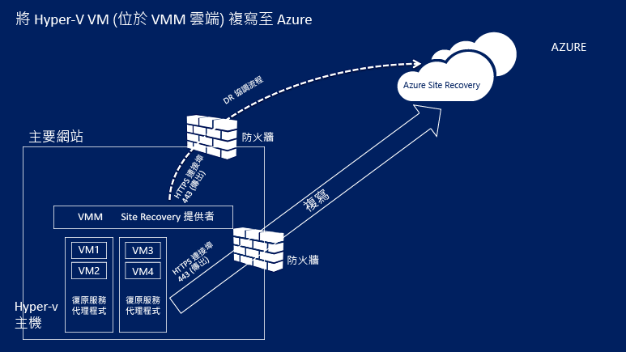

## Azure 必要條件

以下是您在 Azure 中部署此案例所需的項目。

**必要條件** | **詳細資料**
--- | ---
**Azure 帳戶**| 您將需要 [Microsoft Azure](http://azure.microsoft.com/) 帳戶。您可以從[免費試用](https://azure.microsoft.com/pricing/free-trial/)開始。[深入了解](https://azure.microsoft.com/pricing/details/site-recovery/) Site Recovery 價格。 
**Azure 儲存體** | 您需要標準 Azure 儲存體帳戶來儲存複寫的資料。您可以使用 LRS 或 GRS 儲存體帳戶。我們建議使用 GRS，以便在發生區域性停電或無法復原主要區域時，能夠恢復資料。[深入了解](../storage/storage-redundancy.md)。此帳戶必須位於與復原服務保存庫相同的區域中。  不支援進階儲存體。   複寫的資料會儲存在 Azure 儲存體，而在容錯移轉時會建立 Azure VM。   [深入了解](../storage/storage-introduction.md) Azure 儲存體。
**Azure 網路** | 容錯移轉發生時，您需要 Azure VM 會連接的 Azure 虛擬網路。此網路必須位於與復原服務保存庫相同的區域中。

## 內部部署必要條件

以下是您在內部部署中需要的項目：

**必要條件** | **詳細資料**
--- | ---
**VMM**| 在 System Center 2012 R2 上執行的一或多部 VMM 伺服器。每部 VMM 伺服器應設定一或多個雲端。雲端應包含：  一或多個 VMM 主機群組。   每個主機群組中的一或多個 Hyper-V 主機伺服器或叢集。  [深入了解](http://www.server-log.com/blog/2011/8/26/vmm-2012-and-the-clouds.html)如何設定 VMM 雲端。
**Hyper-V** | Hyper-V 主機伺服器至少必須執行附帶 Hyper-V 角色的 Windows Server 2012 R2，並且已安裝最新更新。   Hyper-V 伺服器應該包含一或多部 VM。   必須在 VMM 雲端管理包含您要複寫之 VM 的 Hyper-V 主機伺服器或叢集。  Hyper-V 伺服器應連接到網際網路 (直接或透過 Proxy)。  Hyper-V 伺服器應該安裝文章 [2961977](https://support.microsoft.com/kb/2961977) 中所提的修正程式。  Hyper-V 主機伺服器需要網際網路存取權，才能將資料複寫至 Azure。 
**Provider 和代理程式** | 在 Azure Site Recovery 部署期間，您將在 VMM 伺服器上安裝 Azure Site Recovery Provider 以及在 Hyper-V 主機上安裝復原服務代理程式。Provider 和代理程式必須透過網際網路直接連接或透過 Proxy 連接到 Azure Site Recovery。請注意，不支援 HTTPS 型 Proxy。VMM 伺服器和 Hyper-V 主機上的 Proxy 伺服器應該允許存取︰   .hypervrecoverymanager.windowsazure.com    .accesscontrol.windows.net    .backup.windowsazure.com    .blob.core.windows.net    *.store.core.windows.net  如果您在 VMM 伺服器上有以 IP 位址為基礎的防火牆規則，請檢查這些規則是否允許與 Azure 通訊。您需要允許 [Azure 資料中心 IP 範圍](https://www.microsoft.com/download/confirmation.aspx?id=41653)和 HTTPS (433) 通訊協定。  允許您的訂用帳戶的 Azure 區域和美國西部的 IP 位址範圍。  此外，VMM 伺服器上的 Proxy 伺服器將需要存取 https://www.msftncsi.com/ncsi.txt

## 受保護的機器必要條件

**必要條件** | **詳細資料**
--- | ---
**受保護的 VM** | 在容錯移轉 VM 之前，您必須確定將指派給 Azure VM 的名稱符合 [Azure 必要條件](site-recovery-best-practices.md#azure-virtual-machine-requirements)。您可以在啟用 VM 的複寫後修改此名稱。   受保護機器上的個別磁碟容量不可超過 1023 GB。VM 可以有多達 64 個磁碟 (因此多達 64 TB)。   不支援共用磁碟來賓叢集。   不支援整合可延伸韌體介面 (UEFI)/可延伸韌體介面 (EFI) 開機。   如果來源 VM 有 NIC 小組，它會在容錯移轉至 Azure 之後轉換成單一 NIC。  不支援保護使用靜態 IP 位址執行 Linux 的 VM。

## 準備部署

若要準備進行部署，您必須︰

1. [設定 Azure 網路](#set-up-an-azure-network)，Azure
2. VM 將在容錯移轉後位於其中。
2. 針對複寫的資料[設定 Azure 儲存體帳戶](#set-up-an-azure-storage-account)。
4. [準備 VMM 伺服器](#prepare-the-vmm-server)以便進行 Site Recovery 部署。
5. [準備網路對應](#prepare-for-network-mapping)。設定網路，以便在 Site Recovery 部署期間設定網路對應。

### 設定 Azure 網路

您需要 Azure 網路，以便在容錯移轉後建立的 Azure VM 進行連接。

- 此網路應與您將部署復原服務保存庫的網路位於相同的區域。
- 視您要用於已容錯移轉的 Azure VM 的資源模型而定，您將在 [ARM 模式](../virtual-network/virtual-networks-create-vnet-arm-pportal.md)或[傳統模式](../virtual-network/virtual-networks-create-vnet-classic-pportal.md)中設定 Azure 網路。
- 建議您在開始之前先設定網路。若非如此，則必須在 Site Recovery 部署期間這麼做。

### 設定 Azure 儲存體帳戶

- 您需要標準 Azure 儲存體帳戶來保存複寫到 Azure 的資料。此帳戶必須位於與復原服務保存庫相同的區域中。
- 視您要用於已容錯移轉的 Azure VM 的資源模型而定，您將在 [ARM 模式](../storage/storage-create-storage-account.md)或[傳統模式](../storage/storage-create-storage-account-classic-portal.md)中設定帳戶。
- 建議您在開始之前先設定帳戶。若非如此，則必須在 Site Recovery 部署期間這麼做。

### 準備 VMM 伺服器

- 確定 VMM 伺服器符合[必要條件](#on-premises-prerequisites)。
- 在 Site Recovery 部署期間，您可以指定 VMM 伺服器上的所有雲端應可在 Azure 入口網站中使用。如果只希望特定雲端出現在入口網站中，您可以在 VMM 管理主控台中對此雲端啟用該設定。

### 準備網路對應

您必須在 Site Recovery 部署期間設定網路對應。網路對應會對應來源 VMM VM 網路與目標 Azure 網路，以便︰

- 在相同網路上容錯移轉的機器可以彼此連接，即使它們不是以方式相同或在相同的復原方案中容錯移轉。
- 如果目標 Azure 網路上已設定網路閘道，則 Azure 虛擬機器可以連接到內部部署虛擬機器。
- 若要設定網路對應，以下是您需要準備的事項︰

	- 確認來源 Hyper-V 主機伺服器上的 VM 已連接到 VMM VM 網路。該網路應該連結到與雲端相關聯的邏輯網路。
	- [如上](#set-up-an-azure-network)所述的 Azure 網路

- [深入了解](site-recovery-network-mapping.md)網路對應的運作方式。

## 建立復原服務保存庫

1. 登入 [Azure 入口網站](https://portal.azure.com)。
2. 按一下 [新增] > [管理] > [復原服務]。或者，您可以按一下 [瀏覽] > [復原服務保存庫] > [加入]。

	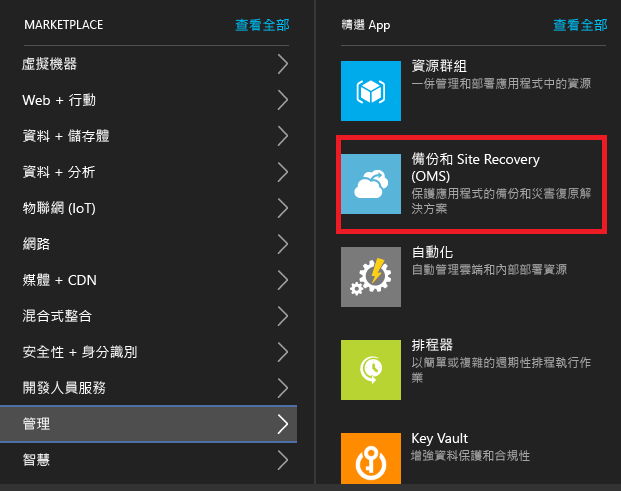

3. 在 [名稱] 中，指定保存庫的易記識別名稱。如果您有多個訂用帳戶，請選取其中一個。
4. [建立新的資源群組](../resource-group-template-deploy-portal.md)或選取現有的資源群組。指定 Azure 區域。機器將會複寫到此區域。若要查看支援的地區，請參閱 [Azure Site Recovery 定價詳細資料](https://azure.microsoft.com/pricing/details/site-recovery/) (英文) 中的＜各地區上市情況＞。
4. 如果您想要從儀表板快速存取保存庫，請按一下 [釘選到儀表板]，然後按一下 [建立保存庫]。

	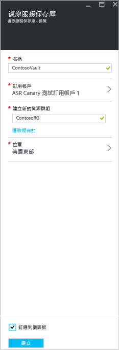

新的保存庫會出現於 [儀表板] > [所有資源]，以及主要 [復原服務保存庫] 刀鋒視窗上。

## 快速入門

Site Recovery 提供的「快速入門」經驗可協助您盡快部署。「快速入門」會檢查必要條件並引導您以正確順序完成 Site Recovery 部署步驟。

在「快速入門」中，您會選取您要複寫的機器類型，以及您要複寫到的位置。您會設定內部部署伺服器、Azure 儲存體帳戶和網路。您會建立複寫原則，並執行容量規劃。已設定好您的基礎結構之後，您可啟用 VM 的複寫。您可以對特定電腦執行容錯移轉，或建立復原方案來容錯移轉多部電腦。

選擇您要部署 Site Recovery 的方式，即可開始「快速入門」。視您的複寫需求而定，「快速入門」流程會稍有不同。

## 步驟 1︰選擇您的保護目標

選取您要複寫的項目以及您要複寫到的位置。

1. 在 [復原服務保存庫] 刀鋒視窗中選取您的保存庫，並按一下 [設定]。
2. 在 [快速入門] 中，按一下 [Site Recovery] > [步驟 1︰準備基礎結構] > [保護目標]。

	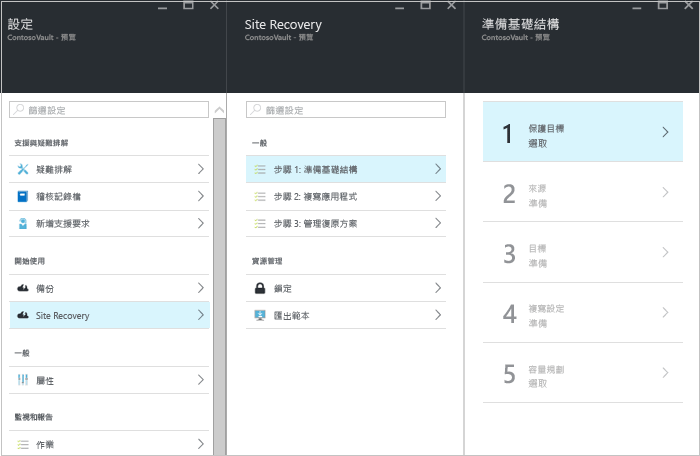

3. 在 [Protection goal] (保護目標) 中選取 [To Azure] (至 Azure)，然後選取 [Yes, with Hyper-V] (是，利用 Hyper-V)。選取 [是]，確認您使用 VMM 來管理 Hyper-V 主機和復原網站。然後按一下 [確定]。

	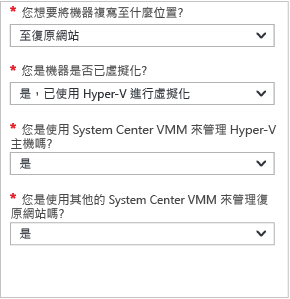

## 步驟 2︰設定來源環境

在 VMM 伺服器上安裝 Azure Site Recovery Provider，並在保存庫中註冊伺服器。在 Hyper-V 主機上安裝 Azure Recovery Services 代理程式。

1. 按一下 [步驟 2：準備基礎結構] > [來源]。

	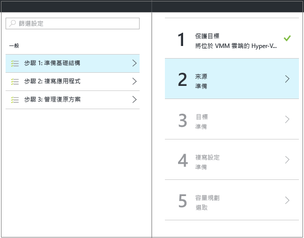

2. 在 [準備來源] 中，按一下 [+ VMM] 以新增 VMM 伺服器。

	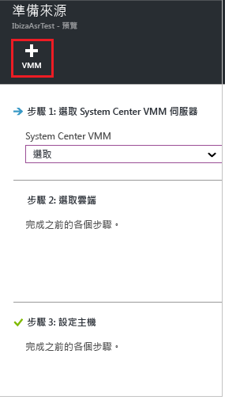

3. 在 [新增伺服器] 刀鋒視窗中，檢查 [System Center VMM 伺服器] 是否出現在 [伺服器類型] 中，以及 VMM 伺服器是否符合[必要條件和 URL 需求](#on-premises-prerequisites)。
4. 下載 Azure Site Recovery Provider 安裝檔案。
5. 下載註冊金鑰。您會在執行安裝程式時用到此金鑰。該金鑰在產生後會維持 5 天有效。

	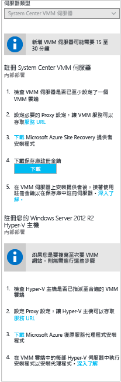

6. 您會在 VMM 伺服器上安裝 Azure Site Recovery Provider。

### 設定 Azure Site Recovery Provider

1.	執行 Provider 安裝程式檔案。
2. 在 [Microsoft Update] 中，您可以選擇進行更新，以便根據您的 Microsoft Update 原則安裝 Provider 更新。
3. 在 [安裝] 中接受或修改預設 Provider 安裝位置，然後按一下 [安裝]。

	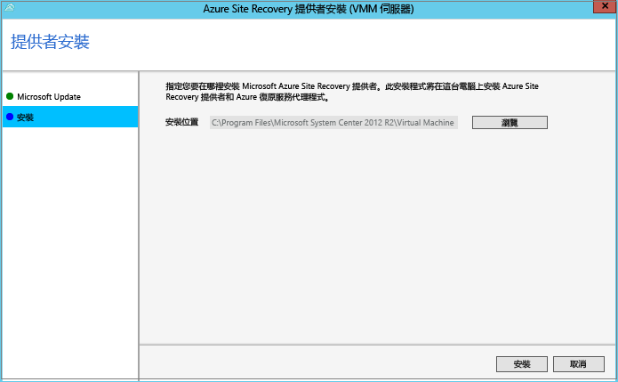

4. 安裝完成時，請按一下 [註冊] 以在保存庫中註冊 VMM 伺服器。
5. 在 [保存庫設定] 頁面中，按一下 [瀏覽] 來選取保存庫金鑰檔案。指定 Azure Site Recovery 訂用帳戶和保存庫名稱。

	

6. 在 [網際網路連線] 中，指定在 VMM 伺服器上執行的 Provider 透過網際網路連接到 Site Recovery 的方式。

	- 如果您想要讓 Provider 直接連線，請選取 [不使用 Proxy 直接連接至 Azure Site Recovery]。
	- 如果您現有的 Proxy 需要驗證，或您想要使用自訂 Proxy，請選取 [使用 Proxy 伺服器連接至 Azure Site Recovery]。
	- 如果您使用自訂 proxy，您必須指定位址、連接埠以及認證
	- 如果您使用 Proxy，您應該已經允許[必要條件](#on-premises-prerequisites)中所述的 URL。
	- 如果您使用的是自訂 proxy，則會使用指定的 proxy 認證自動建立 VMM RunAs 帳戶 (DRAProxyAccount)。設定 proxy 伺服器，讓此帳戶可以成功進行驗證。在 VMM 主控台中，可以修改 VMM RunAs 帳戶設定。在 [設定] 中，展開 [安全性] > [執行身分帳戶]，然後修改 DRAProxyAccount 的密碼。您必須重新啟動 VMM 服務，這項設定才會生效。

	

7. 接受或修改自動為資料加密產生的 SSL 憑證位置。如果您在 Azure 站台復原入口網站中為 Azure 所保護的雲端啟用資料加密，則會使用此憑證。請保護此憑證的安全。當您執行容錯移轉至 Azure 時，如果已啟用資料加密，您需要使用它來解密。

8. 在 [伺服器名稱] 中，指定保存庫中 VMM 伺服器的易記識別名稱。在叢集設定中，指定 VMM 叢集角色名稱。
9. 如果您想要將 VMM 伺服器上所有雲端的中繼資料與保存庫進行同步，請啟用 [同步處理雲端中繼資料]。這個動作只需要在每個伺服器上進行一次。如果不要同步所有雲端，您可以取消核取這項設定，再於 VMM 主控台的雲端屬性中個別同步每個雲端。按一下 [註冊] 完成此程序。

	

10. 註冊作業隨即開始。註冊完成後，伺服器會顯示在保存庫的 [設定] > [伺服器] 刀鋒視窗上。

#### Azure Site Recovery Provider 的命令列安裝

您可以從命令列安裝 Azure Site Recovery Provider。這個方法可以用來在適用於 Windows Server 2012 R2 的伺服器核心上安裝 Provider。

1. 將提供者安裝檔案和註冊金鑰下載至資料夾。例如 C:\\ASR。
2. 在提高權限的命令提示字元中，執行下列命令來擷取 Provider 安裝程式：

	    	C:\Windows\System32> CD C:\ASR
	    	C:\ASR> AzureSiteRecoveryProvider.exe /x:. /q
3. 執行這個命令來安裝元件︰

			C:\ASR> setupdr.exe /i

4. 然後執行下列命令以在保存庫中註冊伺服器：

    	CD C:\Program Files\Microsoft System Center 2012 R2\Virtual Machine Manager\bin
    	C:\Program Files\Microsoft System Center 2012 R2\Virtual Machine Manager\bin> DRConfigurator.exe /r  /Friendlyname <friendly name of the server> /Credentials <path of the credentials file> /EncryptionEnabled <full file name to save the encryption certificate>       

其中：

- **/Credentials**：必要參數，用來指定註冊金鑰檔案所在的位置。
- **/FriendlyName**：對於 Hyper-V 主機伺服器名稱的必要參數，該伺服器會出現在 Azure Site Recovery 入口網站中。
- - **/EncryptionEnabled**：當您將 VMM 雲端中的 Hyper-V VM 複寫至 Azure 時的選用參數。指定是否要在 Azure 中加密虛擬機器 (靜態加密)。確定檔案名稱具有 **.pfx** 副檔名。預設會關閉加密。
- **/proxyAddress**：指定 Proxy 伺服器位址的選用參數。
- **/proxyport**：指定 Proxy 伺服器連接埠的選用參數。
- **/proxyUsername**：指定 Proxy 使用者名稱 (如果 Proxy 需要驗證) 的選用參數。
- **/proxyPassword**：指定用以驗證 Proxy 伺服器之密碼 (如果 Proxy 需要驗證) 的選用參數。

### 在 Hyper-V 主機上安裝 Azure 復原服務代理程式

1. 設定 Provider 之後，您需要下載 Azure 復原服務代理程式的安裝檔案。在 VMM 雲端中的每部 Hyper-V 伺服器上執行安裝程式。

	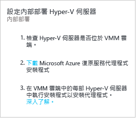

2. 在 [檢查先決條件] 頁面上，按 [下一步]。將自動安裝任何缺少的必要元件。

	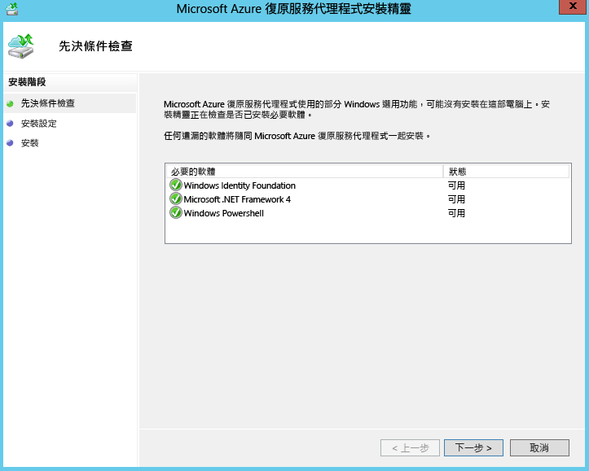

3. 在 [安裝設定] 頁面上，接受或修改安裝位置和快取位置。您可以在至少有 5 GB 可用儲存體的磁碟機上設定快取，但我們建議快取磁碟機有 600 GB 或更多可用空間。然後按一下 [安裝]。
4. 安裝完成後，按一下 [關閉] 按鈕即可完成。
	
	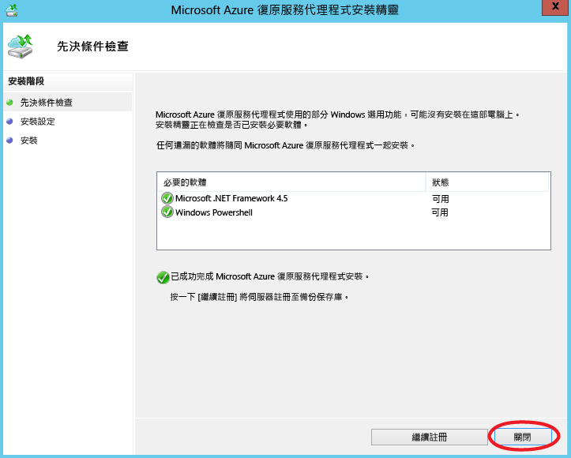

#### Azure Site Recovery 代理程式的命令列安裝

您可以使用下列命令，從命令列安裝 Microsoft Azure 復原服務代理程式：

     marsagentinstaller.exe /q /nu

#### 設定從 Hyper-V 主機對 Site Recovery 的網際網路 Proxy 存取

在 Hyper-V 主機上執行的復原服務代理程式需要 Azure 的網際網路存取權才能進行 VM 複寫。如果您透過 Proxy 存取網際網路，請如下所示設定它︰

1. 在 Hyper-V 主機上開啟 Microsoft Azure 備份 MMC 嵌入式管理單元。根據預設，Microsoft Azure 備份的捷徑位於桌面上或在 C:\\Program Files\\Microsoft Azure Recovery Services Agent\\bin\\wabadmin 中。
2. 在嵌入式管理單元中，按一下 [變更屬性]。
3. 在 [Proxy 設定] 索引標籤上指定 Proxy 伺服器資訊。

	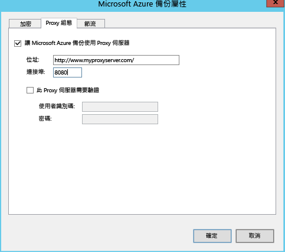

4. 確定代理程式可以連到[必要條件](#on-premises-prerequisites)中所述的 URL。

## 步驟 3︰設定目標環境

指定要用於複寫的 Azure 儲存體帳戶，以及 Azure VM 在容錯移轉後會連接的 Azure 網路。

1.	按一下 [準備基礎結構] > [目標]，然後選取您要使用的 Azure 訂用帳戶。
2.	指定您要在容錯移轉後用於 VM 的部署模型。
3.	Site Recovery 會檢查您是否有一或多個相容的 Azure 儲存體帳戶和網路。

	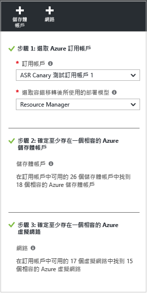

4.	如果您尚未建立儲存體帳戶，而且想要使用 ARM 建立一個，請按一下 [+儲存體帳戶] 以內嵌方式執行該作業。在 [建立儲存體帳戶] 刀鋒視窗中，指定帳戶名稱、類型、訂用帳戶和位置。此帳戶應位於與復原服務保存庫相同的位置。

	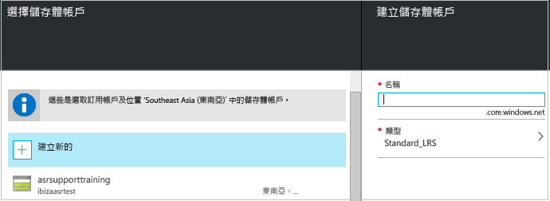

	請注意：

	- 如果您想要使用傳統模型建立儲存體帳戶，請在 Azure 入口網站中執行該作業。[深入了解](../storage/storage-create-storage-account-classic-portal.md)
	- 如果您將進階儲存體帳戶使用於複寫的資料，則必須設定其他標準儲存體帳戶來儲存複寫記錄檔，而這類記錄檔會擷取內部部署資料的進行中變更。

4.	如果您尚未建立 Azure 網路，而且想要使用 ARM 建立一個，請按一下 [+Network] (+網路) 以內嵌方式執行該作業。在 [建立虛擬網路] 刀鋒視窗上，指定網路名稱、位址範圍、子網路詳細資料、訂用帳戶和位置。此網路應位於與復原服務保存庫相同的位置。

	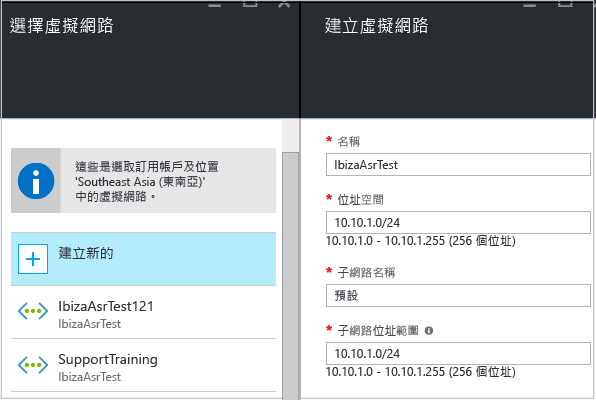

	如果您想要使用傳統模型建立網路，請在 Azure 入口網站中執行該作業。[深入了解](../virtual-network/virtual-networks-create-vnet-classic-pportal.md)。

### 設定網路對應

- [閱讀](#prepare-for-network-mapping)網路對應的快速概觀。[閱讀這文](site-recovery-network-mapping.md)以取得更深入的說明。
- 確認 VMM 伺服器上的虛擬機器已連接到 VM 網路，以及您已建立至少一個 Azure 虛擬網路。請注意，多個 VM 網路可對應至單一 Azure 網路。

設定對應，如下所示︰

1. 在 [設定] > [Site Recovery 基礎結構] > [網路對應] > [網路對應] 中，按一下 [+網路對應] 圖示。

	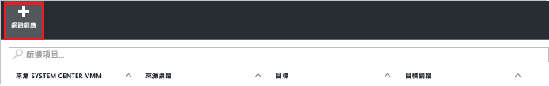

2. 在 [新增網路對應] 上選取來源 VMM 伺服器，並選取 [Azure] 做為目標。
3. 在容錯移轉後確認訂用帳戶和部署模型。
4. 在 [來源網路] 中，從與 VMM 伺服器相關聯的清單中，選取您要對應的來源內部部署 VM 網路。
5. 在 [目標網路] 中，選取複本 Azure VM 啟動後所位在的 Azure 網路。然後按一下 [確定]。

	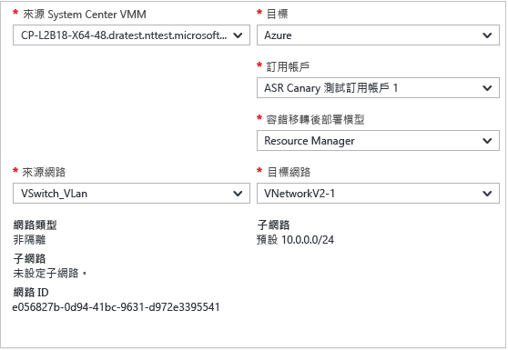

以下是網路對應開始時發生的事情︰

- 對應開始時，來源 VM 網路上的現有 VM 將會連接到目標網路。進行複寫時，連接到來源 VM 網路的新 VM 會連接到對應的 Azure 網路。
- 如果您修改現有的網路對應，則複本虛擬機器將使用新設定進行連線。
- 如果目標網路具有多個子網路，且其中一個子網路的名稱和來源虛擬機器所在之子網路名稱相同，複本虛擬機器將會在容錯移轉之後連線到該目標子網路。
- 如果沒有目標子網路具有相符的名稱，虛擬機器將會連線到網路中的第一個子網路。

## 步驟 4：設定複寫設定

1. 若要建立新的複寫原則，請按一下 [準備基礎結構] > [複寫設定] > [+建立及關聯]。

	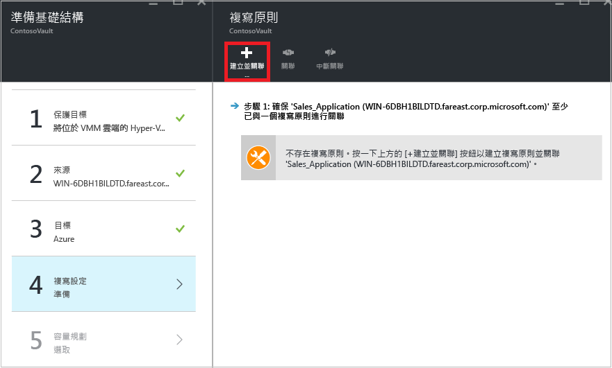

2. 在 [建立及關聯原則] 中指定原則名稱。
3. 在 [複製頻率] 中，指定您要在初始複寫後複寫差異資料的頻率 (每隔 30 秒、5 或 15 分鐘)。
4. 在 [復原點保留] 中，針對每個復原點指定保留週期的長度 (以小時為單位)。受保護的機器可以復原到週期內的任意點。
6. 在 [應用程式一致快照頻率] 中，指定建立包含應用程式一致快照的復原點的頻率 (1-12 小時)。Hyper-V 使用兩種類型的快照，一個是標準快照，提供整個虛擬機器的增量快照，另一個是應用程式一致快照，會建立虛擬機器內應用程式資料的時間點快照。應用程式一致快照會使用「磁碟區陰影複製服務」(VSS) 來確保建立快照時，應用程式是處於一致狀態。請注意，如果您啟用應用程式一致快照，它會影響在來源虛擬機器上執行的應用程式效能。確認您設定的值低於您設定的其他復原點數目。
3. 在 [初始複寫開始時間] 中，指定開始初始複寫的時間。複寫會透過您的網際網路頻寬發生，所以您可能想將它排程在忙碌時間之外。
5. 在 [加密儲存在 Azure 上的資料] 中，指定是否加密 Azure 儲存體中的待用資料。然後按一下 [確定]。

	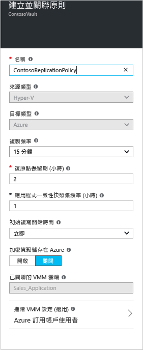

6. 當您建立新的原則時，該原則會自動與 VMM 雲端產生關聯。按一下 [確定]。您可以在 [設定] > [複寫] > 原則名稱 > [關聯 VMM 雲端] 中，將其他 VMM 雲端 (及其中的 VM) 與此複寫原則產生關聯。

	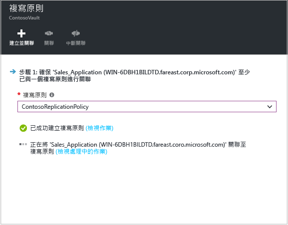

## 步驟 5︰容量規劃

您現已設定您的基本基礎結構，您可以思考容量規劃並找出您是否需要額外的資源。

Site Recovery 會提供容量規劃工具，協助您為來源環境、Site Recovery 元件、網路和儲存體配置適當的資源。您可以在快速模式中執行規劃工具，以便根據 VM、磁碟和儲存體的平均數量進行估計，或在詳細模式中執行規劃工具，以輸入工作負載層級的數據。開始之前，您必須︰

- 收集有關複寫環境的資訊，包括 VM、每個 VM 的磁碟和每個磁碟的儲存體。
- 估計複寫資料的每日變更 (流失) 率。您可以使用 [Capacity Planner for Hyper-V Replica (適用於 Hyper-V 複本的 Capacity Planner)](https://www.microsoft.com/download/details.aspx?id=39057) 來協助您執行這項操作。

1.	按一下 [下載] 來下載此工具並加以執行。閱讀工具隨附的[文章](site-recovery-capacity-planner.md)。
2.	當您完成時，請在 [是否已執行 Capacity Planner?] 中選取 [是]

	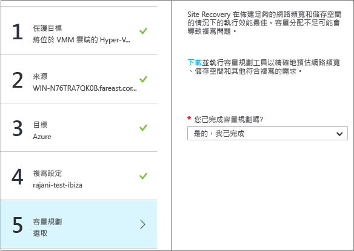

### 網路頻寬考量

您可以使用容量規劃工具來計算複寫 (初始複寫，而後是差異複寫) 所需的頻寬 。若要控制複寫所用的頻寬數量，您有幾個選項可用︰

- **節流頻寬**︰複寫至次要網站的 Hyper-V 流量會經過特定的 Hyper-V 主機。您可以在主機伺服器上進行頻寬節流。
- **調整頻寬**︰您可以使用幾個登錄機碼來影響用於複寫的頻寬。

#### 節流頻寬

1. 在 Hyper-V 主機伺服器上開啟 Microsoft Azure 備份 MMC 嵌入式管理單元。根據預設，Microsoft Azure 備份的捷徑位於桌面上或在 C:\\Program Files\\Microsoft Azure Recovery Services Agent\\bin\\wabadmin 中。
2. 在嵌入式管理單元中，按一下 [變更屬性]。
3. 在 [節流] 索引標籤上，選取 [啟用備份操作的網際網路頻寬使用節流設定]，然後設定工作和非工作時數的限制。有效範圍是每秒 512 Kbps 到 102 Mbps。

	

您也可以使用 [Set-OBMachineSetting](https://technet.microsoft.com/library/hh770409.aspx) Cmdlet 來設定節流。以下是一個範例：

    $mon = [System.DayOfWeek]::Monday 
    $tue = [System.DayOfWeek]::Tuesday
    Set-OBMachineSetting -WorkDay $mon, $tue -StartWorkHour "9:00:00" -EndWorkHour "18:00:00" -WorkHourBandwidth  (512*1024) -NonWorkHourBandwidth (2048*1024)

**Set-OBMachineSetting -NoThrottle** 表示不需要節流。

#### 影響網路頻寬

**UploadThreadsPerVM** 登錄值會控制用於磁碟資料傳輸 (初始或差異複寫) 的執行緒數目。較高的值可增加複寫所用的網路頻寬。**DownloadThreadsPerVM** 登錄值會指定在容錯回復期間用於資料傳輸的執行緒數目。

1. 在登錄中瀏覽至 **HKEY\_LOCAL\_MACHINE\\SOFTWARE\\Microsoft\\Windows Azure Backup\\Replication**。
	
	- 修改 **UploadThreadsPerVM** 值 (如此果機碼不存在，則予以建立) 來控制用於磁碟複寫的執行緒。
	- 修改 **DownloadThreadsPerVM** 值 (如此果機碼不存在，則予以建立) 來控制用於從 Azure 容錯回復流量的執行緒。
2. 預設值為 4。在 “overprovisioned” 網路中，這些登錄機碼必須變更自其預設值。最大值為 32。監視流量，將此值最佳化。

## 步驟 6：啟用複寫

立即啟用複寫，如下所示︰

1. 按一下 [步驟 2: 複寫應用程式] > [來源]。第一次啟用複寫之後，請按一下保存庫中的 [+複寫]，以對其他機器啟用複寫。

	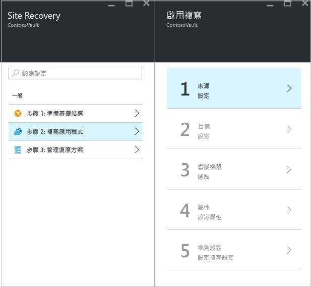

2. 在 [來源] 刀鋒視窗中，選取 VMM 伺服器和 Hyper-V 主機所在的雲端。然後按一下 [確定]。

	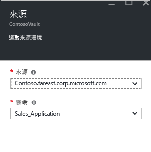

3. 在 [目標] 中，選取訂用帳戶、容錯移轉後的部署模型，以及您用於複寫資料的儲存體帳戶。

	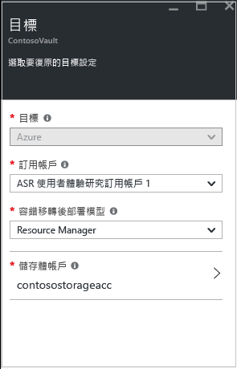

4. 選取您要使用的儲存體帳戶。如果您想使用與現有不同的儲存體帳戶，您可以[建立一個](#set-up-an-azure-storage-account)。若要使用 ARM 模型來建立儲存體帳戶，請按一下 [新建]。如果您想要使用傳統模型建立儲存體帳戶，請在 [Azure 入口網站](../storage/storage-create-storage-account-classic-portal.md)中執行該作業。然後按一下 [確定]。
5. 選取 Azure VM 在容錯移轉後啟動時所要啟動的 Azure 網路和子網路。選取 [Configure now for selected machines] (立即針對選取的機器進行設定)，將網路設定套用至您選取要進行保護的所有機器。選取 [稍後設定] 以選取每部機器的 Azure 網路。如果您想使用與現有不同的網路，您可以[建立一個](#set-up-an-azure-network)。若要使用 ARM 模型建立網路，請按一下 [新建]。如果您想要使用傳統模型建立網路，請在 [Azure 入口網站](../virtual-network/virtual-networks-create-vnet-classic-pportal.md)中執行該作業。選取適用的子網路。然後按一下 [確定]。
6. 在 [虛擬機器] > [選取虛擬機器] 中，按一下並選取您要複寫的每部機器。您只能選取可以啟用複寫的機器。然後按一下 [確定]。

	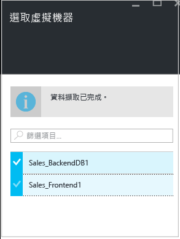

5. 在 [屬性] > [設定屬性] 中，為選取的 VM 選取作業系統和 OS 磁碟。然後按一下 [確定]。您可以稍後再設定其他屬性。

	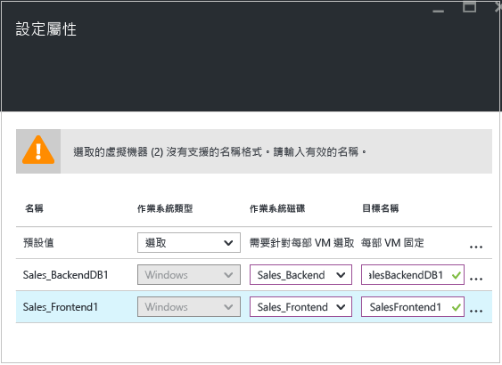

	
12. 在 [複寫設定] > [進行複寫設定] 中，選取您要套用於受保護 VM 的複寫原則。然後按一下 [確定]。您可以在 [設定] > [複寫原則] > 原則名稱 > [編輯設定] 中，修改複寫原則。您套用的變更將用於已在複寫的機器和新的機器。

	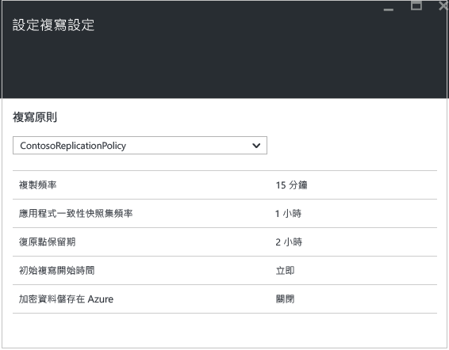

您可以在 [設定] > [作業] > [Site Recovery 作業]中，追蹤 [啟用保護] 作業的進度。執行 [完成保護] 作業之後，機器即準備好進行容錯移轉。

### 檢視及管理 VM 屬性

建議您確認來源機器的屬性。請記住，Azure VM 名稱應該符合 [Azure 虛擬機器需求](site-recovery-best-practices.md#azure-virtual-machine-requirements)。

1. 按一下 [設定] > [受保護的項目] > [複寫的項目]，然後選取電腦以查看其詳細資料。

	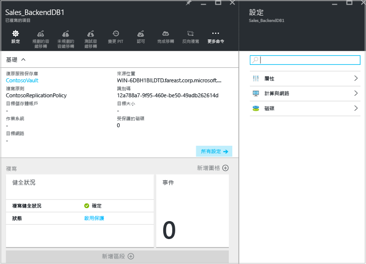

2. 在 [屬性] 中，您可以檢視 VM 的複寫和容錯移轉資訊。

	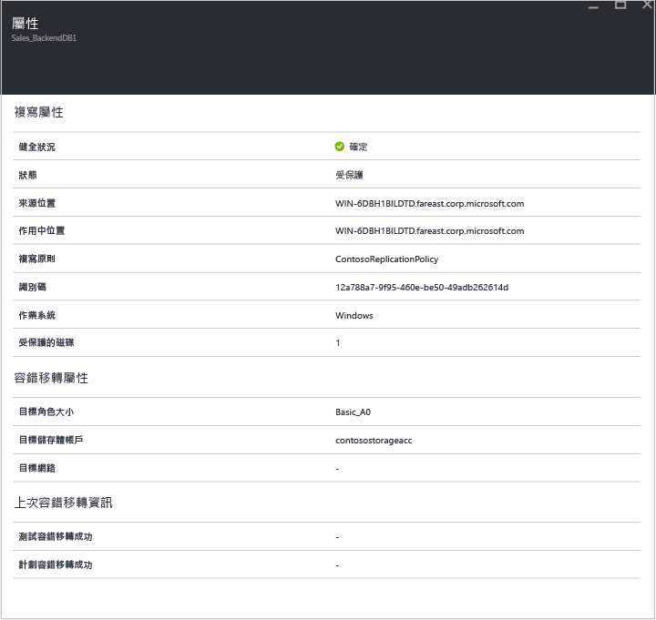

3. 在 [計算和網路] > [計算屬性] 中，您可以指定 Azure VM 名稱和目標大小。視需要修改名稱以符合 [Azure 需求](site-recovery-best-practices.md#azure-virtual-machine-requirements)。您也可以檢視和修改目標網路、子網路的相關資訊，以及將指派給 Azure VM 的 IP 位址。請注意：

	- 您可以設定目標 IP 位址。如果您未提供地址，則容錯移轉的機器會使用 DHCP。如果您設定無法用於容錯移轉的位址，則容錯移轉會失敗。如果位址可用於測試容錯移轉網路，則相同的目標 IP 位址可用於測試容錯移轉。
	- 網路介面卡的數目會視您指定給目標虛擬機器的大小而有所不同，如下所示：

		- 如果來源電腦上的網路介面卡數目小於或等於針對目標機器大小所允許的介面卡數目，則目標將具備與來源相同的介面卡數目。
		- 如果來源虛擬機器的介面卡數目超過針對目標大小所允許的數目，則將使用目標大小的最大值。
		- 例如，如果來源機器具有兩張網路介面卡，而目標機器大小支援四張，則目標機器將會有兩張介面卡。如果來源機器具有兩張介面卡，但支援的目標大小僅支援一張，則目標機器將只會有一張介面卡。
		- 如果 VM 有多張網路介面卡，則全部會連接至相同的網路。

	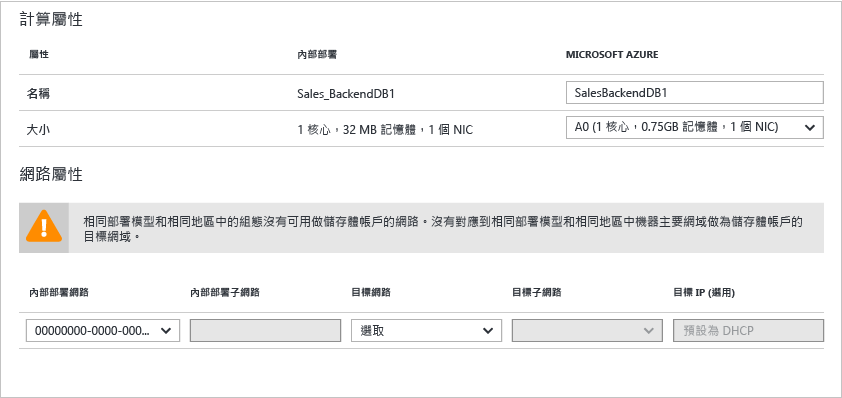

5.	在 [磁碟] 中，您可以看見 VM 上將要複寫的作業系統和資料磁碟。

## 步驟 7︰測試您的部署

若要測試部署，您可以針對單一虛擬機器執行測試容錯移轉，或執行包含一或多部虛擬機器的復原方案。

### 準備容錯移轉

- 若要測試容錯移轉，建議您建立與您的 Azure 生產網路分隔的新 Azure 網路 (這是您在 Azure 中建立新網路時的預設行為)。[深入了解](site-recovery-failover.md#run-a-test-failover)如何執行測試容錯移轉。
- 若要在容錯移轉至 Azure 時獲得最佳效能，請在受保護的機器上安裝 Azure 代理程式。這可讓開機變快速，並協助進行疑難排解。安裝 [Linux](https://github.com/Azure/WALinuxAgent) 或 [Windows](http://go.microsoft.com/fwlink/?LinkID=394789) 代理程式。
- 若要完整測試您的部署，您需要有基礎結構，讓複寫的機器如預期般運作。如果您想要測試 Active Directory 和 DNS，您可以透過 DNS 建立虛擬機器做為網域控制站，並使用 Azure Site Recovery 將此虛擬機器複寫至 Azure。深入了解 [Active Directory 的測試容錯移轉考量](site-recovery-active-directory.md#considerations-for-test-failover)。
- 如果您想要執行非計劃性容錯移轉，而不是測試容錯移轉，請注意下列事項︰

	- 如果可能的話您應該在執行非計劃性容錯移轉之前關閉主要機器。這可確保您不需要同時執行來源和複本機器。
	- 當您執行非計劃性容錯移轉時，會停止從主要機器的資料複寫，讓任何資料差異不會在開始非計劃性容錯移轉之後傳送。此外，如果您在復原方案上執行非計劃性容錯移轉，它將會執行直到完成為止 (即使發生錯誤)。

### 準備在容錯移轉後連接到 Azure VM

如果您想要在容錯移轉後使用 RDP 連接到 Azure VM，請確定執行下列作業︰

**在容錯移轉前的內部部署機器上**：

- 對透過網際網路的存取啟用 RDP，確定已針對 [公用] 新增 TCP 和 UDP 規則，並確定在 [Windows 防火牆] -> [允許的應用程式和功能] 中針對所有設定檔允許 RDP。
- 對透過站對站連線的存取在機器上啟用 RDP，並確定在 [Windows 防火牆] -> [允許的應用程式和功能] 中針對 [網域] 和 [私人] 網路允許 RDP。
- 在內部部署機器上安裝 [Azure VM 代理程式](http://go.microsoft.com/fwlink/?LinkID=394789&clcid=0x409)。
- 確定作業系統的 SAN 原則已設為 OnlineAll。[深入了解](https://support.microsoft.com/kb/3031135)
- 在執行容錯移轉前，關閉 IPSec 服務。

**在容錯移轉後的 Azure VM 上**：

- 新增 RDP 通訊協定 (連接埠 3389) 的公用端點並指定用於登入的認證。
- 請確定沒有任何網域原則禁止您使用公用位址連接到虛擬機器。
- 嘗試連線。如果無法連線，請確認 VM 正在執行中。如需其他疑難排解提示，請閱讀這篇[文章](http://social.technet.microsoft.com/wiki/contents/articles/31666.troubleshooting-remote-desktop-connection-after-failover-using-asr.aspx)。

如果您想要在容錯移轉後使用安全殼層用戶端 (ssh) 存取執行 Linux 的 Azure VM，請執行下列作業︰

**在容錯移轉前的內部部署機器上**：

- 確定 Azure VM 上的安全殼層服務已設定為在系統開機時自動啟動。
- 請檢查防火牆規則是否允許 SSH 連線。

**在容錯移轉後的 Azure VM 上**：

- 已容錯移轉的 VM 上的網路安全性群組規則以及它所連接的 Azure 子網路必須允許 SSH 連接埠的連入連線。
- 應建立公用端點，以允許 SSH 連接埠 (預設為 TCP 通訊埠 22) 上的連入連線。
- 如果透過 VPN 連線 (Express Route 或站對站 VPN) 存取 VM，則用戶端可用來透過 SSH 直接連接到 VM。

### 執行測試容錯移轉

若要執行測試容錯移轉，請執行下列動作：

1. 若要容錯移轉單一 VM，請在 [設定] > [複寫的項目] 中，按一下 [VM] > [+測試容錯移轉]。
2. 若要容錯移轉復原方案，請在 [設定] > [復原方案] 中，以滑鼠右鍵按一下方案 > [測試容錯移轉]。若要建立復原方案，請[遵循這些指示](site-recovery-create-recovery-plans.md)。

3. 在 [測試容錯移轉] 中，選取 Azure VM 在容錯移轉之後要連接的 Azure 網路。
4. 按一下 [確定] 即可開始容錯移轉。您可以按一下 VM 以開啟其屬性，或在 [設定] > [Site Recovery 作業] 中的 [測試容錯移轉] 作業上追蹤進度。
5. 當容錯移轉到達 [完成測試] 階段時，請執行下列作業：

	1. 在 Azure 入口網站中檢視複本虛擬機器。確認虛擬機器成功啟動。
	2. 如果您設定從內部部署網路存取虛擬機器，您可以初始化虛擬機器的「遠端桌面」連線。
	3. 按一下 [完成測試] 來完成它。
	4. 按一下 [記事] 記錄並儲存關於測試容錯移轉的任何觀察。
	5. 按一下 [測試容錯移轉完成]。清除測試環境，以自動關閉電源及刪除測試虛擬機器。
	6. 在此階段，會刪除 Site Recovery 在測試容錯移轉期間自動建立的所有元素或 VM。不會刪除任何您為測試容錯移轉建立的其他元素。
	
	> [AZURE.NOTE] 如果測試容錯移轉持續兩週以上，系統即會強制完成該測試容錯移轉。

6. 容錯移轉完成之後，您應該也會看到複本 Azure 機器出現在 Azure 入口網站 > [虛擬機器]。您應該確定 VM 為適當的大小、已連接到適當的網路，而且正在執行中。
7. 如果您[已準備好容錯移轉後的連線](#prepare-to-connect-to-Azure-VMs-after-failover)，您應該能夠連接到 Azure VM。

## 監視您的部署

以下是監視 Site Recovery 部署的組態設定、狀態和健康狀態的方式︰

1. 按一下保存庫名稱來存取 [程式集] 儀表板。在此儀表板中，您可以看見 Site Recovery 作業、複寫狀態、復原方案、伺服器健康狀態和事件。您可以自訂 [基本資訊] 以顯示最適合您的圖格和配置，包括其他 Site Recovery 和備份保存庫的狀態。

	

2. 在 [健全狀況] 圖格中，您可以監視發生問題的站台伺服器 (VMM 或組態伺服器)，以及 Site Recovery 在過去 24 小時內引發的事件。
3. 您可以在 [複寫的項目]、[復原方案] 和 [Site Recovery 工作] 圖格中管理和監視複寫。您可以在 [設定] -> [作業] -> [Site Recovery 作業] 中向下切入作業。

## 後續步驟

在您的部署設定完成並開始執行之後，[深入了解](site-recovery-failover.md)不同類型的容錯移轉。

<!---HONumber=AcomDC_0803_2016-->