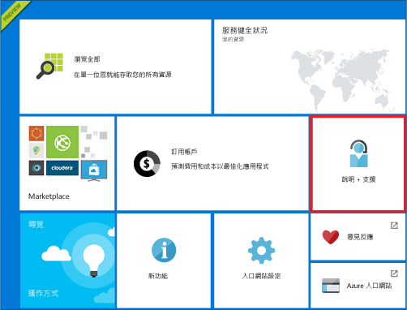
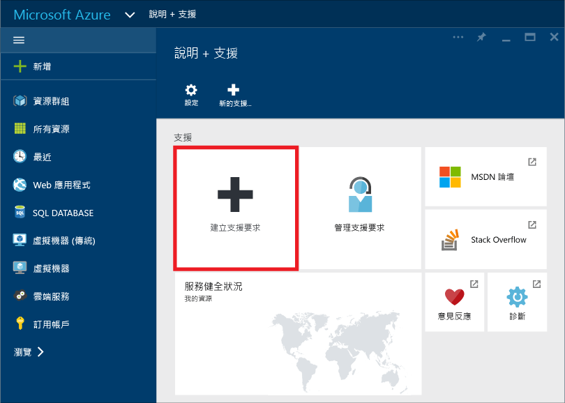
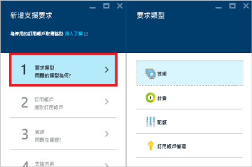
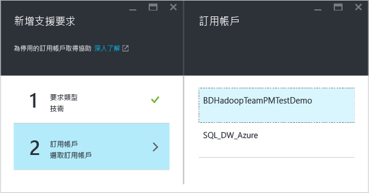
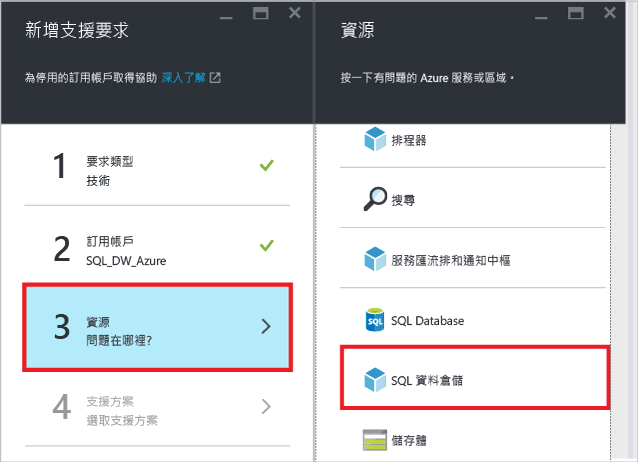
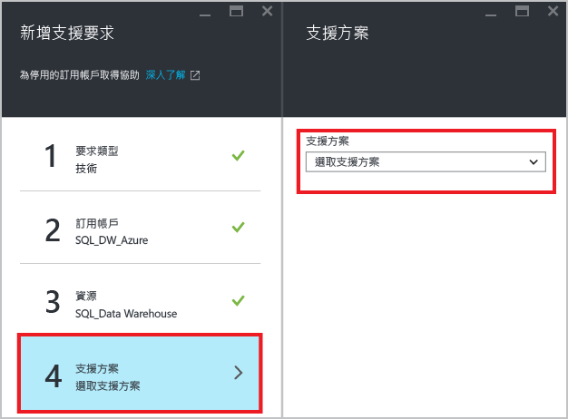
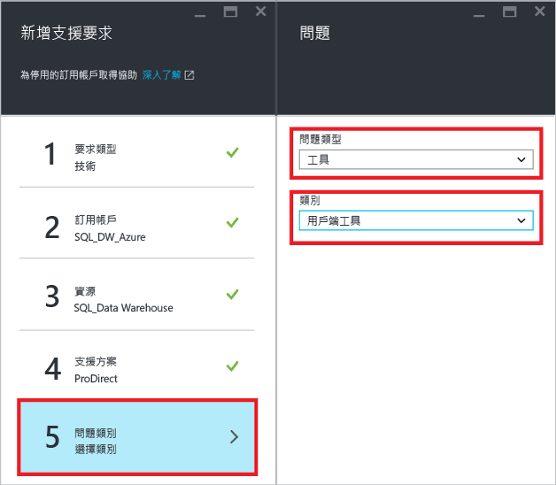
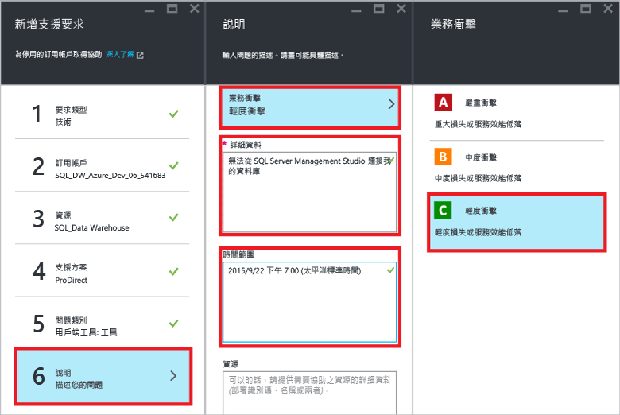
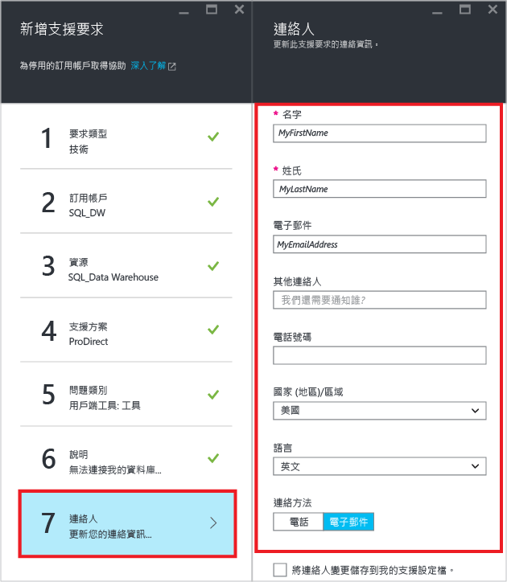
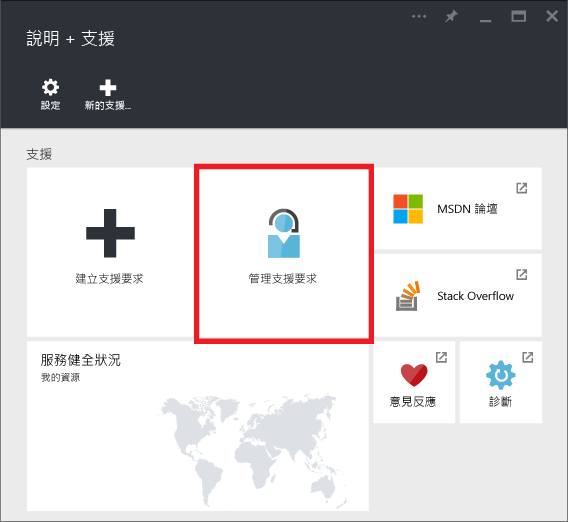

# 如何為 SQL 資料倉儲建立支援票證
如果您的 SQL 資料倉儲有任何問題，請建立支援票證，以便我們的工程小組協助您。

> [!NOTE] 
> 截至 2016 年 12 月 20 日時，Azure 入口網站中的資源健全狀況檢查並不正確。 我們正著手解決這個問題。 

## 建立支援票證
1. 開啟 [Azure 入口網站][Azure portal]。
2. 在 [首頁] 畫面上，按一下 [說明 + 支援]  圖格。
   
    
3. 在 [說明 + 支援] 刀鋒視窗上，按一下 [建立支援要求] 。
   
    
   
     
4. 選取 [要求類型] 。
   
    
   
   > [!NOTE]
   > 根據預設，每個 SQL Server (例如 myserver.database.windows.net) 的 **DTU 配額** 為 45,000。 此配額僅是安全限制。 您可以藉由建立支援票證，並選取 [配額]  做為要求類型來增加配額。 若要計算 DTU 需求，將所需的總 [DWU][DWU] 乘以 7.5。 例如，如果您想要在一個 SQL Server 上裝載兩個 DW6000，則應該要求 90,000 的 DTU 配額。  您可以在入口網站的 [SQL Server] 刀鋒視窗中檢視目前的 DTU 耗用量。 已暫停和未暫停的資料庫都會計入 DTU 配額。 
   > 
   > 
5. 選取主控您回報發生問題之資料庫的 [訂用帳戶]  。
   
    
6. 選取 [SQL 資料倉儲]  做為資源。
   
    
7. 選取 [Azure 支援計劃][Azure support plan]。
   
   * **帳單、配額及訂用帳戶管理** 支援。
   * **協助修正**支援則透過[開發人員][Developer]、[標準][Standard]、[專業直導][Professional Direct]支援或[頂級][Premier]支援來提供。 客戶在使用 Azure 期間如果遇到可合理認為是 Microsoft 所造成的問題，這類問題即屬於可協助修正的問題。
   * [專業指導][Professional Direct]和[頂級][Premier]支援層級可提供**開發顧問**和**諮詢服務**。 
     
     如果您有頂級支援計劃，您也可以在 [Microsoft Premier 線上入口網站][Microsoft Premier online portal]回報 SQL 資料倉儲的相關問題。  請參閱 [Azure 支援計畫][Azure support plan]，進一步了解包括範圍、回應時間、價格等各種 Azure 支援計畫。如需有關 Azure 支援的常見問題集，請參閱 [Azure 支援常見問題集][Azure support FAQs]。  
     
     
8. 選取**問題類型**和**類別**。 在此範例中，我們選擇了 [工具] 做為問題類型，選擇 [用戶端工具] 做為類別。 
   
    
9. 描述問題並選擇商業影響層級。
   
    
10. 將預先填入此支援票證的您的 **連絡資訊** 。 必要時更新此項目。
    
    
11. 按一下 [建立]  提交支援要求。

## 監視支援票證
在您提交支援要求之後，Azure 支援小組會與您連絡。 若要檢查您的要求狀態和詳細資料，請在儀表板上按一下 [管理支援要求]  。

## 其他資源
此外，您可以在 [Stack Overflow][Stack Overflow] 或在 [Azure SQL 資料倉儲 MSDN 論壇][Azure SQL Data Warehouse MSDN forum]上與 SQL 資料倉儲社群聯繫。

<!--Image references--> 

<!--Article references--> 
[DWU]: ./sql-data-warehouse-overview-what-is.md

<!--MSDN references--> 

<!--Other web references--> 
[Azure portal]: https://portal.azure.com/
[Azure support plan]: https://azure.microsoft.com/support/plans/?WT.mc_id=Support_Plan_510979/  
[Developer]: https://azure.microsoft.com/support/plans/developer/  
[Standard]: https://azure.microsoft.com/support/plans/standard/  
[Professional Direct]: https://azure.microsoft.com/support/plans/prodirect/  
[Premier]: https://azure.microsoft.com/support/plans/premier/  
[Azure support FAQs]: https://azure.microsoft.com/support/faq/
[Microsoft Premier online portal]: https://premier.microsoft.com/
[Stack Overflow]: https://stackoverflow.com/questions/tagged/azure-sqldw/
[Azure SQL Data Warehouse MSDN forum]: https://social.msdn.microsoft.com/Forums/home?forum=AzureSQLDataWarehouse/

