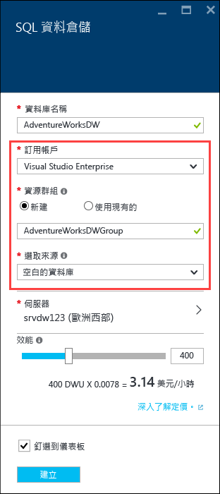
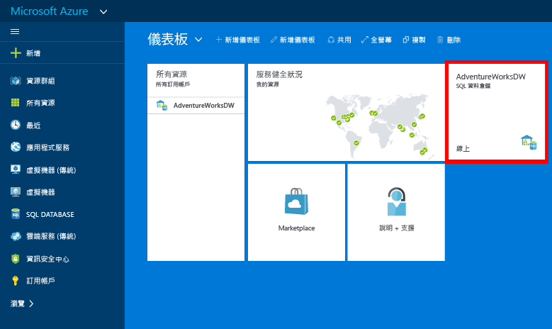

# 建立 Azure SQL 資料倉儲
> [!div class="op_single_selector"]
> * [Azure 入口網站](sql-data-warehouse-get-started-provision.md)
> * [TSQL](sql-data-warehouse-get-started-create-database-tsql.md)
> * [PowerShell](sql-data-warehouse-get-started-provision-powershell.md)
>
>

本教學課程使用 Azure 入口網站來建立包含 AdventureWorksDW 範例資料庫的 SQL 資料倉儲。

## 必要條件
若要開始，您需要：

* **Azure 帳戶**︰請瀏覽 [Azure 免費試用][Azure Free Trial]或 [MSDN Azure 點數][MSDN Azure Credits]以建立帳戶。
* **Azure SQL Server**︰如需詳細資訊，請參閱[使用 Azure 入口網站建立 Azure SQL Database][Create an Azure SQL database in the Azure portal]。

> [!NOTE]
> 建立 SQL 資料倉儲可能會導致新的可計費服務。  如需詳細資訊，請參閱 [SQL 資料倉儲價格][SQL Data Warehouse pricing]。
>
>

## 建立 SQL 資料倉儲
1. 登入 [Azure 入口網站](https://portal.azure.com)。
2. 按一下 [+ 新增] > [資料庫] > [SQL 資料倉儲]。

    
3. 在 [SQL 資料倉儲]  刀鋒視窗中，填入所需的資訊，然後按 [建立] 來建立。

    

   * **伺服器**︰我們建議您先選取您的伺服器。  
   * **資料庫名稱**︰用來參考 SQL 資料倉儲的名稱。  對伺服器而言，它必須是唯一的。
   * **效能**：我們建議從 400 [DWU][DWU] 開始。 您可以將滑桿向左邊或向右移動，以調整資料倉儲的效能，在建立之後相應增加或相應減少。  若要深入了解 DWU，請參閱[調整](sql-data-warehouse-manage-compute-overview.md)相關文件或我們的[價格頁面][SQL Data Warehouse pricing]。
   * **訂用帳戶**：選取此 SQL 資料倉儲將會計費的 [訂用帳戶] 。
   * **資源群組**：[資源群組][Resource group]是為了協助您管理 Azure 資源集合而設計的容器。 深入了解[資源群組](../azure-resource-manager/resource-group-overview.md)。
   * **選取來源**：按一下 [選取來源] > [範例]。 Azure 會自動將 AdventureWorksDW 填入 [選取範例]  選項。

   > [!NOTE]
   > SQL 資料倉儲的預設定序為 SQL_Latin1_General_CP1_CI_AS。 如果需要不同的定序，可以使用 [T-SQL][T-SQL] 來建立具有不同定序的資料庫。
   >
   >

1. 按一下 [建立]  來建立您的 SQL 資料倉儲。
2. 等候幾分鐘的時間。 當您的資料倉儲準備就緒時，您應該會返回 [Azure 入口網站](https://portal.azure.com)。 您可以在儀表板上尋找您的 SQL 資料倉儲，其列在您的 SQL 資料庫之下，或在您用來建立它的資源群組中。

    

[!INCLUDE [SQL Database create server](../../includes/sql-database-create-new-server-firewall-portal.md)]

## 後續步驟
既然您已建立 SQL 資料倉儲，您已準備好 [連接](sql-data-warehouse-connect-overview.md) 和開始查詢。

若要將資料載入 SQL 資料倉儲，請參閱 [載入概觀](sql-data-warehouse-overview-load.md)。

如果您嘗試將現有的資料庫移轉至 SQL 資料倉儲，請參閱[移轉概觀](sql-data-warehouse-overview-migrate.md)或使用[移轉公用程式](sql-data-warehouse-migrate-migration-utility.md)。

也可以使用 Transact-SQL 來設定防火牆規則。 如需詳細資訊，請參閱 [sp_set_firewall_rule][sp_set_firewall_rule] 和 [sp_set_database_firewall_rule][sp_set_database_firewall_rule]。

查看我們的[最佳作法][Best practices]也是不錯的辦法。

<!--Article references-->
[Create an Azure SQL database in the Azure portal]: ../sql-database/sql-database-get-started.md
[Create an Azure SQL database with PowerShell]: ../sql-database/sql-database-create-and-configure-database-powershell
[resource groups]: ../azure-resource-manager/resource-group-template-deploy-portal.md
[Best practices]: sql-data-warehouse-best-practices.md
[DWU]: sql-data-warehouse-overview-what-is.md
[訂用帳戶]: ../azure-glossary-cloud-terminology.md#subscription
[resource group]: ../azure-glossary-cloud-terminology.md#resource-group
[T-SQL]: ./sql-data-warehouse-get-started-create-database-tsql.md

<!--MSDN references-->
[sp_set_firewall_rule]: https://msdn.microsoft.com/library/dn270017.aspx
[sp_set_database_firewall_rule]: https://msdn.microsoft.com/library/dn270010.aspx

<!--Other Web references-->
[SQL Data Warehouse pricing]: https://azure.microsoft.com/pricing/details/sql-data-warehouse/
[Azure Free Trial]: https://azure.microsoft.com/pricing/free-trial/?WT.mc_id=A261C142F
[MSDN Azure Credits]: https://azure.microsoft.com/pricing/member-offers/msdn-benefits-details/?WT.mc_id=A261C142F

