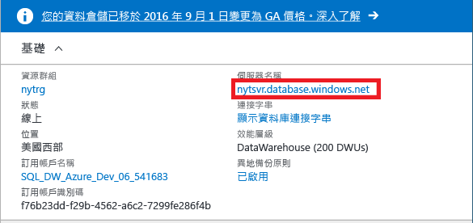
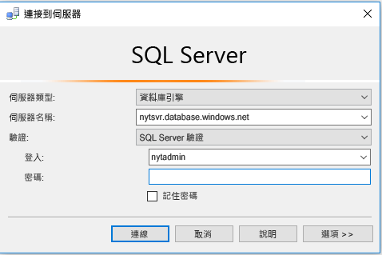
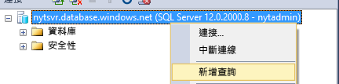
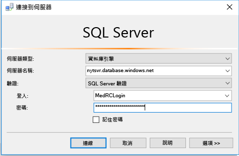
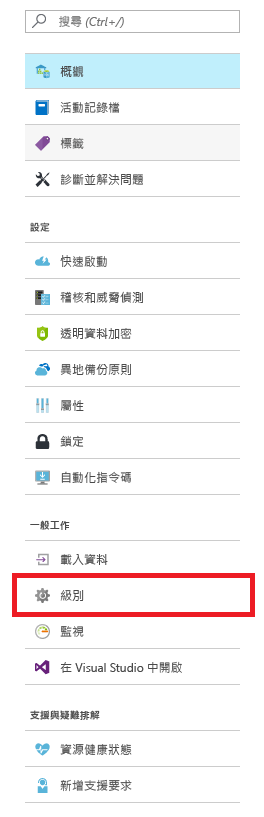
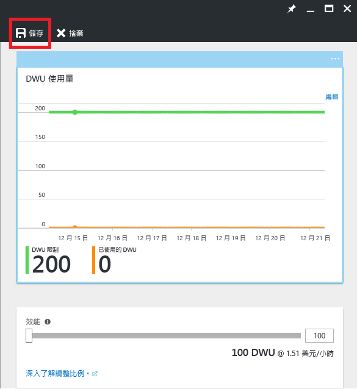

# <a name="get-started-with-sql-data-warehouse"></a>開始使用 SQL 資料倉儲

本教學課程會說明如何佈建，並將資料載入 Azure SQL 資料倉儲。 您也將學習調整、暫停和微調的基本概念。 完成時，您就能查詢及瀏覽資料倉儲。

**預估完成時間︰**這是內含範例程式碼的端對端教學課程，在您完成必要條件後，需耗時約 30 分鐘才能完成。 

## <a name="prerequisites"></a>必要條件

此教學課程假設您熟悉 SQL 資料倉儲基本概念。 如果您需要簡介，請參閱[什麼是 SQL 資料倉儲？](sql-data-warehouse-overview-what-is.md) 

### <a name="sign-up-for-microsoft-azure"></a>註冊 Microsoft Azure
如果您還沒有 Microsoft Azure 帳戶，則必須註冊帳戶才能使用這項服務。 如果您已經有帳戶，則可以跳過此步驟。 

1. 瀏覽至帳戶頁面 [https://azure.microsoft.com/account/](https://azure.microsoft.com/account/)
2. 建立免費的 Azure 帳戶，或購買帳戶。
3. 遵循指示進行

### <a name="install-appropriate-sql-client-drivers-and-tools"></a>安裝適當的 SQL 用戶端驅動程式和工具

大部分的 SQL 用戶端工具都可以使用 JDBC、ODBC 或 ADO.net 連線到 SQL 資料倉儲。 由於 SQL 資料倉儲支援大量 T-SQL 功能，部分用戶端應用程式不會與 SQL 資料倉儲完全相容。

如果您執行的是 Windows 作業系統，建議您使用 [Visual Studio] 或 [SQL Server Management Studio]。

[!INCLUDE [Create a new logical server](../../includes/sql-data-warehouse-create-logical-server.md)] 

[!INCLUDE [SQL Database create server](../../includes/sql-database-create-new-server-firewall-portal.md)]

## <a name="create-a-sql-data-warehouse"></a>建立 SQL 資料倉儲

SQL 資料倉儲是一種特殊類型的資料庫，其設計用來進行大量平行處理。 將跨多個節點分散資料庫，且資料庫可平行處理查詢。 SQL 資料倉儲具有控制節點，其可協調所有節點的活動。 節點本身會使用 SQL Database 來管理資料。  

> [!NOTE]
> 建立 SQL 資料倉儲可能會導致新的可計費服務。  如需詳細資訊，請參閱 [SQL 資料倉儲價格](https://azure.microsoft.com/pricing/details/sql-data-warehouse/)。
>

### <a name="create-a-data-warehouse"></a>建立資料倉儲

1. 登入 [Azure 入口網站](https://portal.azure.com)。
2. 按一下 [新增] > [資料庫] > [SQL 資料倉儲]。

    
    

3. 填寫部署詳細資料

    **資料庫名稱**︰挑選您想要的名稱。 如果您有多個資料倉儲，建議您在名稱中包含詳細資料，例如其區域、環境等，例如 *mydw-westus-1-test*。

    **訂用帳戶**：您的 Azure 訂用帳戶

    **資源群組**：建立新的資源群組，或使用現有的資源群組。
    > [!NOTE]
    > 資源群組適合用來管理資源，例如界定存取控制和樣板化部署的範圍。 您可以[在此](https://docs.microsoft.com/azure/azure-resource-manager/resource-group-overview#resource-groups)深入了解 Azure 資源群組和最佳作法

    **來源**：空白資料庫

    **伺服器**︰選取您在[必要條件]中建立的伺服器。

    **定序**：保留預設定序 SQL_Latin1_General_CP1_CI_AS。

    **選取效能**︰建議您使用標準的 400 DWU。

4. 選擇 [釘選到儀表板]****
    

5. 稍候一會，讓資料倉儲進行部署！ 正常來說，此程序需要幾分鐘的時間。 資料倉儲可供使用時，入口網站會通知您。 

## <a name="connect-to-sql-data-warehouse"></a>連線到 SQL 資料倉儲

本教學課程使用 SQL Server Management Studio (SSMS) 來連線到資料倉儲。 您透過下列支援連接器連線到 SQL 資料倉儲︰ADO.NET、JDBC、ODBC 和 PHP。 請記住，非 Microsoft 支援工具的功能可能會受限。


### <a name="get-connection-information"></a>取得連線資訊

若要連線到資料倉儲，您必須透過在[必要條件]中所建立的邏輯 SQL Server 進行連線。

1. 從儀表板選取資料倉儲，或在您的資源中進行搜尋。

    

2. 尋找邏輯 SQL Server 的完整名稱。

    

3. 開啟 SSMS，並使用物件總管以使用您在[必要條件]中所建立的伺服器系統管理員認證連線到此伺服器

    

如果一切正常，您現在應該已連線到邏輯 SQL Server。 因為您以伺服器系統管理員的身分登入，您可以連接到伺服器裝載的任何資料庫，包括主要資料庫。 

只有一個伺服器系統管理帳戶，而且它有所有使用者的大部分權限。 請小心不要讓組織中的太多人員知道管理員密碼。 

您也可以擁有 Azure Active Directory 系統管理帳戶。 我們不會在此提供詳細資料。 如果您想要進一步了解 Azure Active Directory 驗證的使用，請參閱 [Azure AD 驗證](https://docs.microsoft.com/azure/sql-database/sql-database-aad-authentication)。

接下來，我們將探討建立其他登入和使用者。


## <a name="create-a-database-user"></a>建立資料庫使用者

在此步驟中，您會建立使用者帳戶來存取資料倉儲。 我們也會說明如何讓使用者能夠執行需使用大量的記憶體和 CPU 資源的查詢。

### <a name="notes-about-resource-classes-for-allocating-resources-to-queries"></a>配置查詢資源之資源類別的相關事項

- 若要保護您的資料，請不要使用伺服器系統管理員對您的生產資料庫執行查詢。 它具有所有使用者的大部分權限，且使用它在使用者資料上執行作業會讓您的資料面臨風險。 此外，因為伺服器管理員是要執行管理作業，它僅會使用小型配置的記憶體和 CPU 資源來執行作業。 

- SQL 資料倉儲會使用預先定義的資料庫角色 (名為資源類別)，來配置記憶體、CPU 資源和並行存取插槽的不同數量的使用者。 每個使用者可屬於小型、中型、大型或超大型資源類別。 使用者的資源類別會決定使用者執行查詢和載入作業所擁有的資源。

- 對於最佳化資料壓縮，使用者通常必須載入大型或超大型資源配置。 請[在此](./sql-data-warehouse-develop-concurrency.md#resource-classes)深入了解資源類別：

### <a name="create-an-account-that-can-control-a-database"></a>建立一個可以控制資料庫的帳戶

因為您目前以伺服器管理員的身分登入，即擁有建立登入和使用者的權限。

1. 使用 SSMS 或另一個查詢用戶端，開啟對**主要**的新查詢。

    

    

2. 在查詢視窗中，執行此 T-SQL 命令來建立名為 MedRCLogin 的登入以及名為 LoadingUser 的使用者。 此登入可以連接到邏輯 SQL Server。

    ```sql
    CREATE LOGIN MedRCLogin WITH PASSWORD = 'a123reallySTRONGpassword!';
    CREATE USER LoadingUser FOR LOGIN MedRCLogin;
    ```

3. 現在查詢 *SQL 資料倉儲資料庫*，根據您建立用來對資料庫存取和執行作業的登入來建立資料庫使用者。

    ```sql
    CREATE USER LoadingUser FOR LOGIN MedRCLogin;
    ```

4. 提供資料庫使用者控制權限，讓其可控制名為 NYT 的資料庫。 

    ```sql
    GRANT CONTROL ON DATABASE::[NYT] to LoadingUser;
    ```
    > [!NOTE]
    > 如果資料庫名稱中有連字號，請務必以括弧括住！ 
    >

### <a name="give-the-user-medium-resource-allocations"></a>提供使用者中型資源配置

1. 執行此 T-SQL 命令，使其成為名為 mediumrc 之中型資源類別的成員。 

    ```sql
    EXEC sp_addrolemember 'mediumrc', 'LoadingUser';
    ```
    > [!NOTE]
    > 按一下[這裡](sql-data-warehouse-develop-concurrency.md#resource-classes)以深入了解並行和資源類別！ 
    >

2. 使用新認證，連接到邏輯伺服器

    


## <a name="load-data-from-azure-blob-storage"></a>從 Azure blob 儲存體載入資料

現已可將資料載入資料倉儲。 此步驟說明如何從公用 Azure 儲存體 blob 載入紐約市計程車封包資料。 

- 將資料載入 SQL 資料倉儲的常見方式是先將資料移至 Azure blob 儲存體，然後將其載入至資料倉儲。 為了讓您輕鬆了解載入的方式，我們在公開 Azure 儲存體 blob 中已裝載紐約市計程車資料。 

- 如需日後參考，要了解如何將您的資料置於 Azure blob 儲存體，或直接從您的來源將資料載入 SQL 資料倉儲，請參閱[載入概觀](sql-data-warehouse-overview-load.md)。


### <a name="define-external-data"></a>定義外部資料

1. 建立建立主要金鑰。 您只需要為每個資料庫建立一次主要金鑰。 

    ```sql
    CREATE MASTER KEY;
    ```

2. 定義內含計程車封包資料的 Azure blob 的位置。  

    ```sql
    CREATE EXTERNAL DATA SOURCE NYTPublic
    WITH
    (
        TYPE = Hadoop,
        LOCATION = 'wasbs://2013@nytpublic.blob.core.windows.net/'
    );
    ```

3. 定義外部檔案格式

    可使用 ```CREATE EXTERNAL FILE FORMAT``` 命令來指定內含外部資料的檔案格式。 其中包含以一或多個名為分隔符號字元分隔的文字。 基於示範目的，計程車封包資料以未壓縮的資料和 gzip 壓縮資料的形式儲存。

    執行這些 T-SQL 命令，來定義兩個不同的格式︰未壓縮和壓縮。

    ```sql
    CREATE EXTERNAL FILE FORMAT uncompressedcsv
    WITH (
        FORMAT_TYPE = DELIMITEDTEXT,
        FORMAT_OPTIONS ( 
            FIELD_TERMINATOR = ',',
            STRING_DELIMITER = '',
            DATE_FORMAT = '',
            USE_TYPE_DEFAULT = False
        )
    );

    CREATE EXTERNAL FILE FORMAT compressedcsv
    WITH ( 
        FORMAT_TYPE = DELIMITEDTEXT,
        FORMAT_OPTIONS ( FIELD_TERMINATOR = '|',
            STRING_DELIMITER = '',
        DATE_FORMAT = '',
            USE_TYPE_DEFAULT = False
        ),
        DATA_COMPRESSION = 'org.apache.hadoop.io.compress.GzipCodec'
    );
    ```

4.  建立外部檔案格式的結構描述。 

    ```sql
    CREATE SCHEMA ext;
    ```
5. 建立外部資料表。 這些資料表會參考 Azure Blob 儲存體中儲存的資料。 執行下列 T-SQL 命令來建立數個外部資料表，而這些資料表都指向我們先前在外部資料來源中定義的 Azure blob。

```sql
    CREATE EXTERNAL TABLE [ext].[Date] 
    (
        [DateID] int NOT NULL,
        [Date] datetime NULL,
        [DateBKey] char(10) COLLATE SQL_Latin1_General_CP1_CI_AS NULL,
        [DayOfMonth] varchar(2) COLLATE SQL_Latin1_General_CP1_CI_AS NULL,
        [DaySuffix] varchar(4) COLLATE SQL_Latin1_General_CP1_CI_AS NULL,
        [DayName] varchar(9) COLLATE SQL_Latin1_General_CP1_CI_AS NULL,
        [DayOfWeek] char(1) COLLATE SQL_Latin1_General_CP1_CI_AS NULL,
        [DayOfWeekInMonth] varchar(2) COLLATE SQL_Latin1_General_CP1_CI_AS NULL,
        [DayOfWeekInYear] varchar(2) COLLATE SQL_Latin1_General_CP1_CI_AS NULL,
        [DayOfQuarter] varchar(3) COLLATE SQL_Latin1_General_CP1_CI_AS NULL,
        [DayOfYear] varchar(3) COLLATE SQL_Latin1_General_CP1_CI_AS NULL,
        [WeekOfMonth] varchar(1) COLLATE SQL_Latin1_General_CP1_CI_AS NULL,
        [WeekOfQuarter] varchar(2) COLLATE SQL_Latin1_General_CP1_CI_AS NULL,
        [WeekOfYear] varchar(2) COLLATE SQL_Latin1_General_CP1_CI_AS NULL,
        [Month] varchar(2) COLLATE SQL_Latin1_General_CP1_CI_AS NULL,
        [MonthName] varchar(9) COLLATE SQL_Latin1_General_CP1_CI_AS NULL,
        [MonthOfQuarter] varchar(2) COLLATE SQL_Latin1_General_CP1_CI_AS NULL,
        [Quarter] char(1) COLLATE SQL_Latin1_General_CP1_CI_AS NULL,
        [QuarterName] varchar(9) COLLATE SQL_Latin1_General_CP1_CI_AS NULL,
        [Year] char(4) COLLATE SQL_Latin1_General_CP1_CI_AS NULL,
        [YearName] char(7) COLLATE SQL_Latin1_General_CP1_CI_AS NULL,
        [MonthYear] char(10) COLLATE SQL_Latin1_General_CP1_CI_AS NULL,
        [MMYYYY] char(6) COLLATE SQL_Latin1_General_CP1_CI_AS NULL,
        [FirstDayOfMonth] date NULL,
        [LastDayOfMonth] date NULL,
        [FirstDayOfQuarter] date NULL,
        [LastDayOfQuarter] date NULL,
        [FirstDayOfYear] date NULL,
        [LastDayOfYear] date NULL,
        [IsHolidayUSA] bit NULL,
        [IsWeekday] bit NULL,
        [HolidayUSA] varchar(50) COLLATE SQL_Latin1_General_CP1_CI_AS NULL
    )
    WITH
    (
        LOCATION = 'Date',
        DATA_SOURCE = NYTPublic,
        FILE_FORMAT = uncompressedcsv,
        REJECT_TYPE = value,
        REJECT_VALUE = 0
    );
    
    CREATE EXTERNAL TABLE [ext].[Geography]
    (
        [GeographyID] int NOT NULL,
        [ZipCodeBKey] varchar(10) COLLATE SQL_Latin1_General_CP1_CI_AS NOT NULL,
        [County] varchar(50) COLLATE SQL_Latin1_General_CP1_CI_AS NULL,
        [City] varchar(50) COLLATE SQL_Latin1_General_CP1_CI_AS NULL,
        [State] varchar(50) COLLATE SQL_Latin1_General_CP1_CI_AS NULL,
        [Country] varchar(50) COLLATE SQL_Latin1_General_CP1_CI_AS NULL,
        [ZipCode] varchar(50) COLLATE SQL_Latin1_General_CP1_CI_AS NULL
    )
    WITH
    (
        LOCATION = 'Geography',
        DATA_SOURCE = NYTPublic,
        FILE_FORMAT = uncompressedcsv,
        REJECT_TYPE = value,
        REJECT_VALUE = 0 
    );
        
    
    CREATE EXTERNAL TABLE [ext].[HackneyLicense]
    (
        [HackneyLicenseID] int NOT NULL,
        [HackneyLicenseBKey] varchar(50) COLLATE SQL_Latin1_General_CP1_CI_AS NOT NULL,
        [HackneyLicenseCode] varchar(50) COLLATE SQL_Latin1_General_CP1_CI_AS NULL
    )
    WITH
    (
        LOCATION = 'HackneyLicense',
        DATA_SOURCE = NYTPublic,
        FILE_FORMAT = uncompressedcsv,
        REJECT_TYPE = value,
        REJECT_VALUE = 0
    )
    ;
        
    
    CREATE EXTERNAL TABLE [ext].[Medallion]
    (
        [MedallionID] int NOT NULL,
        [MedallionBKey] varchar(50) COLLATE SQL_Latin1_General_CP1_CI_AS NOT NULL,
        [MedallionCode] varchar(50) COLLATE SQL_Latin1_General_CP1_CI_AS NULL
    )
    WITH
    (
        LOCATION = 'Medallion',
        DATA_SOURCE = NYTPublic,
        FILE_FORMAT = uncompressedcsv,
        REJECT_TYPE = value,
        REJECT_VALUE = 0
    )
    ;
        
    CREATE EXTERNAL TABLE [ext].[Time]
    (
        [TimeID] int NOT NULL,
        [TimeBKey] varchar(8) COLLATE SQL_Latin1_General_CP1_CI_AS NOT NULL,
        [HourNumber] tinyint NOT NULL,
        [MinuteNumber] tinyint NOT NULL,
        [SecondNumber] tinyint NOT NULL,
        [TimeInSecond] int NOT NULL,
        [HourlyBucket] varchar(15) COLLATE SQL_Latin1_General_CP1_CI_AS NOT NULL,
        [DayTimeBucketGroupKey] int NOT NULL,
        [DayTimeBucket] varchar(100) COLLATE SQL_Latin1_General_CP1_CI_AS NOT NULL
    )
    WITH
    (
        LOCATION = 'Time',
        DATA_SOURCE = NYTPublic,
        FILE_FORMAT = uncompressedcsv,
        REJECT_TYPE = value,
        REJECT_VALUE = 0
    )
    ;
    
    
    CREATE EXTERNAL TABLE [ext].[Trip]
    (
        [DateID] int NOT NULL,
        [MedallionID] int NOT NULL,
        [HackneyLicenseID] int NOT NULL,
        [PickupTimeID] int NOT NULL,
        [DropoffTimeID] int NOT NULL,
        [PickupGeographyID] int NULL,
        [DropoffGeographyID] int NULL,
        [PickupLatitude] float NULL,
        [PickupLongitude] float NULL,
        [PickupLatLong] varchar(50) COLLATE SQL_Latin1_General_CP1_CI_AS NULL,
        [DropoffLatitude] float NULL,
        [DropoffLongitude] float NULL,
        [DropoffLatLong] varchar(50) COLLATE SQL_Latin1_General_CP1_CI_AS NULL,
        [PassengerCount] int NULL,
        [TripDurationSeconds] int NULL,
        [TripDistanceMiles] float NULL,
        [PaymentType] varchar(50) COLLATE SQL_Latin1_General_CP1_CI_AS NULL,
        [FareAmount] money NULL,
        [SurchargeAmount] money NULL,
        [TaxAmount] money NULL,
        [TipAmount] money NULL,
        [TollsAmount] money NULL,
        [TotalAmount] money NULL
    )
    WITH
    (
        LOCATION = 'Trip2013',
        DATA_SOURCE = NYTPublic,
        FILE_FORMAT = compressedcsv,
        REJECT_TYPE = value,
        REJECT_VALUE = 0
    )
    ;
    
    CREATE EXTERNAL TABLE [ext].[Weather]
    (
        [DateID] int NOT NULL,
        [GeographyID] int NOT NULL,
        [PrecipitationInches] float NOT NULL,
        [AvgTemperatureFahrenheit] float NOT NULL
    )
    WITH
    (
        LOCATION = 'Weather2013',
        DATA_SOURCE = NYTPublic,
        FILE_FORMAT = uncompressedcsv,
        REJECT_TYPE = value,
        REJECT_VALUE = 0
    )
    ;
```

### <a name="import-the-data-from-azure-blob-storage"></a>從 Azure Blob 儲存體匯入資料。

SQL 資料倉儲支援稱為 CREATE TABLE AS SELECT (CTAS) 的重要陳述式。 此陳述式會根據 select 陳述式的結果建立新的資料表。 新的資料表擁有和 select 陳述式結果相同的資料行和資料類型。  這是將資料從 Azure Blob 儲存體匯入 SQL 資料倉儲的最佳方式。

1. 執行這個指令碼來匯入資料。

    ```sql
    CREATE TABLE [dbo].[Date]
    WITH
    ( 
        DISTRIBUTION = ROUND_ROBIN,
        CLUSTERED COLUMNSTORE INDEX
    )
    AS SELECT * FROM [ext].[Date]
    OPTION (LABEL = 'CTAS : Load [dbo].[Date]')
    ;
    
    CREATE TABLE [dbo].[Geography]
    WITH
    ( 
        DISTRIBUTION = ROUND_ROBIN,
        CLUSTERED COLUMNSTORE INDEX
    )
    AS
    SELECT * FROM [ext].[Geography]
    OPTION (LABEL = 'CTAS : Load [dbo].[Geography]')
    ;
    
    CREATE TABLE [dbo].[HackneyLicense]
    WITH
    ( 
        DISTRIBUTION = ROUND_ROBIN,
        CLUSTERED COLUMNSTORE INDEX
    )
    AS SELECT * FROM [ext].[HackneyLicense]
    OPTION (LABEL = 'CTAS : Load [dbo].[HackneyLicense]')
    ;
    
    CREATE TABLE [dbo].[Medallion]
    WITH
    (
        DISTRIBUTION = ROUND_ROBIN,
        CLUSTERED COLUMNSTORE INDEX
    )
    AS SELECT * FROM [ext].[Medallion]
    OPTION (LABEL = 'CTAS : Load [dbo].[Medallion]')
    ;
    
    CREATE TABLE [dbo].[Time]
    WITH
    (
        DISTRIBUTION = ROUND_ROBIN,
        CLUSTERED COLUMNSTORE INDEX
    )
    AS SELECT * FROM [ext].[Time]
    OPTION (LABEL = 'CTAS : Load [dbo].[Time]')
    ;
    
    CREATE TABLE [dbo].[Weather]
    WITH
    ( 
        DISTRIBUTION = ROUND_ROBIN,
        CLUSTERED COLUMNSTORE INDEX
    )
    AS SELECT * FROM [ext].[Weather]
    OPTION (LABEL = 'CTAS : Load [dbo].[Weather]')
    ;
    
    CREATE TABLE [dbo].[Trip]
    WITH
    (
        DISTRIBUTION = ROUND_ROBIN,
        CLUSTERED COLUMNSTORE INDEX
    )
    AS SELECT * FROM [ext].[Trip]
    OPTION (LABEL = 'CTAS : Load [dbo].[Trip]')
    ;
    ```

2. 檢視載入中的資料。

   您會載入數 GB 的資料，並將其壓縮成高效能的叢集資料行存放區索引。 執行下列會使用動態管理檢視 (DMV) 來顯示載入狀態的查詢。 啟動查詢之後，喝咖啡吃點心等候 SQL 資料倉儲進行一些繁重的工作。
    
    ```sql
    SELECT
        r.command,
        s.request_id,
        r.status,
        count(distinct input_name) as nbr_files,
        sum(s.bytes_processed)/1024/1024 as gb_processed
    FROM 
        sys.dm_pdw_exec_requests r
        INNER JOIN sys.dm_pdw_dms_external_work s
        ON r.request_id = s.request_id
    WHERE
        r.[label] = 'CTAS : Load [dbo].[Date]' OR
        r.[label] = 'CTAS : Load [dbo].[Geography]' OR
        r.[label] = 'CTAS : Load [dbo].[HackneyLicense]' OR
        r.[label] = 'CTAS : Load [dbo].[Medallion]' OR
        r.[label] = 'CTAS : Load [dbo].[Time]' OR
        r.[label] = 'CTAS : Load [dbo].[Weather]' OR
        r.[label] = 'CTAS : Load [dbo].[Trip]'
    GROUP BY
        r.command,
        s.request_id,
        r.status
    ORDER BY
        nbr_files desc, 
        gb_processed desc;
    ```

3. 檢視所有系統查詢。

    ```sql
    SELECT * FROM sys.dm_pdw_exec_requests;
    ```

4. 輕鬆地看著資料順利載入至 Azure SQL 資料倉儲。

    


## <a name="improve-query-performance"></a>改善查詢效能

有數種方式可以改善查詢效能，並達到 SQL 資料倉儲依設計所能提供的高速效能。  

### <a name="see-the-effect-of-scaling-on-query-performance"></a>查看調整查詢效能時的影響 

改善查詢效能的方法之一是藉由變更資料倉儲的 DWU 服務層級來調整資源。 每個服務等級的成本會往上增加，但您可以隨時調整回來或暫停資源。 

在此步驟中，您將會比較兩個不同 DWU 設定的效能。

首先，讓我們將規模下調為 100 DWU，以便了解單一計算節點本身的可能執行效能。

1. 移至入口網站，並選取 SQL 資料倉儲。

2. 在 [SQL 資料倉儲] 刀鋒視窗中選取 [調整]。 

    

3. 將效能列縮小到 100 DWU，然後按一下 [儲存]。

    

4. 等候調整作業完成。

    > [!NOTE]
    > 變更規模時無法執行查詢。 調整會**刪除**目前執行的查詢。 您可以在作業完成時重新啟動查詢。
    >
    
5. 對車程資料執行掃描作業，選取所有資料行的前&1; 百萬個項目。 如果您想要進展快一點，可放心地選取較少的資料列。 記下執行這項作業所花費的時間。

    ```sql
    SELECT TOP(1000000) * FROM dbo.[Trip]
    ```
6. 將資料倉儲調回 400 DWU。 請記住，每上調 100 DWU 就會再新增一個計算節點至您的 Azure SQL 資料倉儲。

7. 再次執行查詢！ 您應該會發現顯著差異。 

> [!NOTE]
> SQL 資料倉儲會使用大量平行處理。 因此，對數百萬個資料列掃描或執行分析函式將可體驗到 Azure SQL 資料倉儲的真正威力。
>

### <a name="see-the-effect-of-statistics-on-query-performance"></a>查看查詢效能統計資料的影響

1. 執行聯結了日期資料表與車程資料表的查詢

    ```sql
    SELECT TOP (1000000) 
        dt.[DayOfWeek],
        tr.[MedallionID],
        tr.[HackneyLicenseID],
        tr.[PickupTimeID],
        tr.[DropoffTimeID],
        tr.[PickupGeographyID],
        tr.[DropoffGeographyID],
        tr.[PickupLatitude],
        tr.[PickupLongitude],
        tr.[PickupLatLong],
        tr.[DropoffLatitude],
        tr.[DropoffLongitude],
        tr.[DropoffLatLong],
        tr.[PassengerCount],
        tr.[TripDurationSeconds],
        tr.[TripDistanceMiles],
        tr.[PaymentType],
        tr.[FareAmount],
        tr.[SurchargeAmount],
        tr.[TaxAmount],
        tr.[TipAmount],
        tr.[TollsAmount],
        tr.[TotalAmount]
    FROM [dbo].[Trip] as tr
        JOIN dbo.[Date] as dt
        ON  tr.DateID = dt.DateID
    ```

    SQL 資料倉儲必須先隨機處理資料才能執行聯結，因此這項查詢需要進行一段時間。 若聯結依設計會以散佈資料時的相同方式來聯結資料，則不必隨機處理資料。 這是更深入的主題了。 

2. 統計資料會造成差異。 
3. 執行此陳述式來建立聯結資料行的統計資料。

    ```sql
    CREATE STATISTICS [dbo.Date DateID stats] ON dbo.Date (DateID);
    CREATE STATISTICS [dbo.Trip DateID stats] ON dbo.Trip (DateID);
    ```

    > [!NOTE]
    > SQL DW 不會自動管理您的統計資料。 統計資料對於查詢的效能很重要，因此強烈建議您建立和更新統計資料。
    > 
    > **對牽涉聯結的資料行、WHERE 子句中使用的資料行、在 GROUP BY 中找到的資料行加以統計資料，可以獲得最大效益。**
    >

3. 再次從必要條件執行查詢，並觀察效能差異。 雖然查詢效能的差異幅度不會和上調規模一樣巨大，但您應該會發現速度有所增加。 

## <a name="next-steps"></a>後續步驟

您現在已準備就緒，可以開始查詢和探索。 請查看我們的最佳作法或提示。

如果您當天的探索已完成，請務必暫停您的執行個體！ 在生產環境中，您可以藉由暫停和調整大小以符合商務需求來省下大額成本。


## <a name="useful-readings"></a>實用內容

[並行和工作負載管理][]

[Azure SQL 資料倉儲最佳做法][]

[查詢監視][]

[建立大規模關聯式資料倉儲的 10 大最佳作法][]

[將資料移轉至 Azure SQL 資料倉儲][]

[並行和工作負載管理]: sql-data-warehouse-develop-concurrency.md#change-a-user-resource-class-example
[Azure SQL 資料倉儲最佳做法]: sql-data-warehouse-best-practices.md#hash-distribute-large-tables
[查詢監視]: sql-data-warehouse-manage-monitor.md
[建立大規模關聯式資料倉儲的 10 大最佳作法]: https://blogs.msdn.microsoft.com/sqlcat/2013/09/16/top-10-best-practices-for-building-a-large-scale-relational-data-warehouse/
[將資料移轉至 Azure SQL 資料倉儲]: https://blogs.msdn.microsoft.com/sqlcat/2016/08/18/migrating-data-to-azure-sql-data-warehouse-in-practice/


[!INCLUDE [Additional Resources](../../includes/sql-data-warehouse-article-footer.md)]

<!-- Internal Links -->
[必要條件]: sql-data-warehouse-get-started-tutorial.md#prerequisites

<!--Other Web references-->
[Visual Studio]: https://www.visualstudio.com/
[SQL Server Management Studio]: https://msdn.microsoft.com/en-us/library/mt238290.aspx

