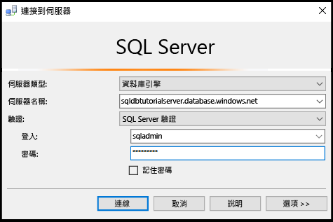
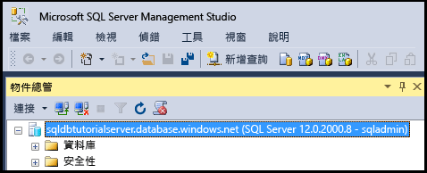
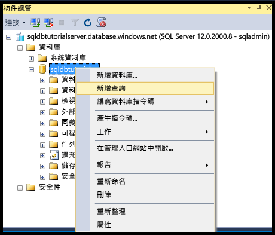

# <a name="connect-to-sql-database-with-sql-server-management-studio-and-execute-a-sample-t-sql-query"></a>使用 SQL Server Management Studio 連接到 SQL Database 並執行範例 T-SQL 查詢
> [!div class="op_single_selector"]
> * [Visual Studio](sql-database-connect-query.md)
> * [SSMS](sql-database-connect-query-ssms.md)
> * [Excel](sql-database-connect-excel.md)
> 

本文示範如何使用 SQL Server Management Studio (SSMS) 連接到 Azure SQL Database。 成功連線之後，我們會執行簡單的 Transact-SQL (T-SQL) 查詢，以便驗證與資料庫的通訊。

[!INCLUDE [SSMS Install](../../includes/sql-server-management-studio-install.md)]

1. 如果您尚未這麼做，請下載並安裝最新版的 SSMS，位置是[下載 SQL Server Management Studio](https://msdn.microsoft.com/library/mt238290.aspx)。 為了保持最新狀態，最新版的 SSMS 會在有新版本可供下載時提示您。

2. 安裝之後，在 Windows 搜尋方塊中輸入 **Microsoft SQL Server Management Studio**，然後按一下 **Enter** 來開啟 SSMS：

    
3. 在 [連接到伺服器] 對話方塊中，輸入使用 SQL Server 驗證連接到 SQL Server 所需的資訊。

    
4. 按一下 [ **連接**]。

    
5. 在 [物件總管] 中，展開 [資料庫]，展開任何資料庫以檢視該資料庫中的物件。

    
6. 以滑鼠右鍵按一下此資料庫，然後按一下 [新增查詢]。

    
7. 在查詢視窗中，輸入下列查詢︰

   ```select * from sys.objects```
   
8.  在工具列上，按一下 [執行] 來傳回範例資料庫中所有系統物件的清單。

    

> [!Tip]
> 如需教學課程，請參閱[教學課程：使用 Azure 入口網站和 SQL Server Management Studio 佈建及存取 Azure SQL 資料庫](sql-database-get-started.md)。    
>

## <a name="next-steps"></a>後續步驟

- 如同您處理 SQL Server 的方式一樣，您可以使用 T-SQL 陳述式來建立及管理 Azure 中的資料庫。 如果您已熟悉使用 T-SQL 搭配 SQL Server，請參閱 [Azure SQL Database Transact-SQL 資訊)](sql-database-transact-sql-information.md) 中的差異摘要。
- 如果您是 T-SQL 新手，請參閱[教學課程：撰寫 Transact-SQL 陳述式](https://msdn.microsoft.com/library/ms365303.aspx)和[Transact-SQL 參考 (Database Engine)](https://msdn.microsoft.com/library/bb510741.aspx)。
- 如需 SQL Server 驗證的入門教學課程，請參閱 [SQL 驗證和授權](sql-database-control-access-sql-authentication-get-started.md)
- 如需 Azure Active Directory 驗證的入門教學課程，請參閱 [Azure AD 驗證和授權](sql-database-control-access-aad-authentication-get-started.md)
- 如需有關 SSMS 的詳細資訊，請參閱 [使用 SQL Server Management Studio](https://msdn.microsoft.com/library/ms174173.aspx)。


<!--HONumber=Feb17_HO1-->


